# 🎓 AcWing——算法基础课


> 本笔记为 **第一讲 · 基础算法** 的 C++ 模板与题解，旨在提供一个清晰、实用的学习与复习参考。

---

# 📖 第一讲 基础算法

## 🚀 1. 快速排序

> **核心思想**：快速排序是一种高效的分治排序算法，平均时间复杂度为 O(n log n)。其核心是选取一个基准元素（pivot），通过一趟排序将待排序列分割成独立的两部分，其中一部分记录的关键字均比另一部分记录的关键字小，则可分别对这两部分记录继续进行排序，以达到整个序列有序。

### 1.0 洛谷题单


| 来源 | 题目/题单                                                    | 说明                       |
| ---- | ------------------------------------------------------------ | -------------------------- |
| 洛谷 | [快速排序和归并排序 - 题单 - 洛谷](https://www.luogu.com.cn/training/784214) | 快速排序和归并排序（题单） |
| 洛谷 | [归并排序 - 题单 - 洛谷](https://www.luogu.com.cn/training/13545) | 归并排序（题单）           |
| 洛谷 | https://www.luogu.com.cn/training/107                        | 【算法1-2】排序（题单）    |
| 洛谷 | https://www.luogu.com.cn/training/189070                     | 快速排序（题单）           |


### 1.1 快速排序


<details>
<summary><strong>🔗 练习平台</strong></summary>

- **LeetCode**: [912. 排序数组](https://leetcode.cn/problems/sort-an-array/description/)
- **洛谷**:
    - [P1177 【模板】快速排序](https://www.luogu.com.cn/problem/P1177)
    - [U239911 【模板】快速排序](https://www.luogu.com.cn/problem/U239911)
    - 题单: [排序](https://www.luogu.com.cn/training/18907)


</details>


<details>
<summary><strong>🎯 AcWing 题目与题解</strong></summary>


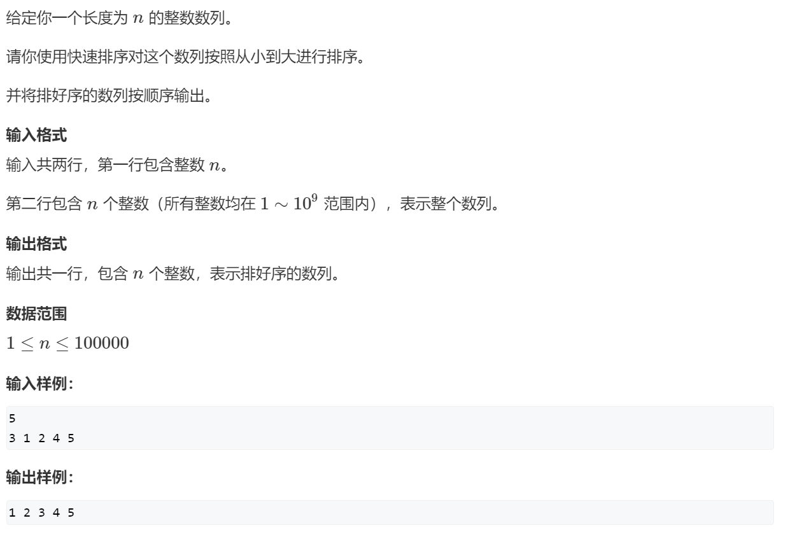

> **快速排序模板**

```cpp
#include<iostream>
#include<algorithm>

using namespace std;

const int N = 1e5+7;

int q[N];

// 快速排序模板
void quickSort(int q[], int l, int r){
    if(l >= r) return;
    int i = l - 1, j = r + 1, x = q[l + r >> 1];
    while(i < j){
        do i++; while(q[i] < x);
        do j--; while(q[j] > x);
        if(i < j) swap(q[i], q[j]);
    }
    quickSort(q, l, j);
    quickSort(q, j + 1, r);
}

int main(){
    int n;
    scanf("%d", &n);
    for(int i = 0; i < n; i++) scanf("%d", &q[i]);

    quickSort(q, 0, n - 1);

    for(int i = 0; i < n; i++) printf("%d ", q[i]);
    return 0;
}
```
</details>

---

## 🧬 2. 归并排序

> **核心思想**：归并排序是建立在归并操作上的一种有效、稳定的排序算法，时间复杂度始终为 O(n log n)。该算法是采用分治法的一个非常典型的应用。它将已有序的子序列合并，得到完全有序的序列。

### 2.1 归并排序

<details>
<summary><strong>🔗 练习平台</strong></summary>

- **洛谷**:
    
    - https://www.luogu.com.cn/problem/U232725
    - 题单: [快速排序和归并排序](https://www.luogu.com.cn/training/784214)
    - 题单: [归并排序](https://www.luogu.com.cn/training/13545)
    


</details>

<details>
<summary><strong>🎯 AcWing 题目与题解</strong></summary>


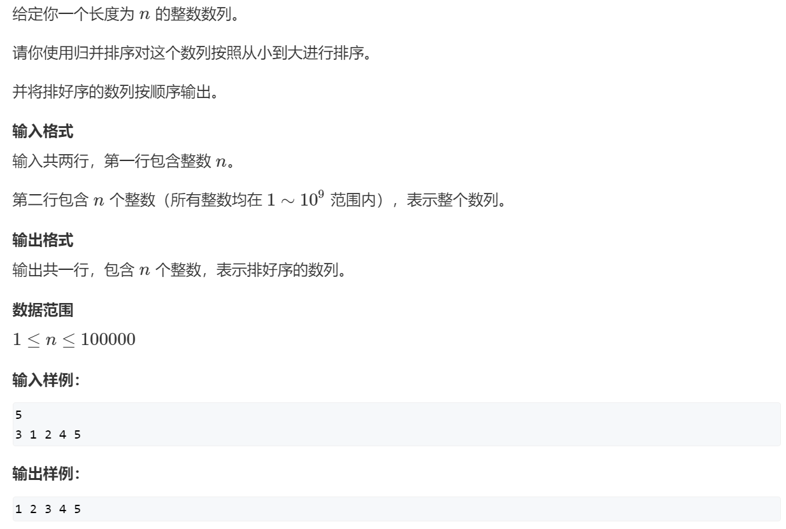

> **归并排序模板**

```cpp
#include<iostream>

using namespace std;

const int N = 1e5+7;
int q[N], tmp[N];

// 归并排序模板
void mergeSort(int q[], int l, int r){
    if(l >= r) return;
    int mid = l + r >> 1;
    mergeSort(q, l, mid);
    mergeSort(q, mid + 1, r);

    int k = 0, i = l, j = mid + 1;
    while(i <= mid && j <= r){
        if(q[i] <= q[j]) tmp[k++] = q[i++];
        else tmp[k++] = q[j++];
    }
    while(i <= mid) tmp[k++] = q[i++];
    while(j <= r) tmp[k++] = q[j++];

    for(int i = l, j = 0; i <= r; i++, j++) q[i] = tmp[j];
}

int main(){
    int n;
    scanf("%d", &n);
    for(int i = 0; i < n; i++) scanf("%d", &q[i]);
    
    mergeSort(q, 0, n - 1);
    
    for(int i = 0; i < n; i++) printf("%d ", q[i]);
    return 0;
}
```
</details>

### 2.2 逆序对的数量

> **解法思路**：归并排序在合并左右两个有序子数组时，若发现左边数组的元素 `q[i]` 大于右边数组的元素 `q[j]`，则意味着 `q[i]` 以及其后的所有元素（`mid - i + 1`个）都与 `q[j]` 构成逆序对。

<details>
<summary><strong>🔗 练习平台</strong></summary>

- **洛谷**:
    - [P1908 逆序对](https://www.luogu.com.cn/problem/P1908)
    - [U232725 逆序对](https://www.luogu.com.cn/problem/U232725)


</details>


<details>
<summary><strong>🎯 AcWing 题目与题解</strong></summary>


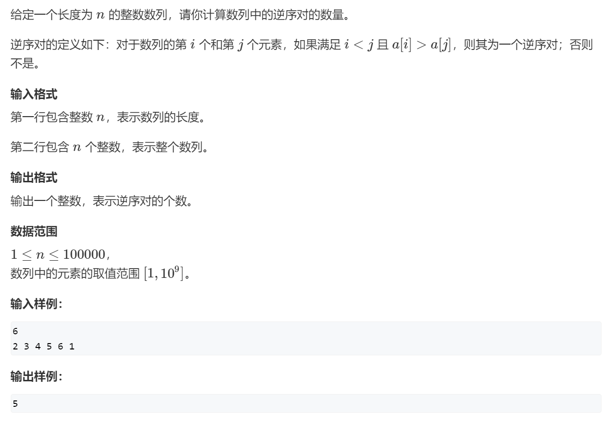

```cpp
#include<iostream>

using namespace std;

typedef long long LL;

const int N = 1e5+7;
int q[N], tmp[N];

LL mergeSort(int q[], int l, int r){
    if(l >= r) return 0;
    int mid = l + r >> 1;
    LL res = mergeSort(q, l, mid) + mergeSort(q, mid + 1, r);
    
    int k = 0, i = l, j = mid + 1;
    while(i <= mid && j <= r){
        if(q[i] <= q[j]) tmp[k++] = q[i++];
        else{
            tmp[k++] = q[j++];
            res += mid - i + 1;
        }
    }
    while(i <= mid) tmp[k++] = q[i++];
    while(j <= r) tmp[k++] = q[j++];
    
    for(int i = l, j = 0; i <= r; i++, j++) q[i] = tmp[j];
    
    return res;
}

int main(){
    int n;
    scanf("%d", &n);
    for(int i = 0; i < n; i++) scanf("%d", &q[i]);
    
    cout << mergeSort(q, 0, n - 1) << endl;
    
    return 0;
}
```
</details>

---

## 🔍 3. 二分查找

> **核心思想**：二分查找（Binary Search）是一种在 **有序数组** 中查找特定元素的搜索算法。通过每次比较数组中间元素与目标值，可以将搜索范围缩小一半，从而实现 O(log n) 的高效查找。

**洛谷题单：**


| 来源 | 题目/题单                                | 说明                                  |
| ---- | ---------------------------------------- | ------------------------------------- |
| 洛谷 | https://www.luogu.com.cn/training/111    | 【算法1-6】二分查找与二分答案（题单） |
| 洛谷 | https://www.luogu.com.cn/training/545539 | 二分算法（普及-至普及/提高-）（题单） |
| 洛谷 | https://www.luogu.com.cn/training/138949 | 二分查找（题单）                      |
| 洛谷 | https://www.luogu.com.cn/training/10364  | 【普及组训练】二分答案（题单）        |


### 3.1 数的范围（整数二分）

<details>
<summary><strong>🔗 练习平台</strong></summary>

- **洛谷**:
    - [U383691 【模板】二分查找](https://www.luogu.com.cn/problem/U383691)
    - 题单: [二分查找/二分答案](https://www.luogu.com.cn/training/111)

</details>

<details>
<summary><strong>🎯 AcWing 题目与题解</strong></summary>


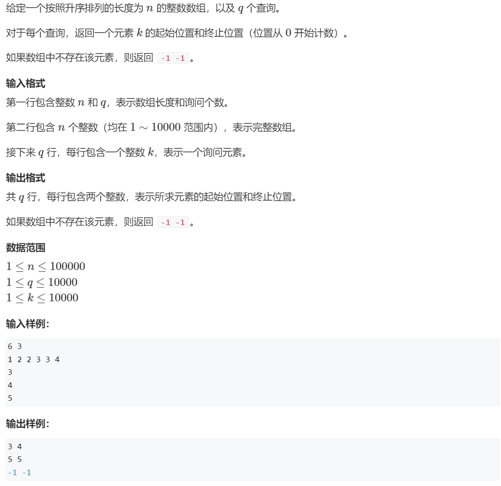

> **整数二分模板**
> 
> 关键在于 `check` 函数的实现和 `mid` 的取值，确保每次循环都能缩小范围且不会死循环。

```cpp
// 查找左边界：区间[l, r]被划分为[l, mid]和[mid + 1, r]
int bsearch_left(int l, int r) {
    while (l < r) {
        int mid = l + r >> 1;
        if (check(mid)) r = mid;
        else l = mid + 1;
    }
    return l;
}

// 查找右边界：区间[l, r]被划分为[l, mid - 1]和[mid, r]
int bsearch_right(int l, int r) {
    while (l < r) {
        int mid = l + r + 1 >> 1;
        if (check(mid)) l = mid;
        else r = mid - 1;
    }
    return l;
}
```

> **题解代码**

```cpp
#include <iostream>

using namespace std;

const int N = 100010;

int q[N];

int main(){
    int n, m;
    scanf("%d%d", &n, &m);
    for(int i = 0; i < n; i++) scanf("%d", &q[i]);

    while(m--){
        int x;
        scanf("%d", &x);
        
        // 查找起始位置
        int l = 0, r = n - 1;
        while(l < r){
            int mid = l + r >> 1;
            if (q[mid] >= x) r = mid;
            else l = mid + 1;
        }

        if(q[l] != x) {
            cout << "-1 -1" << endl;
        } else {
            cout << l << " ";
            // 查找结束位置
            int l = 0, r = n - 1;
            while(l < r){
                int mid = l + r + 1 >> 1;
                if(q[mid] <= x) l = mid;
                else r = mid - 1;
            }
            cout << l << endl;
        }
    }
    return 0;
}
```
</details>

### 3.2 数的三次方根（浮点数二分）

<details>
<summary><strong>🔗 练习平台</strong></summary>

- **洛谷**:
    - [U269029 数的三次方根](https://www.luogu.com.cn/problem/U269029)
    - [T627060 开三次方根](https://www.luogu.com.cn/problem/T627060)


</details>

<details>
<summary><strong>🎯 AcWing 题目与题解</strong></summary>


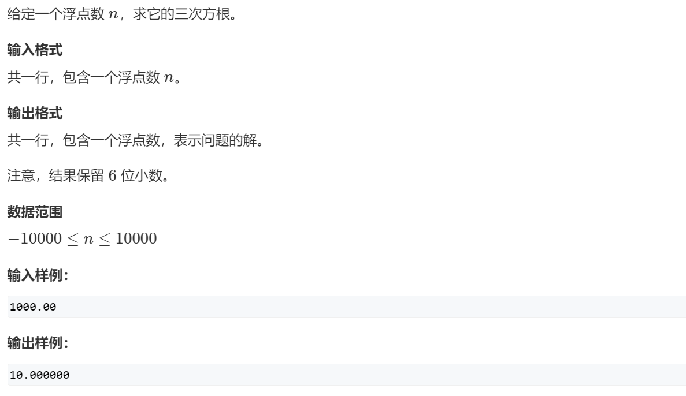

> **浮点数二分模板**
>
> 浮点数二分相对简单，不需要处理边界和 `+1` 的问题。循环条件通常是 `r - l > eps` (精度) 或固定循环次数。

```cpp
double bsearch_float(double l, double r) {
    const double eps = 1e-8; // eps取决于题目精度要求
    while (r - l > eps) {
        double mid = (l + r) / 2;
        if (check(mid)) r = mid;
        else l = mid;
    }
    return l;
}
```

> **题解代码**

```cpp
#include<iostream>
#include<iomanip>

using namespace std;

int main(){
    double n;
    cin >> n;
    
    double l = -10000, r = 10000;
    // 也可以固定循环次数，例如 for(int i=0; i<100; i++)
    while(r - l > 1e-8){
        double mid = (l + r) / 2;
        if(mid * mid * mid >= n) r = mid;
        else l = mid;
    }
    
    cout << fixed << setprecision(6) << l << endl;
    return 0;
} 
```
</details>

---

## 🧮 4. 高精度计算

> **核心思想**：当 `long long` 也无法存储一个数时，就需要用数组来模拟大数的运算。基本思路是将大数逆序存储在 `vector<int>` 中，每个元素存一位数字，然后模拟手算的过程（如加法中的进位、减法中的借位）。

**洛谷题单：**


| 来源 | 题目/题单                                | 说明                            |
| ---- | ---------------------------------------- | ------------------------------- |
| 洛谷 | https://www.luogu.com.cn/training/398734 | 高精度专项训练练习题（题单）    |
| 洛谷 | https://www.luogu.com.cn/training/304001 | 高精度（题单）                  |
| 洛谷 | https://www.luogu.com.cn/training/106    | 【算法1-1】模拟与高精度（题单） |


### 4.1 高精度加法


<details>
<summary><strong>🔗 练习平台</strong></summary>


- **洛谷**:

  -  [P1601 A+B Problem（高精）](https://www.luogu.com.cn/problem/P1601)
  - [U489586 高精度加法](https://www.luogu.com.cn/problem/U489586)


- **牛客**: [高精度加法](https://www.nowcoder.com/practice/49e772ab08994a96980f9618892e55b6)


</details>

<details>
<summary><strong>🎯 AcWing 题目与题解</strong></summary>


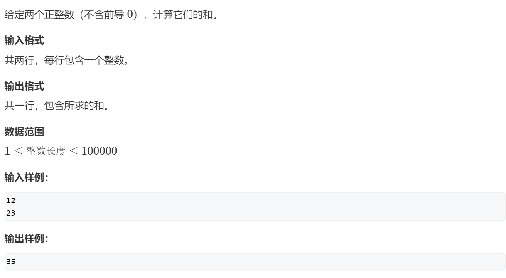

```cpp
#include<iostream>
#include<vector>
#include<string>
#include<algorithm>

using namespace std;

// 高精度加法模板
vector<int> add(vector<int> &A, vector<int> &B){
    vector<int> C; 
    int t = 0; // 进位
    for(int i = 0; i < A.size() || i < B.size() || t; i++){
        if(i < A.size()) t += A[i];
        if(i < B.size()) t += B[i];
        C.push_back(t % 10);
        t /= 10;
    }
    return C;
}

int main(){
    string a, b;
    cin >> a >> b;
    vector<int> A, B;
    for(int i = a.size() - 1; i >= 0; i--) A.push_back(a[i] - '0');
    for(int i = b.size() - 1; i >= 0; i--) B.push_back(b[i] - '0');
    
    vector<int> C = add(A, B);
    
    for(int i = C.size() - 1; i >= 0; i--) cout << C[i];
    cout << endl;
    return 0;
}
```
</details>


### 4.2 高精度减法


<details>
<summary><strong>🔗 练习平台</strong></summary>


- **洛谷**: [P2142 高精度减法](https://www.luogu.com.cn/problem/P2142)

</details>

<details>
<summary><strong>🎯 AcWing 题目与题解</strong></summary>


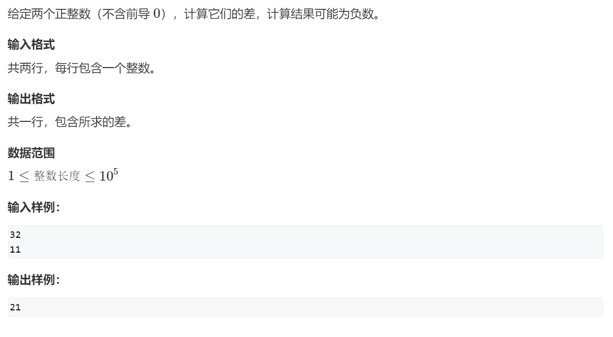

```cpp
#include<iostream>
#include<vector>
#include<string>

using namespace std;

// 比较 A 是否 >= B
bool cmp(vector<int> &A, vector<int> &B){
    if(A.size() != B.size()) return A.size() > B.size();
    for(int i = A.size() - 1; i >= 0; i--){
        if(A[i] != B[i]) return A[i] > B[i];
    }
    return true;
}

// 高精度减法模板 (A - B)
vector<int> sub(vector<int> &A, vector<int> &B){
    vector<int> C; 
    int t = 0; // 借位
    for(int i = 0; i < A.size(); i++){
        t = A[i] - t;
        if(i < B.size()) t -= B[i];
        C.push_back((t + 10) % 10);
        if(t < 0) t = 1;
        else t = 0;
    }
    while(C.size() > 1 && C.back() == 0) C.pop_back(); // 去掉前导0
    return C;
}

int main(){
    string a, b;
    cin >> a >> b;
    vector<int> A, B;
    for(int i = a.size() - 1; i >= 0; i--) A.push_back(a[i] - '0');
    for(int i = b.size() - 1; i >= 0; i--) B.push_back(b[i] - '0');
    
    vector<int> C;
    if(cmp(A, B)) {
        C = sub(A, B);
    } else {
        C = sub(B, A);
        cout << "-";
    }

    for(int i = C.size() - 1; i >= 0; i--) cout << C[i];
    cout << endl;
    return 0;
}
```
</details>


### 4.3 高精度乘法

<details>
<summary><strong>🔗 练习平台</strong></summary>


- **洛谷**

  -  [U371642 【模板】高精度乘法](https://www.luogu.com.cn/problem/U371642)


</details>


<details>
<summary><strong>🎯 AcWing 题目与题解</strong></summary>


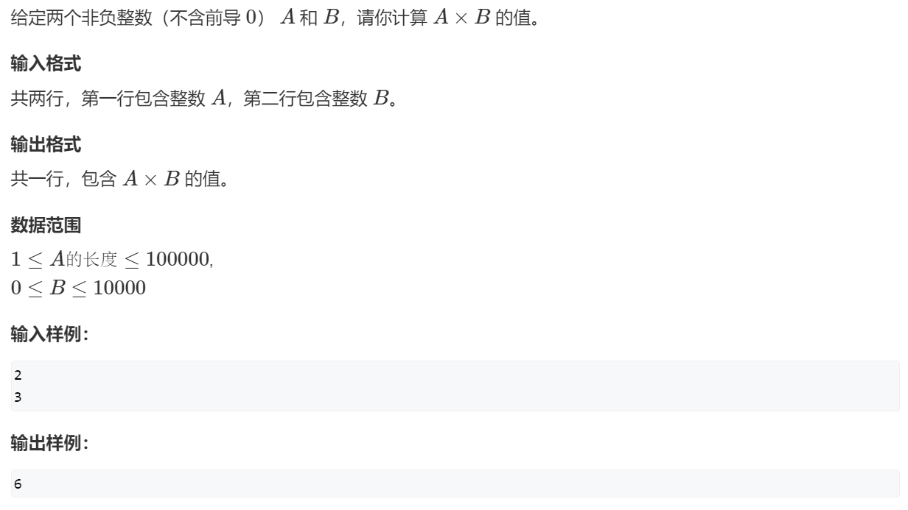

```cpp
#include<iostream>
#include<vector>
#include<string>

using namespace std;

// 高精度乘法模板 (大数 * 小数)
vector<int> mul(vector<int> &A, int b){
    vector<int> C; 
    int t = 0; // 进位
    for(int i = 0; i < A.size() || t; i++){
        if(i < A.size()) t += A[i] * b;
        C.push_back(t % 10);
        t /= 10;
    }
    while(C.size() > 1 && C.back() == 0) C.pop_back();
    return C;
}

int main(){
    string a;
    int b;
    cin >> a >> b;
    vector<int> A;
    for(int i = a.size() - 1; i >= 0; i--) A.push_back(a[i] - '0');
    
    vector<int> C = mul(A, b);
    
    for(int i = C.size() - 1; i >= 0; i--) cout << C[i];
    cout << endl;
    return 0;
}
```
</details>


### 4.4 高精度除法

<details>
<summary><strong>🔗 练习平台</strong></summary>


- **洛谷**: [P1480 A/B Problem](https://www.luogu.com.cn/problem/P1480)

</details>


<details>
<summary><strong>🎯 AcWing 题目与题解</strong></summary>


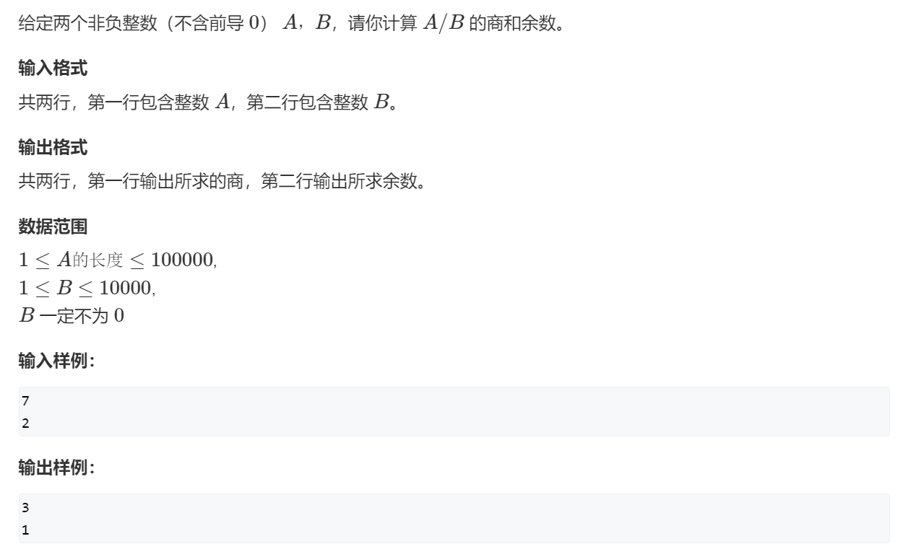

```cpp
#include<iostream>
#include<algorithm>
#include<vector>
#include<string>

using namespace std;

// 高精度除法模板 (大数 / 小数)，r是余数
vector<int> div(vector<int> &A, int b, int &r){
    vector<int> C; 
    r = 0;
    for(int i = A.size() - 1; i >= 0; i--){
        r = r * 10 + A[i]; 
        C.push_back(r / b);
        r %= b;
    }
    reverse(C.begin(), C.end());
    while(C.size() > 1 && C.back() == 0) C.pop_back();
    return C;
}

int main(){
    string a;
    int b, r;
    cin >> a >> b;
    vector<int> A;
    for(int i = a.size() - 1; i >= 0; i--) A.push_back(a[i] - '0');
    
    vector<int> C = div(A, b, r);
    
    for(int i = C.size() - 1; i >= 0; i--) cout << C[i];
    cout << endl << r << endl;
    return 0;
}
```
</details>


---

## 📊 5. 前缀和与差分

> **核心思想**：前缀和与差分是一对逆运算，是处理 **区间问题** 的利器。前缀和能 O(1) 地求出数组任意区间的和，而差分则能 O(1) 地对数组的任意区间进行批量增减操作。

**洛谷题单**

| 来源 | 题目/题单                                | 说明                                    |
| ---- | ---------------------------------------- | --------------------------------------- |
| 洛谷 | https://www.luogu.com.cn/training/168559 | 前缀和与差分（题单）                    |
| 洛谷 | https://www.luogu.com.cn/training/671085 | 一维前缀和（题单）                      |
| 洛谷 | https://www.luogu.com.cn/training/4013   | 差分入门（题单）                        |
| 洛谷 | https://www.luogu.com.cn/training/485232 | 差分 （题单）                           |
| 洛谷 | https://www.luogu.com.cn/training/46475  | 差分、树上差分（题单）                  |
| 洛谷 | https://www.luogu.com.cn/training/200    | 【算法2-1】前缀和、差分与离散化（题单） |


### 5.1 前缀和（一维）


<details>
<summary><strong>🔗 练习平台</strong></summary>


- **洛谷**:

  -  [P8218 【深基2.例12】求区间和](https://www.luogu.com.cn/problem/P8218)
  - [U410636 一维前缀和](https://www.luogu.com.cn/problem/U410636)


</details>


<details>
<summary><strong>🎯 AcWing 题目与题解</strong></summary>


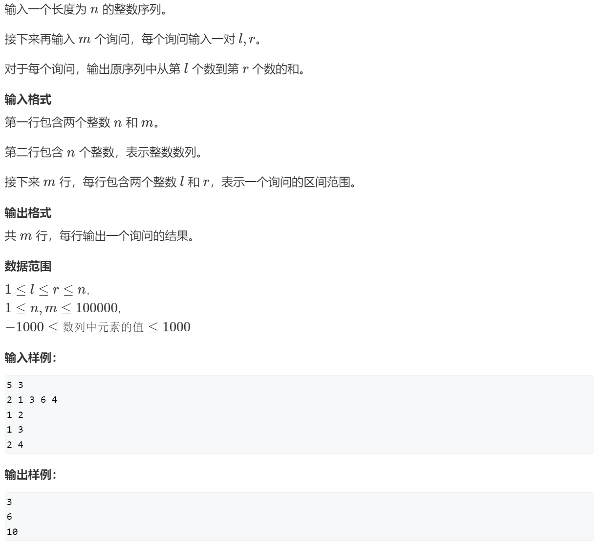

> **一维前缀和公式**
> ```
> S[i] = a + a + ... + a[i]
> a[l] + ... + a[r] = S[r] - S[l - 1]
> ```

```cpp
#include <iostream>
using namespace std;
const int N = 1e5 + 10;
int a[N], s[N];

int main(){
    int n, m;
    cin >> n >> m;
    for(int i = 1; i <= n; i++) cin >> a[i];
    // 初始化前缀和数组
    for(int i = 1; i <= n; i++) s[i] = s[i-1] + a[i];
    
    while(m--){
        int l, r;
        cin >> l >> r;
        cout << s[r] - s[l - 1] << endl;
    }
    return 0;
}
```
</details>


### 5.2 子矩阵的和（二维）


<details>
<summary><strong>🔗 练习平台</strong></summary>


- **洛谷**

  -  [U388817 【模板】二维前缀和](https://www.luogu.com.cn/problem/U388817)
  - [T271585 【模板】二维前缀和](https://www.luogu.com.cn/problem/T271585)
  - [U567555 二维前缀和-模板](https://www.luogu.com.cn/problem/U567555)


</details>


<details>
<summary><strong>🎯 AcWing 题目与题解</strong></summary>


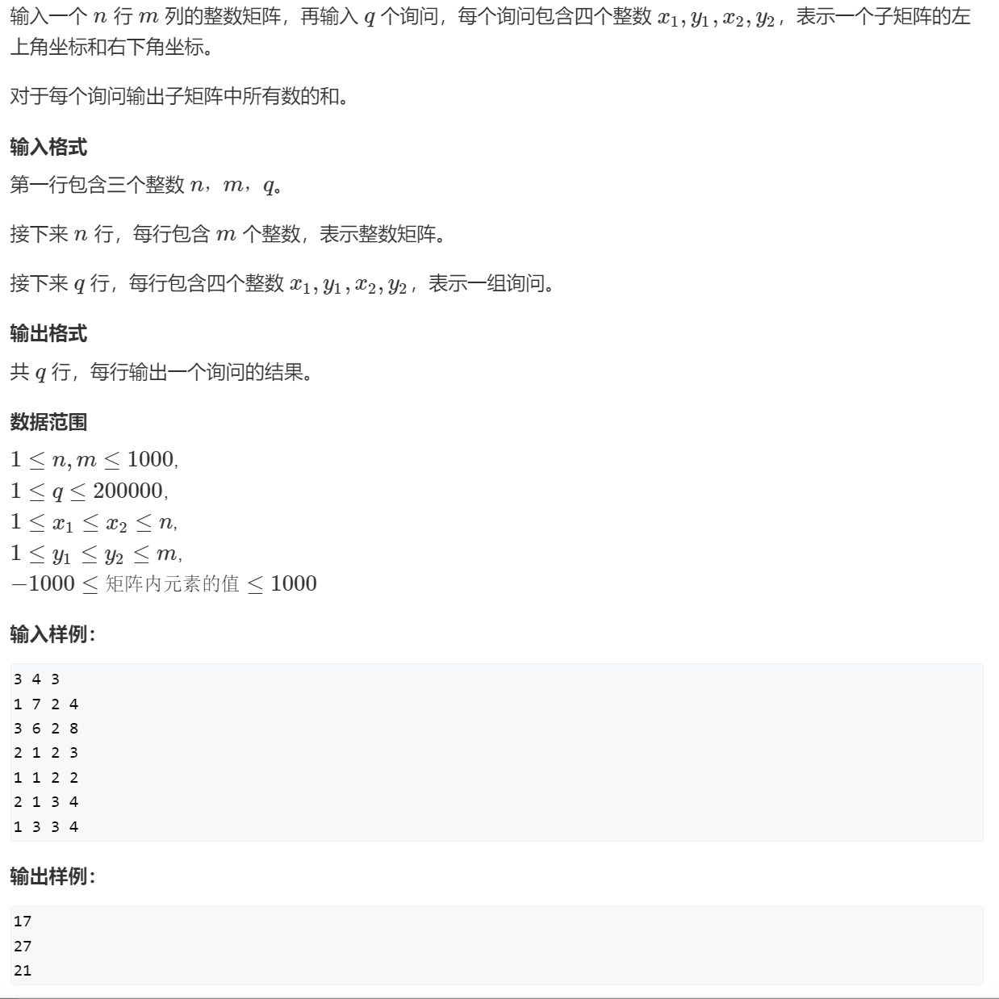

> **二维前缀和公式** (容斥原理)
> ```
> S[i,j] = S[i-1,j] + S[i,j-1] - S[i-1,j-1] + a[i,j]
> Sum(x1,y1,x2,y2) = S[x2,y2] - S[x1-1,y2] - S[x2,y1-1] + S[x1-1,y1-1]
> ```


```cpp
#include <iostream>
using namespace std;
const int N = 1e3 + 10;
int a[N][N], s[N][N];

int main(){
    int n, m, q;
    cin >> n >> m >> q;
    for(int i = 1; i <= n; i++)
        for(int j = 1; j <= m; j++)
            cin >> a[i][j];
    
    // 初始化二维前缀和数组
    for(int i = 1; i <= n; i++)
        for(int j = 1; j <= m; j++)
            s[i][j] = s[i-1][j] + s[i][j-1] - s[i-1][j-1] + a[i][j];
            
    while(q--){
        int x1, y1, x2, y2;
        cin >> x1 >> y1 >> x2 >> y2;
        cout << s[x2][y2] - s[x1-1][y2] - s[x2][y1-1] + s[x1-1][y1-1] << endl;
    }
    return 0;
}
```
</details>


### 5.3 差分（一维）


<details>
<summary><strong>🔗 练习平台</strong></summary>


- **洛谷**: [P2367 语文成绩](https://www.luogu.com.cn/problem/P2367)

</details>


<details>
<summary><strong>🎯 AcWing 题目与题解</strong></summary>


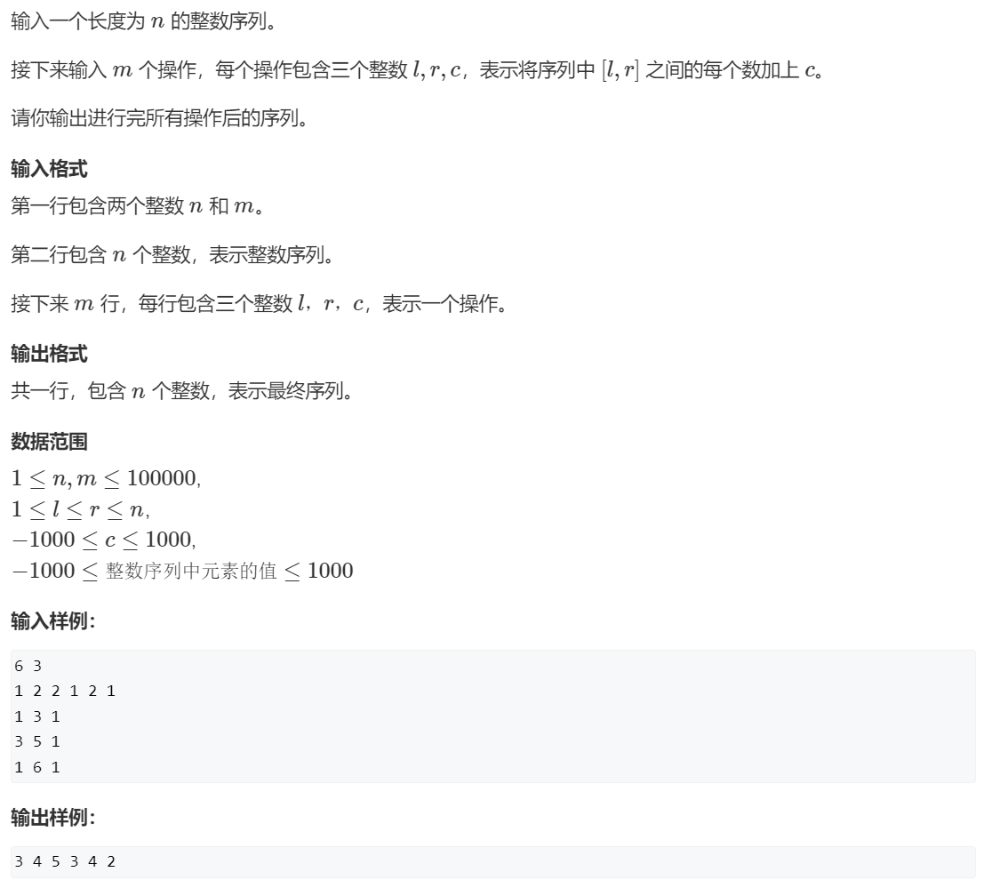

> **一维差分操作**
> ```
> // 给区间[l, r]中的每个数加上c
> B[l] += c, B[r + 1] -= c
> ```

```cpp
#include<iostream>
using namespace std;
const int N = 1e5+10;
int a[N], b[N]; // a为原数组，b为差分数组

void insert(int l, int r, int c){
    b[l] += c;
    b[r + 1] -= c;
}

int main(){
    int n, m;
    cin >> n >> m;
    for(int i = 1; i <= n; i++) cin >> a[i];
    // 初始化差分数组b
    for(int i = 1; i <= n; i++) insert(i, i, a[i]);
    
    while(m--){
        int l, r, c;
        cin >> l >> r >> c;
        insert(l, r, c);
    }
    
    // 通过前缀和还原数组a
    for(int i = 1; i <= n; i++) a[i] = a[i - 1] + b[i];
    for(int i = 1; i <= n; i++) cout << a[i] << " ";
    cout << endl;
    return 0;
}
```

</details>


### 5.4 差分矩阵（二维）


<details>
<summary><strong>🔗 练习平台</strong></summary>


- **洛谷**: [U223961 差分矩阵](https://www.luogu.com.cn/problem/U223961)

</details>


<details>
<summary><strong>🎯 AcWing 题目与题解</strong></summary>


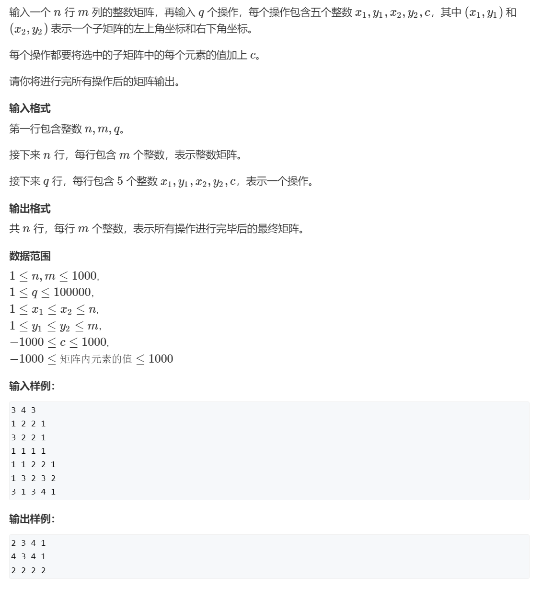

> **二维差分操作**
> ```
> // 给以(x1, y1)为左上角，(x2, y2)为右下角的子矩阵所有元素加上c
> b[x1][y1] += c;
> b[x2 + 1][y1] -= c;
> b[x1][y2 + 1] -= c;
> b[x2 + 1][y2 + 1] += c;
> ```

```cpp
#include<iostream>
using namespace std;
const int N = 1e3+10;
int a[N][N], b[N][N];

void insert(int x1, int y1, int x2, int y2, int c){
    b[x1][y1] += c;
    b[x2 + 1][y1] -= c;
    b[x1][y2 + 1] -= c;
    b[x2 + 1][y2 + 1] += c;
} 

int main(){
    int n, m, q;
    cin >> n >> m >> q;
    for(int i = 1; i <= n; i++)
        for(int j = 1; j <= m; j++)
            cin >> a[i][j];
            
    // 初始化差分数组b
    for(int i = 1; i <= n; i++)
        for(int j = 1; j <= m; j++)
            insert(i, j, i, j, a[i][j]);
            
    while(q--){
        int x1, y1, x2, y2, c;
        cin >> x1 >> y1 >> x2 >> y2 >> c;
        insert(x1, y1, x2, y2, c);
    }
    
    // 通过前缀和还原数组a
    for(int i = 1; i <= n; i++)
        for(int j = 1; j <= m; j++)
            a[i][j] = a[i-1][j] + a[i][j-1] - a[i-1][j-1] + b[i][j];
            
    for(int i = 1; i <= n; i++){
        for(int j = 1; j <= m; j++)
            cout << a[i][j] << " ";
        cout << endl;
    }
    return 0;
}
```
</details>


---

## 👉👈 6. 双指针算法

> **核心思想**：双指针算法是一种通过维护两个指针在序列中 **同向** 或 **相向** 移动，来优化暴力枚举的技巧。它通常能将 O(n²) 的复杂度优化到 O(n)，常用于解决子序列、数组和等问题。

洛谷题单：

| 来源 | 题目/题单                                | 说明           |
| ---- | ---------------------------------------- | -------------- |
| 洛谷 | https://www.luogu.com.cn/training/306156 | 双指针（题单） |


### 6.1 最长连续不重复子序列

<details>
<summary><strong>🔗 练习平台</strong></summary>


- **洛谷**

  -  [U224090 最长连续不重复子序列](https://www.luogu.com.cn/problem/U224090)
  - [U492053 最长连续不重复子序列](https://www.luogu.com.cn/problem/U492053)


</details>


<details>
<summary><strong>🎯 AcWing 题目与题解</strong></summary>

​    


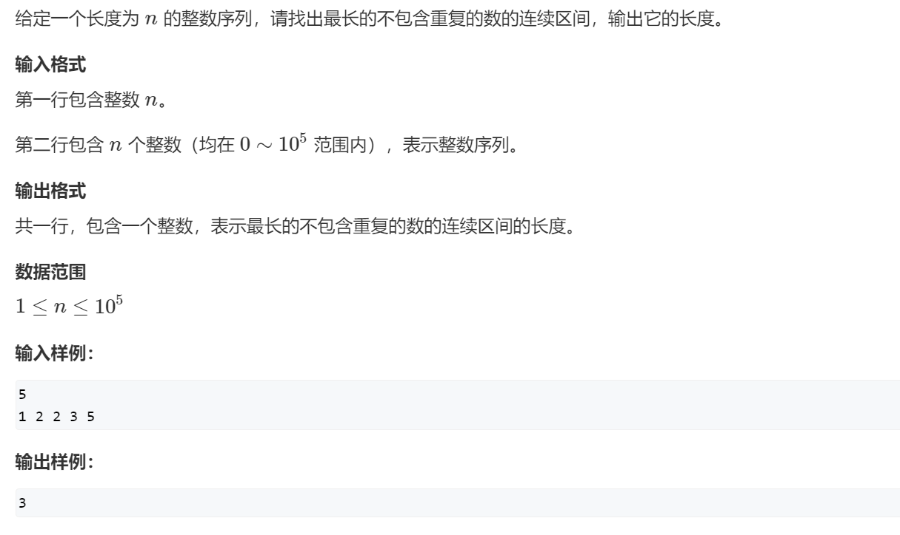

> **双指针算法模板**
> ```cpp
> for (int i = 0, j = 0; i < n; i++) {
>     while (j < i && check(i, j)) j++;
>     // 具体问题的逻辑
> }
> ```

```cpp
#include<iostream>
#include<algorithm>
using namespace std;
const int N = 1e5+10;
int a[N], s[N]; // s数组用于计数

int main(){
    int n;
    cin >> n;
    for(int i = 0; i < n; i++) cin >> a[i];
    
    int res = 0;
    // i指针向右移动，j指针在需要时跟进
    for(int i = 0, j = 0; i < n; i++){
        s[a[i]]++;
        // 当a[i]出现次数>1时，移动j指针直到窗口内无重复元素
        while(s[a[i]] > 1){
            s[a[j]]--;
            j++;
        }
        res = max(res, i - j + 1);
    }
    cout << res << endl;
    return 0;
}
```
</details>


### 6.2 数组元素的目标和


<details>
<summary><strong>🔗 练习平台</strong></summary>


- **洛谷**: [U268985 数组元素的目标和](https://www.luogu.com.cn/problem/U268985)

</details>


<details>
<summary><strong>🎯 AcWing 题目与题解</strong></summary>


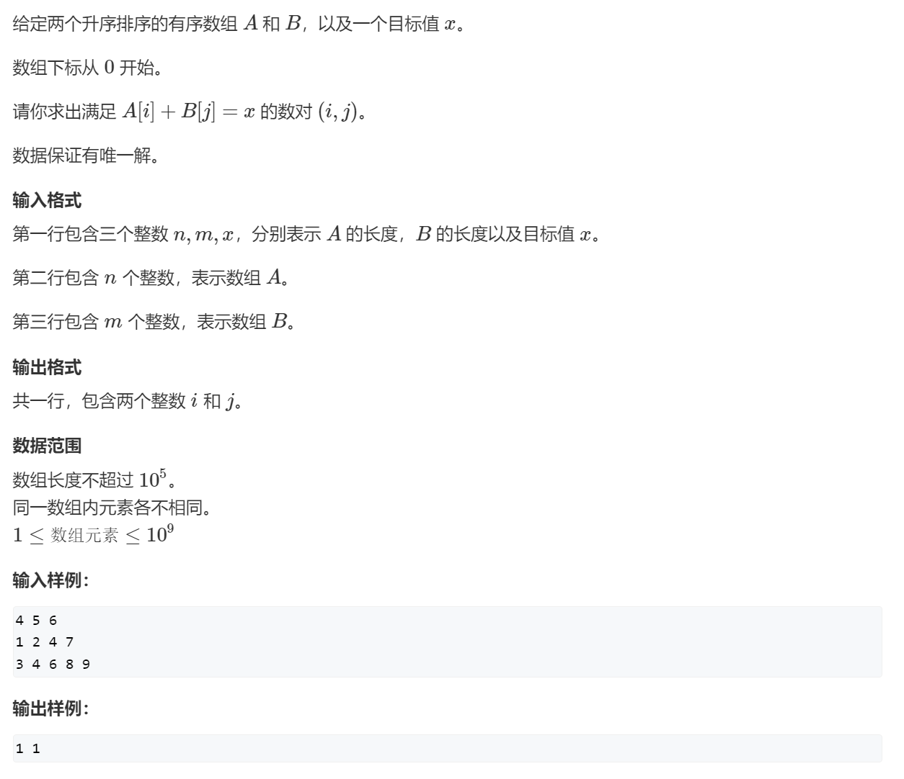

```cpp
#include<iostream>
using namespace std;
const int N = 1e5+10;
int a[N], b[N];

int main(){
    int n, m, x;
    cin >> n >> m >> x;
    for(int i = 0; i < n; i++) cin >> a[i];
    for(int i = 0; i < m; i++) cin >> b[i];
    
    // i 从左向右，j 从右向左，相向而行
    for(int i = 0, j = m - 1; i < n; i++){
        while(j >= 0 && a[i] + b[j] > x) j--;
        if(j >= 0 && a[i] + b[j] == x){
            cout << i << " " << j << endl;
            break;
        }
    }
    return 0;
}
```

</details>


### 6.3 判断子序列

<details>
<summary><strong>🔗 练习平台</strong></summary>

- **洛谷**: [U269021 【模板】判断子序列](https://www.luogu.com.cn/problem/U269021)

</details>


<details>
<summary><strong>🎯 AcWing 题目与题解</strong></summary>


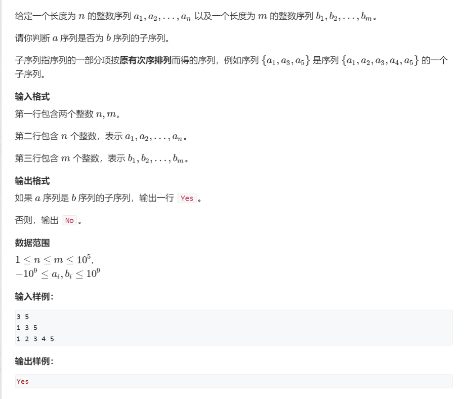

```cpp
#include<iostream>
using namespace std;
const int N = 1e5+10;
int a[N], b[N];

int main(){
    int n, m;
    cin >> n >> m;
    for(int i = 0; i < n; i++) cin >> a[i];
    for(int i = 0; i < m; i++) cin >> b[i];
    
    int i = 0, j = 0;
    // i, j 指针同向移动
    while(i < n && j < m){
        if(a[i] == b[j]) i++;
        j++;
    }
    
    if(i == n) cout << "Yes" << endl;
    else cout << "No" << endl;
    
    return 0;
}
```
</details>


---

## ⚙️ 7. 位运算

> **核心思想**：位运算是直接对整数在内存中的二进制位进行操作，速度极快。熟练掌握位运算技巧（如 `n >> k & 1` 取出第 k 位，`x & -x` 即 `lowbit` 操作等）是解决树状数组等问题的基础。

洛谷题单：

| 来源 | 题目/题单                                | 说明               |
| ---- | ---------------------------------------- | ------------------ |
| 洛谷 | https://www.luogu.com.cn/training/406978 | 位运算（题单）     |
| 洛谷 | https://www.luogu.com.cn/training/463970 | 位运算题单（题单） |


### 7.1 二进制中1的个数


<details>
<summary><strong>🔗 练习平台</strong></summary>


- **洛谷**: [U199197 【模板】二进制中1的个数](https://www.luogu.com.cn/problem/U199197)

</details>


<details>
<summary><strong>🎯 AcWing 题目与题解</strong></summary>


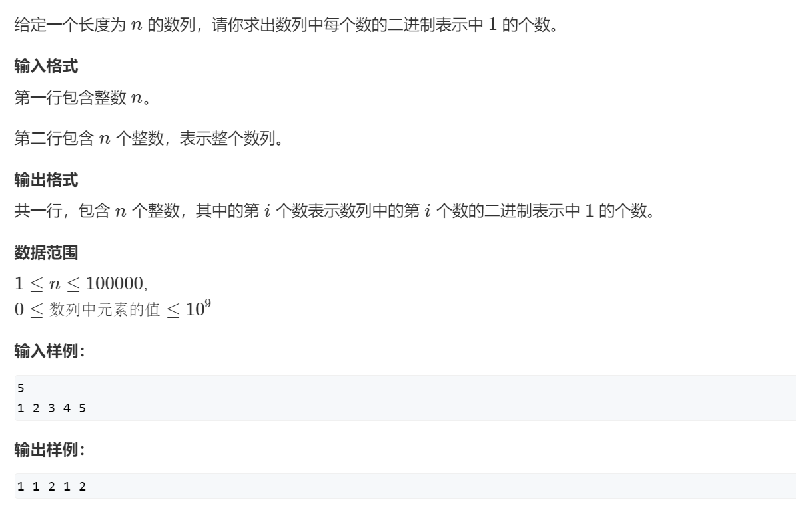

> **位运算常用技巧**
> 1.  **求 n 的第 k 位数字**: `n >> k & 1`
> 2.  **lowbit(x)**: 返回 x 的最后一位 1。`x & -x` (负数在计算机中用补码表示)

```cpp
#include<iostream>
using namespace std;

// 返回x的二进制表示中，最后一位1所代表的值
int lowbit(int x){
    return x & -x;
}

int main(){
    int n;
    cin >> n;
    while(n--){
        int x;
        cin >> x;
        int count = 0;
        while(x){
            x -= lowbit(x); // 每次减去最后一位1
            count++;
        }
        cout << count << " ";
    }
    cout << endl;
    return 0;
}
```

</details>

---

## 🗺️ 8. 离散化

> **核心思想**：当问题涉及的数据范围很大（如 `10^9`），但实际用到的数据点个数却很少时（如 `10^5`），我们可以将这些稀疏的大数 **映射** 到一个较小的连续整数范围内（如 `1..10^5`），这就是离散化。它本质上是一种哈希，通常用于配合树状数组、线段树等数据结构。

| 来源 | 题目/题单                                | 说明                       |
| ---- | ---------------------------------------- | -------------------------- |
| 洛谷 | https://www.luogu.com.cn/training/878154 | 题单——集合与离散化（题单） |


### 8.1 区间和


<details>
<summary><strong>🔗 练习平台</strong></summary>


- **洛谷**: [U415396 【模板】离散化](https://www.luogu.com.cn/problem/U415396)

</details>


<details>
<summary><strong>🎯 AcWing 题目与题解</strong></summary>


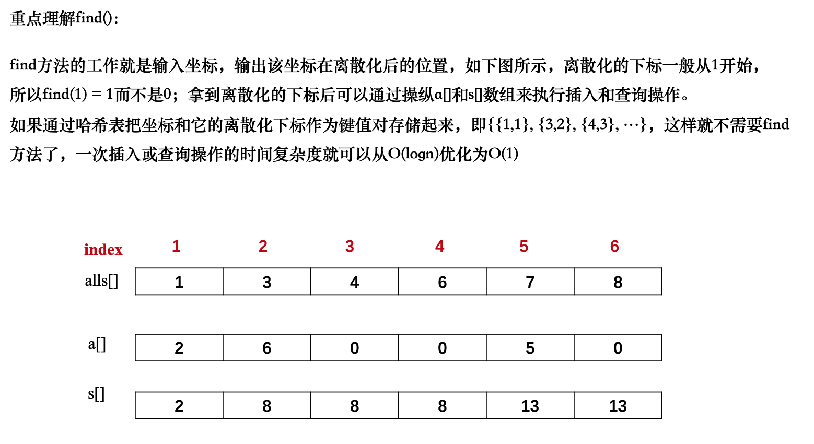

> **离散化模板**
> ```cpp
> vector<int> alls; // 存储所有待离散化的值
> sort(alls.begin(), alls.end()); // 排序
> alls.erase(unique(alls.begin(), alls.end()), alls.end()); // 去重
> 
> // 通过二分查找x离散化后的值
> int find(int x) {
>     int l = 0, r = alls.size() - 1;
>     while(l < r) {
>         int mid = l + r >> 1;
>         if (alls[mid] >= x) r = mid;
>         else l = mid + 1;
>     }
>     return r + 1; // 映射到1, 2, ...
> }                
> ```

```cpp
#include<iostream>
#include<vector>
#include<algorithm>
using namespace std;
typedef pair<int, int> PII;
const int N = 3e5 + 10;

int a[N], s[N];
vector<int> alls;
vector<PII> add, query;

// 返回x离散化后的下标
int find(int x){
    int l = 0, r = alls.size() - 1;
    while(l < r){
        int mid = l + r >> 1;
        if(alls[mid] >= x) r = mid;
        else l = mid + 1;
    }
    return r + 1; // 映射到1开始的下标
}

int main(){
    int n, m;
    cin >> n >> m;
    for(int i = 0; i < n; i++){
        int x, c;
        cin >> x >> c;
        add.push_back({x, c});
        alls.push_back(x);
    }
    for(int i = 0; i < m; i++){
        int l, r;
        cin >> l >> r;
        query.push_back({l, r});
        alls.push_back(l);
        alls.push_back(r);
    }
    
    // 排序去重
    sort(alls.begin(), alls.end());
    alls.erase(unique(alls.begin(), alls.end()), alls.end()); 
    
    // 处理插入操作
    for(auto item : add){
        int x = find(item.first);
        a[x] += item.second;
    }
    
    // 预处理前缀和
    for(int i = 1; i <= alls.size(); i++) s[i] = s[i-1] + a[i];
    
    // 处理查询操作
    for(auto item : query){
        int l = find(item.first);
        int r = find(item.second);
        cout << s[r] - s[l-1] << endl;
    }
    
    return 0;
} 
```

</details>


---

## 🤝 9. 区间合并

> **核心思想**：将一系列可能存在交集的区间合并成一个或多个无交集的连续区间。其标准做法是：首先按区间的 **左端点** 进行排序，然后遍历排序后的区间，维护一个当前合并的区间 `[st, ed]`，并与下一个区间进行比较和合并。

### 9.1 区间合并

<details>
<summary><strong>🔗 练习平台</strong></summary>


- **洛谷**: [U282660 【模板】区间合并](https://www.luogu.com.cn/problem/U282660)

</details>


<details>
<summary><strong>🎯 AcWing 题目与题解</strong></summary>


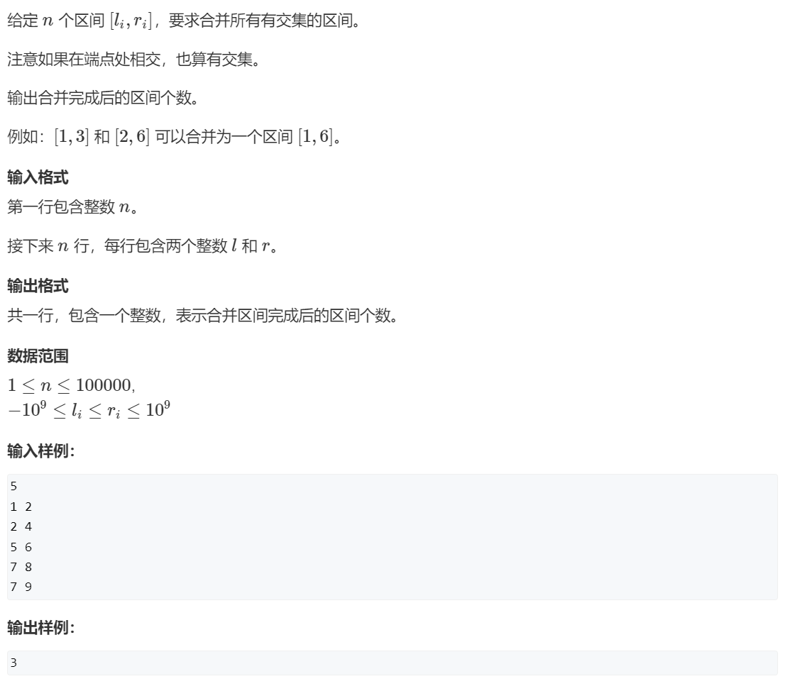

> **区间合并模板**
> ```cpp
> void merge(vector<PII> &segs) {
>  vector<PII> res;
>  sort(segs.begin(), segs.end());
>  int st = -2e9, ed = -2e9;
>  if (!segs.empty()) {
>      st = segs.first;
>      ed = segs.second;
>  }
>  for (int i = 1; i < segs.size(); i++) {
>      if (segs[i].first <= ed) {
>          ed = max(ed, segs[i].second);
>      } else {
>          res.push_back({st, ed});
>          st = segs[i].first;
>          ed = segs[i].second;
>      }
>  }
>  if (!segs.empty()) res.push_back({st, ed});
>  segs = res;
> }
> ```
>
> 


```cpp
#include<iostream>
#include<algorithm>
#include<vector>

using namespace std;

typedef pair<int, int> PII;

void merge(vector<PII> &segs){
    if(segs.empty()) return;

    vector<PII> res;
    sort(segs.begin(), segs.end());

    int st = segs.first, ed = segs.second;

    for(int i = 1; i < segs.size(); i++){
        if(segs[i].first <= ed){
            ed = max(ed, segs[i].second);
        } else {
            res.push_back({st, ed});
            st = segs[i].first;
            ed = segs[i].second;
        }
    }
    res.push_back({st, ed});
    segs = res;
}

int main(){
    vector<PII> segs;
    int n;
    cin >> n;
    while(n--){
        int l, r;
        cin >> l >> r;
        segs.push_back({l, r});
    }

    merge(segs);
    
    cout << segs.size() << endl;
    return 0;
}
```
</details>
