# 🎓 AcWing——算法基础课


> 第二讲 · 数据结构 · 重要模板与题解

---

# 第二讲 数据结构

## 1 单链表

### 1.1 单链表

> [!important]
>
> 洛谷：https://www.luogu.com.cn/problem/U231659

AcWing题目：

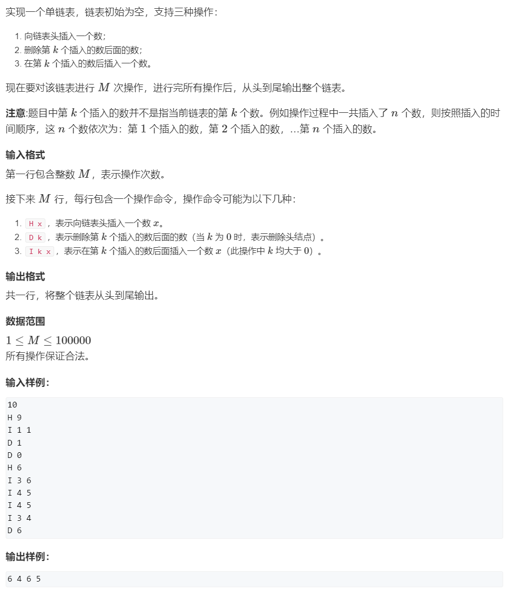


单链表模板：

```c++
//单链表模板

int head,idx;//head指头指针（头指针指向头结点），e[head]指的是头结点的值
//idx指的是下一个可存储的位置的索引，也可以说是插入的第几个数的序号，即idx=0时表示插入的第一个数
 

int e[N],ne[N];//e[N]存储的是结点的值，ne[N]存储的是结点的下一个结点的索引 

void init(){
	head = -1;//头指针默认赋-1 
	idx = 0;
}

void insert_to_head(int x){
	e[idx] = x;
	ne[idx] = head;
	head = idx++;
}

void remove(int k){
	ne[k] = ne[ne[k]];
}

void insert(int k ,int x){
	e[idx] = x;
	ne[idx] = ne[k];
	ne[k] = idx++;
}
```


**题解代码：**

```c++

//此模板的关键在于k-1索引上的数绝对是插入的第k个数 

#include<iostream>

using namespace std;

const int N = 1e5+10;

int head,idx;//head指头指针（头指针指向头结点），e[head]指的是头结点的值
//idx指的是下一个可存储的位置的索引，也可以说是插入的第几个数的序号，即idx=0时表示插入的第一个数
 

int e[N],ne[N];//e[N]存储的是结点的值，ne[N]存储的是结点的下一个结点的索引 

void init(){
	head = -1;//head的默认值赋-1 
	idx = 0;
}

void insert_to_head(int x){
	e[idx] = x;
	ne[idx] = head;
	head = idx++;
}

void remove(int k){
	ne[k] = ne[ne[k]];
}

void insert(int k ,int x){
	e[idx] = x;
	ne[idx] = ne[k];
	ne[k] = idx++;
}

int main(){
	int m;
	cin>>m;
	init();
	while(m--){
		char op;
		int k,x;
		cin>>op;
		if(op == 'H'){
			cin>>x;
			insert_to_head(x);
		}
		else if(op == 'I'){
			cin>>k>>x;
			insert(k-1,x);//第k个插入的数索引为k-1，因为idx是从0开始的，第一个插入的数索引为1；
		}else{
			cin>>k;
			if(!k) head = ne[head];
			else remove(k-1);
		}
	}
	
	for(int i = head ; i != -1 ; i = ne[i]) cout<<e[i]<<" ";
	cout<<endl;
	return 0;
} 

```

## 2 双链表

### 2.1 双链表

洛谷：https://www.luogu.com.cn/problem/T430507


AcWing题目：


**双链表模板：**

```c++
//双链表模板

int l[N],r[N],e[N];
int idx;

 
void init(){
    //头结点指向尾结点，尾结点指向头节点，头结点指针为0，尾结点指针为1，所以头指针为1，尾指针为0
	r[0] = 1;
	l[1] = 0;
	idx = 2; 
}

void insert(int k, int x){
	e[idx] = x;
	l[idx] = k;
	r[idx] = r[k];
	l[r[k]] = idx;//必须这步在前面，否则r[k]的值会被修改 
	r[k] = idx++;
}

void remove(int k){
	r[l[k]] = r[k];
	l[r[k]] = l[k];
}
```


**题解代码：**

```c++
#include<iostream>

using namespace std;

const int N = 1e5+10;

int l[N],r[N],e[N];
int idx;

void init(){
    //头结点指向尾结点，尾结点指向头节点，头结点指针为0，尾结点指针为1，所以头指针为1，尾指针为0
	r[0] = 1;
	l[1] = 0;
	idx = 2; 
}

void insert(int k, int x){
	e[idx] = x;
	l[idx] = k;
	r[idx] = r[k];
	l[r[k]] = idx;//必须这步在前面，否则r[k]的值会被修改 
	r[k] = idx++;
}

void remove(int k){
	r[l[k]] = r[k];
	l[r[k]] = l[k];
}

int main(){
	int m;
	cin>>m;
	init();
	while(m--){
		string op;
		int k,x;
		cin>>op;
		if(op == "L"){
			cin>>x;
			insert(0,x);//最左端插入表示索引1的位置插入数 
		}
		else if( op == "R"){
			cin>>x;
			insert(l[1],x);//最右端插入表示尾结点前面的位置插入数 
		}
		else if( op == "D"){
			cin>>k;
			remove(k + 1);//第k个插入的数索引为k+1，因为idx是从2开始的，第一个插入的数索引为2； 
		}
		else if( op == "IL"){
			cin>>k>>x;
			insert(l[k+1],x);
		}
		else{
			cin>>k>>x;
			insert(k + 1 ,x);
		}
	}
	for(int i = r[0] ; i!= 1 ;i = r[i]) cout<<e[i]<<" ";
	cout<<endl;
	return 0; 
}
```

## 3 栈

### 3.1 模拟栈

洛谷：https://www.luogu.com.cn/problem/B3614


AcWing题目：


**栈模板：**

```c++
//栈模板
// top表示栈顶
int stk[N], top = -1;

// 向栈顶插入一个数
stk[ ++ top] = x;

// 从栈顶弹出一个数
top -- ;

// 栈顶的值
stk[top];

// 判断栈是否为空，如果 top >= 0，则表示不为空
if (top >= 0)
{

}
```

**题解代码：**

```c++
#include<iostream>

using namespace std;

const int N = 100010;

int top = -1;//初始时top等于-1，表示没有元素
int stk[N];

int main(){
	int m;
	cin>>m;
	while(m--){
		string s;
		int x;
		cin>>s;
		if(s == "push"){
			cin>>x;
			stk[++top] = x;
		}
		else if(s == "pop") top--;
		else if(s == "empty"){
			if(top >= 0) cout<<"NO"<<endl;
			else cout<<"YES"<<endl; 
		}
		else cout<<stk[top]<<endl;
	}
	return 0;
} 

```

### 3.2 表达式求值


```c++
#include <iostream>
#include <stack>
#include <string>
#include <map>
using namespace std;

//双栈加优先级表 
stack<int> num;
stack<char> op;
map<char, int> h = { {'+', 1}, {'-', 1}, {'*',2}, {'/', 2} };

//求值函数 
void eval()
{
    int b = num.top();//第二个操作数
    num.pop();

    int a = num.top();//第一个操作数
    num.pop();

    char p = op.top();//运算符
    op.pop();

    int r = 0;//结果 

    //计算结果
    if (p == '+') r = a + b;
    else if (p == '-') r = a - b;
    else if (p == '*') r = a * b;
    else if (p == '/') r = a / b;

    num.push(r);//结果入栈
}

int main()
{
    string s;//读入表达式
    cin >> s;

    for (int i = 0; i < s.size(); i++)
    {
    	char c = s[i]; 
    	//1.数字，数字入栈 
        if (isdigit(c))
        {	
        	//此while循环是在读到了数字时读完一整个数字 
            int x = 0, j = i;
            while (j < s.size() && isdigit(s[j]))
            {
                x = x * 10 + s[j] - '0';
                j++;
            }
            num.push(x);
            i = j - 1;
        }
        //2.左括号，左括号无优先级，直接入栈
        else if (c == '(')//左括号入栈
        {
            op.push(c);
        }
        //3.右括号，括号特殊，遇到左括号直接入栈，遇到右括号不进栈，直接计算 
        else if (c == ')')
        {
            while(op.top() != '(')
                eval();
            op.pop();//左括号出栈
        }
        //4.运算符，主要是优先级的问题 
        else
        {
            while (op.size() && h[op.top()] >= h[c])//待入栈运算符优先级低，则先计算
                eval();
            op.push(c);//算完之后此运算符入栈
        }
    }
    while (op.size()) eval();//剩余的进行计算 
    cout << num.top() << endl;//输出结果
    return 0;
}
```

## 4 队列

### 4.1 模拟队列

洛谷：

https://www.luogu.com.cn/problem/B3616


AcWing题目：


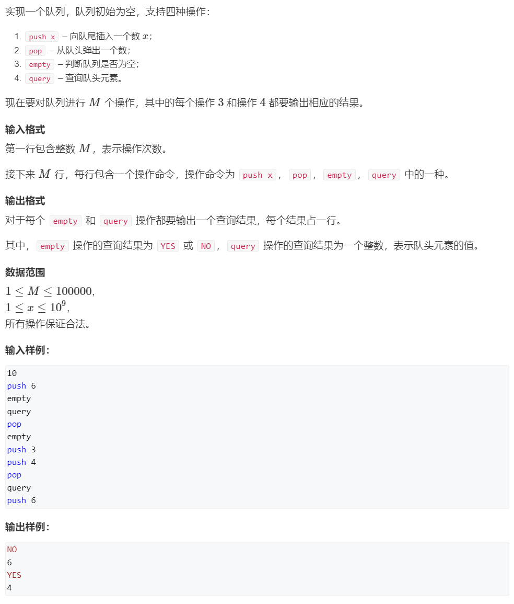


**模拟普通队列模板：**

```c++
//模拟普通队列模板

// hh 表示队头，tt表示队尾
int q[N], hh = 0, tt = -1;

// 向队尾插入一个数
q[ ++ tt] = x;

// 从队头弹出一个数
hh ++ ;

// 队头的值
q[hh];

// 判断队列是否为空，如果 tt >= hh，则表示不为空
if (tt >= hh)
{

}

//模拟循环队列模板

// hh 表示队头，tt表示队尾的后一个位置
int q[N], hh = 0, tt = 0;

// 向队尾插入一个数
q[tt ++ ] = x;
if (tt == N) tt = 0;

// 从队头弹出一个数
hh ++ ;
if (hh == N) hh = 0;

// 队头的值
q[hh];

// 判断队列是否为空，如果hh != tt，则表示不为空(其实不能这样简单判断是否为空)
if (hh != tt)
{

}
```


**题解代码：**

```c++
#include <iostream>
using namespace std;
const int N = 100010;
int q[N];

//[hh, tt] 之间为队列（左闭右闭）
int hh = 0;//队头位置
int tt = -1;//队尾位置，存第一个元素时的索引为0，所以从0开始存储 
int m;
string s;


int main(){
    cin >> m;
    while(m--){
        cin >> s;
        //入队
        if(s == "push"){
            int x;
            cin >> x;
            q[++tt] = x;
        }
        //出队
        else if(s == "pop"){
            hh++;
        }
        //问空
        else if(s == "empty"){
            if(tt >= hh) cout << "NO" << endl;
    		else cout << "YES" << endl;
        }
        //查询 
        else if(s == "query"){
            cout << q[hh] << endl;
        }
    }
}

```

## 5 单调栈

### 5.1 单调栈

洛谷：https://www.luogu.com.cn/problem/P5788

AcWing题目：


**单调栈常见模型：**

```c++
//单调栈常见模型：找出每个数左边离它最近的比它大/小的数
int top = -1;
while(n--)
{
    while (top >= 0 && check(stk[top], x)) top -- ;
    stk[ ++ top] = x;
}
```

**题解代码：**

```c++
#include <iostream>

using namespace std;

const int N = 100010;

int stk[N];
int top = -1;

int main(){
	int n;
	cin>>n;
	while(n--){
		int x;
		cin>>x;
		while(top >= 0 && stk[top] >= x) top--;//比x大的元素全弹出来 
		if(top >= 0) cout<<stk[top]<<" ";//弹完之后如果还有元素就输出栈顶元素 
		else cout<<-1<<" ";//无就输出-1 
		stk[++top] = x;//最后要把x存入，因为x是有可能比之后的元素小的，并且x离之后的元素最近 
	}
	return 0;
}
```

## 6 单调队列

### 6.1 滑动窗口

洛谷：https://www.luogu.com.cn/problem/P1886


AcWing题目：


**单调队列常见模型：**

```c++
//单调队列常见模型：找出滑动窗口中的最大值/最小值
int hh = 0, tt = -1;
for (int i = 0; i < n; i ++ )
{
    while (hh <= tt && check_out(q[hh])) hh ++ ;  // 判断队头是否滑出窗口
    while (hh <= tt && check(q[tt], i)) tt -- ;
    q[ ++ tt] = i;
}
```

**题解代码：**

```c++
#include <iostream>

using namespace std;

const int N = 1000010;

int a[N],q[N];//q[N]存的是下标 

int main(){
	int n,k;
	cin>>n>>k;
	for(int i = 0; i< n ; i++) cin>>a[i];
	
	//最小值 
	int hh = 0, tt = -1;
	for(int i = 0 ; i < n; i++){
		//滑出队头 
		if(hh <= tt && q[hh] < i-k+1) hh++;//i-k+1为窗口的最左端索引
		//去掉比当前要进入的数更大的数 
		while(hh <= tt && a[q[tt]] >= a[i]) tt--;
		//当前操作数的索引存入数组 
		q[++tt] = i;
		// i 等于 k - 1 时，窗口的大小刚好为 k。因此，当 i 大于或等于 k - 1 时，窗口就已经包含了至少 k 个元素。
		if(i >= k-1) cout<<a[q[hh]]<<" ";
	}
	cout<<endl;
	
	//最大值，除a[q[tt]] <= a[i]外无变化 
	hh = 0, tt = -1;
	for(int i = 0 ; i < n; i++){
		if(hh <= tt && q[hh] < i-k+1) hh++;
		while(hh <= tt && a[q[tt]] <= a[i]) tt--;
		q[++tt] = i;
		if(i >= k-1) cout<<a[q[hh]]<<" ";
	}
	cout<<endl;
	return 0;
}
```

## 7 KMP

### 7.1 KMP字符串

洛谷：https://www.luogu.com.cn/problem/P3375


AcWing题目：


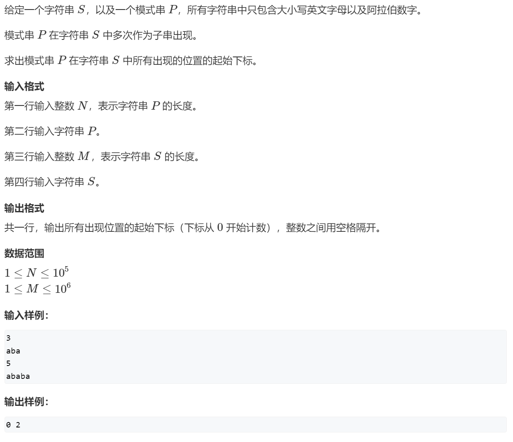


手动模拟求next数组：

对 p = “abcab”

|   p    |  a   |  b   |  c   |  a   |  b   |
| :----: | :--: | :--: | :--: | :--: | :--: |
|  下标  |  1   |  2   |  3   |  4   |  5   |
| next[] |  0   |  0   |  0   |  1   |  2   |

对next[ 1 ] ：前缀 = 空集—————后缀 = 空集—————next[ 1 ] = 0;

对next[ 2 ] ：前缀 = { a }—————后缀 = { b }—————next[ 2 ] = 0;

对next[ 3 ] ：前缀 = { a , ab }—————后缀 = { c , bc}—————next[ 3 ] = 0;

对next[ 4 ] ：前缀 = { **a** , ab , abc }—————后缀 = { **a** . ca , bca }—————next[ 4 ] = 1;

对next[ 5 ] ：前缀 = { a , **ab** , abc , abca }————后缀 = { b , **ab** , cab , bcab}————next[ 5 ] = 2;


```c++
// s[]是长文本，p[]是模式串，m是s的长度，n是p的长度
//求模式串的Next数组：
for (int i = 2, j = 0; i <= n; i ++ )
{	
    while (j && p[i] != p[j + 1]) j = ne[j];
    if (p[i] == p[j + 1]) j ++ ;
    ne[i] = j;
}

// 匹配
for (int i = 1, j = 0; i <= m; i ++ )
{
    while (j && s[i] != p[j + 1]) j = ne[j];
    if (s[i] == p[j + 1]) j ++ ;
    if (j == n)
    {
        j = ne[j];
        // 匹配成功后的逻辑
    }
}
```


```c++
//KMP算法即字符串匹配算法
#include <iostream>

using namespace std;

const int N = 10010, M = 100010;

//p，s，ne数组索引都是从1开始的 
char p[N],s[M];
int ne[N];

int main(){                   
	int n,m;
	cin>>n>>p+1>>m>>s+1;
	
//	//输出为空 
//	cout<<p<<endl;
//	cout<<s<<endl;
//	
//	//输出整个p和整个s 
//	cout<<p+1<<endl;
//	cout<<s+1<<endl;
	
	//求ne数组的过程,ne[1]为0，所以从2开始，ne[i]表示从1到i之间，前缀和后缀最长相等元素的长度
	//next数组的求法是模板串自己与自己进行匹配 
	for(int i = 2, j = 0; i <= n; i++){
        //如果不等就回溯
		while(j && p[i] != p[j+1]) j = ne[j];
        //如果相等，模板串下标j的元素是提前和文本串对应j的下一个元素也就是下标为i的元素比较，所以j要+1
		if(p[i] == p[j+1]) j++;
        //现在j就已经是前缀和后缀最长相等元素的长度，所以要赋给ne[i]
		ne[i] = j;
	}
	
	//kmp匹配过程，模板串与文本串进行匹配 
	for(int i = 1, j = 0; i <= m; i++){
        //如果不等就回溯
		while(j && s[i] != p[j+1]) j = ne[j];
        //如果相等，模板串下标j的元素是提前和文本串对应j的下一个元素也就是下标为i的元素比较，所以j要+1（短的为模板串）
		if(s[i] == p[j+1]) j++;
        //j == n是找到了完整的相同的字符串
		if(j == n){
			cout<<i-n<<" ";//输入匹配完全的字符串的头下标，题目下标是从0开始的，所以不用加一 
			j = ne[j];//继续回溯找下一个相同的字符串，不要从头开始
		}
	}
	return 0; 
}
```

## 8 Trie 树

### 8.1 Trie字符串统计

> [!important]
>
> 牛客：
>
> [【模板】Trie 字典树_牛客题霸_牛客网](https://www.nowcoder.com/practice/feed1cd7546a4901965751b9fbf5f8a1)
>
> 洛谷：
>
> https://www.luogu.com.cn/problem/P8306

AcWing题目：


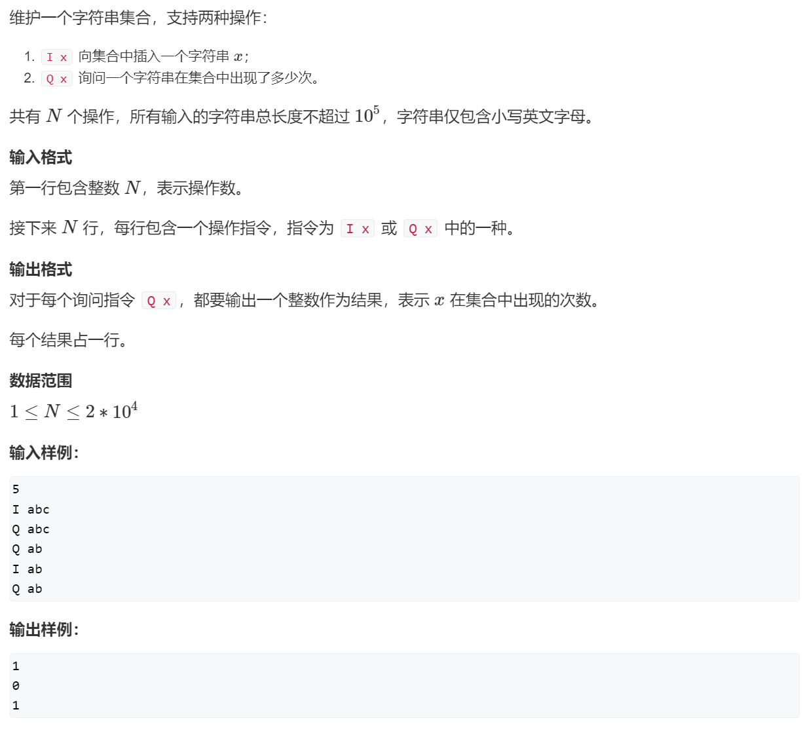


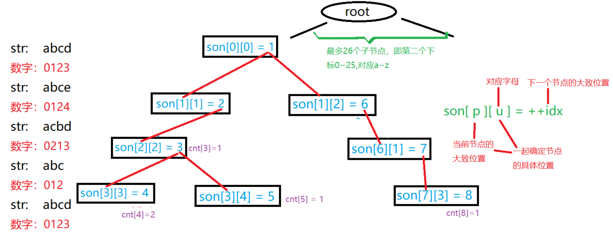


```c++
int son[N][26], cnt[N], idx;
// 0号点既是根节点，又是空节点
// son[][]存储树中每个节点的子节点
// cnt[]存储以每个节点结尾的字符串数量

// 插入一个字符串
void insert(char *str)
{
    int p = 0;
    for (int i = 0; str[i]; i ++ )
    {
        int u = str[i] - 'a';
        if (!son[p][u]) son[p][u] = ++ idx;
        p = son[p][u];
    }
    cnt[p] ++ ;
}

// 查询字符串出现的次数
int query(char *str)
{
    int p = 0;
    for (int i = 0; str[i]; i ++ )
    {
        int u = str[i] - 'a';
        if (!son[p][u]) return 0;
        p = son[p][u];
    }
    return cnt[p];
```


```c++
//Trie树快速存储字符集合和快速查询字符集合
#include <iostream>

using namespace std;

const int N = 100010;
//son[][]存储子节点的位置，也存储第几个结点（idx的值），分支最多26条；
//cnt[p]存储以p节点结尾的字符串个数（同时也起标记作用）
//idx表示当前要插入的节点是第几个,每创建一个节点值+1
int son[N][26], cnt[N], idx;
char str[N];

void insert(char *str)
{
    int p = 0;  //类似指针，指向当前节点
    for(int i = 0; str[i]; i++)
    {
        int u = str[i] - 'a'; //将字母转化为数字
        if(!son[p][u]) son[p][u] = ++idx;   //该节点不存在，创建节点
        p = son[p][u];  //使“p指针”指向下一个节点
    }
    cnt[p]++;  //结束时的标记，也是记录以此节点结束的字符串个数
}

int query(char *str)
{
    int p = 0;
    for(int i = 0; str[i]; i++)
    {
        int u = str[i] - 'a';
        if(!son[p][u]) return 0;  //该节点不存在，即该字符串不存在
        p = son[p][u]; 
    }
    return cnt[p];  //返回字符串出现的次数
}

int main()
{
    int m;
    cin >> m;

    while(m--)
    {
        char op[2];
		cin>>op>>str; 
        if(*op == 'I') insert(str);
        else cout<<query(str)<<endl;
        //改成char op; op == 'I'也行
    }

    return 0;
}
```

### 8.2 最大异或对


```c++
#include<iostream>
#include<algorithm>
using namespace std;
const int N=100010,M=31*N;

int a[N];
int son[M][2],idx;
//M代表一个数字串二进制可以到多长

void insert(int x)
{
    int p=0;  //根节点
    for(int i=30;i>=0;i--)
    {
        int u=x>>i&1;   //取x的二进制中的第i位数字
        if(!son[p][u]) son[p][u]=++idx; ///如果插入中发现没有该子节点,开出这条路
        p=son[p][u]; //指针指向下一层
    }
}
//异或运算相同为0不同为1 
int search(int x)
{
    int p=0;int res=0;
    for(int i=30;i>=0;i--)
    {                               
        int u=x>>i&1; //从最大位开始找
        if(son[p][!u]) //如果当前层有对应的不相同的数，res左移一位并加一 
        {   
          p=son[p][!u];
          res=res*2+1;
             //*2相当左移一位  然后如果找到对应位上不同的数res+1
        }                                                       
        else //如果当前层有对应的相同的数，res左移一位并加零                                                                                                                    //刚开始找0的时候是一样的所以+0    到了0和1的时候原来0右移一位,判断当前位是同还是异,同+0,异+1
        {
            p=son[p][u];
            res=res*2+0;
        }
    }
    return res;
}
int main()
{
	int n; 
    cin>>n;
    for(int i=0;i<n;i++)
    {
        cin>>a[i];
        insert(a[i]);
    }
    int res=0;
    for(int i=0;i<n;i++)
    {   
        res=max(res,search(a[i]));  ///search(a[i])查找的是a[i]值的最大与或值
    }
    cout<<res<<endl;
    return 0; 
}
```

## 9 并查集

```c++

并查集：
1.将两个集合合并
2.询问两个元素是否在一个集合当中
基本原理：每个集合用一棵树来表示。树根的编号就是整个集合的编号。每个节点存储
它的父节点，p[x]表示x的父节点
问题1：如何判断树根：if(p[x]==x)
问题2：如何求x的集合编号：while(p[x]!=x)x = p[x]
问题3：如何合并两个集合：px是x的集合编号，py是y的集合编号。p[x]=y

(1)朴素并查集：

    int p[N]; //存储每个点的祖宗节点

    // 返回x的祖宗节点
    int find(int x)
    {
        if (p[x] != x) p[x] = find(p[x]);
        return p[x];
    }

    // 初始化，假定节点编号是1~n
    for (int i = 1; i <= n; i ++ ) p[i] = i;

    // 合并a和b所在的两个集合：
    p[find(a)] = find(b);


(2)维护size的并查集：

    int p[N], size[N];
    //p[]存储每个点的祖宗节点, size[]只有祖宗节点的有意义，表示祖宗节点所在集合中的点的数量

    // 返回x的祖宗节点
    int find(int x)
    {
        if (p[x] != x) p[x] = find(p[x]);
        return p[x];
    }

    // 初始化，假定节点编号是1~n
    for (int i = 1; i <= n; i ++ )
    {
        p[i] = i;
        size[i] = 1;
    }

    // 合并a和b所在的两个集合：
    size[find(b)] += size[find(a)];
    p[find(a)] = find(b);


(3)维护到祖宗节点距离的并查集：

    int p[N], d[N];
    //p[]存储每个点的祖宗节点, d[x]存储x到p[x]的距离

    // 返回x的祖宗节点
    int find(int x)
    {
        if (p[x] != x)
        {
            int u = find(p[x]);
            d[x] += d[p[x]];
            p[x] = u;
        }
        return p[x];
    }

    // 初始化，假定节点编号是1~n
    for (int i = 1; i <= n; i ++ )
    {
        p[i] = i;
        d[i] = 0;
    }

    // 合并a和b所在的两个集合：
    p[find(a)] = find(b);
    d[find(a)] = distance; // 根据具体问题，初始化find(a)的偏移量
```


### 9.1 合并集合

洛谷：https://www.luogu.com.cn/problem/P3367


AcWing题目：


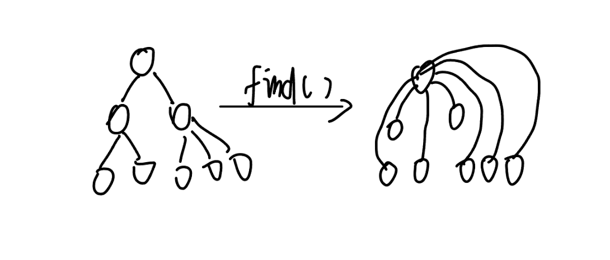

```c++
#include<iostream>

using namespace std;

const int N=100010;
int p[N];//存储父节点的数组，p[x]=y表示x的父节点为y 

//找根节点（集合编号）的函数 ，查找过一遍后所有经过的x的父节点的父节点都会变为集合编号以降低时间复杂度 
int find(int x)
{
    if(p[x]!=x) p[x]=find(p[x]);//只有根节点的p[x]=x，所以要一直找直到找到根节点 
    return p[x];//找到了便返回根节点的值
}

int main()
{
    int n,m;
    cin>>n>>m;
    for(int i=1;i<=n;i++) p[i]=i;//刚开始每个数自成一个集合，每个数自己为根节点 
    while(m--)
    {
        char op;
        int a,b;
        cin>>op>>a>>b;
        if(op=='M') p[find(a)]=find(b);//集合合并操作(把a合并到b集合)
        else{
        	if(find(a)==find(b)) cout<<"Yes"<<endl;//如果根节点一样,就输出yes
	        else cout<<"No"<<endl;
		}
    }
    return 0;
}
```

### 9.2 连通块中点的数量


```c++
#include <iostream>

using namespace std;

const int N = 100010;

//只有根节点的s能代表集合的节点数量，所以s中括号里一般都要有find函数先找出根节点 
int p[N],s[N];

int find(int x){
	if(p[x] != x) p[x] = find(p[x]);
	return p[x];
}

int main(){
	int n,m;
	cin>>n>>m;
	for(int i = 1; i <= n;i++){
		p[i] = i;
		s[i] = 1;
	}
	while(m--){
		string op;
		int a,b;
		cin>>op;
		if(op == "C"){
			cin>>a>>b;
			if(find(a) == find(b)) continue;
			s[find(b)]+=s[find(a)];//先加size 
			p[find(a)] = find(b);//再连	
		}
		else if(op == "Q1"){
			cin>>a>>b;
			if(find(a) == find(b)) cout<<"Yes"<<endl;
			else cout<<"No"<<endl;
		}
		else{
			cin>>a;
			cout<<s[find(a)]<<endl;
		}
	}
	return 0;
}
```

### 9.3 食物链

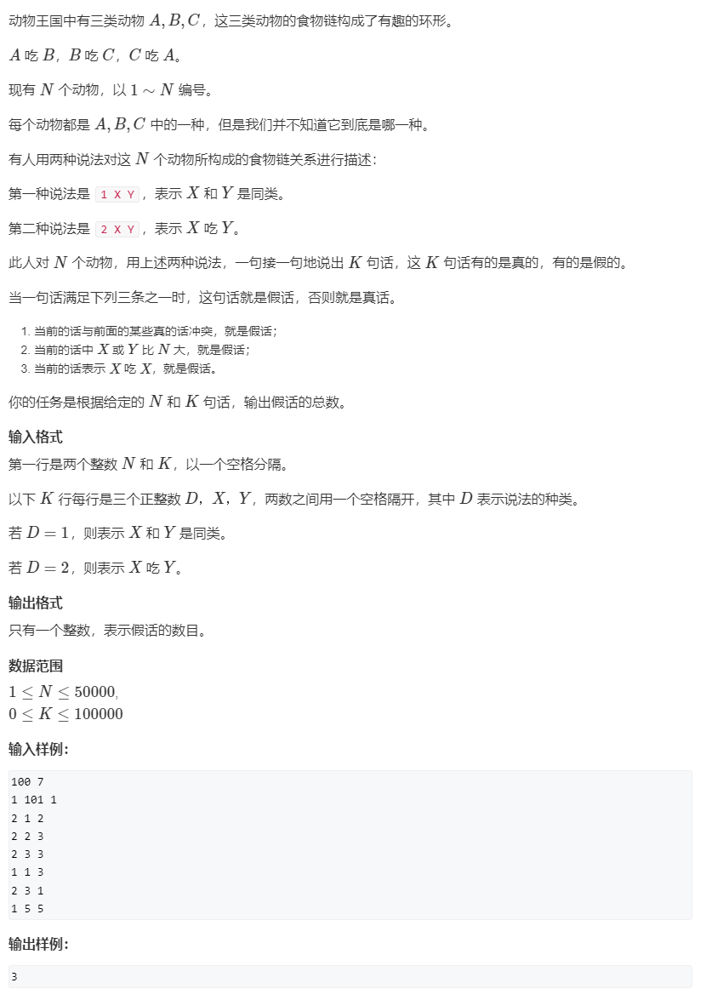

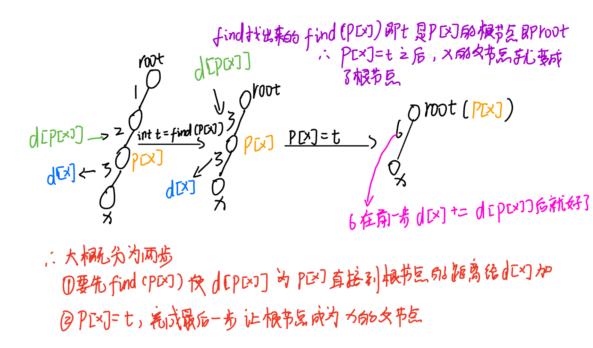

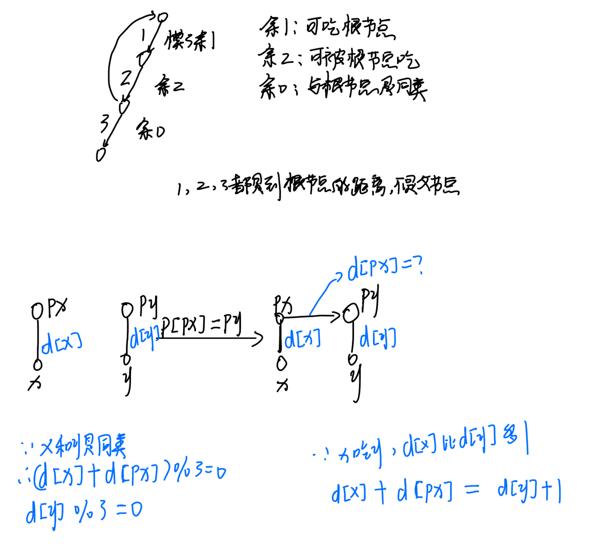

```c++
#include <iostream>

using namespace std;

const int N = 50010;

//d[x]表示x到父节点的距离，p[x]表示x的父节点 
int p[N],d[N];

/*int find(int x)函数两个作作用：
1.使根节点成为x的父节点，并返回x的根节点
2.将d[x]即x到父节点的距离变为x到根节点的距离*/
int find(int x){
	if(p[x]!=x){
		int t = find(p[x]);
		//find完之后，p[x]直接连接根节点了，d[p[x]]是x的父节点p[x]到根节点的距离，即：
		/*x到根节点的距离 = x到父节点的距离 + 父节点到根节点的距离
		d[x] = d[x] + d[p[x]];*/ 
		//如果不先find那么d[p[x]]就是x的父节点p[x]到父节点的距离，就不一定是p[x]到根节点的距离，即： 
		/*x到根节点的距离 = x到父节点的距离 + 父节点到父节点的距离
		d[x] = d[x] + d[p[x]];*/ 
		//因为find完之后p[x]的子节点就是x，父节点就是根节点0 
		d[x] += d[p[x]];//这步进行完d[x]是没错的了，就是x到根节点的总距离
		//这步再把x的父节点改为根节点，取代之前x和根节点之间的父节点，这样x和根节点就是距离也没错也是直接连接的了  
		p[x] = t; 
	}
	return p[x];
}

int main(){
	int n,m;
	cin>>n>>m;
	for(int i = 1; i<= n; i++) p[i] = i;
	int res = 0;
	while(m--){
		int t,x,y;
		cin>>t>>x>>y;
		//1.X或Y比N大，假话
		if( x>n || y>n) res++;
		else{
			//为什么px一定要等于py也就是x和y为什么一定要在一个集合内呢
			//如果不在同一个集合内，就无法正确地模拟食物链的关系。因为在同一个集合内，才能通过距离数组 d 来维护元素之间的食物链关系，并查集核心思想也是要在一个集合内 
			int px = find(x),py = find(y);
			if(t == 1){//此时t == 1，表示已经告诉我们x和y是同类 
				//在一个树上并且x和y不是同类即(d[x] - d[y])%3余1或余2，假话+1 
				if(px == py && (d[x] - d[y])%3) res++;//注意此时已经经过了find函数所以d[x]是x到根节点的距离 
				else if(px != py){//当x和y不在一个集合内时把他们合并，注意if条件不要漏，不要直接else，是只有x和y不在一个集合时才要合并
					p[px] = py;
					d[px] = d[y] - d[x];//1式 
				}
			}
			else{//此时告诉我们x吃y
				//在一个树上并且x不吃y即(d[x] - d[y] - 1)%3不等于0，假话+1
				if(px == py && (d[x] - d[y] - 1)%3) res++;
				else if(px != py){//当x和y不在一个集合内时把他们合并，注意if条件不要漏，不要直接else，是只有x和y不在一个集合时才要合并
					p[px] = py;
					d[px] = d[y] +1-d[x];//2式，1式和2式具体思路看图 
				}
			}
		}
	}
	cout<<res<<endl;
	return 0;
}
```

```c++
//简洁版
#include <iostream>

using namespace std;

const int N = 50010;

int p[N],d[N];

int find(int x){
	if(p[x] != x){
		int t= find(p[x]);
		d[x]+=d[p[x]];
		p[x] = t;
	}
	return p[x];
}

int main(){
	int n,m;
	cin>>n>>m;
	for(int i = 1; i <= n ; i++) p[i] = i;
	int res = 0;
	while(m--){
		int op,x,y;
		cin>>op>>x>>y;
		if(x > n ||y > n) res++;
		else{
			int px = find(x),py = find(y);
			if(op == 1){
				if( px == py && (d[x]-d[y])%3) res++;
				else if(px != py){
					p[px] = py;
					d[px] = d[y]-d[x]; 
				}
			}
			else{
				if( px == py && (d[x]-d[y]-1)%3) res++;
				else if(px != py){
					p[px] = py;
					d[px] = d[y]-d[x] + 1; 
				}
			}
		}
	}
	cout<<res<<endl;
	return 0;
}
```

## 10 堆

```c++
//h[N]存储堆中的值, h[1]是堆顶，x的左儿子是2x, 右儿子是2x + 1
//ph存储堆中的下标，ph是插入顺序数组 
//hp存储元素的插入顺序，h存储的是元素的值，h和hp都是堆数组
//se表示size，插入点在堆中的下标，因为size是关键字所以用se代替
int h[N], ph[N], hp[N], se;

void heap_swap(int a, int b){
	//下面三个交换只要保证 swap(hp[a], hp[b])在swap(ph[hp[a]], ph[hp[b]])后面就行，其他无所谓 
	swap(ph[hp[a]], ph[hp[b]]);//交换堆中的下标
	/*上面这一步是交换堆中的下标，为什么不能直接交换a和b：首先，是因为交换a和b会影响后面两个交换。
	但是这么交换的实际意思是：只是交换了ph数组中对应a和b的那个值，所以这样既正确修改了映射，又没影响到a和b*/ 
	swap(hp[a], hp[b]);//交换插入顺序 
	swap(h[a], h[b]);//交换值 
}

void down(int r){
	int t=r;
	if (r * 2 <= se && h[r * 2]< h[t]) t = r * 2;
	if (r *2 + 1 <= se && h[r * 2 + 1]< h[t]) t = r * 2 + 1;
	if (r != t){
		heap_swap(r, t);
		down(t);
	}
}
void up(int u){
	//只要保证比根结点的值大就行了 
	while (u / 2 && h[u] < h[u / 2]){//此节点索引为u，根节点为u/2 
		heap_swap(u /2, u);
		u /= 2;//下次循环再跟根节点的根节点比...以此类推 
	}
}

// O(n)建堆
for (int i = n / 2; i; i -- ) down(i);
```


### 10.1 堆排序

洛谷：https://www.luogu.com.cn/problem/P3378


AcWing题目：


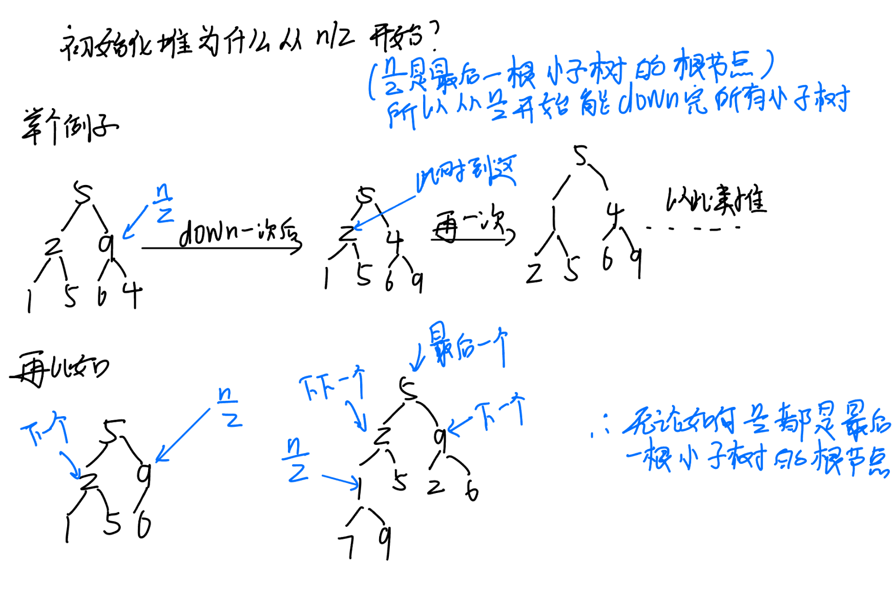


```c++

//小顶堆：1.根节点小于等于两个子节点；2.假如根节点的索引为x，则左子节点索引为2x，右为2x+1；3.堆在几何意义上是一颗完全二叉树 

#include<iostream> 
#include<algorithm>

using namespace std;

const int N = 100010;

int h[N], se;//se是数组长度size 

int n, m;

void down(int r)
{
    int t = r;
    //一定要用h[t]比较，如上图
    if (2 * r <= se && h[2 * r] < h[t])//先跟左子节点比
        t = 2 * r;
    if (2 * r + 1 <= se && h[2 * r + 1] < h[t])//再跟右子节点比
        t = 2 * r + 1;
    if (r != t)
    {
        swap(h[r], h[t]);//跟最后比出来的最小的那个结点换值
        /*为什么要在if (r != t)里面down(t)，而不是这个函数的最后或其他位置：因为当r == t时，根节点就是最小值，也就是之前t没被赋索引；如果t被赋索引了，此时t是两个子节点中最小的那一个，因为这个最小的值被这个小子树的根节点换走了，所以此时这个子节点的值就是根结点的值，是比原来的值更大的，所以以这个子节点为根节点的子树可能就不满足小顶堆了，所以要再down一下，同理，到了以这个子节点为根节点的小子树如果也是这种情况也要继续再down，以此类推。*/
        down(t);
    }
}

int main()
{
    cin >> n >> m;
    se = n;
    for (int i = 1; i <= n; i++) cin>>h[i];
    //使数组成为堆，即初始化堆
    for (int i = n / 2; i > 0; i--) down(i);

    while (m--)
    {
        cout << h[1] << " ";
        h[1] = h[se--];
        down(1);
    }

    return 0;
}
```

### 10.2 模拟堆


```c++
#include<iostream>
#include<algorithm> 

using namespace std;

const int N = 100010;

//ph存储堆中的下标，ph是插入顺序数组 
//hp存储元素的插入顺序，h存储的是元素的值，h和hp都是堆数组 
//se表示size，插入点在堆中的下标 
int h[N], ph[N], hp[N], se;

//参数是堆中的下标
void heap_swap(int a, int b){
	swap(ph[hp[a]], ph[hp[b]]);//交换堆中的下标
	/*上面这一步是交换堆中的下标，为什么不能直接交换a和b：首先，是因为交换a和b会影响后面两个交换。
	但是这么交换的实际意思是：只是交换了ph数组中对应a和b的那个值，所以这样既正确修改了映射，又没影响到a和b*/ 
	swap(hp[a], hp[b]);//交换插入顺序 
	swap(h[a], h[b]);//交换值 
}

void down(int r){
	int t=r;
	if (r * 2 <= se && h[r * 2]< h[t]) t = r * 2;
	if (r *2 + 1 <= se && h[r * 2 + 1]< h[t]) t = r * 2 + 1;
	if (r != t){
		heap_swap(r, t);
		down(t);
	}
}
void up(int u){
	//只要保证比根结点的值大就行了 
	while (u / 2 && h[u] < h[u / 2]){//此节点索引为u，根节点为u/2 
		heap_swap(u /2, u);
		u /= 2;//下次循环再跟根节点的根节点比...以此类推 
	}
}

int main(){
	int m;
    cin>>m;
    int n = 0;//n表示插入的第几个数     
    while(m--)
    {
        string op;
        int k,x;
        cin>>op;
        //1.插入一个数x 
        if(op=="I")
        {
            cin>>x;
            n++;
            se++;//se表示在堆中的下标 
            h[se]=x;
            hp[se]=n;
            ph[hp[se]]=se;
            up(se);//新插入的值浮上去，注意这点易忘 
        }
        //2.输出当前集合中的最小值
        else if(op=="PM") cout<<h[1]<<endl;
        //3.删除当前集合中的最小值
        else if(op=="DM")
        {
            heap_swap(1,se);//删除操作都是通过交换实现，删除完要进行沉或者浮
            se--;
            down(1);
        }
        //4.删除第k个插入的数 
        else if(op=="D")
        {
            cin>>k;
            int u = ph[k];
            heap_swap(u,se);//删除操作都是通过交换实现，删除完要进行沉或者浮          
            se--;                    
            up(u);
            down(u);
        }
        //5.修改第 k个插入的数，将其变为 x
        else if(op=="C")
        {
        	//ph[k]表示第k个数在堆中的下标 
            cin>>k>>x;
            h[ph[k]]=x;                
            down(ph[k]);                
            up(ph[k]);
        }

    }
    return 0;
}
```

```c++
			cin>>k;
            int u = ph[k];
            heap_swap(u,se);       
            se--;                    
            up(u);
            down(u);
			//这里不能用直接用ph[K]，ph数组在heap_swap里有操作，heap_swap之后ph[k]会改变，而如果用另一个变量先ph[k]的值就不会
			cin>>k;
            heap_swap(ph[k],se);       
            se--;                    
            up(ph[k]);
            down(ph[k]);
```

## 11 哈希表

```c++
核心思想：将字符串看成P进制数，P的经验值是131或13331，取这两个值的冲突概率低
小技巧：取模的数用2^64，这样直接用unsigned long long存储，溢出的结果就是取模的结果

typedef unsigned long long ULL;
ULL h[N], p[N]; // h[k]存储字符串前k个字母的哈希值, p[k]存储 P^k mod 2^64

// 初始化
p[0] = 1;
for (int i = 1; i <= n; i ++ )
{
    h[i] = h[i - 1] * P + str[i - 1];
    p[i] = p[i - 1] * P;
}

// 计算子串 str[l ~ r] 的哈希值
ULL get(int l, int r)
{
    return h[r] - h[l - 1] * p[r - l + 1];
}
```


### 11.1 模拟散列表

洛谷：https://www.luogu.com.cn/problem/T332544


AcWing题目：


```c++

//拉链法，其实本质上就是N个单链表，就是头结点head变成了h[i] 
#include <iostream>
#include <cstring>

using namespace std;

const int N = 100003;  // 取大于1e5的第一个质数，取质数冲突的概率最小 可以百度

//h是一个数组，对应索引上面连着一个链表，h[i]的值是i索引上的链表中的头结点的下一个元素的指针，头结点是留空的； 
int h[N], e[N], ne[N], idx;  

//插入的方式是往头结点插入，具体可以看单链表 
void insert(int x) {
    int k = (x % N + N) % N;//防止x是负数 
    e[idx] = x;
    ne[idx] = h[k];
    h[k] = idx++;
}

bool find(int x) {
    int k = (x % N + N) % N;
    for (int i = h[k]; i != -1; i = ne[i]) {
        if (e[i] == x) return true;
    }
    return false;
}


int main() {
	int n; 
    cin >> n;
	memset(h, -1, sizeof h);  //将h数组全部元素的值赋为-1
    while (n--) {
        string op;
        int x;
        cin >> op >> x;
        if (op == "I") insert(x);
        else {
            if (find(x)) cout<<"Yes"<<endl;
            else cout<<"No"<<endl;
        }
    }
    return 0;
}

```

```c++
//开放寻址法 

#include <cstring>
#include <iostream>

using namespace std;

//开放寻址法一般开 数据范围的 2~3倍, 这样大概率就没有冲突了
const int N = 200003;        //大于数据范围的第一个质数
const int null = 0x3f3f3f3f;  //规定空指针为 null 0x3f3f3f3f

int h[N];

//插入与查找合为一体的函数 
int find(int x) {
    int k = (x % N + N) % N;
    //h[k] != null是插入操作的条件，h[k] != x是查找操作的条件
	//跳出循环的条件h[k] == null既是插入位置的最终结果，也是未找到待查找元素的最终结果
    //这里可能会考虑用for循环代码更短，但提交可能会超时，采用while循环会更快
    while ( h[k] != null && h[k] != x ) {
        k++;
        if (k == N) k = 0;
    }
    return k;  
}


int main() {
	int n; 
    cin >> n;
    
    memset(h, 0x3f, sizeof h);  //规定空指针为 0x3f3f3f3f

    while (n--) {
        string op;
        int x;
        cin >> op >> x;
        if (op == "I") {
            h[find(x)] = x;
        } else {
            if (h[find(x)] == x) {
                puts("Yes");
            } else {
                puts("No");
            }
        }
    }
    return 0;
}

```

### 11.2 字符串哈希

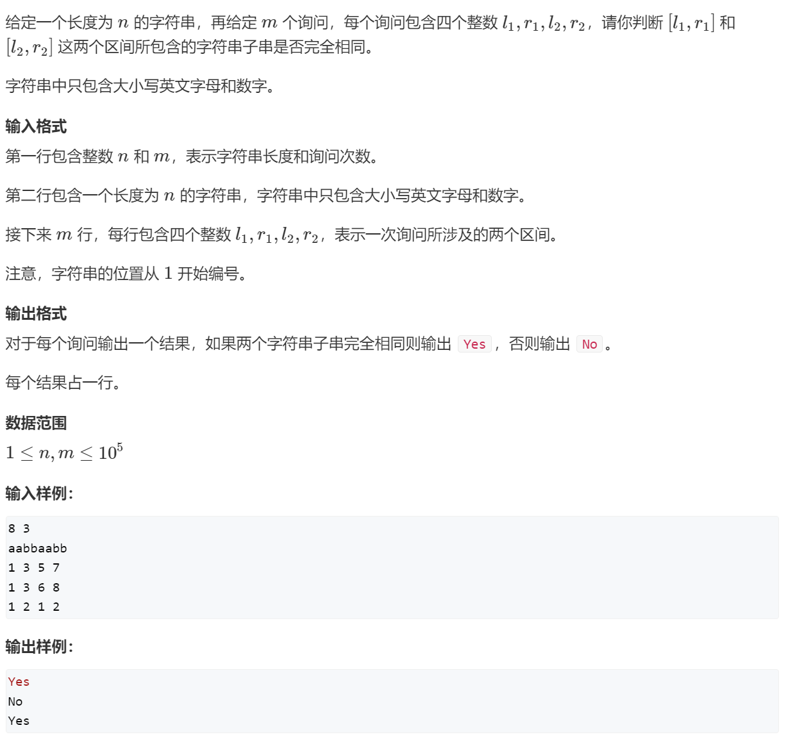

```c++
#include <iostream>

using namespace std;

const int N = 100010,P = 131;//P=131 或 P=13331

typedef unsigned long long ull;//因为Q是2的64次方

char str[N];

//p[i]是131的i次方，主要就是用到一个p[r - l + 1]；h[i]是指前i个字母的哈希值，p和h下标都从1开始考虑 
ull h[N],p[N];

ull get(int l,int r){
	return h[r] - h[l - 1] * p[r - l + 1];
}

int main(){
	int n,m;
	cin>>n>>m>>str;
	p[0] = 1;
    //初始化
	for(int i = 1; i <= n; i++){
		p[i] = p[i-1] * P;
		h[i] = h[i-1] * P + str[i - 1];//计算字符串哈希值的公式
		
	}
	while(m--){
		int l1,r1,l2,r2;
		cin>>l1>>r1>>l2>>r2;
		if(get(l1,r1) == get(l2,r2)) puts("Yes");
		else puts("No");
	}
	return 0;
} 
```

## 12 C++ STL简介

```
vector, 变长数组，倍增的思想
    size()  返回元素个数
    empty()  返回是否为空
    clear()  清空
    front()/back()
    push_back()/pop_back()
    begin()/end()
    []
    支持比较运算，按字典序

pair<int, int>
    first, 第一个元素
    second, 第二个元素
    支持比较运算，以first为第一关键字，以second为第二关键字（字典序）

string，字符串
    size()/length()  返回字符串长度
    empty()
    clear()
    substr(起始下标，(子串长度))  返回子串
    c_str()  返回字符串所在字符数组的起始地址

queue, 队列
    size()
    empty()
    push()  向队尾插入一个元素
    front()  返回队头元素
    back()  返回队尾元素
    pop()  弹出队头元素

priority_queue, 优先队列，默认是大根堆
    size()
    empty()
    push()  插入一个元素
    top()  返回堆顶元素
    pop()  弹出堆顶元素
    定义成小根堆的方式：priority_queue<int, vector<int>, greater<int>> q;

stack, 栈
    size()
    empty()
    push()  向栈顶插入一个元素
    top()  返回栈顶元素
    pop()  弹出栈顶元素

deque, 双端队列
    size()
    empty()
    clear()
    front()/back()
    push_back()/pop_back()
    push_front()/pop_front()
    begin()/end()
    []

set, map, multiset, multimap, 基于平衡二叉树（红黑树），动态维护有序序列
    size()
    empty()
    clear()
    begin()/end()
    ++, -- 返回前驱和后继，时间复杂度 O(logn)

    set/multiset
        insert()  插入一个数
        find()  查找一个数
        count()  返回某一个数的个数
        erase()
            (1) 输入是一个数x，删除所有x   O(k + logn)
            (2) 输入一个迭代器，删除这个迭代器
        lower_bound()/upper_bound()
            lower_bound(x)  返回大于等于x的最小的数的迭代器
            upper_bound(x)  返回大于x的最小的数的迭代器
    map/multimap
        insert()  插入的数是一个pair
        erase()  输入的参数是pair或者迭代器
        find()
        []  注意multimap不支持此操作。 时间复杂度是 O(logn)
        lower_bound()/upper_bound()

unordered_set, unordered_map, unordered_multiset, unordered_multimap, 哈希表
    和上面类似，增删改查的时间复杂度是 O(1)
    不支持 lower_bound()/upper_bound()， 迭代器的++，--

bitset, 压位
    bitset<10000> s;
    ~, &, |, ^
    >>, <<
    ==, !=
    []

    count()  返回有多少个1

    any()  判断是否至少有一个1
    none()  判断是否全为0

    set()  把所有位置成1
    set(k, v)  将第k位变成v
    reset()  把所有位变成0
    flip()  等价于~
    flip(k) 把第k位取反

```

