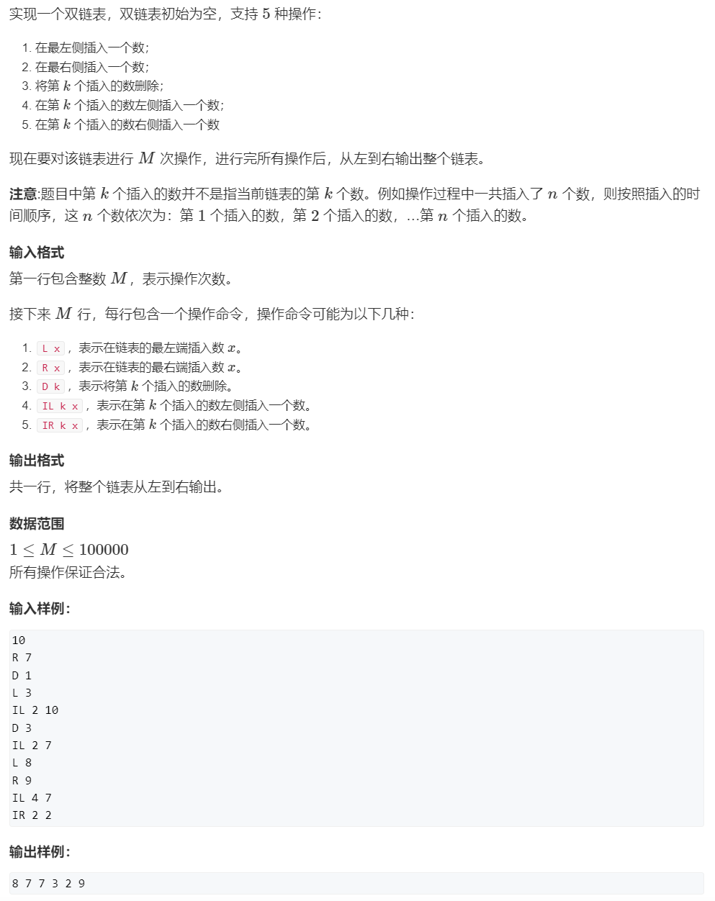
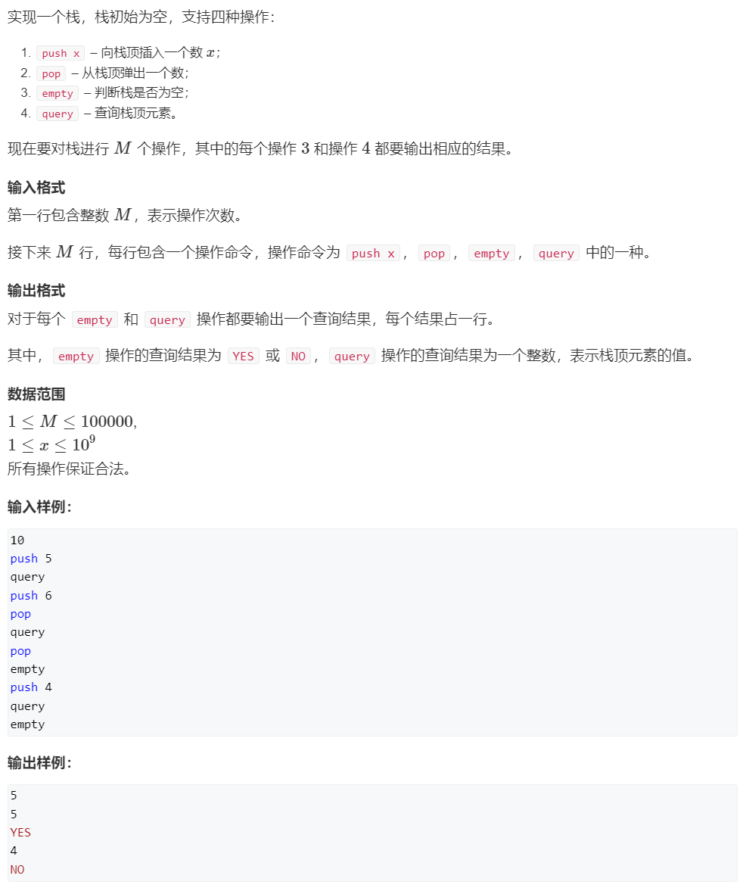
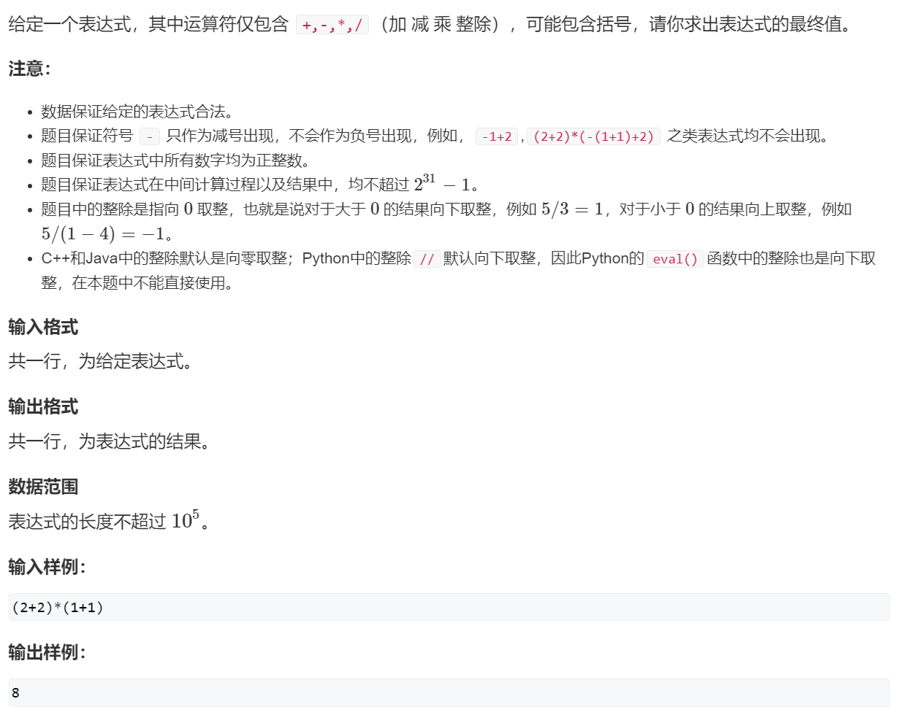
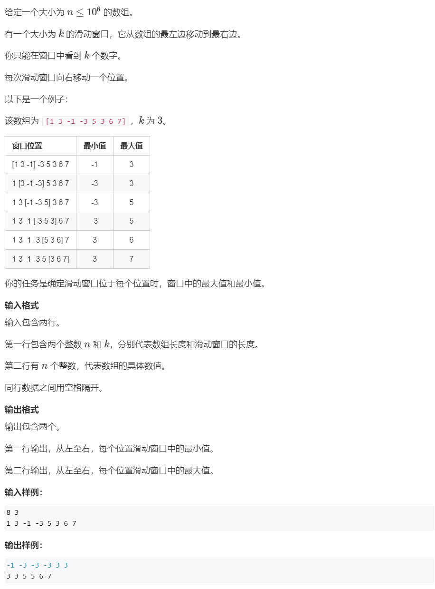
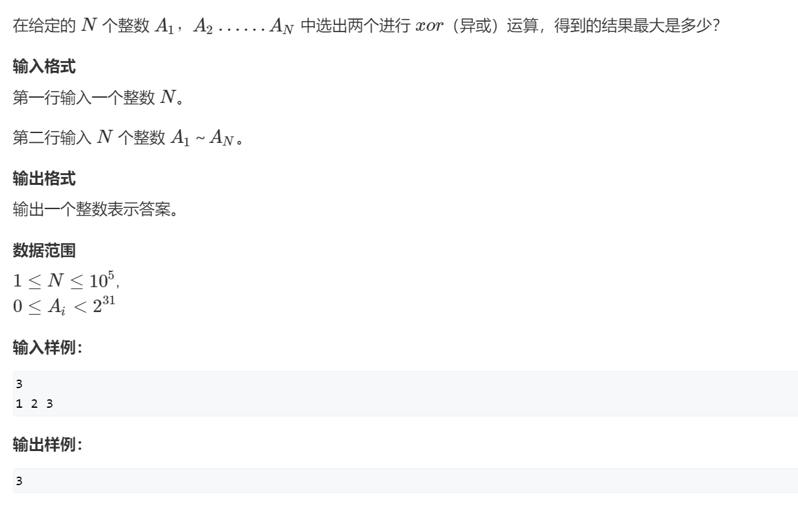

# 🎓 AcWing——算法基础课


> 本笔记为 **第二讲 · 数据结构** 的 C++ 模板与题解，覆盖了从基础链表到高级数据结构的常用实现。

---

## 📖 第二讲 数据结构

### 🔗 1. 单链表

> **核心思想**：单链表是一种线性数据结构，通过指针将一系列零散的内存块串联起来。每个节点包含数据域和指向下一个节点的指针域。它能高效地进行头插和在指定节点后插入/删除操作，但访问特定元素需要 O(n) 的时间。这里使用数组模拟链表，`e[i]` 存节点值，`ne[i]` 存下一节点下标，`idx` 作为内存池指针。

<details>
<summary><strong>🔗 练习平台与题解</strong></summary>

- **洛谷**: [U231659 【模板】单链表](https://www.luogu.com.cn/problem/U231659)


> **数组模拟单链表模板**
> 
> - `head`: 头指针，存储头节点的下标。
> - `e[i]`: 节点 `i` 的值。
> - `ne[i]`: 节点 `i` 的 `next` 指针，存储下一个节点的下标。
> - `idx`: 当前可用的最新节点的下标。

```cpp
// 单链表模板
int head, e[N], ne[N], idx;

// 初始化
void init() {
    head = -1;
    idx = 0;
}

// 头插法
void insert_to_head(int x) {
    e[idx] = x;
    ne[idx] = head;
    head = idx++;
}

// 在第 k 个插入的数后插入一个数
void insert(int k, int x) {
    e[idx] = x;
    ne[idx] = ne[k];
    ne[k] = idx++;
}

// 删除第 k 个插入的数后面的数
void remove(int k) {
    ne[k] = ne[ne[k]];
}
```

> **题解代码**

```cpp
#include<iostream>
using namespace std;
const int N = 1e5 + 10;

int head, e[N], ne[N], idx;

void init() {
    head = -1;
    idx = 0;
}

void insert_to_head(int x) {
    e[idx] = x;
    ne[idx] = head;
    head = idx++;
}

void insert(int k, int x) {
    e[idx] = x;
    ne[idx] = ne[k];
    ne[k] = idx++;
}

void remove(int k) {
    ne[k] = ne[ne[k]];
}

int main() {
    int m;
    cin >> m;
    init();
    while (m--) {
        char op;
        cin >> op;
        if (op == 'H') {
            int x;
            cin >> x;
            insert_to_head(x);
        } else if (op == 'D') {
            int k;
            cin >> k;
            if (k == 0) head = ne[head];
            else remove(k - 1); // 第k个插入的数下标是k-1
        } else {
            int k, x;
            cin >> k >> x;
            insert(k - 1, x);
        }
    }
    for (int i = head; i != -1; i = ne[i]) cout << e[i] << " ";
    cout << endl;
    return 0;
}
```
</details>

---

### ⛓️ 2. 双链表

> **核心思想**：双链表在单链表的基础上增加了一个前驱指针，使得每个节点都能直接访问其前一个和后一个节点。这使得在任意位置的插入和删除操作都变为 O(1)，但代价是需要额外的空间存储前驱指针。数组模拟时，通常用 `l[i]` 和 `r[i]` 分别存储前驱和后继的下标。

<details>
<summary><strong>🔗 练习平台与题解</strong></summary>

- **洛谷**: [T430507 【模板】双链表](https://www.luogu.com.cn/problem/T430507)



> **数组模拟双链表模板**
>
> - `0` 号点是左端点/头哨兵，`1` 号点是右端点/尾哨兵。
> - `l[i]`: 节点 `i` 的前驱。
> - `r[i]`: 节点 `i` 的后继。

```cpp
// 双链表模板
int e[N], l[N], r[N], idx;

// 初始化
void init() {
    // 0是头，1是尾
    r = 1;
    l = 0;
    idx = 2;
}

// 在节点k的右边插入一个数x
void insert(int k, int x) {
    e[idx] = x;
    r[idx] = r[k];
    l[idx] = k;
    l[r[k]] = idx;
    r[k] = idx++;
}

// 删除节点k
void remove(int k) {
    r[l[k]] = r[k];
    l[r[k]] = l[k];
}
```

> **题解代码**

```cpp
#include<iostream>
#include<string>
using namespace std;
const int N = 1e5 + 10;

int e[N], l[N], r[N], idx;

void init() {
    r = 1;
    l = 0;
    idx = 2;
}

void insert(int k, int x) {
    e[idx] = x;
    r[idx] = r[k];
    l[idx] = k;
    l[r[k]] = idx;
    r[k] = idx++;
}

void remove(int k) {
    r[l[k]] = r[k];
    l[r[k]] = l[k];
}

int main() {
    int m;
    cin >> m;
    init();
    while (m--) {
        string op;
        cin >> op;
        if (op == "L") {
            int x; cin >> x;
            insert(0, x); // 在头哨兵右边插入
        } else if (op == "R") {
            int x; cin >> x;
            insert(l, x); // 在尾哨兵左边插入
        } else if (op == "D") {
            int k; cin >> k;
            remove(k + 1); // 第k个插入的数下标是k+1
        } else if (op == "IL") {
            int k, x; cin >> k >> x;
            insert(l[k + 1], x);
        } else { // IR
            int k, x; cin >> k >> x;
            insert(k + 1, x);
        }
    }
    for (int i = r; i != 1; i = r[i]) cout << e[i] << " ";
    cout << endl;
    return 0;
}
```
</details>

---

### 🥞 3. 栈

> **核心思想**：栈（Stack）是一种遵循 **后进先出（LIFO）** 原则的线性数据结构。所有操作都在栈的一端——栈顶进行。常用操作包括 `push`（入栈）、`pop`（出栈）和 `top`（查看栈顶元素）。

#### 3.1 模拟栈
<details>
<summary><strong>🔗 练习平台与题解</strong></summary>

- **洛谷**: [B3614 【模板】栈](https://www.luogu.com.cn/problem/B3614)



> **数组模拟栈模板**
> 
> - `stk[]`: 存储栈元素的数组。
> - `top`: 栈顶指针，指向栈顶元素的下标。

```cpp
// 数组模拟栈
int stk[N], top = -1;

// 入栈
stk[++top] = x;

// 出栈
top--;

// 查看栈顶
stk[top];

// 判空
if (top == -1) { /* 栈空 */ }
```

> **题解代码**

```cpp
#include<iostream>
#include<string>
using namespace std;
const int N = 100010;

int stk[N], top = -1;

int main() {
    int m;
    cin >> m;
    while (m--) {
        string s;
        cin >> s;
        if (s == "push") {
            int x;
            cin >> x;
            stk[++top] = x;
        } else if (s == "pop") {
            top--;
        } else if (s == "empty") {
            cout << (top == -1 ? "YES" : "NO") << endl;
        } else { // query
            cout << stk[top] << endl;
        }
    }
    return 0;
}
```
</details>

#### 3.2 表达式求值
<details>
<summary><strong>🎯 AcWing 题目与题解</strong></summary>



> **解法思路**：使用双栈法。一个 `num` 栈存放数字，一个 `op` 栈存放操作符。遍历表达式：
> 1.  **数字**：直接入 `num` 栈。
> 2.  **操作符**：若 `op` 栈顶操作符优先级 **不低于** 当前操作符，则弹出 `op` 栈顶和 `num` 栈顶两个数进行计算，结果压回 `num` 栈，重复此过程，直到 `op` 栈顶优先级更低或栈空，再将当前操作符入栈。
> 3.  **左括号**：直接入 `op` 栈。
> 4.  **右括号**：不断计算直到遇到左括号，并将左括号弹出。

```cpp
#include <iostream>
#include <stack>
#include <string>
#include <map>
#include <cctype>
using namespace std;

stack<int> num;
stack<char> op;
map<char, int> pr = {{'+', 1}, {'-', 1}, {'*', 2}, {'/', 2}};

void eval() {
    int b = num.top(); num.pop();
    int a = num.top(); num.pop();
    char p = op.top(); op.pop();
    int r = 0;
    if (p == '+') r = a + b;
    else if (p == '-') r = a - b;
    else if (p == '*') r = a * b;
    else r = a / b;
    num.push(r);
}

int main() {
    string s;
    cin >> s;
    for (int i = 0; i < s.size(); i++) {
        char c = s[i];
        if (isdigit(c)) {
            int x = 0, j = i;
            while (j < s.size() && isdigit(s[j])) {
                x = x * 10 + s[j++] - '0';
            }
            num.push(x);
            i = j - 1;
        } else if (c == '(') {
            op.push(c);
        } else if (c == ')') {
            while (op.top() != '(') eval();
            op.pop(); // 弹出 '('
        } else {
            while (op.size() && op.top() != '(' && pr[op.top()] >= pr[c]) {
                eval();
            }
            op.push(c);
        }
    }
    while (op.size()) eval();
    cout << num.top() << endl;
    return 0;
}
```
</details>

---

### ➡️ 4. 队列

> **核心思想**：队列（Queue）是一种遵循 **先进先出（FIFO）** 原则的线性数据结构。元素从队尾（rear）进入，从队头（front）离开。

#### 4.1 模拟队列
<details>
<summary><strong>🔗 练习平台与题解</strong></summary>

- **洛谷**: [B3616 【模板】队列](https://www.luogu.com.cn/problem/B3616)


> **数组模拟队列模板 (普通队列)**
> 
> - `q[]`: 存储队列元素的数组。
> - `hh`: 队头指针。
> - `tt`: 队尾指针。

```cpp
// 数组模拟队列
int q[N], hh = 0, tt = -1;

// 入队
q[++tt] = x;

// 出队
hh++;

// 查看队头
q[hh];

// 判空
if (hh > tt) { /* 队空 */ }
```

> **题解代码**

```cpp
#include <iostream>
#include <string>
using namespace std;
const int N = 100010;

int q[N], hh = 0, tt = -1;

int main() {
    int m;
    cin >> m;
    while (m--) {
        string s;
        cin >> s;
        if (s == "push") {
            int x;
            cin >> x;
            q[++tt] = x;
        } else if (s == "pop") {
            hh++;
        } else if (s == "empty") {
            cout << (hh > tt ? "YES" : "NO") << endl;
        } else { // query
            cout << q[hh] << endl;
        }
    }
    return 0;
}
```
</details>

---

### 📈 5. 单调栈

> **核心思想**：单调栈是一种特殊的栈，其内部元素始终保持单调（递增或递减）。它可以高效地解决一类问题：**寻找每个元素左/右侧第一个比它大/小的元素**。当一个新元素入栈时，为了维护单调性，会弹出栈顶所有“破坏”单调性的元素。

<details>
<summary><strong>🔗 练习平台与题解</strong></summary>

- **洛谷**: [P5788 【模板】单调栈](https://www.luogu.com.cn/problem/P5788)


> **单调栈模型 (求左边第一个更小的数)**
> ```cpp
> for (int i = 0; i < n; i++) {
>     // 栈顶元素不满足条件(>=x)，则出栈
>     while (top > -1 && stk[top] >= x) top--;
>     if (top > -1) // 栈不空，栈顶就是答案
>         result[i] = stk[top];
>     else // 栈空，没有答案
>         result[i] = -1;
>     // 当前元素入栈
>     stk[++top] = x;
> }
> ```

> **题解代码**

```cpp
#include <iostream>
using namespace std;
const int N = 100010;

int stk[N], top = -1;

int main() {
    int n;
    cin >> n;
    for (int i = 0; i < n; i++) {
        int x;
        cin >> x;
        // 当栈不空且栈顶元素大于等于x，则出栈
        while (top > -1 && stk[top] >= x) top--;
        // 此时栈顶即为左侧第一个比x小的数
        if (top > -1) cout << stk[top] << " ";
        else cout << -1 << " ";
        // 当前元素x入栈
        stk[++top] = x;
    }
    cout << endl;
    return 0;
}
```
</details>

---

### 📉 6. 单调队列

> **核心思想**：单调队列是一种双端队列，其内部元素同样保持单调性。它常用于解决 **滑动窗口内的最值问题**。队列中存储的是元素的 **下标**。当窗口滑动时：
> 1.  从队头移除已经滑出窗口的元素。
> 2.  从队尾移除所有“破坏”单调性的元素。
> 3.  将当前元素加入队尾。
> 此时，队头元素就是当前窗口的最值。

<details>
<summary><strong>🔗 练习平台与题解</strong></summary>

- **洛谷**: [P1886 滑动窗口 /【模板】单调队列](https://www.luogu.com.cn/problem/P1886)



> **单调队列模型 (求滑动窗口最小值)**
> ```cpp
> int hh = 0, tt = -1;
> for (int i = 0; i < n; i++) {
>     // 1. 判断队头是否滑出窗口
>     if (hh <= tt && q[hh] < i - k + 1) hh++;
>     // 2. 维护队列单调性，从队尾移除 >= 当前元素的
>     while (hh <= tt && a[q[tt]] >= a[i]) tt--;
>     // 3. 当前元素下标入队
>     q[++tt] = i;
>     // 4. 形成窗口后，输出队头（最值）
>     if (i >= k - 1) cout << a[q[hh]] << " ";
> }
> ```

> **题解代码**

```cpp
#include <iostream>
using namespace std;
const int N = 1000010;

int a[N], q[N]; // q存的是下标

int main() {
    int n, k;
    cin >> n >> k;
    for (int i = 0; i < n; i++) cin >> a[i];

    // 求窗口最小值
    int hh = 0, tt = -1;
    for (int i = 0; i < n; i++) {
        if (hh <= tt && q[hh] < i - k + 1) hh++;
        while (hh <= tt && a[q[tt]] >= a[i]) tt--;
        q[++tt] = i;
        if (i >= k - 1) cout << a[q[hh]] << " ";
    }
    cout << endl;

    // 求窗口最大值
    hh = 0, tt = -1;
    for (int i = 0; i < n; i++) {
        if (hh <= tt && q[hh] < i - k + 1) hh++;
        while (hh <= tt && a[q[tt]] <= a[i]) tt--;
        q[++tt] = i;
        if (i >= k - 1) cout << a[q[hh]] << " ";
    }
    cout << endl;
    return 0;
}
```
</details>

---

### 📜 7. KMP 字符串匹配

> **核心思想**：KMP 算法是一种高效的字符串匹配算法，其核心在于利用一个 `next` 数组来避免在匹配失败时不必要的回溯。`next[i]` 表示模式串 `p` 的前 `i` 个字符组成的子串中，**最长公共前后缀** 的长度。当 `s[i]` 与 `p[j+1]` 匹配失败时，`j` 直接跳到 `next[j]`，实现了 O(m+n) 的时间复杂度。

<details>
<summary><strong>🔗 练习平台与题解</strong></summary>

- **洛谷**: [P3375 【模板】KMP字符串匹配](https://www.luogu.com.cn/problem/P3375)


> **KMP 模板**
> 
> **1. 计算 Next 数组:**
> ```cpp
> // p是模式串，n是其长度，ne是next数组
> for (int i = 2, j = 0; i <= n; i++) {
>     while (j && p[i] != p[j + 1]) j = ne[j];
>     if (p[i] == p[j + 1]) j++;
>     ne[i] = j;
> }
> ```
> **2. 匹配过程:**
> ```cpp
> // s是主串, m是其长度
> for (int i = 1, j = 0; i <= m; i++) {
>     while (j && s[i] != p[j + 1]) j = ne[j];
>     if (s[i] == p[j + 1]) j++;
>     if (j == n) {
>         // 匹配成功，处理逻辑...
>         j = ne[j]; // 继续寻找下一个匹配
>     }
> }
> ```

> **题解代码**

```cpp
#include <iostream>
using namespace std;
const int N = 1e5 + 10, M = 1e6 + 10;

char p[N], s[M];
int ne[N];

int main() {
    int n, m;
    cin >> n >> (p + 1) >> m >> (s + 1);

    // 求next数组
    for (int i = 2, j = 0; i <= n; i++) {
        while (j && p[i] != p[j + 1]) j = ne[j];
        if (p[i] == p[j + 1]) j++;
        ne[i] = j;
    }

    // kmp匹配
    for (int i = 1, j = 0; i <= m; i++) {
        while (j && s[i] != p[j + 1]) j = ne[j];
        if (s[i] == p[j + 1]) j++;
        if (j == n) {
            cout << i - n << " "; // 题目要求0-indexed
            j = ne[j];
        }
    }
    cout << endl;
    return 0;
}
```
</details>

---

### 🌳 8. Trie 树（字典树）

> **核心思想**：Trie 树是一种用于高效存储和检索字符串集合的树形结构。每个节点代表一个字符，从根到某个节点的路径构成一个字符串。它利用字符串的公共前缀来节约存储空间，查询一个字符串是否存在或其出现次数的时间复杂度为 O(L)，L为字符串长度。

#### 8.1 Trie 字符串统计
<details>
<summary><strong>🔗 练习平台与题解</strong></summary>

- **洛谷**: [P8306 【模板】字典树](https://www.luogu.com.cn/problem/P8306)
- **牛客**: [【模板】Trie](https://www.nowcoder.com/practice/feed1cd7546a4901965751b9fbf5f8a1)


> **Trie 树模板**
>
> - `son[p][u]`: 节点 `p` 的 `u` 字符儿子节点的下标。
> - `cnt[p]`: 以节点 `p` 结尾的字符串数量。
> - `idx`: 当前可用节点的下标。

```cpp
int son[N], cnt[N], idx;

// 插入
void insert(char *str) {
    int p = 0;
    for (int i = 0; str[i]; i++) {
        int u = str[i] - 'a';
        if (!son[p][u]) son[p][u] = ++idx;
        p = son[p][u];
    }
    cnt[p]++;
}

// 查询
int query(char *str) {
    int p = 0;
    for (int i = 0; str[i]; i++) {
        int u = str[i] - 'a';
        if (!son[p][u]) return 0;
        p = son[p][u];
    }
    return cnt[p];
}
```

> **题解代码**

```cpp
#include <iostream>
using namespace std;
const int N = 100010;

int son[N], cnt[N], idx;
char str[N];

void insert(char *str) {
    int p = 0;
    for (int i = 0; str[i]; i++) {
        int u = str[i] - 'a';
        if (!son[p][u]) son[p][u] = ++idx;
        p = son[p][u];
    }
    cnt[p]++;
}

int query(char *str) {
    int p = 0;
    for (int i = 0; str[i]; i++) {
        int u = str[i] - 'a';
        if (!son[p][u]) return 0;
        p = son[p][u];
    }
    return cnt[p];
}

int main() {
    int m;
    cin >> m;
    while (m--) {
        char op;
        cin >> op >> str;
        if (op == 'I') insert(str);
        else cout << query(str) << endl;
    }
    return 0;
}
```
</details>

#### 8.2 最大异或对
<details>
<summary><strong>🎯 AcWing 题目与题解</strong></summary>


> **解法思路**：将所有数字的二进制表示（从高位到低位）插入到一棵 Trie 树中。对于每个数字 `x`，在 Trie 树中查询与其异或值最大的数。查询时，从高位到低位遍历 `x` 的每一位，**贪心** 地选择与当前位相反的路径走。如果相反路径存在，就走过去，结果的当前位贡献为1；否则只能走相同路径，结果当前位贡献为0。

```cpp
#include<iostream>
#include<algorithm>
using namespace std;
const int N = 100010, M = 31 * N;

int a[N];
int son[M], idx;

void insert(int x) {
    int p = 0;
    for (int i = 30; i >= 0; i--) {
        int u = x >> i & 1;
        if (!son[p][u]) son[p][u] = ++idx;
        p = son[p][u];
    }
}

int search(int x) {
    int p = 0, res = 0;
    for (int i = 30; i >= 0; i--) {
        int u = x >> i & 1;
        if (son[p][!u]) { // 贪心：走相反的路
            p = son[p][!u];
            res = res * 2 + 1;
        } else {
            p = son[p][u];
            res = res * 2 + 0;
        }
    }
    return res;
}

int main() {
    int n;
    cin >> n;
    for (int i = 0; i < n; i++) {
        cin >> a[i];
        insert(a[i]);
    }
    int res = 0;
    for (int i = 0; i < n; i++) {
        res = max(res, search(a[i]));
    }
    cout << res << endl;
    return 0;
}
```
</details>

---

### 🤝 9. 并查集

> **核心思想**：并查集（Disjoint Set Union）是一种维护集合的数据结构，支持两种操作：**合并** 两个集合，以及 **查询** 两个元素是否属于同一集合。它用一棵树表示一个集合，树根是集合的代表。核心是 `find` 函数，用于查找元素的根，并通过 **路径压缩** 优化，使得操作接近 O(1) 复杂度。

#### 9.1 合并集合
<details>
<summary><strong>🔗 练习平台与题解</strong></summary>

- **洛谷**: [P3367 【模板】并查集](https://www.luogu.com.cn/problem/P3367)


> **朴素并查集模板**
> ```cpp
> int p[N]; // p[x] 表示 x 的父节点
> 
> // 返回x的根节点 + 路径压缩
> int find(int x) {
>     if (p[x] != x) p[x] = find(p[x]);
>     return p[x];
> }
> 
> // 合并a和b所在的集合
> p[find(a)] = find(b);
> ```

> **题解代码**

```cpp
#include<iostream>
using namespace std;
const int N = 100010;

int p[N];

int find(int x) {
    if (p[x] != x) p[x] = find(p[x]);
    return p[x];
}

int main() {
    int n, m;
    cin >> n >> m;
    for (int i = 1; i <= n; i++) p[i] = i;

    while (m--) {
        char op;
        int a, b;
        cin >> op >> a >> b;
        if (op == 'M') {
            p[find(a)] = find(b);
        } else {
            if (find(a) == find(b)) cout << "Yes" << endl;
            else cout << "No" << endl;
        }
    }
    return 0;
}
```
</details>

#### 9.2 连通块中点的数量
<details>
<summary><strong>🎯 AcWing 题目与题解</strong></summary>


> **维护 size 的并查集**：在朴素并查集基础上，增加一个 `size` 数组，`size[i]` 仅在 `i` 是根节点时有意义，表示该集合的大小。合并时，将小集合合并到大集合（按秩合并，可选），并将 `size` 值相加。

```cpp
#include <iostream>
#include <string>
using namespace std;
const int N = 100010;

int p[N], sz[N];

int find(int x) {
    if (p[x] != x) p[x] = find(p[x]);
    return p[x];
}

int main() {
    int n, m;
    cin >> n >> m;
    for (int i = 1; i <= n; i++) {
        p[i] = i;
        sz[i] = 1;
    }
    while (m--) {
        string op;
        cin >> op;
        if (op == "C") {
            int a, b;
            cin >> a >> b;
            int pa = find(a), pb = find(b);
            if (pa != pb) {
                p[pa] = pb;
                sz[pb] += sz[pa];
            }
        } else if (op == "Q1") {
            int a, b;
            cin >> a >> b;
            if (find(a) == find(b)) cout << "Yes" << endl;
            else cout << "No" << endl;
        } else { // Q2
            int a;
            cin >> a;
            cout << sz[find(a)] << endl;
        }
    }
    return 0;
}
```
</details>

#### 9.3 食物链
<details>
<summary><strong>🎯 AcWing 题目与题解</strong></summary>


> **带权并查集**：在 `find` 操作中除了维护父节点，还维护一个权值 `d[x]`，表示 `x` 到其父节点 `p[x]` 的某种关系（如距离、种类差异）。路径压缩时，`d[x]` 也要相应更新，`d[x] = d[x] + d[p[x]]`。本题中，`d[x] % 3` 表示 `x` 相对于根节点的种类：0-同类, 1-吃根, 2-被根吃。

```cpp
#include <iostream>
using namespace std;
const int N = 50010;

int p[N], d[N];

int find(int x) {
    if (p[x] != x) {
        int root = find(p[x]);
        d[x] += d[p[x]];
        p[x] = root;
    }
    return p[x];
}

int main() {
    int n, k;
    cin >> n >> k;
    for (int i = 1; i <= n; i++) p[i] = i;
    int lies = 0;
    while (k--) {
        int op, x, y;
        cin >> op >> x >> y;
        if (x > n || y > n) {
            lies++;
            continue;
        }
        int px = find(x), py = find(y);
        if (op == 1) { // x, y 是同类
            if (px == py) { // 在同一集合
                if ((d[x] - d[y]) % 3 != 0) lies++;
            } else { // 不在同一集合，合并
                p[px] = py;
                d[px] = d[y] - d[x];
            }
        } else { // x 吃 y
            if (x == y) {
                lies++;
                continue;
            }
            if (px == py) {
                if ((d[x] - d[y] - 1) % 3 != 0) lies++;
            } else {
                p[px] = py;
                d[px] = d[y] + 1 - d[x];
            }
        }
    }
    cout << lies << endl;
    return 0;
}
```
</details>

---

### ⛰️ 10. 堆

> **核心思想**：堆（Heap）是一种特殊的完全二叉树，满足 **堆性质**：父节点的值总是大于等于（大顶堆）或小于等于（小顶堆）其子节点的值。它常用于实现优先队列，可以 O(1) 获取最值，O(log n) 插入和删除。核心操作是 `down` (下沉) 和 `up` (上浮)，用于维护堆性质。

#### 10.1 堆排序
<details>
<summary><strong>🔗 练习平台与题解</strong></summary>

- **洛谷**: [P3378 【模板】堆](https://www.luogu.com.cn/problem/P3378)


> **堆排序思路 (小顶堆)**
> 1.  **建堆**: 从最后一个非叶子节点 (`n/2`) 开始，倒序对每个节点执行 `down` 操作，建成小顶堆。
> 2.  **排序**: 重复 `n` 次：
>     -   取出堆顶（最小值）。
>     -   将最后一个元素放到堆顶。
>     -   堆大小减一，对新堆顶执行 `down` 操作。

```cpp
#include<iostream> 
#include<algorithm>
using namespace std;
const int N = 100010;

int h[N], sz;

void down(int u) {
    int t = u;
    if (u * 2 <= sz && h[u * 2] < h[t]) t = u * 2;
    if (u * 2 + 1 <= sz && h[u * 2 + 1] < h[t]) t = u * 2 + 1;
    if (u != t) {
        swap(h[u], h[t]);
        down(t);
    }
}

int main() {
    int n, m;
    cin >> n >> m;
    sz = n;
    for (int i = 1; i <= n; i++) cin >> h[i];
    
    // O(n) 建堆
    for (int i = n / 2; i > 0; i--) down(i);

    while (m--) {
        cout << h << " ";
        h = h[sz--];
        down(1);
    }
    cout << endl;
    return 0;
}
```
</details>

#### 10.2 模拟堆（复杂操作）
<details>
<summary><strong>🎯 AcWing 题目与题解</strong></summary>


> **解法思路**：为了支持对 **第 k 个插入的数** 进行操作，需要额外的映射关系：
> - `ph[k]`: 第 `k` 个插入的数在堆 `h` 中的下标。
> - `hp[i]`: 堆中下标为 `i` 的元素是第几个插入的。
>
> `swap` 操作需要同时维护 `h`, `ph`, `hp` 三个数组的映射关系。删除和修改任意元素，都可定位到其在堆中的位置，交换到堆尾再删除，或直接修改后执行 `up` 和 `down` 调整。

```cpp
#include<iostream>
#include<algorithm>
#include<string>
using namespace std;
const int N = 100010;

int h[N], ph[N], hp[N], sz;

void heap_swap(int a, int b) {
    swap(ph[hp[a]], ph[hp[b]]);
    swap(hp[a], hp[b]);
    swap(h[a], h[b]);
}

void down(int u) {
    int t = u;
    if (u * 2 <= sz && h[u * 2] < h[t]) t = u * 2;
    if (u * 2 + 1 <= sz && h[u * 2 + 1] < h[t]) t = u * 2 + 1;
    if (u != t) {
        heap_swap(u, t);
        down(t);
    }
}

void up(int u) {
    while (u / 2 && h[u] < h[u / 2]) {
        heap_swap(u, u / 2);
        u /= 2;
    }
}

int main() {
    int n, m = 0;
    cin >> n;
    while (n--) {
        string op;
        cin >> op;
        if (op == "I") {
            int x;
            cin >> x;
            m++;
            sz++;
            ph[m] = sz; hp[sz] = m;
            h[sz] = x;
            up(sz);
        } else if (op == "PM") {
            cout << h << endl;
        } else if (op == "DM") {
            heap_swap(1, sz);
            sz--;
            down(1);
        } else if (op == "D") {
            int k;
            cin >> k;
            int u = ph[k];
            heap_swap(u, sz);
            sz--;
            down(u);
            up(u);
        } else { // C
            int k, x;
            cin >> k >> x;
            int u = ph[k];
            h[u] = x;
            down(u);
            up(u);
        }
    }
    return 0;
}
```
</details>

---

### #️⃣ 11. 哈希表

> **核心思想**：哈希表（Hash Table）通过哈希函数将任意键（Key）映射到数组的固定位置（索引），从而实现快速的插入、删除和查找，平均时间复杂度为 O(1)。处理哈希冲突的常用方法有 **拉链法** 和 **开放寻址法**。字符串哈希则是将整个字符串映射为一个整数，用于快速比较两个字符串是否相等。

#### 11.1 模拟散列表
<details>
<summary><strong>🔗 练习平台与题解</strong></summary>

- **洛谷**: [T332544 【模板】哈希表](https://www.luogu.com.cn/problem/T332544)


> **拉链法**

```cpp
#include <iostream>
#include <cstring>
using namespace std;
const int N = 100003; // 取大于数据范围的第一个质数

int h[N], e[N], ne[N], idx;

void insert(int x) {
    int k = (x % N + N) % N;
    e[idx] = x;
    ne[idx] = h[k];
    h[k] = idx++;
}

bool find(int x) {
    int k = (x % N + N) % N;
    for (int i = h[k]; i != -1; i = ne[i]) {
        if (e[i] == x) return true;
    }
    return false;
}

int main() {
    int n;
    cin >> n;
    memset(h, -1, sizeof h);
    while (n--) {
        string op;
        int x;
        cin >> op >> x;
        if (op == "I") insert(x);
        else {
            if (find(x)) cout << "Yes" << endl;
            else cout << "No" << endl;
        }
    }
    return 0;
}
```

> **开放寻址法**

```cpp
#include <cstring>
#include <iostream>
using namespace std;
const int N = 200003; // 通常开2-3倍大小
const int null = 0x3f3f3f3f;

int h[N];

int find(int x) {
    int k = (x % N + N) % N;
    while (h[k] != null && h[k] != x) {
        k++;
        if (k == N) k = 0;
    }
    return k;
}

int main() {
    int n;
    cin >> n;
    memset(h, 0x3f, sizeof h);
    while (n--) {
        string op;
        int x;
        cin >> op >> x;
        int k = find(x);
        if (op == "I") {
            h[k] = x;
        } else {
            if (h[k] != null) cout << "Yes" << endl;
            else cout << "No" << endl;
        }
    }
    return 0;
}
```
</details>

#### 11.2 字符串哈希
<details>
<summary><strong>🎯 AcWing 题目与题解</strong></summary>


> **字符串哈希公式**
> 将字符串看作 P 进制数，`h[i]` 存储前 `i` 个字符的哈希值。
> ```
> h[i] = h[i-1] * P + str[i]
> get(l, r) = h[r] - h[l-1] * p[r-l+1]
> ```
> `p[k]` 预处理 `P^k` 的值。使用 `unsigned long long` 可自动处理取模 `2^64`。

```cpp
#include <iostream>
using namespace std;
typedef unsigned long long ULL;
const int N = 100010, P = 131;

char str[N];
ULL h[N], p[N];

ULL get(int l, int r) {
    return h[r] - h[l - 1] * p[r - l + 1];
}

int main() {
    int n, m;
    cin >> n >> m >> (str + 1); // 字符串从1开始存
    p = 1;
    for (int i = 1; i <= n; i++) {
        p[i] = p[i - 1] * P;
        h[i] = h[i - 1] * P + str[i];
    }
    while (m--) {
        int l1, r1, l2, r2;
        cin >> l1 >> r1 >> l2 >> r2;
        if (get(l1, r1) == get(l2, r2)) cout << "Yes" << endl;
        else cout << "No" << endl;
    }
    return 0;
}
```
</details>

---

### 🛠️ 12. C++ STL 简介

> **核心思想**：STL (Standard Template Library) 是 C++ 的标准库，提供了一套强大的、可复用的组件，包括容器、算法和迭代器。熟练使用 STL 可以极大地提高编程效率和代码质量。

-   **`vector`**: 动态数组。
    -   `push_back()`, `pop_back()`, `size()`, `empty()`, `clear()`, `begin()`, `end()`, `[]`

-   **`pair<T1, T2>`**: 对组。
    -   `first`, `second`，支持字典序比较。

-   **`string`**: 字符串。
    -   `size()`, `length()`, `empty()`, `clear()`, `substr()`, `c_str()`

-   **`queue`**: 队列 (FIFO)。
    -   `push()`, `pop()`, `front()`, `back()`, `size()`, `empty()`

-   **`priority_queue`**: 优先队列 (默认大顶堆)。
    -   `push()`, `pop()`, `top()`, `size()`, `empty()`
    -   小顶堆: `priority_queue<int, vector<int>, greater<int>> q;`

-   **`stack`**: 栈 (LIFO)。
    -   `push()`, `pop()`, `top()`, `size()`, `empty()`

-   **`deque`**: 双端队列。
    -   支持队头队尾的 `push` 和 `pop`。

-   **有序集合/映射 (基于红黑树, O(log n))**:
    -   **`set`**: 存储不重复元素的有序集合。
    -   **`map`**: 存储键值对 `(key-value)` 的有序映射，键唯一。
    -   **`multiset`**: 允许元素重复的 `set`。
    -   **`multimap`**: 允许键重复的 `map`。
    -   常用操作: `insert()`, `erase()`, `find()`, `count()`, `lower_bound()`, `upper_bound()`.

-   **无序集合/映射 (基于哈希表, 平均 O(1))**:
    -   **`unordered_set`**, **`unordered_map`**, **`unordered_multiset`**, **`unordered_multimap`**
    -   功能类似有序版本，但内部无序，不支持 `lower/upper_bound`。

-   **`bitset`**: 位图。
    -   高效地存储和操作二进制位。
    -   支持位运算 `~, &, |, ^, >>, <<`。
    -   `count()`: 1的个数。`any()`: 是否有1。`none()`: 是否全0。`set()`, `reset()`, `flip()`.

