# 🎓 AcWing——算法基础课


> 第三讲 · 搜索与图论 · DFS / BFS / 最短路 / 最小生成树

---

## 📖 第三讲 搜索与图论

### 🌲 1. DFS (深度优先搜索)

> **核心思想**：DFS 是一种用于遍历或搜索树或图的算法。它从一个起始节点开始，沿着一条路径尽可能深地探索，直到到达末端，然后回溯到上一个节点，选择另一条未被访问的路径继续探索。DFS 通常使用递归或显式栈来实现，其核心在于 **“不撞南墙不回头”** 的探索方式和 **“恢复现场”** 的回溯思想。

#### 1.1 排列数字
<details>
<summary><strong>🎯 AcWing 题目与题解</strong></summary>

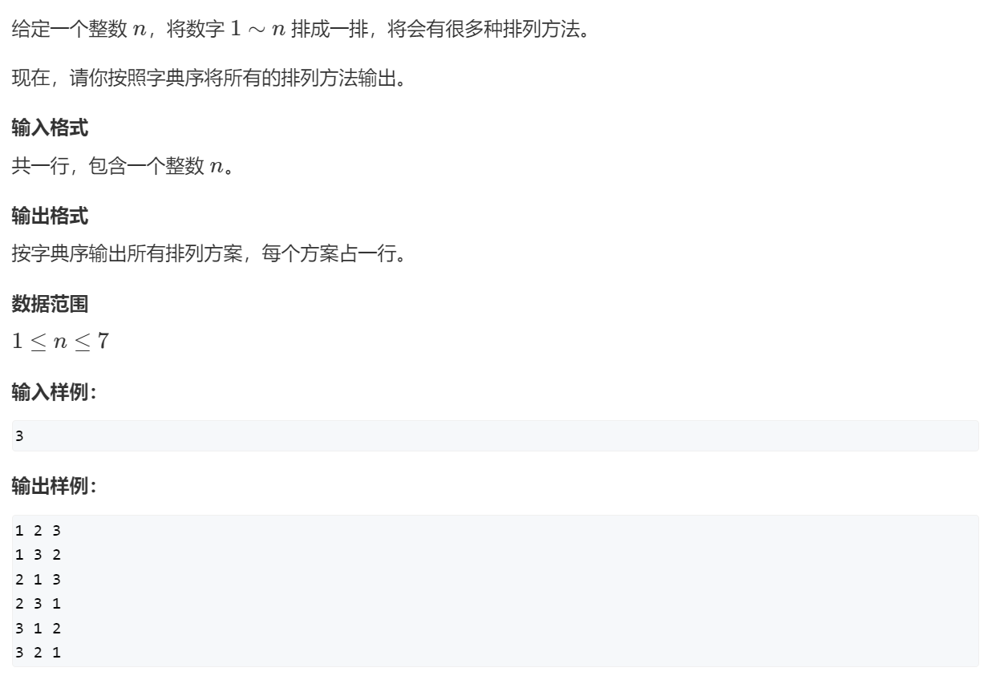

> **解法思路**：这是一个典型的全排列问题。我们使用 DFS 来探索所有可能的排列。`dfs(u)` 函数表示正在确定排列的第 `u` 个位置。我们遍历数字 1 到 n，如果一个数字 `i` 尚未被使用（通过 `st` 数组判断），就将它放在第 `u` 位，标记为已用，然后递归到下一层 `dfs(u + 1)`。当 `u > n` 时，表示一个完整的排列已生成，输出即可。之后，**回溯**，取消对数字 `i` 的使用标记，以便其他分支可以使用它。

```cpp
#include<iostream>
using namespace std;
const int N = 10;

int path[N];    // 保存当前排列
bool st[N];     // 标记数字是否已被使用
int n;

void dfs(int u) {
    // 如果 u 超过 n，说明一个 n 位数的排列已经生成完毕
    if (u > n) {
        for (int i = 1; i <= n; i++) {
            cout << path[i] << " ";
        }
        cout << endl;
        return;
    }

    // 遍历所有数字，尝试将其放入第 u 个位置
    for (int i = 1; i <= n; i++) {
        if (!st[i]) { // 如果数字 i 没被用过
            path[u] = i;        // 放置数字
            st[i] = true;       // 标记为已用
            dfs(u + 1);         // 递归到下一个位置
            
            // 回溯：恢复现场，以便其他分支可以继续搜索
            st[i] = false;
        }
    }
}

int main() {
    cin >> n;
    dfs(1);
    return 0;
}
```
</details>

#### 1.2 n-皇后问题
<details>
<summary><strong>🎯 AcWing 题目与题解</strong></summary>

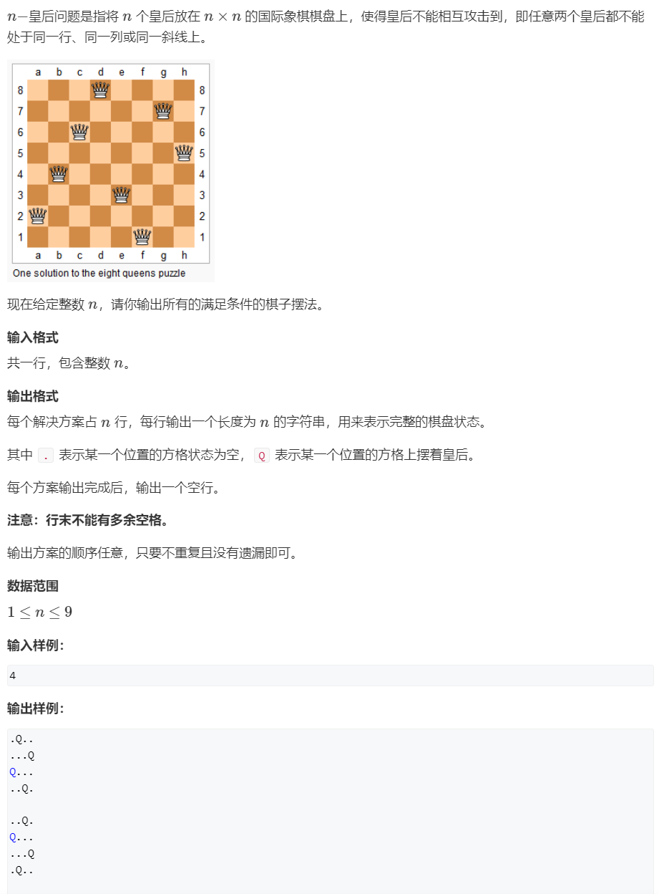

> **解法思路**：按行进行 DFS 搜索。`dfs(row)` 表示在第 `row` 行放置皇后。我们遍历该行的每一列 `col`，检查该位置 `(row, col)` 是否与之前放置的皇后冲突。为了高效判断冲突，使用三个布尔数组 `col[]`, `dg[]`, `udg[]` 分别标记某一列、主对角线、副对角线是否已被占用。
> -   列冲突：`col[c]`
> -   主对角线冲突 (y=x+b => b=y-x): `dg[row - col]`
> -   副对角线冲突 (y=-x+b => b=y+x): `udg[row + col]`
>
> 如果不冲突，则放置皇后，标记占用，并递归到下一行 `dfs(row + 1)`。之后回溯，取消标记。

```cpp
#include <iostream>
using namespace std;
const int N = 20;

int n;
char g[N][N];
bool col[N], dg[N*2], udg[N*2]; // 对角线数组大小需要2N

// 按行搜索
void dfs(int r) {
    if (r == n) {
        for (int i = 0; i < n; i++) puts(g[i]);
        puts("");
        return;
    }

    // 遍历当前行的每一列
    for (int c = 0; c < n; c++) {
        // 剪枝：检查列、主对角线、副对角线是否冲突
        if (!col[c] && !dg[r - c + n] && !udg[r + c]) {
            g[r][c] = 'Q';
            col[c] = dg[r - c + n] = udg[r + c] = true;
            dfs(r + 1);
            // 回溯
            col[c] = dg[r - c + n] = udg[r + c] = false;
            g[r][c] = '.';
        }
    }
}

int main() {
    cin >> n;
    for (int i = 0; i < n; i++) {
        for (int j = 0; j < n; j++) {
            g[i][j] = '.';
        }
    }
    dfs(0);
    return 0;
}
```
</details>

---

### 🌊 2. BFS (广度优先搜索)

> **核心思想**：BFS 也是一种图/树的遍历算法。它从起始节点开始，首先访问其所有相邻节点，然后逐层向外扩展，先访问完距离为 k 的所有节点，再访问距离为 k+1 的所有节点。BFS 通常使用队列来实现，非常适合解决 **最短路径**（在无权图中）或 **最少操作次数** 的问题，因为它能保证找到的第一个解就是最优解。

#### 2.1 走迷宫
<details>
<summary><strong>🎯 AcWing 题目与题解</strong></summary>

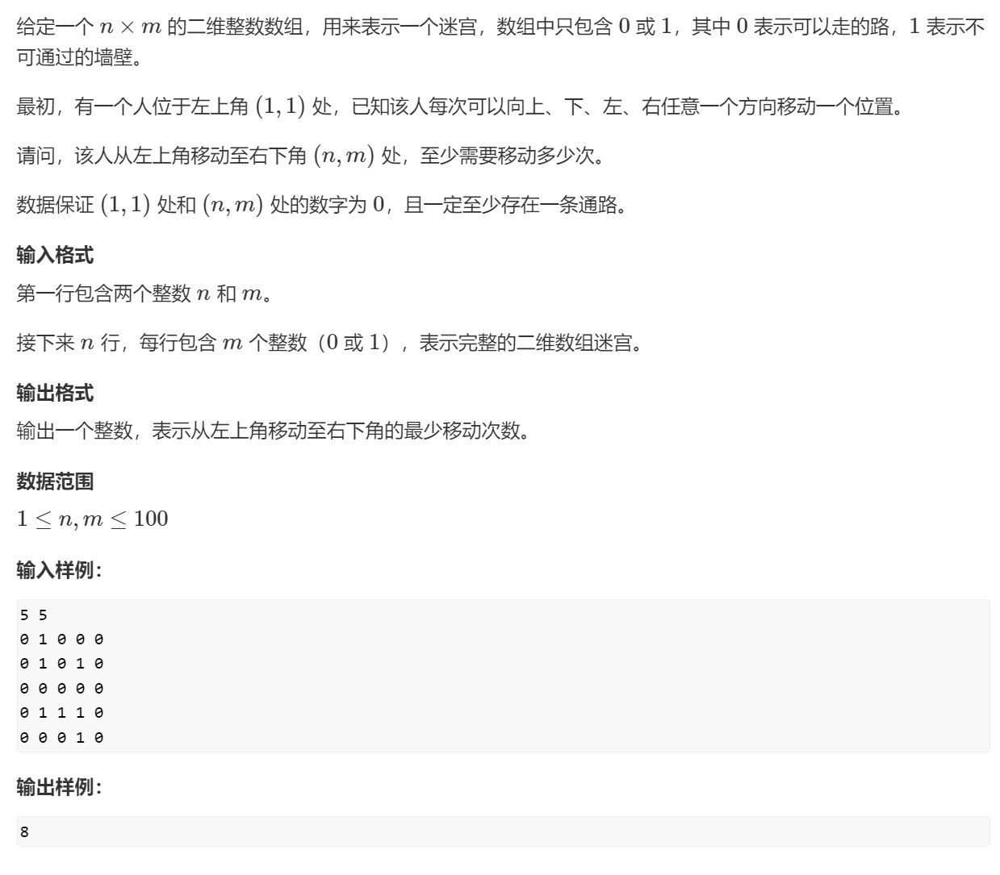

> **解法思路**：这是一个典型的无权图最短路径问题，使用 BFS 解决。我们用一个队列 `q` 存储待访问的坐标 `(x, y)`，用一个距离数组 `d[x][y]` 存储从起点 `(0, 0)` 到 `(x, y)` 的最短距离。
> 1.  将起点 `(0, 0)` 入队，`d[0][0] = 0`。
> 2.  当队列不空时，取出队头 `t`，遍历其上下左右四个相邻点 `(nx, ny)`。
> 3.  如果 `(nx, ny)` 可达（未越界、非障碍物）且 **未被访问过**（`d[nx][ny] == -1`），则更新其距离 `d[nx][ny] = d[t.x][t.y] + 1`，并将其入队。
> 4.  重复此过程，直到终点被访问或队列为空。`d[n-1][m-1]` 即为答案。

```cpp
#include <iostream>
#include <cstring>
#include <queue>
using namespace std;
typedef pair<int, int> PII;
const int N = 110;

int n, m;
int g[N][N], d[N][N];

int bfs() {
    queue<PII> q;
    q.push({0, 0});
    
    memset(d, -1, sizeof d);
    d = 0;

    int dx[] = {-1, 0, 1, 0}, dy[] = {0, 1, 0, -1};

    while (q.size()) {
        auto t = q.front();
        q.pop();

        if (t.first == n - 1 && t.second == m - 1) return d[t.first][t.second];

        for (int i = 0; i < 4; i++) {
            int x = t.first + dx[i], y = t.second + dy[i];
            if (x >= 0 && x < n && y >= 0 && y < m && g[x][y] == 0 && d[x][y] == -1) {
                d[x][y] = d[t.first][t.second] + 1;
                q.push({x, y});
            }
        }
    }
    return -1;
}

int main() {
    cin >> n >> m;
    for (int i = 0; i < n; i++) {
        for (int j = 0; j < m; j++) {
            cin >> g[i][j];
        }
    }
    cout << bfs() << endl;
    return 0;
}
```
</details>

#### 2.2 八数码
<details>
<summary><strong>🎯 AcWing 题目与题解</strong></summary>
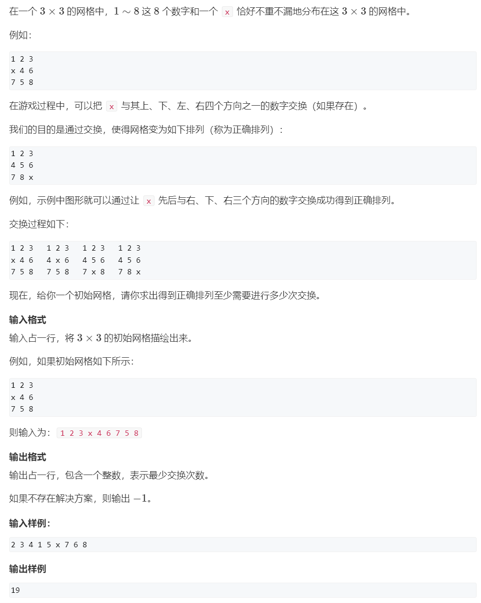

> **解法思路**：将每个九宫格状态视为一个节点，状态之间的转换（移动 'x'）视为边，问题转化为求从初始状态到目标状态 `12345678x` 的最短路径。
> -   **状态表示**：用字符串表示九宫格状态。
> -   **BFS 框架**：使用队列 `q` 存储状态字符串，使用 `unordered_map<string, int> d` 存储每个状态的距离（操作次数）并兼做判重。
> -   **状态转移**：每次从队列取出状态 `t`，找到 'x' 的位置，尝试将其与上下左右的数字交换，生成新状态 `t_new`。如果 `t_new` 未被访问过，则更新距离并入队。

```cpp
#include <iostream>
#include <string>
#include <queue>
#include <unordered_map>
#include <algorithm>
using namespace std;

int bfs(string start) {
    string end = "12345678x";
    queue<string> q;
    unordered_map<string, int> d;

    q.push(start);
    d[start] = 0;

    int dx[] = {-1, 0, 1, 0}, dy[] = {0, 1, 0, -1};

    while (q.size()) {
        auto t = q.front();
        q.pop();

        if (t == end) return d[t];
        int dist = d[t];
        
        int k = t.find('x');
        int x = k / 3, y = k % 3;

        for (int i = 0; i < 4; i++) {
            int a = x + dx[i], b = y + dy[i];
            if (a >= 0 && a < 3 && b >= 0 && b < 3) {
                string next_state = t;
                swap(next_state[k], next_state[a * 3 + b]);
                if (d.find(next_state) == d.end()) {
                    d[next_state] = dist + 1;
                    q.push(next_state);
                }
            }
        }
    }
    return -1;
}

int main() {
    string start = "";
    for (int i = 0; i < 9; i++) {
        char c;
        cin >> c;
        start += c;
    }
    cout << bfs(start) << endl;
    return 0;
}
```
</details>

---

### 🌳 3. 树与图的遍历

> **核心思想**：无论是树还是图，其本质都是由节点和边构成的结构。遍历是指系统地访问图中的每一个节点。
> - **存储方式**：常用邻接矩阵（稠密图）或邻接表（稀疏图）。本节主要使用邻接表（数组模拟链表）。
> - **DFS 遍历**：递归实现，深入探索。`dfs(u)` 访问节点 `u`，然后对 `u` 的每个未访问过的邻居 `v` 调用 `dfs(v)`。
> - **BFS 遍历**：队列实现，逐层扩展。将起点入队，然后循环：出队节点 `u`，将其所有未访问过的邻居入队并标记。

#### 3.1 树的重心
<details>
<summary><strong>🎯 AcWing 题目与题解</strong></summary>

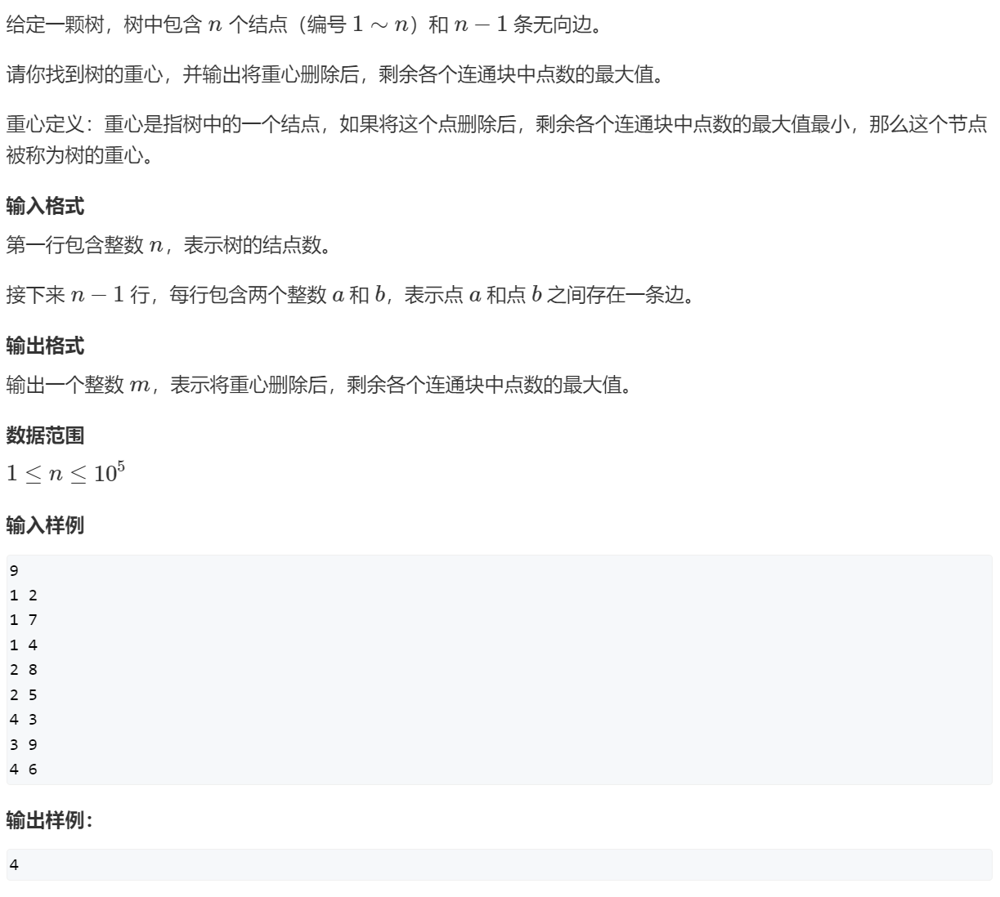

> **解法思路**：树的重心是指一个节点，删除它之后，剩余各个连通块中节点数的最大值最小。
> 1.  对树进行一次 DFS 遍历，从任意节点（如 1）开始。
> 2.  `dfs(u)` 函数返回以 `u` 为根的子树的节点总数。
> 3.  在 `dfs(u)` 的过程中，对于 `u` 的每个子节点 `j`，我们递归调用 `dfs(j)` 得到子树大小 `s`。这个 `s` 就是删除 `u` 后形成的一个连通块的大小。
> 4.  除了这些子树形成的连通块，还有一个连通块是 `u` 的父节点所在的部分，其大小为 `n - (以u为根的子树大小)`。
> 5.  对于每个节点 `u`，我们计算出删除它后所有连通块大小的最大值，并更新全局最小值 `ans`。

```cpp
#include <iostream>
#include <algorithm>
#include <cstring>
using namespace std;
const int N = 1e5 + 10, M = N * 2;

int h[N], e[M], ne[M], idx;
bool st[N];
int n, ans = N;

void add(int a, int b) {
    e[idx] = b, ne[idx] = h[a], h[a] = idx++;
}

// 返回以 u 为根的子树大小
int dfs(int u) {
    st[u] = true;
    int sum = 1, max_part_size = 0;

    for (int i = h[u]; i != -1; i = ne[i]) {
        int j = e[i];
        if (!st[j]) {
            int s = dfs(j); // s是子树j的大小
            max_part_size = max(max_part_size, s);
            sum += s;
        }
    }
    
    // 另一个连通块是 u 的父节点部分
    max_part_size = max(max_part_size, n - sum);
    ans = min(ans, max_part_size);
    
    return sum;
}

int main() {
    memset(h, -1, sizeof h);
    cin >> n;
    for (int i = 0; i < n - 1; i++) {
        int a, b;
        cin >> a >> b;
        add(a, b), add(b, a);
    }
    dfs(1);
    cout << ans << endl;
    return 0;
}
```
</details>

#### 3.2 图中点的层次
<details>
<summary><strong>🎯 AcWing 题目与题解</strong></summary>
...

> **解法思路**：求有向图中节点 1 到节点 n 的最短距离。由于是无权图，边的长度都为 1，因此这就是一个典型的 BFS 应用。

```cpp
#include <iostream>
#include <cstring>
#include <queue>
using namespace std;
const int N = 100010;

int h[N], e[N], ne[N], d[N], idx;
int n, m;

void add(int a, int b) {
    e[idx] = b, ne[idx] = h[a], h[a] = idx++;
}

int bfs() {
    memset(d, -1, sizeof d);
    queue<int> q;
    
    q.push(1);
    d = 0;
    
    while(q.size()) {
        int t = q.front();
        q.pop();
        
        if (t == n) return d[n];
        
        for (int i = h[t]; i != -1; i = ne[i]) {
            int j = e[i];
            if (d[j] == -1) {
                d[j] = d[t] + 1;
                q.push(j);
            }
        }
    }
    return -1;
}

int main() {
    cin >> n >> m;
    memset(h, -1, sizeof h);
    while (m--) {
        int a, b;
        cin >> a >> b;
        add(a, b);
    }
    cout << bfs() << endl;
    return 0;
}
```
</details>

---

### ➡️ 4. 拓扑排序

> **核心思想**：拓扑排序是对 **有向无环图（DAG）** 的顶点进行排序，使得对于图中每一条有向边 `u -> v`，节点 `u` 都出现在节点 `v` 之前。
>
> **算法流程（基于 BFS）**：
> 1.  统计所有节点的入度 `d[i]`。
> 2.  将所有入度为 0 的节点加入队列。
> 3.  当队列不空时，出队一个节点 `t`，将其加入拓扑序列。
> 4.  遍历 `t` 的所有出边 `t -> j`，将节点 `j` 的入度减 1。
> 5.  如果 `j` 的入度变为 0，则将 `j` 入队。
> 6.  循环结束。如果拓扑序列中的节点数等于图的总节点数，则排序成功；否则，图中存在环。

#### 4.1 有向图的拓扑序列
<details>
<summary><strong>🎯 AcWing 题目与题解</strong></summary>

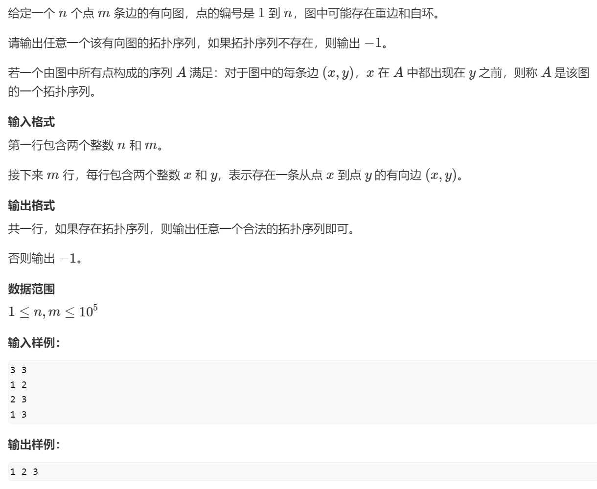

```cpp
#include <iostream>
#include <cstring>
#include <algorithm>
using namespace std;
const int N = 100010;

int h[N], e[N], ne[N], idx;
int q[N], d[N]; // d[]是入度数组, q[]是队列
int n, m;

void add(int a, int b) {
    e[idx] = b, ne[idx] = h[a], h[a] = idx++;
}

bool topsort() {
    int hh = 0, tt = -1;
    for (int i = 1; i <= n; i++) {
        if (!d[i]) q[++tt] = i;
    }

    while (hh <= tt) {
        int t = q[hh++];
        for (int i = h[t]; i != -1; i = ne[i]) {
            int j = e[i];
            d[j]--;
            if (d[j] == 0) q[++tt] = j;
        }
    }
    return tt == n - 1;
}

int main() {
    cin >> n >> m;
    memset(h, -1, sizeof h);
    while (m--) {
        int a, b;
        cin >> a >> b;
        add(a, b);
        d[b]++;
    }
    if (topsort()) {
        for (int i = 0; i < n; i++) cout << q[i] << " ";
        cout << endl;
    } else {
        cout << -1 << endl;
    }
    return 0;
}
```
</details>

---

### 📍 5. 最短路算法

#### 5.1 Dijkstra 算法
> **核心思想**：Dijkstra 是一种贪心算法，用于求解 **单源最短路径** 问题，但 **不能处理带负权边的图**。
> -   它维护一个已确定最短路径的节点集合 `S`，和一个未确定的集合 `U`。
> -   每次从 `U` 中选择一个距离源点最近的节点 `t`，加入 `S`。
> -   用 `t` 来 “松弛” `t` 的所有邻居 `j`，即更新 `dist[j]` 的值：`dist[j] = min(dist[j], dist[t] + weight(t, j))`。
> -   **朴素版 (O(n²))**：适用于稠密图，用循环查找 `U` 中最近的点。
> -   **堆优化版 (O(m log n))**：适用于稀疏图，用优先队列（最小堆）快速找到 `U` 中最近的点。

<details>
<summary><strong>Dijkstra I (朴素版)</strong></summary>

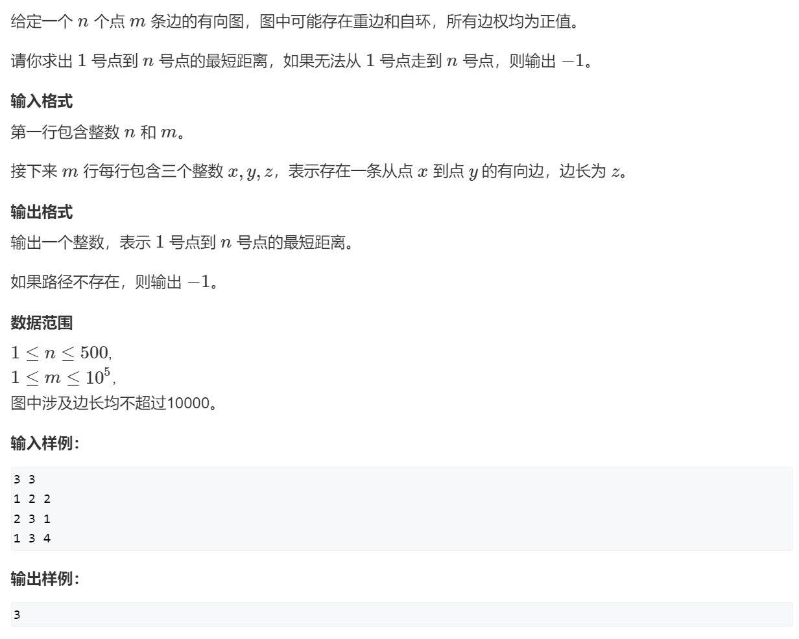

```cpp
#include<iostream>
#include<algorithm>
#include<cstring>
using namespace std;
const int N = 510;

int g[N][N];
int dist[N];
bool st[N];
int n, m;

int dijkstra() {
    memset(dist, 0x3f, sizeof dist);
    dist = 0;

    for (int i = 0; i < n; i++) {
        int t = -1;
        // 找到未确定且距离最近的点
        for (int j = 1; j <= n; j++) {
            if (!st[j] && (t == -1 || dist[t] > dist[j])) {
                t = j;
            }
        }
        
        st[t] = true;
        // 用 t 更新其他点的距离
        for (int j = 1; j <= n; j++) {
            dist[j] = min(dist[j], dist[t] + g[t][j]);
        }
    }

    if (dist[n] == 0x3f3f3f3f) return -1;
    return dist[n];
}

int main() {
    cin >> n >> m;
    memset(g, 0x3f, sizeof g);
    while(m--) {
        int x, y, z;
        cin >> x >> y >> z;
        g[x][y] = min(g[x][y], z);
    }
    cout << dijkstra() << endl;
    return 0;
}
```
</details>

<details>
<summary><strong>Dijkstra II (堆优化版)</strong></summary>

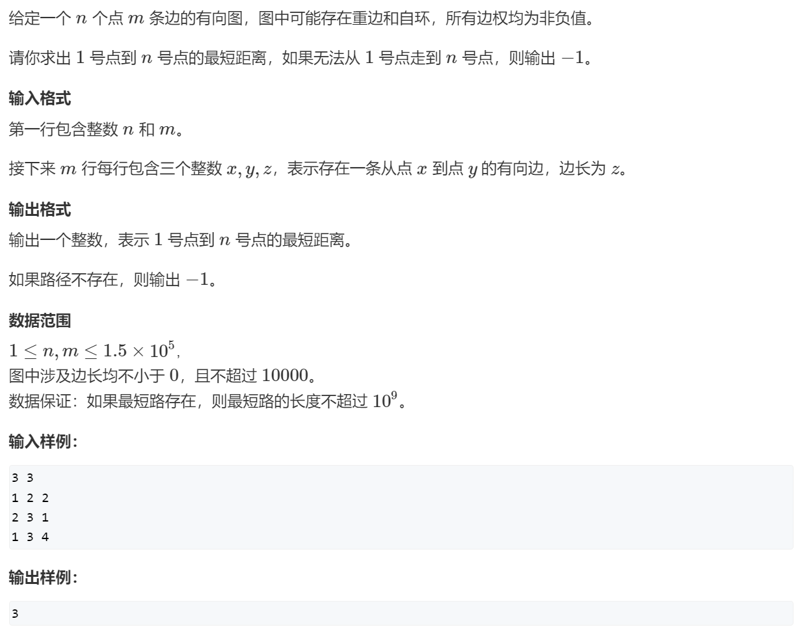

```cpp
#include <cstring>
#include <iostream>
#include <queue>
#include <vector>
using namespace std;
typedef pair<int, int> PII;
const int N = 150010;

int n, m;
int h[N], w[N], e[N], ne[N], idx;
int dist[N];
bool st[N];

void add(int a, int b, int c) {
    e[idx] = b, w[idx] = c, ne[idx] = h[a], h[a] = idx++;
}

int dijkstra() {
    memset(dist, 0x3f, sizeof dist);
    dist = 0;
    priority_queue<PII, vector<PII>, greater<PII>> heap;
    heap.push({0, 1}); // {distance, node_id}

    while (heap.size()) {
        auto t = heap.top();
        heap.pop();
        int ver = t.second, distance = t.first;
        
        if (st[ver]) continue;
        st[ver] = true;

        for (int i = h[ver]; i != -1; i = ne[i]) {
            int j = e[i];
            if (dist[j] > distance + w[i]) {
                dist[j] = distance + w[i];
                heap.push({dist[j], j});
            }
        }
    }
    if (dist[n] == 0x3f3f3f3f) return -1;
    return dist[n];
}

int main() {
    cin >> n >> m;
    memset(h, -1, sizeof h);
    while (m--) {
        int a, b, c;
        cin >> a >> b >> c;
        add(a, b, c);
    }
    cout << dijkstra() << endl;
    return 0;
}
```
</details>

#### 5.2 Bellman-Ford & SPFA 算法
> **核心思想**:
> - **Bellman-Ford (O(nm))**: 能处理 **带负权边** 的单源最短路，并能 **检测负权环**。核心是循环 n-1 次，每次对所有 m 条边进行松弛操作。如果第 n 次循环仍能松弛，则存在负权环。
> - **SPFA (通常 O(m), 最坏 O(nm))**: Bellman-Ford 的队列优化版本。只有被松弛过的节点，其邻居才可能被更新，因此只将这些被松弛的节点入队，避免了无效的遍历。SPFA 同样能处理负权边和检测负权环（通过记录一个点入队的次数或最短路径的边数）。

<details>
<summary><strong>Bellman-Ford (有边数限制的最短路)</strong></summary>

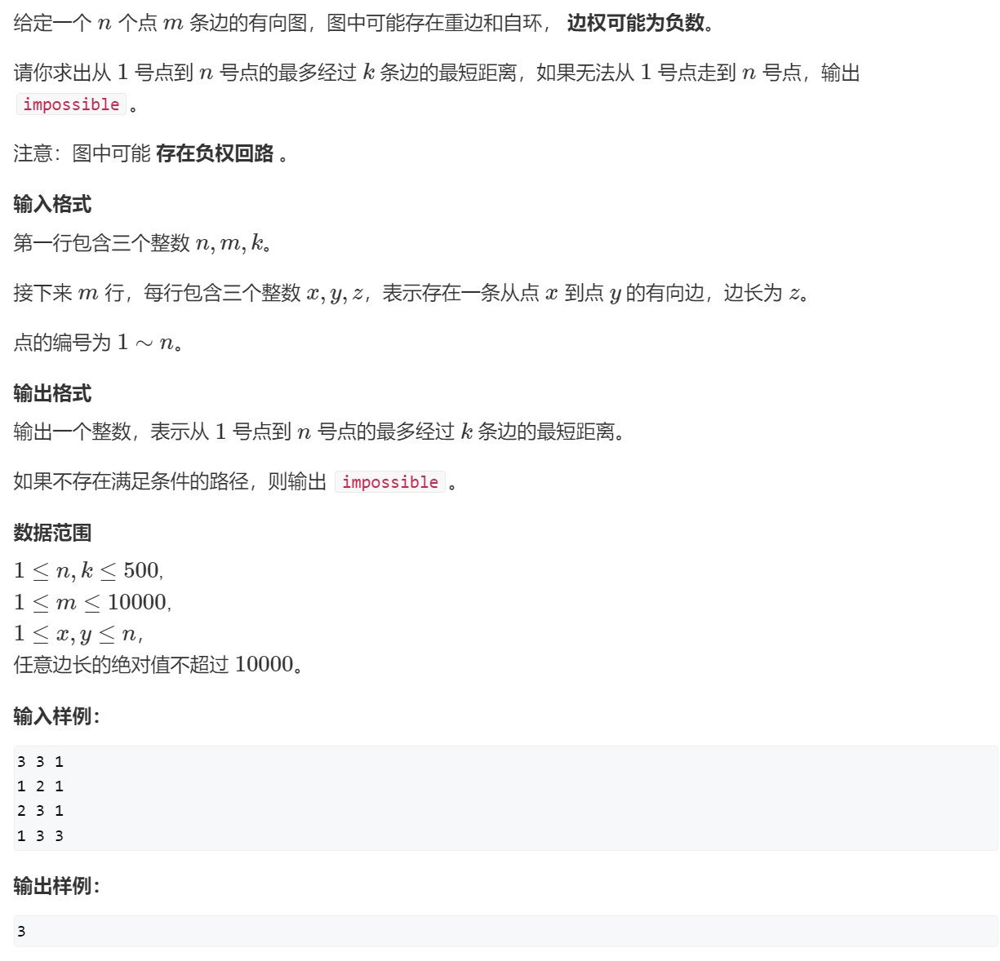
> **注意**：常规 Bellman-Ford 循环 `n-1` 次，这里题目限制了最多 `k` 条边，所以我们循环 `k` 次。使用 `backup` 数组是为了防止在一次迭代中发生“串联更新”，确保每轮迭代只使用上一轮的结果，严格对应“经过至多 i 条边的最短路”。

```cpp
#include <cstring>
#include <iostream>
#include <algorithm>
using namespace std;
const int N = 510, M = 10010;

struct Edge {
    int a, b, w;
} edges[M];

int n, m, k;
int dist[N], backup[N];

void bellman_ford() {
    memset(dist, 0x3f, sizeof dist);
    dist = 0;

    for (int i = 0; i < k; i++) {
        memcpy(backup, dist, sizeof dist);
        for (int j = 0; j < m; j++) {
            auto e = edges[j];
            dist[e.b] = min(dist[e.b], backup[e.a] + e.w);
        }
    }
}

int main() {
    cin >> n >> m >> k;
    for (int i = 0; i < m; i++) {
        int a, b, w;
        cin >> a >> b >> w;
        edges[i] = {a, b, w};
    }
    bellman_ford();
    // 如果 dist[n] > INF / 2，可能被负权边更新过，但仍不可达
    if (dist[n] > 0x3f3f3f3f / 2) puts("impossible");
    else cout << dist[n] << endl;
    return 0;
}
```
</details>

<details>
<summary><strong>SPFA (求最短路)</strong></summary>

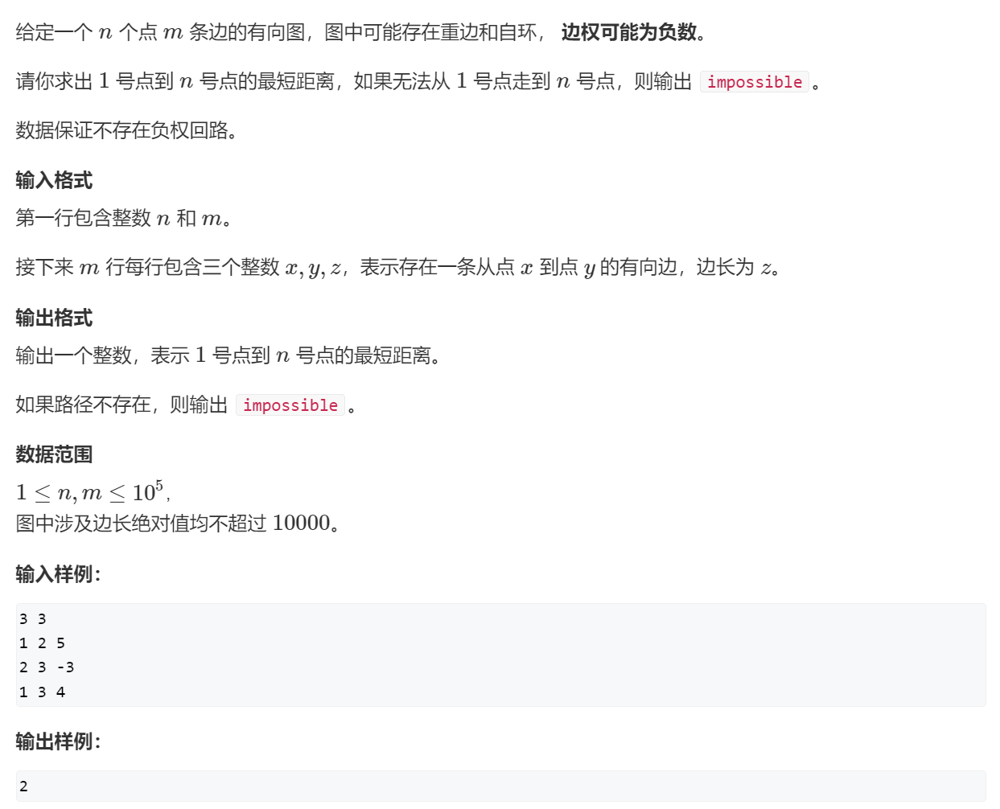

```cpp
#include <cstring>
#include <iostream>
#include <queue>
using namespace std;
const int N = 100010;

int n, m;
int h[N], w[N], e[N], ne[N], idx;
int dist[N];
bool st[N]; // 标记是否在队列中

void add(int a, int b, int c) {
    e[idx] = b, w[idx] = c, ne[idx] = h[a], h[a] = idx++;
}

int spfa() {
    memset(dist, 0x3f, sizeof dist);
    dist = 0;
    queue<int> q;
    q.push(1);
    st = true;

    while (q.size()) {
        int t = q.front();
        q.pop();
        st[t] = false;

        for (int i = h[t]; i != -1; i = ne[i]) {
            int j = e[i];
            if (dist[j] > dist[t] + w[i]) {
                dist[j] = dist[t] + w[i];
                if (!st[j]) {
                    q.push(j);
                    st[j] = true;
                }
            }
        }
    }
    return dist[n];
}

int main() {
    cin >> n >> m;
    memset(h, -1, sizeof h);
    while (m--) {
        int a, b, c;
        cin >> a >> b >> c;
        add(a, b, c);
    }
    int t = spfa();
    if (t == 0x3f3f3f3f) puts("impossible");
    else cout << t << endl;
    return 0;
}
```
</details>

<details>
<summary><strong>SPFA (判断负环)</strong></summary>

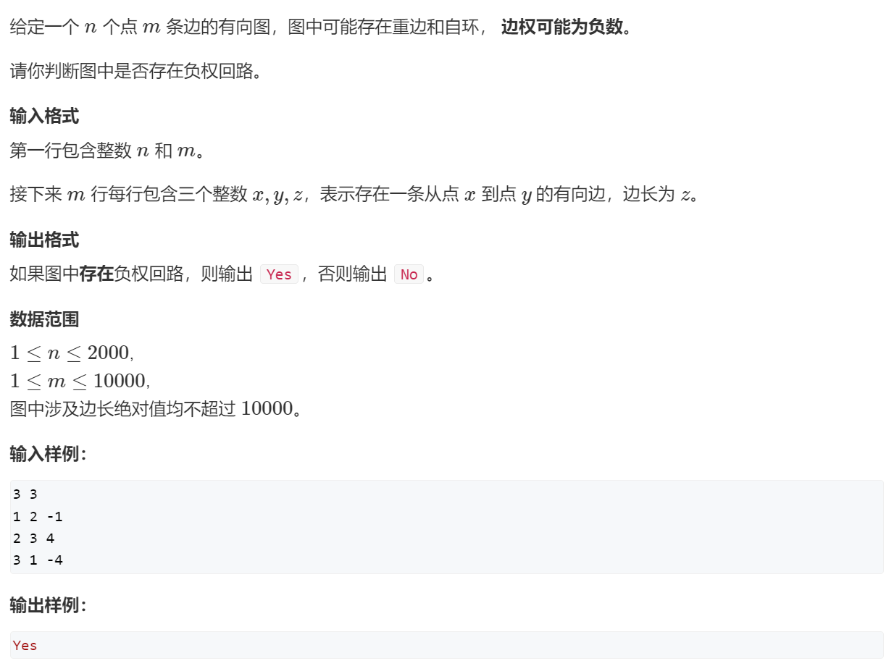
> **思路**：若存在负环，则从环上某点出发，绕环一圈后路径会变短，导致无限松弛。我们用 `cnt[x]` 记录从源点到 `x` 的最短路径所含的边数。若 `cnt[x] >= n`，根据抽屉原理，路径上必有重复点，即存在环。由于是负权，这个环就是负环。初始时将所有点入队，以确保能遍历到所有连通分量。

```cpp
#include <cstring>
#include <iostream>
#include <queue>
using namespace std;
const int N = 2010, M = 10010;

int n, m;
int h[N], e[M], ne[M], w[M], idx;
bool st[N];
int dist[N], cnt[N];

void add(int a, int b, int c) {
    e[idx] = b, w[idx] = c, ne[idx] = h[a], h[a] = idx++;
}

bool spfa() {
    queue<int> q;
    for (int i = 1; i <= n; i++) {
        q.push(i);
        st[i] = true;
    }

    while (q.size()) {
        int t = q.front();
        q.pop();
        st[t] = false;

        for (int i = h[t]; i != -1; i = ne[i]) {
            int j = e[i];
            if (dist[j] > dist[t] + w[i]) {
                dist[j] = dist[t] + w[i];
                cnt[j] = cnt[t] + 1;
                if (cnt[j] >= n) return true;
                if (!st[j]) {
                    q.push(j);
                    st[j] = true;
                }
            }
        }
    }
    return false;
}

int main() {
    cin >> n >> m;
    memset(h, -1, sizeof h);
    while (m--) {
        int a, b, c;
        cin >> a >> b >> c;
        add(a, b, c);
    }
    if (spfa()) puts("Yes");
    else puts("No");
    return 0;
}
```
</details>

#### 5.3 Floyd-Warshall 算法
> **核心思想 (O(n³))**: Floyd 是一种基于动态规划的算法，用于求解 **所有节点对之间的最短路径（APSP）**，可以处理带负权边的图，但 **不能处理负权环**。
>
> 其状态转移方程为：`d[i][j] = min(d[i][j], d[i][k] + d[k][j])`。
> 
> 这表示从 `i` 到 `j` 的最短路径，要么是原来不经过 `k` 的路径，要么是经过 `k` 的路径（`i` -> `k` -> `j`）。通过 `k` 从 1 到 n 的三重循环，即可求出所有点对的最短路。

<details>
<summary><strong>Floyd (求最短路)</strong></summary>

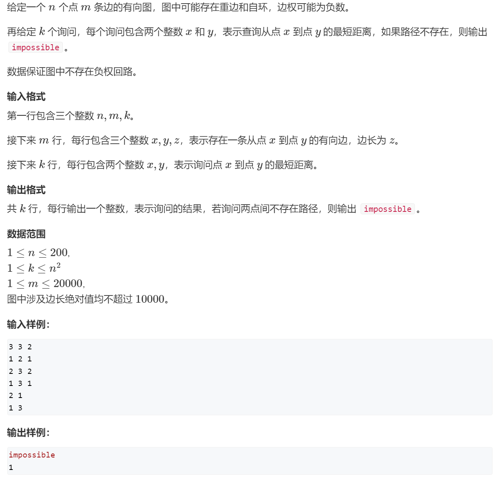

```cpp
#include <iostream>
#include <algorithm>
using namespace std;
const int N = 210, INF = 1e9;

int n, m, q;
int d[N][N];

void floyd() {
    for (int k = 1; k <= n; k++) {
        for (int i = 1; i <= n; i++) {
            for (int j = 1; j <= n; j++) {
                d[i][j] = min(d[i][j], d[i][k] + d[k][j]);
            }
        }
    }
}

int main() {
    cin >> n >> m >> q;
    for (int i = 1; i <= n; i++) {
        for (int j = 1; j <= n; j++) {
            d[i][j] = (i == j) ? 0 : INF;
        }
    }
    while (m--) {
        int a, b, c;
        cin >> a >> b >> c;
        d[a][b] = min(d[a][b], c);
    }
    
    floyd();
    
    while (q--) {
        int a, b;
        cin >> a >> b;
        if (d[a][b] > INF / 2) puts("impossible");
        else cout << d[a][b] << endl;
    }
    return 0;
}
```
</details>

---

### 🕸️ 6. 最小生成树 (MST)

> **核心思想**：最小生成树（Minimum Spanning Tree）是针对 **无向连通图** 的。它是在图中找出一棵包含所有顶点的树，且所有边的权值之和最小。
> - **Prim 算法 (O(n²))**: 类似 Dijkstra，从一个点开始，不断将离 **当前已选集合** 最近的顶点加入树中。
> - **Kruskal 算法 (O(m log m))**: 将所有边按权值从小到大排序，依次尝试加入边，只要不形成环（用并查集判断），就加入。

#### 6.1 Prim 算法
<details>
<summary><strong>🎯 AcWing 题目与题解 (朴素版)</strong></summary>

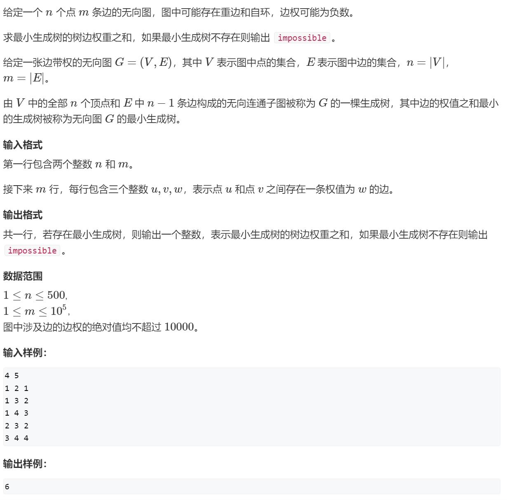

```cpp
#include <cstring>
#include <iostream>
#include <algorithm>
using namespace std;
const int N = 510, INF = 0x3f3f3f3f;

int n, m;
int g[N][N];
int dist[N]; // 存储点到集合的最短距离
bool st[N];  // 标记是否已在MST中

int prim() {
    memset(dist, 0x3f, sizeof dist);
    int res = 0;

    for (int i = 0; i < n; i++) {
        int t = -1;
        // 找到未加入且距离集合最近的点
        for (int j = 1; j <= n; j++) {
            if (!st[j] && (t == -1 || dist[t] > dist[j])) {
                t = j;
            }
        }
        
        // 如果是稀疏图或者不连通
        if (i > 0 && dist[t] == INF) return INF;
        
        if (i > 0) res += dist[t];
        st[t] = true;
        
        // 用 t 更新其他点到集合的距离
        for (int j = 1; j <= n; j++) {
            dist[j] = min(dist[j], g[t][j]);
        }
    }
    return res;
}

int main() {
    cin >> n >> m;
    memset(g, 0x3f, sizeof g);
    while (m--) {
        int a, b, c;
        cin >> a >> b >> c;
        g[a][b] = g[b][a] = min(g[a][b], c);
    }
    int t = prim();
    if (t == INF) puts("impossible");
    else cout << t << endl;
    return 0;
}
```
</details>

#### 6.2 Kruskal 算法
<details>
<summary><strong>🎯 AcWing 题目与题解</strong></summary>

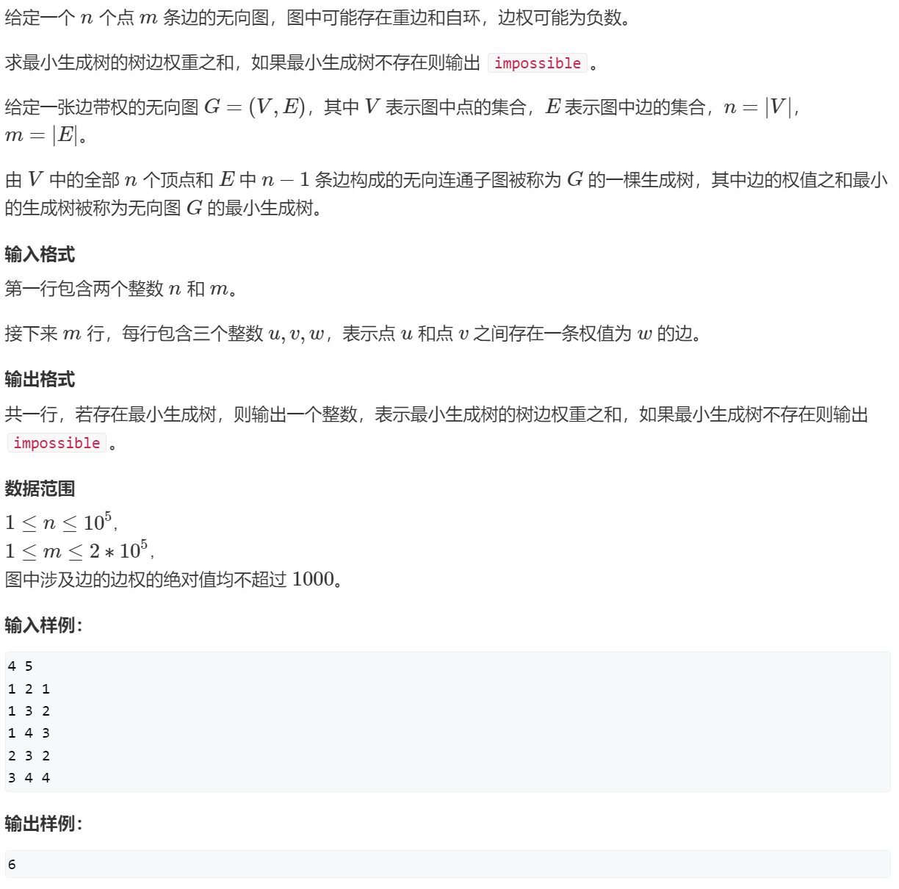

```cpp
#include <iostream>
#include <algorithm>
using namespace std;
const int N = 100010, M = 200010;

int n, m;
int p[N];

struct Edge {
    int a, b, w;
    bool operator< (const Edge &other) const {
        return w < other.w;
    }
} edges[M];

int find(int x) {
    if (p[x] != x) p[x] = find(p[x]);
    return p[x];
}

int main() {
    cin >> n >> m;
    for (int i = 0; i < m; i++) {
        int a, b, w;
        cin >> a >> b >> w;
        edges[i] = {a, b, w};
    }

    sort(edges, edges + m);

    for (int i = 1; i <= n; i++) p[i] = i;

    int res = 0, cnt = 0;
    for (int i = 0; i < m; i++) {
        int a = edges[i].a, b = edges[i].b, w = edges[i].w;
        int pa = find(a), pb = find(b);
        if (pa != pb) {
            p[pa] = pb;
            res += w;
            cnt++;
        }
    }

    if (cnt < n - 1) cout << "impossible" << endl;
    else cout << res << endl;
    return 0;
}```
</details>

---

### 🎨 7. 二分图

> **核心思想**：二分图是指一个图的顶点可以被分为两个独立的集合 `U` 和 `V`，使得所有边都跨越这两个集合，而集合内部没有边。
> - **判定（染色法）**: 尝试用两种颜色对图进行染色，如果所有相邻的顶点颜色都不同，则是二分图。DFS 或 BFS 均可实现。
> - **最大匹配（匈牙利算法）**: 在二分图中寻找一个最大的边的集合，使得集合中任意两条边都没有公共顶点。匈牙利算法的核心是为每个未匹配的左部点寻找 **增广路**（一条从未匹配的左部点开始，从未匹配的右部点结束，且匹配边和非匹配边交替出现的路径）。

#### 7.1 染色法判定二分图
<details>
<summary><strong>🎯 AcWing 题目与题解</strong></summary>

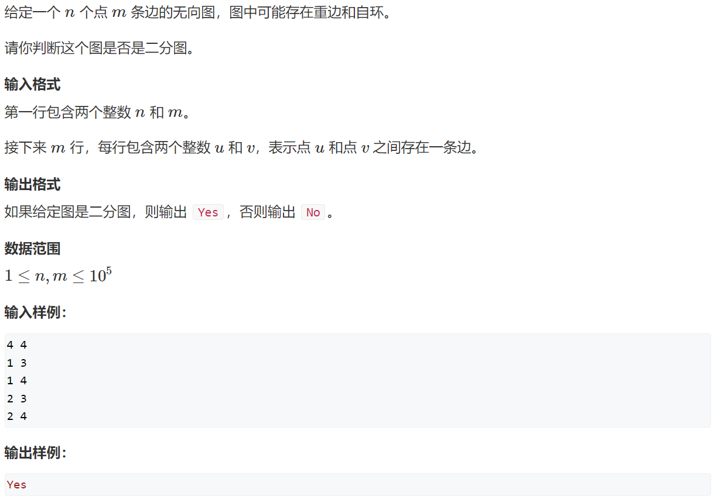

```cpp
#include <cstring>
#include <iostream>
using namespace std;
const int N = 100010, M = 200010;

int n, m;
int h[N], e[M], ne[M], idx;
int color[N]; // 0:未染, 1:颜色1, 2:颜色2

void add(int a, int b) {
    e[idx] = b, ne[idx] = h[a], h[a] = idx++;
}

bool dfs(int u, int c) {
    color[u] = c;
    for (int i = h[u]; i != -1; i = ne[i]) {
        int j = e[i];
        if (!color[j]) {
            if (!dfs(j, 3 - c)) return false;
        } else if (color[j] == c) {
            return false;
        }
    }
    return true;
}

int main() {
    cin >> n >> m;
    memset(h, -1, sizeof h);
    while (m--) {
        int a, b;
        cin >> a >> b;
        add(a, b), add(b, a);
    }
    bool flag = true;
    for (int i = 1; i <= n; i++) {
        if (!color[i]) {
            if (!dfs(i, 1)) {
                flag = false;
                break;
            }
        }
    }
    if (flag) puts("Yes");
    else puts("No");
    return 0;
}
```
</details>

#### 7.2 二分图的最大匹配
<details>
<summary><strong>🎯 AcWing 题目与题解 (匈牙利算法)</strong></summary>

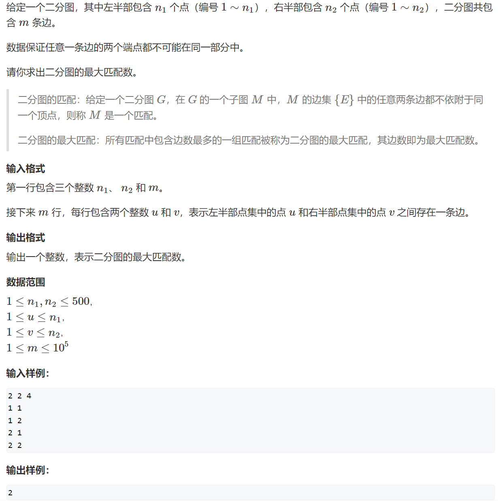

```cpp
#include <cstring>
#include <iostream>
using namespace std;
const int N = 510, M = 100010;

int n1, n2, m;
int h[N], e[M], ne[M], idx;
int match[N]; // match[j] = i 表示右部点j与左部点i匹配
bool st[N]; // st[j] 表示本轮搜索中右部点j是否被访问过

void add(int a, int b) {
    e[idx] = b, ne[idx] = h[a], h[a] = idx++;
}

bool find(int u) {
    for (int i = h[u]; i != -1; i = ne[i]) {
        int j = e[i];
        if (!st[j]) {
            st[j] = true;
            if (match[j] == 0 || find(match[j])) {
                match[j] = u;
                return true;
            }
        }
    }
    return false;
}

int main() {
    cin >> n1 >> n2 >> m;
    memset(h, -1, sizeof h);
    while (m--) {
        int a, b;
        cin >> a >> b;
        add(a, b);
    }

    int res = 0;
    for (int i = 1; i <= n1; i++) {
        memset(st, false, sizeof st); // 每轮为新的左部点搜索，st数组需重置
        if (find(i)) res++;
    }
    cout << res << endl;
    return 0;
}
```
</details>
```