# 🎓 AcWing——算法基础课


> 第四讲 · 数学知识 · 质数 / 欧拉函数 / 快速幂 / 组合数

---

# 第四讲  数学知识


## 1 质数

> 质数：在大于1的整数中，如果只包含1和本身这两个约数，被称为质数，也叫素数。

### 1.1 试除法判定质数

时间复杂度为$O(\sqrt(n))$


牛客：[判断质数_牛客题霸_牛客网](https://www.nowcoder.com/practice/9f418ff48b5e4e879f398352bed6118d)

洛谷：

https://www.luogu.com.cn/problem/T409608

https://www.luogu.com.cn/problem/U203147


AcWing题目：


```c++
bool is_prime(int x)
{
    if (x < 2) return false;
    for (int i = 2; i <= x / i; i ++ )
        if (x % i == 0)
            return false;
    return true;
}
```


```c++
#include <iostream>
#include <algorithm>

using namespace std;

bool is_prime(int x)
{
    if (x < 2) return false;
    // x 的一个更小的因子为 i ，另一个更大的因子为 x / i ，遍历所有更小的因子
    for (int i = 2; i <= x / i; i ++ )
        if (x % i == 0)
            return false;
            
    return true;
}

int main()
{
    int n;
    cin >> n;

    while (n -- )
    {
        int x;
        cin >> x;
        if (is_prime(x)) puts("Yes");
        else puts("No");
    }

    return 0;
}
```

### 1.2 分解质因数

> 一个正整数n中最多只包含一个大于$\sqrt(n)$的质因数

时间复杂度为$O(\sqrt(n))$

牛客：[分解质因数_牛客题霸_牛客网](https://www.nowcoder.com/practice/35723516d6f841ca8869ecbcf3ddacaf)

洛谷：


```c++
#include <iostream>
#include <algorithm>

using namespace std;

void divide(int x)
{
	/*这里遍历的 i 肯定所有都是质数，假如 i 是合数那么 i 肯定也可分解为更小的质数相乘，由于循环是从小到大遍历的
	所以 i 分解的更小的质数肯定是遍历过， x 除过了的，所以不可能遍历到合数*/
	//因最多只有一个大于 sqrt(n) 的质因子，所以先遍历小于 sqrt(n) 的 
    for (int i = 2; i <= x / i; i ++ )
    	//每有一个质因子 
        if (x % i == 0)
        {
            int s = 0;
            while (x % i == 0) x /= i, s ++ ;
            cout << i << ' ' << s << endl;
        }
    //如果最后 x > 1 ，那此时的 x 就是那个大于 sqrt(n) 的质因子 
    if (x > 1) cout << x << ' ' << 1 << endl;
    cout << endl;
}

int main()
{
    int n;
    cin >> n;
    while (n -- )
    {
        int x;
        cin >> x;
        divide(x);
    }

    return 0;
}
```

```c++
void divide(int x)
{
    for (int i = 2; i <= x / i; i ++ )
        if (x % i == 0)
        {
            int s = 0;
            while (x % i == 0) x /= i, s ++ ;
            cout << i << ' ' << s << endl;
        }
    if (x > 1) cout << x << ' ' << 1 << endl;
    cout << endl;
}
```


写法2（题目：[分解质因数_牛客题霸_牛客网](https://www.nowcoder.com/practice/35723516d6f841ca8869ecbcf3ddacaf)）：

```c++
#include<iostream>
using namespace std;
void handle(long n) {
    while (n % 2 == 0) {
        printf("2 ");
        n /= 2;
    }
    for (int i = 3; i <= n / i; i += 2) {
        while (n % i == 0) {
            printf("%d ", i);
            n /= i;
        }
    }
    if (n > 1) {
        printf("%ld ", n);
    }
}
int main () {
    long n;
    cin >> n;
    handle(n);
    return 0;
}
```


### 1.3 筛质数

洛谷：

https://www.luogu.com.cn/problem/U208323

https://www.luogu.com.cn/problem/P5736

https://www.luogu.com.cn/problem/P3383


AcWing题目：


1、朴素筛法（把所有数的所有倍数筛掉 ，时间复杂度为$O(n logn)$）

```c++
int primes[N], cnt;// primes 是存储质数的数组， cnt 是质数的数量 
bool st[N];

void get_primes(int n)
{
    for (int i = 2; i <= n; i ++ ){
        if(!st[i]){
        	primes[cnt ++ ] = i;
		}
        //把所有数的所有倍数筛掉 
        for (int j = i + i; j <= n; j += i) st[j] = true;
    }
}
```

2、埃氏筛法（**把所有质数的所有倍数筛掉** ，时间复杂度为$O(nloglogn)$）

```c++
int primes[N], cnt;// primes 是存储质数的数组， cnt 是质数的数量 
bool st[N];

void get_primes(int n)
{
    for (int i = 2; i <= n; i ++ ){
        if(!st[i]){
        	primes[cnt ++ ] = i;
        	//把此质数的所有倍数筛掉 
        	for (int j = i + i; j <= n; j += i) st[j] = true;
		}
    }
}
```


```c++

//埃氏筛法 

#include <iostream>
#include <algorithm>

using namespace std;

const int N= 1000010;

int primes[N], cnt;// primes 是存储质数的数组， cnt 是质数的数量 
bool st[N];

void get_primes(int n)
{
    for (int i = 2; i <= n; i ++ ){
        if(!st[i]){
        	primes[cnt ++ ] = i;
        	//把此质数的所有倍数筛掉 
        	for (int j = i + i; j <= n; j += i) st[j] = true;
		}
    }
}

int main()
{
    int n;
    cin >> n;

    get_primes(n);

    cout << cnt << endl;

    return 0;
}
```

> 埃氏筛的另一种写法：

```c++
int primes[N], cnt;// primes 是存储质数的数组， cnt 是质数的数量 
bool st[N];

void get_primes(int n)
{
    for (int i = 2; i <= n / i; i ++ ){
        if(!st[i]){
        	primes[cnt ++ ] = i;
        	//把此质数的所有倍数筛掉 
        	for (int j = i * i; j <= n; j += i) st[j] = true;
		}
    }
}
```


3、线性筛法（**一个数只被其最小质因子筛掉**）

```c++
int primes[N], cnt;     // primes[]存储所有素数
bool st[N];         // st[x]存储x是否被筛掉

void get_primes(int n)
{
    for (int i = 2; i <= n; i ++ )
    {
        if (!st[i]) primes[cnt ++ ] = i;
        for (int j = 0; primes[j] <= n / i; j ++ )
        {
            st[primes[j] * i] = true;
            if (i % primes[j] == 0) break;
        }
    }
}

```


```c++

//线性筛法，数据大时会快很多
//详解参考：https://blog.csdn.net/littlegengjie/article/details/134164936

#include <iostream>
#include <algorithm>

using namespace std;

const int N= 1000010;

int primes[N], cnt;
bool st[N];//st[x]存储x是否被筛掉，非质数要被筛掉，起初全为 false ，全为质数

void get_primes(int n)
{
    for (int i = 2; i <= n; i ++ )
    {
        //当 i 是质数
        if (!st[i]) primes[cnt ++ ] = i;
        
        //在筛 i 的最小质因子的过程中把 primes[j] * i <= n 的所有合数筛出来 
        for (int j = 0; primes[j] <= n / i; j ++ )
        {
        	/*
			当  i % primes[j] != 0  时：
			primes[j]一定小于 i 的最小质因子，而且 primes[j] 一定是primes[j] * i的最小质因子。
			把对应 primes[j] 的合数筛掉
			*/
            st[primes[j] * i] = true;
            /*
            当  i % primes[j] == 0  时：
			就说明枚举到 i 的最小质因子，退出循环 
			*/
            if (i % primes[j] == 0) break;
        }
    }
}

int main()
{
    int n;
    cin >> n;

    get_primes(n);

    cout << cnt << endl;

    return 0;
}

```


## 2 约数

### 2.1 试除法求约数

时间复杂度为$O(\sqrt(n))$


函数关键代码：

```c++
vector<int> get_divisors(int x)
{
    vector<int> res;
    for (int i = 1; i <= x / i; i ++ )
        if (x % i == 0)
        {
            res.push_back(i);
            if (i != x / i) res.push_back(x / i);
        }
    sort(res.begin(), res.end());
    return res;
}
```

完整代码：

```c++
#include <iostream>
#include <algorithm>
#include <vector>

using namespace std;

vector<int> get_divisors(int x)
{
    vector<int> res;
    //遍历更小的约数就行，更大的约数可以通过 x / i pushback进去 
    for (int i = 1; i <= x / i; i ++ )
        if (x % i == 0)
        {
            res.push_back(i);
            //避免 x = i * i 时重复放入同一个数 
            if (i != x / i) res.push_back(x / i);
        }
    sort(res.begin(), res.end());
    return res;
}

int main()
{
    int n;
    cin >> n;

    while (n -- )
    {
        int x;
        cin >> x;
        vector<int> res = get_divisors(x);

        for (int x : res) cout << x << ' ';
        cout << endl;
    }

    return 0;
}
```


### 2.2 约数个数和约数之和

#### 2.2.0 公式介绍

设正整数 $N$ 的质因数分解为：

$$
N = p_1^{a_1} p_2^{a_2} \cdots p_k^{a_k},
$$

其中 $p_1, p_2, \ldots, p_k$ 是互不相同的**质数**，$a_1, a_2, \ldots, a_k$ 是对应的**正整数指数**。

1、约数个数（正约数的总数）

正整数 $N$ 的**约数个数**（记作 $\tau(N)$ 或 $d(N)$）是指它的**正约数的总数**，计算公式为：

$$
\tau(N) = (a_1 + 1)(a_2 + 1) \cdots (a_k + 1) = \prod_{i=1}^{k} (a_i + 1)
$$

> 📌 例如：若 $N = p^a$，则 $\tau(N) = a + 1$。

2、约数之和（所有正约数的总和）

正整数 $N$ 的**约数之和**（记作 $\sigma(N)$）是指它的**所有正约数相加的总和**，公式如下：

$$
\sigma(N) = (p_1^0 + p_1^1 + p_1^2 + \cdots + p_1^{a_1}) \cdot (p_2^0 + p_2^1 + p_2^2 + \cdots + p_2^{a_2}) \cdots (p_k^0 + p_k^1 + p_k^2 + \cdots + p_k^{a_k})
$$

也可以简洁地表示为：

$$
\sigma(N) = \prod_{i=1}^{k} \left( \sum_{j=0}^{a_i} p_i^j \right) = \prod_{i=1}^{k} \frac{p_i^{a_i + 1} - 1}{p_i - 1} \quad (p_i 
eq 1)
$$

> 📌 例如：若 $N = p^a$，则 $\sigma(N) = 1 + p + p^2 + \cdots + p^a = \frac{p^{a+1} - 1}{p - 1}$


#### 2.2.1 约数个数

洛谷：

https://www.luogu.com.cn/problem/U203210


AcWing题目：


```c++

//约数个数定理：一个正整数的约数个数等于其质因子分解中每个质数指数加1的乘积。
/*
例如： 
将378000分解质因数378000=2^4×3^3×5^3×7^1
由约数个数定理可知378000共有正约数(4+1)×(3+1)×(3+1)×(1+1)=160个。
*/

#include <iostream>
#include <algorithm>
#include <unordered_map>
#include <vector>

using namespace std;

typedef long long LL;

const int N = 110, mod = 1e9 + 7;

int main()
{
    int n;
    cin >> n;

    unordered_map<int, int> primes;//primes[i] 表示 i 这个质因子对应的指数 

    while (n -- )
    {
        int x;
        cin >> x;
		//分解质因数
        for (int i = 2; i <= x / i; i ++ )
            while (x % i == 0)
            {
                x /= i;
                primes[i] ++ ;
            }
		//最多只有一个大于 sqrt(n) 的质因子，要考虑这个大于 sqrt(n) 的质因子
        if (x > 1) primes[x] ++ ;
    }

    LL res = 1;
    
    for (pair<int,int> p : primes) res = res * (p.second + 1) % mod;

    cout << res << endl;

    return 0;
}
```

#### 2.2.2  约数之和


洛谷：https://www.luogu.com.cn/problem/U506557


AcWing题目：


```c++

/*
例： 
将 37800 分解质因数可得

360=2^4*3^3*5^3+7^1

1.由约数个数定理可知 378000 共有正约数(4+1)×(3+1)×(3+1)×(1+1)=160个。
2.由约数和定理可知， 378000 所有正约数的和为
(2^0+2^1+2^2+2^3+2^4)×(3^0+3^1+3^2+3^3)×(5^0+5^1+5^2+5^3) x (7^0+7^1)
=(1+2+4+8+16)(1+3+9+27)(1+5+25+125)(1+7)=31×40×156 x8 =1537920
*/

#include <iostream>
#include <algorithm>
#include <unordered_map>
#include <vector>

using namespace std;

typedef long long LL;

const int N = 110, mod = 1e9 + 7;

int main()
{
    int n;
    cin >> n;

    unordered_map<int, int> primes;

    while (n -- )
    {
        int x;
        cin >> x;
		//分解质因数
        for (int i = 2; i <= x / i; i ++ )
            while (x % i == 0)
            {
                x /= i;
                primes[i] ++ ;
            }

        if (x > 1) primes[x] ++ ;
    }

    LL res = 1;
    for (pair<int,int> p : primes)
    {
        LL a = p.first, b = p.second;
        LL t = 1;
        while (b -- ) t = (t * a + 1) % mod;//算出开头例子的括号项 
        res = res * t % mod;//把括号项乘起来 
    }

    cout << res << endl;

    return 0;
}
```

### 2.3 最大公约数


```c++

//欧几里得算法（辗转相除法） 

#include <iostream>

using namespace std;

int gcd(int a, int b)
{
    return b ? gcd(b, a % b) : a;//如果 b 不为0，则返回 gcd(b, a % b)，否则返回 a。
}

int main()
{
    int n;
    cin >> n;
    while (n -- )
    {
        int a, b;
        cin>>a>>b;
        cout<<gcd(a,b)<<endl;
    }

    return 0;
}
```

> 拓展

1、欧几里得算法（递归）

```c++
int gcd1(int a, int b) {
    if (b == 0) {
        return a;
    } else {
        return gcd(b, a % b);
    }
}
```

2、欧几里得算法（迭代）

```c++
int gcd2(int a, int b) {
    while (b != 0) {
        int temp = a % b;
        a = b;
        b = temp;
    }
    return a;
}
```

3、更相减损法

```c++
int gcd3(int a, int b) {
    while (a != b) {
        if (a > b) {
            a -= b;
        } else {
            b -= a;
        }
    }
    return a;
}
```


## 3 欧拉函数


欧拉函数，记作 $\varphi(n)$ 或 $\phi(n)$，表示：**小于或等于 $n$ 的正整数中，与 $n$ 互质的正整数的个数**。

$$
φ(n)=满足 1≤x≤n 且 gcd(x,n)=1 的整数 x 的个数
$$
$\varphi(n)$的求法：

若正整数 $n$ 的质因数分解为：
$$
n = p_1^{a_1} p_2^{a_2} \cdots p_k^{a_k}
$$
其中 $p_1, p_2, \ldots, p_k$ 是互不相同的**质数**，$a_1, a_2, \ldots, a_k$ 是对应的**正整数指数**，则欧拉函数为：

$$
\varphi(n) = n \cdot \left(1 - \frac{1}{p_1}\right) \cdot \left(1 - \frac{1}{p_2}\right) \cdots \left(1 - \frac{1}{p_k}\right)
$$

或者：
$$
\varphi(n) = n \cdot \prod_{i=1}^{k} \left(1 - \frac{1}{p_i}\right)
$$


### 3.1 用定义求欧拉函数

洛谷：

- [x] [T349567 欧拉函数](https://www.luogu.com.cn/problem/T349567)
- [x] [U203244 欧拉函数](https://www.luogu.com.cn/problem/U203244)


AcWing题目：


> 定义法求欧拉函数（模板）

```c++
int phi(int x)
{
    int res = x;//res初始值是x
    for (int i = 2; i <= x / i; i ++ )
        if (x % i == 0)
        {
            res = res / i * (i - 1);//相当于 N * (1 - 1 / p)，是为了防止小数 
            while (x % i == 0) x /= i;
        }
    if (x > 1) res = res / x * (x - 1);

    return res;
}
```

> 完整代码

```c++

//互质是公约数只有1的两个整数，叫做互质整数。

#include <iostream>

using namespace std;


int phi(int x)
{
    int res = x;//res初始值是x!!
    for (int i = 2; i <= x / i; i ++ )
        if (x % i == 0)
        {
            res = res / i * (i - 1);//相当于 N * (1 - 1 / p)，是为了防止小数 
            while (x % i == 0) x /= i;
        }
    if (x > 1) res = res / x * (x - 1);

    return res;
}


int main()
{
    int n;
    cin >> n;
    while (n -- )
    {
        int x;
        cin >> x;
        cout << phi(x) << endl;
    }

    return 0;
}

```


### 3.2 筛法求欧拉函数

洛谷：

- [x] [T349752 筛法求欧拉函数](https://www.luogu.com.cn/problem/T349752)
- [ ] [U398681 【模板】欧拉函数线性筛/phi](https://www.luogu.com.cn/problem/U398681)

- [x] [U546927 线性筛求欧拉函数](https://www.luogu.com.cn/problem/U546927)
- [ ] [U578745  线性筛求欧拉函数](https://www.luogu.com.cn/problem/U578745)

AcWing题目：


```c++
#include <iostream>

using namespace std;

typedef long long LL;

const int N = 1000010;


int primes[N], cnt;
int euler[N];//存储元素的欧拉函数 
bool st[N];


void get_eulers(int n)
{
	// 1 的欧拉函数是 1  
    euler[1] = 1;
    
    //在线性筛法的过程中求出 1 到 n 的欧拉函数 
    for (int i = 2; i <= n; i ++ )
    {
    	//当 i 是质数 
        if (!st[i])
        {
            primes[cnt ++ ] = i;
            //质数的欧拉函数为 i - 1 
            euler[i] = i - 1;
        }
        
        for (int j = 0; primes[j] <= n / i; j ++ )
        {
        	//筛掉对应primes[j]的合数 
            int t = primes[j] * i;
            st[t] = true;
            
            //当 i % primes[j] == 0 时，primes[j] 是 i 的最小质因子，也是 primes[j] * i 的最小质因子  
            if (i % primes[j] == 0)
            {
            	//修正 primes[j] * i 的欧拉函数 
                euler[t] = euler[i] * primes[j];
                break;
            }
            
            //当 i % primes[j] ！= 0 时，primes[j] 不是 i 的最小质因子，但是 primes[j] * i 的最小质因子
            //修正 primes[j] * i 的欧拉函数
            euler[t] = euler[i] * (primes[j] - 1);
        }
    }
}


int main()
{
    int n;
    cin >> n;

    get_eulers(n);

    LL res = 0;
    for (int i = 1; i <= n; i ++ ) res += euler[i];

    cout << res << endl;

    return 0;
}
```

```c++
int primes[N], cnt;     // primes[]存储所有素数
int euler[N];           // 存储每个数的欧拉函数
bool st[N];         // st[x]存储x是否被筛掉


void get_eulers(int n)
{
    euler[1] = 1;
    for (int i = 2; i <= n; i ++ )
    {
        if (!st[i])
        {
            primes[cnt ++ ] = i;
            euler[i] = i - 1;
        }
        for (int j = 0; primes[j] <= n / i; j ++ )
        {
            int t = primes[j] * i;
            st[t] = true;
            if (i % primes[j] == 0)
            {
                euler[t] = euler[i] * primes[j];
                break;
            }
            euler[t] = euler[i] * (primes[j] - 1);
        }
    }
}

```


### 3.3 欧拉定理和费马定理

（1）欧拉定理 (Euler's Theorem)

在数论中，**欧拉定理**是一个关于同余的重要定理。其内容如下：

若两个正整数 $a$ 与 $n$ **互质**（即 $\gcd(a, n) = 1$），则下式成立：

$$
a^{\phi(n)} \equiv 1 \pmod{n}
$$

其中：
- $a^{\phi(n)}$ 表示 $a$ 的 $\phi(n)$ 次方。
- $\phi(n)$ 是**欧拉函数**（Euler's Totient Function）。
- $\equiv$ 表示同余。
- $\pmod{n}$ 表示模 $n$ 同余。

（2）欧拉函数 $\phi(n)$

欧拉函数 $\phi(n)$ 的定义是：小于等于 $n$ 的正整数中，与 $n$ 互质的数的个数。

计算规则

1.  若 $n$ 是质数，则 $\phi(n) = n-1$。
2.  若 $n = p^k$（$p$ 为质数，$k$ 为正整数），则 $\phi(n) = p^k - p^{k-1} = p^{k-1}(p-1)$。
3.  若 $m$ 和 $n$ 互质，即 $\gcd(m, n)=1$，则欧拉函数是积性函数：$\phi(mn) = \phi(m) \phi(n)$。

（3）费马小定理 

**费马小定理**是欧拉定理的一个特例，其描述如下：

若 $p$ 是一个**质数**，且整数 $a$ 不是 $p$ 的倍数（即 $p \nmid a$，等价于 $\gcd(a, p) = 1$），则下式成立：

$$
a^{p-1} \equiv 1 \pmod{p}
$$

由于当模数 $n$ 为质数 $p$ 时，欧拉函数 $\phi(p) = p-1$。将此关系代入欧拉定理的公式：

$$
a^{\phi(p)} \equiv 1 \pmod{p} \implies a^{p-1} \equiv 1 \pmod{p}
$$

即可得到费马小定理。因此，**费马小定理是欧拉定理在模数为质数时的特殊情况**。

另一种表述形式，对于任意整数 $a$ 和质数 $p$，以下同余式也恒成立：
$$
a^p \equiv a \pmod{p}
$$

当 $p \mid a$ 时，两边显然同余于 $0$；当 $p \nmid a$ 时，在公式 $a^{p-1} \equiv 1 \pmod{p}$ 两边乘以 $a$，即可得到此形式。

## 4 快速幂

### 4.1 快速幂


牛客：

- [x] [【模板】快速幂Ⅰ ‖ 整数](https://www.nowcoder.com/practice/3d624107a6904da1bd0e8c9c85e17167)
- [x] [快速幂](https://www.nowcoder.com/practice/defdedf4fe984c6c91eefa6b00d5f4f0)

洛谷：

- [x] [P1226 【模板】快速幂](https://www.luogu.com.cn/problem/P1226)
- [x] [U579207 快速幂求逆元](https://www.luogu.com.cn/problem/U579207)
- [x] [题单：快速幂、逆元](https://www.luogu.com.cn/training/53467)
- [x] [题单：快速幂](https://www.luogu.com.cn/training/34972)


AcWing题目：


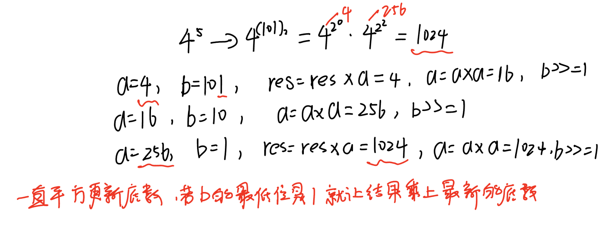

```c++
#include <iostream>

using namespace std;

typedef long long LL;


LL qmi(int a, int b, int p)
{
	//防止 p = 1 
    LL res = 1 % p;
    while (b)
    {
    	//如果当前 b 的最低位为 1 则把结果乘上当前底数 a ，为 0 就不用乘  
        if (b & 1) res = res * a % p;
        //每次都要更新底数，使 a 为 a 的平方 
        a = (LL)a * a % p;//强转其中一个操作数防止溢出
        //b右移一位
        b >>= 1;
    }
    return res;
}


int main()
{
    int n;
    cin>>n;
    while (n -- )
    {
        int a, b, p;
        cin>>a>>b>>p;
        cout<<qmi(a, b, p)<<endl;;
    }

    return 0;
}
```

```c++
LL qmi(int a, int b, int p)
{
    LL res = 1 % p;
    while (b)
    {
        if (b & 1) res = res * a % p;
        a = (LL)a * a % p;
        b >>= 1;
    }
    return res;
}
```

### 4.2 快速幂求逆元

洛谷：https://www.luogu.com.cn/problem/U579207


- [x] [U579207 快速幂求逆元](https://www.luogu.com.cn/problem/U579207)


AcWing题目：


```c++
#include <iostream>

using namespace std;

typedef long long LL;


LL qmi(int a, int b, int p)
{
    LL res = 1 % p;
    while (b)
    {
        if (b & 1) res = res * a % p;
        a = (LL)a * a % p;
        b >>= 1;
    }
    return res;
}


int main()
{
    int n;
    cin>>n;
    while (n -- )
    {
        int a, p;
        cin>>a>>p;
        /*
        a 和 p 互质并且 p 是质数时 a 的逆元为 a^p-2 mod p
        因 p 为质数，因子只有 1 和 p，所以 a 和 p 存在除 1 以外的公因数即不互质的话，那个公因数只能是 p
        所以只需要判断 p 是否为 a 的因子就可以确定 a 和 p 是否互质
        */
        if (a % p == 0) puts("impossible");
        else cout<<qmi(a, p - 2, p)<<endl;
    }

    return 0;
}
```

## 5 扩展欧几里得算法

### 5.1 扩展欧几里得算法


一、算法要解决什么问题？

扩展欧几里得算法不仅能够计算两个整数 $a$ 和 $b$ 的**最大公约数** $\gcd(a, b)$，还能找到满足 **贝祖等式** 的整数解 $x$ 和 $y$。**贝祖等式**：

$$
a \times x + b \times y = \gcd(a, b)
$$

| 特性           | 描述                                                         |
| :------------- | :----------------------------------------------------------- |
| **输入**       | 两个整数 $a$, $b$                                            |
| **输出**       | 三元组 $(d, x, y)$，满足 $d = \gcd(a, b) = a \times x + b \times y$ |
| **核心思想**   | 在辗转相除法的基础上，通过递推关系回溯求解贝祖等式的系数     |
| **时间复杂度** | $O(\log(\min(a, b)))$，与标准欧几里得算法相同，非常高效      |
|||

洛谷：

https://www.luogu.com.cn/problem/U553464

https://www.luogu.com.cn/problem/T114032

https://www.luogu.com.cn/problem/T270218


AcWting题目：


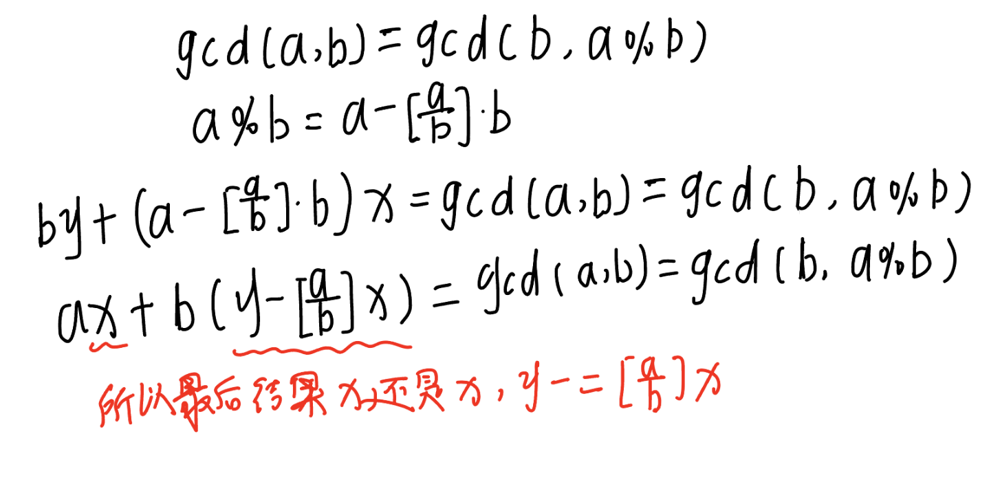


> 关键函数模板

```c++
// 求x, y，使得ax + by = gcd(a, b)
int exgcd(int a, int b, int &x, int &y)
{
    if (!b)
    {
        x = 1; y = 0;
        return a;
    }
    int d = exgcd(b, a % b, y, x);
    y -= (a/b) * x;
    return d;
}
```

> 完整代码模板

```c++
#include <iostream>
#include <algorithm>

using namespace std;

int exgcd(int a, int b, int &x, int &y)//必须传引用，不能用全局变量
{
	//b 为 0 时，最大公约数为 a ，所以 a x 1 + 0 x 0 = a 
    if (!b)
    {
        x = 1, y = 0;
        return a;
    }
    //b 不为 0 时，详细过程见手动模拟 
    int d = exgcd(b, a % b, y, x);
    y -= a / b * x;//调用函数求得最大公约数之后发现 y 要减 a / b * x 才是 b 的真正的系数
    return d;
}

int main()
{
    int n;
    scanf("%d", &n);//数据范围比较大时用scanf会快很多

    while (n -- )
    {
        int a, b;
        scanf("%d%d", &a, &b);
        int x, y;
        exgcd(a, b, x, y);
        printf("%d %d\n", x, y);
    }

    return 0;
}

```


### 5.2 线性同余方程

洛谷：

https://www.luogu.com.cn/problem/P1082

https://www.luogu.com.cn/problem/T580848


AcWting题目：


```c++
#include <iostream>
#include <algorithm>

using namespace std;

typedef long long LL;


int exgcd(int a, int b, int &x, int &y)
{
    if (!b)
    {
        x = 1, y = 0;
        return a;
    }
    int d = exgcd(b, a % b, y, x);
    y -= a / b * x;
    return d;
}


int main()
{
    int n;
    scanf("%d", &n);
    while (n -- )
    {
        int a, b, m;
        scanf("%d%d%d", &a, &b, &m);

        int x, y;
        int d = exgcd(a, m, x, y);
        // b 不是 a 和 m 的最大公约数的倍数 ，无解 
        if (b % d) puts("impossible");
        //ax + by = gcd ,ax0 + by0 = b 解得 x0 = x * b / gcd , y0 = y * b / gcd（扩大 b / gcd 倍）
        /*
        由题可知 b 的范围几乎就是 int 的范围，所以要转成 LL ，防止x * b结果溢出，但是题中所说输出答案必须在 int 范围之内，所以用 %d 保证输出答案为 int（%lld 为 long long）
        */
        else printf("%d\n", (LL)x * b / d % m);
    }

    return 0;
}

```

## 6 中国剩余定理（*）

### 6.0 定理说明

一、定理介绍

中国剩余定理 (Chinese Remainder Theorem, CRT)是数论中的一个重要定理，它解决的是**一元线性同余方程组**的求解问题。

设 $m_1, m_2, \ldots, m_k$ 是**两两互质**的正整数（即对于任意 $i \neq j$，有 $\gcd(m_i, m_j) = 1$）。

则对于任意的整数 $a_1, a_2, \ldots, a_k$，下面的同余方程组：
$$
\begin{cases}
x \equiv a_1 \pmod{m_1} \\
x \equiv a_2 \pmod{m_2} \\
\vdots \\
x \equiv a_k \pmod{m_k}
\end{cases}
$$

在模 $M = m_1 \times m_2 \times \cdots \times m_k$ 下有**唯一解**。求解方法：

1. 计算所有模数的乘积：$M = m_1 \times m_2 \times \cdots \times m_k$
2. 对每个 $i$，计算：$M_i = \frac{M}{m_i}$
3. 对每个 $i$，求 $M_i$ 在模 $m_i$ 下的乘法逆元 $y_i$（即 $M_i y_i \equiv 1 \pmod{m_i}$）
4. 方程组的解为：$x \equiv a_1 M_1 y_1 + a_2 M_2 y_2 + \cdots + a_k M_k y_k \pmod{M}$

**公式**：
$$
x \equiv \sum_{i=1}^k a_i M_i y_i \pmod{M}
$$

二、实例演示

求解"物不知数"问题：
$$
\begin{cases}
x \equiv 2 \pmod{3} \\
x \equiv 3 \pmod{5} \\ 
x \equiv 2 \pmod{7}
\end{cases}
$$

**解题步骤**：

1. **模数**：$m_1 = 3, m_2 = 5, m_3 = 7$（两两互质）
2. **计算** $M$：$M = 3 \times 5 \times 7 = 105$
3. **计算** $M_i$：
   - $M_1 = 105 \div 3 = 35$
   - $M_2 = 105 \div 5 = 21$ 
   - $M_3 = 105 \div 7 = 15$
4. **求逆元** $y_i$：
   - 求 $35$ 模 $3$ 的逆元：$35 \equiv 2 \pmod{3}$，$2 \times 2 = 4 \equiv 1 \pmod{3}$，所以 $y_1 = 2$
   - 求 $21$ 模 $5$ 的逆元：$21 \equiv 1 \pmod{5}$，$1 \times 1 = 1 \equiv 1 \pmod{5}$，所以 $y_2 = 1$
   - 求 $15$ 模 $7$ 的逆元：$15 \equiv 1 \pmod{7}$，$1 \times 1 = 1 \equiv 1 \pmod{7}$，所以 $y_3 = 1$
5. **代入公式**：
   $$
   \begin{aligned}
   x &= 2 \times 35 \times 2 + 3 \times 21 \times 1 + 2 \times 15 \times 1 \\
     &= 140 + 63 + 30 = 233
   \end{aligned}
   $$
6. **取模得最小正整数解**：$x \equiv 233 \pmod{105} \equiv 23 \pmod{105}$

**验证**：
- $23 \div 3 = 7$ 余 $2$ ✅
- $23 \div 5 = 4$ 余 $3$ ✅  
- $23 \div 7 = 3$ 余 $2$ ✅

所以最小正整数解是 $23$，通解为 $x = 23 + 105k$（$k$ 为整数）。


### 6.1 表达整数的奇怪方式

> **这是中国剩余定理的拓展版本**

洛谷：

https://www.luogu.com.cn/problem/P4777

牛客竞赛：

[Strange Way to Express Integers](https://ac.nowcoder.com/acm/problem/50570)


AcWing题目：


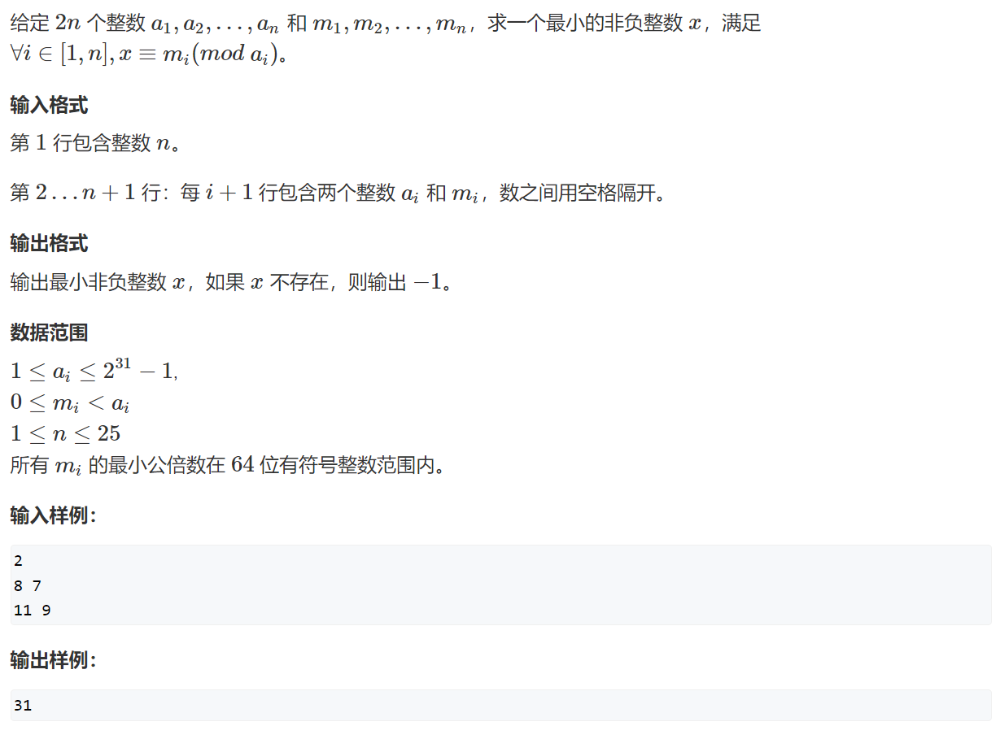

```c++
#include <iostream>
#include <algorithm>

using namespace std;

typedef long long LL;


LL exgcd(LL a, LL b, LL &x, LL &y)
{
    if (!b)
    {
        x = 1, y = 0;
        return a;
    }

    LL d = exgcd(b, a % b, y, x);
    y -= a / b * x;
    return d;
}


int main()
{
    int n;
    cin >> n;

    LL x = 0, m1, a1;
    cin >> m1 >> a1;
    for (int i = 0; i < n - 1; i ++ )
    {
        LL m2, a2;
        cin >> m2 >> a2;
        LL k1, k2;
        LL d = exgcd(m1, m2, k1, k2);
        if ((a2 - a1) % d)
        {
            x = -1;
            break;
        }

        k1 *= (a2 - a1) / d;
        k1 = (k1 % (m2/d) + m2/d) % (m2/d);

        x = k1 * m1 + a1;

        LL m = abs(m1 / d * m2);
        a1 = k1 * m1 + a1;
        m1 = m;
    }

    if (x != -1) x = (a1 % m1 + m1) % m1;

    cout << x << endl;

    return 0;
}

```

> 牛客竞赛：[Strange Way to Express Integers](https://ac.nowcoder.com/acm/problem/50570)

```c++
#include <iostream>
using namespace std;
typedef long long LL;
LL exgcd(LL a, LL b, LL& x, LL& y) {
  if (b == 0) {
    x = 1, y = 0;
    return a;
  }
  LL d = exgcd(b, a % b, y, x);
  y -= a / b * x;
  return d;
}
int main() {
  int n;
  while (scanf("%d", &n) != EOF) {
    bool flag = true;
    LL a1, b1, a2, b2;
    scanf("%lld %lld", &a1, &b1);
    for (int i = 1; i <= n - 1; i++) {
      scanf("%lld %lld", &a2, &b2);
      LL k1, k2;
      LL d = exgcd(a1, a2, k1, k2);
      if ((b2 - b1) % d) {
        flag = false;
        // 继续读完
        for (int j = i + 1; j < n; j++) scanf("%lld %lld", &a2, &b2);
        break;
      }
      //    s = k1 * (b2 - b1) / d;
      k1 *= (b2 - b1) / d;
      LL t = a2 / d;
      k1 = (k1 % t + t) % t;
      b1 = a1 * k1 + b1;
      a1 = a1 * a2 / d;  // LCM(a1, a2)
    }
    if (flag) {
      printf("%lld\n", (b1 % a1 + a1) % a1);
    } else {
      printf("-1\n");
    }
  }

  return 0;
}
```

> 洛谷：https://www.luogu.com.cn/problem/P4777
>
> 有个测试点会卡`long long`溢出，需要用到`__int128`

```c++
#include <iostream>
using namespace std;
typedef long long LL;
LL exgcd(LL a, LL b, LL& x, LL& y) {
  if (b == 0) {
    x = 1, y = 0;
    return a;
  }
  LL d = exgcd(b, a % b, y, x);
  y -= a / b * x;
  return d;
}
int main() {
  int n;
  scanf("%d", &n);
  bool flag = true;
  LL a1, b1, a2, b2;
  scanf("%lld %lld", &a1, &b1);
  for (int i = 1; i <= n - 1; i++) {
    scanf("%lld %lld", &a2, &b2);
    LL k1, k2;
    LL d = exgcd(a1, a2, k1, k2);
    if ((b2 - b1) % d) { flag = false; }
    __int128 s = (__int128)k1 * (b2 - b1) / d;
    // k1 *= (b2 - b1) / d;
    LL t = a2 / d;
    s = (s % t + t) % t;
    b1 = (__int128)a1 * s + b1;
    a1 = (__int128)a1 * a2 / d;  // LCM(a1, a2)
  }
  if (flag) {
    printf("%lld\n", (b1 % a1 + a1) % a1);
  } else {
    printf("-1\n");
  }

  return 0;
}
```


### 6.2 中国剩余定理（纯模板）

牛客竞赛：[曹冲养猪](https://ac.nowcoder.com/acm/problem/50569)

洛谷：https://www.luogu.com.cn/problem/P1495

代码实现：

```c++
#include <iostream>
using namespace std;
const int N = 14;
int a[N], b[N];
typedef long long LL;
// (a * b) % mod
LL mul_mod(LL a, LL b, LL k) {
  LL result = 0;
  a %= k;
  while (b) {
    if (b & 1) { result = (result + a) % k; }
    b >>= 1;
    a = 2 * a % k;
  }
  return result;
}
LL exgcd(LL a, LL b, LL& x, LL& y) {
  if (b == 0) {
    x = 1, y = 0;
    return a;
  }
  LL d = exgcd(b, a % b, y, x);
  y -= a / b * x;
  return d;
}
// 求模逆元，即求x使得 a * x ≡ 1 mod m
LL mod_inverse(LL a, LL m) {
  LL x, y;
  LL d = exgcd(a, m, x, y);
  if (d != 1) { return -1; }
  return (x % m + m) % m;
}
int main() {
  int n;
  scanf("%d", &n);
  LL M = 1;
  for (int i = 0; i < n; i++) {
    scanf("%d %d", a + i, b + i);
    M *= a[i];
  }
  LL result = 0;
  for (int i = 0; i < n; i++) {
    LL Mi = M / a[i];
    LL yi = mod_inverse(Mi, a[i]);
    result = (result + mul_mod(mul_mod(b[i], Mi, M), yi, M)) % M;
  }
  result = (result % M + M) % M;
  printf("%lld", result);
  return 0;
}
```


## 7 高斯消元（*）


### 7.1 高斯消元解线性方程组


洛谷：

https://www.luogu.com.cn/problem/P3389

https://www.luogu.com.cn/problem/P2455


AcWing题目：


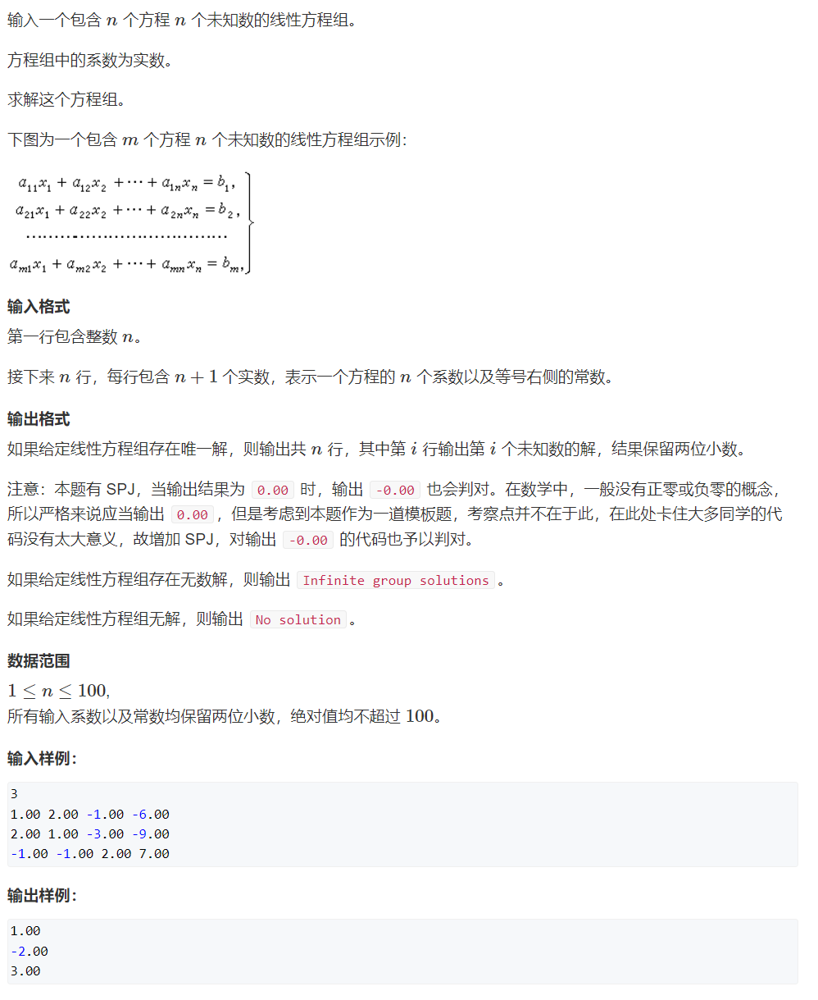

```c++
#include <iostream>
#include <cstring>
#include <algorithm>
#include <cmath>

using namespace std;

const int N = 110;
const double eps = 1e-8;

int n;
double a[N][N];

int gauss()  // 高斯消元，答案存于a[i][n]中，0 <= i < n
{
    int c, r;
    for (c = 0, r = 0; c < n; c ++ )
    {
        int t = r;
        for (int i = r; i < n; i ++ )  // 找绝对值最大的行
            if (fabs(a[i][c]) > fabs(a[t][c]))
                t = i;

        if (fabs(a[t][c]) < eps) continue;

        for (int i = c; i <= n; i ++ ) swap(a[t][i], a[r][i]);  // 将绝对值最大的行换到最顶端
        for (int i = n; i >= c; i -- ) a[r][i] /= a[r][c];  // 将当前行的首位变成1
        for (int i = r + 1; i < n; i ++ )  // 用当前行将下面所有的列消成0
            if (fabs(a[i][c]) > eps)
                for (int j = n; j >= c; j -- )
                    a[i][j] -= a[r][j] * a[i][c];

        r ++ ;
    }

    if (r < n)
    {
        for (int i = r; i < n; i ++ )
            if (fabs(a[i][n]) > eps)
                return 2; // 无解
        return 1; // 有无穷多组解
    }

    for (int i = n - 1; i >= 0; i -- )
        for (int j = i + 1; j < n; j ++ )
            a[i][n] -= a[i][j] * a[j][n];

    return 0; // 有唯一解
}


int main()
{
    scanf("%d", &n);
    for (int i = 0; i < n; i ++ )
        for (int j = 0; j < n + 1; j ++ )
            scanf("%lf", &a[i][j]);

    int t = gauss();
    if (t == 2) puts("No solution");
    else if (t == 1) puts("Infinite group solutions");
    else
    {
        for (int i = 0; i < n; i ++ )
            printf("%.2lf\n", a[i][n]);
    }

    return 0;
}

```

### 7.2 高斯消元解异或线性方程组

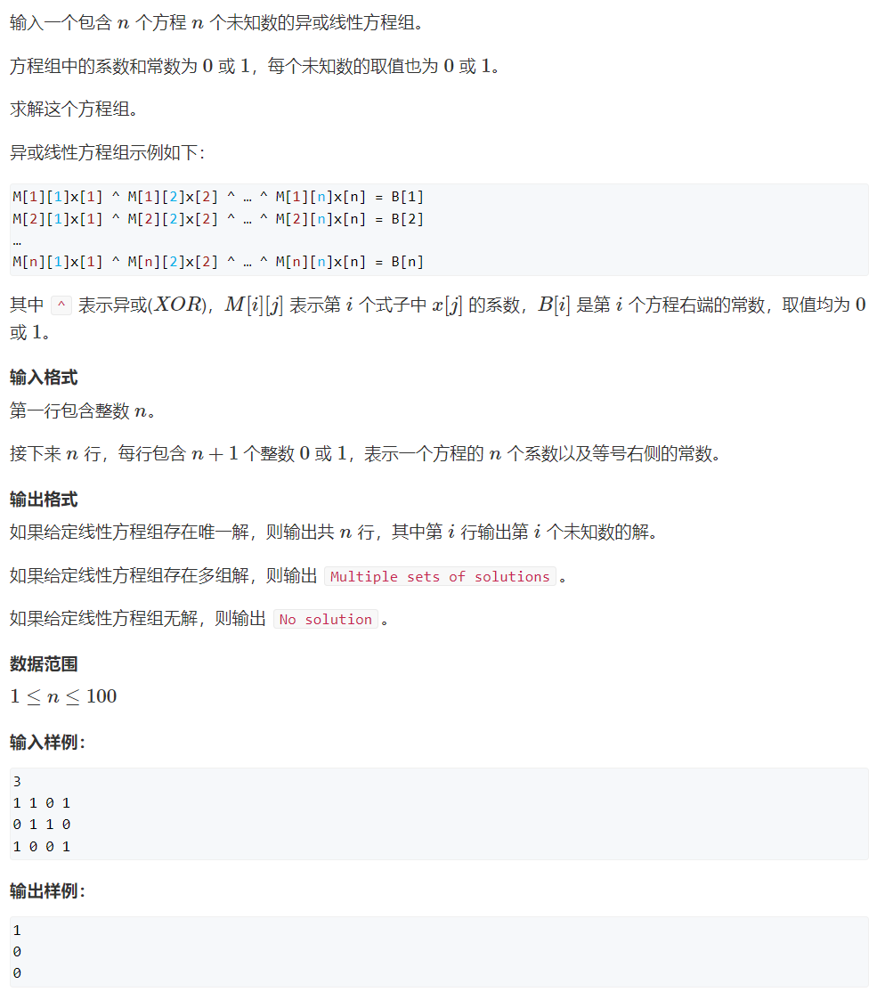

```c++
#include <iostream>
#include <algorithm>

using namespace std;

const int N = 110;


int n;
int a[N][N];


int gauss()
{
    int c, r;
    for (c = 0, r = 0; c < n; c ++ )
    {
        int t = r;
        for (int i = r; i < n; i ++ )
            if (a[i][c])
                t = i;

        if (!a[t][c]) continue;

        for (int i = c; i <= n; i ++ ) swap(a[r][i], a[t][i]);
        for (int i = r + 1; i < n; i ++ )
            if (a[i][c])
                for (int j = n; j >= c; j -- )
                    a[i][j] ^= a[r][j];

        r ++ ;
    }

    if (r < n)
    {
        for (int i = r; i < n; i ++ )
            if (a[i][n])
                return 2;
        return 1;
    }

    for (int i = n - 1; i >= 0; i -- )
        for (int j = i + 1; j < n; j ++ )
            a[i][n] ^= a[i][j] * a[j][n];

    return 0;
}


int main()
{
    cin >> n;

    for (int i = 0; i < n; i ++ )
        for (int j = 0; j < n + 1; j ++ )
            cin >> a[i][j];

    int t = gauss();

    if (t == 0)
    {
        for (int i = 0; i < n; i ++ ) cout << a[i][n] << endl;
    }
    else if (t == 1) puts("Multiple sets of solutions");
    else puts("No solution");

    return 0;
}

```

## 8 求组合数


### 8.1 求组合数 I

> 特点
>
> 数据范围：
>
> $1 \le n \le 10000$, $1 \le b \le a \le 2000$，
>
> 方法：使用递归方法，公式
> $$
> C_a^b = C_{a-1}^{b-1} + C_{a-1}^b
> $$
> 计算所有的$C_a^b$的值进行打表。


牛客：[【模板】组合数_牛客题霸_牛客网](https://www.nowcoder.com/practice/53f82db091b2452bae5fef4437ffd0bb)

洛谷：https://www.luogu.com.cn/problem/T474685


AcWing题目：


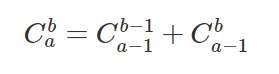

```c++
#include <iostream>
#include <algorithm>

using namespace std;

const int N = 2010, mod = 1e9 + 7;


int c[N][N];


void init()
{
    c[0][0] = 1;
    for (int i = 1; i < N; i ++ )
        for (int j = 0; j <= i; j ++ )
            if (!j) c[i][j] = 1;
            else c[i][j] = (c[i - 1][j] + c[i - 1][j - 1]) % mod;
}


int main()
{
    int n;

    init();

    scanf("%d", &n);

    while (n -- )
    {
        int a, b;
        scanf("%d%d", &a, &b);

        printf("%d\n", c[a][b]);
    }

    return 0;
}
```

### 8.2 求组合数 II


洛谷：


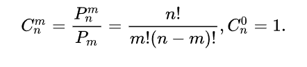

```c++
#include <iostream>
#include <algorithm>

using namespace std;

typedef long long LL;

const int N = 100010, mod = 1e9 + 7;

//fact 存的是元素的阶乘，infact 存的是元素的阶乘的逆元 
int fact[N], infact[N];


int qmi(int a, int k, int p)
{
    int res = 1;
    while (k)
    {
        if (k & 1) res = (LL)res * a % p;
        a = (LL)a * a % p;
        k >>= 1;
    }
    return res;
}


int main()
{
	//先初始化 0 的阶乘和阶乘逆元
    fact[0] = infact[0] = 1;
    
    //初始化阶乘数组和阶乘逆元数组 
    for (int i = 1; i < N; i ++ )
    {
    	//fact[i] = fact[i - 1] * i
        fact[i] = (LL)fact[i - 1] * i % mod;
        //infact[i] = infact[i - 1] * i 模 mod 的逆元 
        infact[i] = (LL)infact[i - 1] * qmi(i, mod - 2, mod) % mod;
    }


    int n;
    scanf("%d", &n);
    while (n -- )
    {
        int a, b;
        scanf("%d%d", &a, &b);
        //fact[a] * infact[b] 会溢出 1e9 了 ，所以要转 LL 并且先模 mod 一下 ，公式见上图 
        printf("%d\n", (LL)fact[a] * infact[b] % mod * infact[a - b] % mod);
    }

    return 0;
}

```

```c++
int qmi(int a, int k, int p)    // 快速幂模板
{
    int res = 1;
    while (k)
    {
        if (k & 1) res = (LL)res * a % p;
        a = (LL)a * a % p;
        k >>= 1;
    }
    return res;
}

// 预处理阶乘的余数和阶乘逆元的余数
fact[0] = infact[0] = 1;
for (int i = 1; i < N; i ++ )
{
    fact[i] = (LL)fact[i - 1] * i % mod;
    infact[i] = (LL)infact[i - 1] * qmi(i, mod - 2, mod) % mod;
}

```


> 求逆元的优化版本
>
> 题目：https://www.luogu.com.cn/problem/U51417


> [!important]
>
> 前提条件：
>
> 所有涉及的逆元必须存在，即 $\gcd(n!, M) = 1$ 且 $\gcd((n+1)!, M) = 1$；等价于：$\gcd((n+1)!, M) = 1$（因为 $n! \mid (n+1)!$）；特别地，当 $M$ 是质数且 $n+1 < M$ 时，条件自然满足。
>
>
> 以下公式成立：
>
> $$
> (n!)^{-1} \equiv ((n+1)!)^{-1} \cdot (n+1) \pmod{M}
> $$
>
>
> 证明过程：
>
> 我们知道阶乘的递推关系：
>
> $$
> (n+1)! = (n+1) \cdot n!
> $$
>
> 对两边在模 $M$ 下取乘法逆元（假设逆元存在）：
>
> $$
> ((n+1)!)^{-1} \equiv \big((n+1) \cdot n!\big)^{-1} \pmod{M}
> $$
>
> 利用模逆元的性质 $(ab)^{-1} \equiv a^{-1} b^{-1} \pmod{M}$（当 $a,b$ 与 $M$ 互质时）：
>
> $$
> ((n+1)!)^{-1} \equiv (n+1)^{-1} \cdot (n!)^{-1} \pmod{M}
> $$
>
> 两边同时乘以 $(n+1)$（注意：这里是原数，不是逆元）：
>
> $$
> ((n+1)!)^{-1} \cdot (n+1) \equiv (n+1)^{-1} \cdot (n!)^{-1} \cdot (n+1) \pmod{M}
> $$
>
> 由于 $(n+1)^{-1} \cdot (n+1) \equiv 1 \pmod{M}$，右边化简为：
>
> $$
> ((n+1)!)^{-1} \cdot (n+1) \equiv (n!)^{-1} \pmod{M}
> $$
>
> 即：
>
> $$
> (n!)^{-1} \equiv ((n+1)!)^{-1} \cdot (n+1) \pmod{M}
> $$
>
> 


代码实现逻辑：

```c++
// 步骤1：计算最大值的阶乘逆元
infact[N-1] = quickPow(fact[N-1], M-2, M);
// 这里使用费马小定理：a^(M-2) ≡ a^(-1) mod M
// 计算：((N-1)!)^(-1) mod M

// 步骤2：反向递推
for (int i = N-2; i >= 0; i--) {
    infact[i] = (LL)infact[i+1] * (i+1) % M;
    // 应用公式：(i!)^(-1) = ((i+1)!)^(-1) × (i+1) mod M
}
```

完整代码实现：


```c++
#include<iostream>
using namespace std;
typedef long long LL;

const int N = 3e7 + 5;  // 最大可能的值+5，用于数组大小
const int M = 1e9 + 7;  // 模数，10^9+7是一个质数

int fact[N];    // 存储阶乘数组：fact[i] = i! mod M
int infact[N];  // 存储阶乘的逆元数组：infact[i] = (i!)^(-1) mod M

// 快速幂函数：计算 a^k mod p
int quickPow(int a, int k, int p){
    int result = 1;
    while(k){
        if(k & 1){  // 如果k的二进制最低位为1
            result = (LL)result * a % p;
        }
        a = (LL)a * a % p;  // a平方
        k >>= 1;  // k右移一位
    }
    return result;
}

// 初始化函数：预处理阶乘和阶乘逆元
void init(){
    // 初始化0的阶乘和阶乘逆元为1
    fact[0] = infact[0] = 1;
    
    // 正向计算阶乘数组：fact[i] = i! mod M
    for(int i = 1; i < N; i++){
        fact[i] = (LL)fact[i - 1] * i % M;
    }

    // --- 关键部分：逆元的高效求解 ---
    // 1. 先计算最大阶乘的逆元：((N-1)!)^(-1) mod M
    //    使用费马小定理：a^(M-2) ≡ a^(-1) mod M
    infact[N - 1] = quickPow(fact[N - 1], M - 2, M);
    
    // 2. 反向递推计算所有阶乘的逆元
    //    利用公式：(n!)^(-1) ≡ ((n+1)!)^(-1) × (n+1) mod M
    for (int i = N - 2; i >= 0; i--) {
        infact[i] = (LL)infact[i + 1] * (i + 1) % M;
    }
}

int main(){
    init();  // 预处理阶乘和逆元
    
    int t, n, m, result;
    scanf("%d", &t);
    while(t--){
        scanf("%d%d", &m, &n);
        // 计算组合数：C(m,n) = m! / (n! × (m-n)!) mod M
        result = (LL)fact[m] * infact[n] % M * infact[m - n] % M;
        printf("%d\n", result);
    }
    return 0;
}
```


### 8.3 求组合数 III


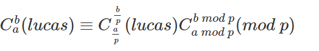

```c++
#include <iostream>
#include <algorithm>

using namespace std;

typedef long long LL;


int qmi(int a, int k, int p)
{
    int res = 1;
    while (k)
    {
        if (k & 1) res = (LL)res * a % p;
        a = (LL)a * a % p;
        k >>= 1;
    }
    return res;
}


int C(int a, int b, int p)
{
    if (b > a) return 0;//注意 b > a 的情况

    int res = 1;
    for (int i = 1, j = a; i <= b; i ++, j -- )
    {
    	// a 到 a - b + 1 总共 a - b 个数 
        res = (LL)res * j % p;
        //再乘 1 到 b 的逆元也就是 b 的阶乘的逆元 
        res = (LL)res * qmi(i, p - 2, p) % p;
    }
    return res;
}


int lucas(LL a, LL b, int p)
{
	//递归终点 a < p && b < p
    if (a < p && b < p) return C(a, b, p);
    
    return (LL)lucas(a / p, b / p, p) * C(a % p, b % p, p) % p;
}


int main()
{
    int n;
    cin >> n;

    while (n -- )
    {
        LL a, b;//注意 a 和 b 的类型
        int p;
        cin >> a >> b >> p;
        cout << lucas(a, b, p) << endl;
    }

    return 0;
}

```

```c++

//若 p 是质数，C(n, m) = C(n / p, m / p) * C(n % p, m % p) (mod p)


int qmi(int a, int k, int p)
{
    int res = 1;
    while (k)
    {
        if (k & 1) res = (LL)res * a % p;
        a = (LL)a * a % p;
        k >>= 1;
    }
    return res;
}


int C(int a, int b, int p)
{
    if (b > a) return 0;
    int res = 1;
    for (int i = 1, j = a; i <= b; i ++, j -- )
    {   	
        res = (LL)res * j % p;
        res = (LL)res * qmi(i, p - 2, p) % p;
    }
    return res;
}


int lucas(LL a, LL b, int p)
{
	
    if (a < p && b < p) return C(a, b, p);
    return (LL)lucas(a / p, b / p, p) * C(a % p, b % p, p) % p;
}
```

### 8.4 求组合数 Ⅳ


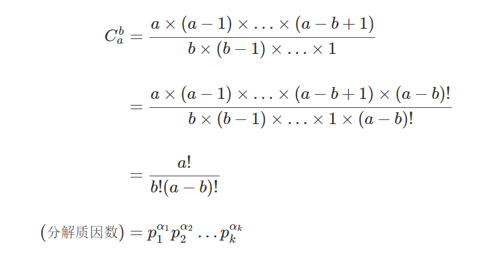


> `sum[i]`表示第`i`个质数的和


```c++
#include <iostream>
#include <algorithm>
#include <vector>

using namespace std;


const int N = 5010;

int primes[N], cnt;
int sum[N];
bool st[N];

//线性筛法筛质数
void get_primes(int n)
{
    for (int i = 2; i <= n; i ++ )
    {
        if (!st[i]) primes[cnt ++ ] = i;
        for (int j = 0; primes[j] <= n / i; j ++ )
        {
            st[primes[j] * i] = true;
            if (i % primes[j] == 0) break;
        }
    }
}


//返回 n 的阶乘中质因子 p 的次数 
int get(int n, int p)
{
    int res = 0;
    while (n)
    {
        res += n / p;
        n /= p;
    }
    return res;
}


vector<int> mul(vector<int> a, int b)
{
    vector<int> c;
    int t = 0;
 
    for (int i = 0; i < a.size(); i ++ )
    {
        t += a[i] * b;
        c.push_back(t % 10);
        t /= 10;
    }
    while (t)
    {
        c.push_back(t % 10);
        t /= 10;
    }
    return c;
}


int main()
{
    int a, b;
    cin >> a >> b;
    
	//筛出 1 到 a 的质数，因为 b 和 a - b 都比 a 小，所以 1 到 b 和 a - b的质数包含在 1 到 a 的质数中 
    get_primes(a);
    
	//求出1 到 a ，1 到 b 和 a - b每个质数的总次数 
    for (int i = 0; i < cnt; i ++ )
    {
        int p = primes[i];
        //C(a,b) 中 p 的总次数等于 a! 中 p 的次数减去 a - b! 中 p 的次数减去b! 中 p 的次数 
        sum[i] = get(a, p) - get(a - b, p) - get(b, p);
    }

    vector<int> res;
    res.push_back(1);
    
	//把每个质数乘起来，即上图最后一步的结果（分解质因数） 
    for (int i = 0; i < cnt; i ++ )
        for (int j = 0; j < sum[i]; j ++ )
            res = mul(res, primes[i]);
	
	//输出最终结果 
    for (int i = res.size() - 1; i >= 0; i -- ) printf("%d", res[i]);
    puts("");

    return 0;
}

```

```c++
当我们需要求出组合数的真实值，而非对某个数的余数时，分解质因数的方式比较好用：
    1. 筛法求出范围内的所有质数
    2. 通过 C(a, b) = a! / b! / (a - b)! 这个公式求出每个质因子的次数。 n! 中p的次数是 n / p + n / p^2 + n / p^3 + ...
    3. 用高精度乘法将所有质因子相乘

int primes[N], cnt;     // 存储所有质数
int sum[N];     // 存储每个质数的次数
bool st[N];     // 存储每个数是否已被筛掉


void get_primes(int n)      // 线性筛法求素数
{
    for (int i = 2; i <= n; i ++ )
    {
        if (!st[i]) primes[cnt ++ ] = i;
        for (int j = 0; primes[j] <= n / i; j ++ )
        {
            st[primes[j] * i] = true;
            if (i % primes[j] == 0) break;
        }
    }
}


int get(int n, int p)       // 求n！中 p 的次数
{
    int res = 0;
    while (n)
    {
        res += n / p;
        n /= p;
    }
    return res;
}


vector<int> mul(vector<int> a, int b)       // 高精度乘低精度模板
{
    vector<int> c;
    int t = 0;
    for (int i = 0; i < a.size(); i ++ )
    {
        t += a[i] * b;
        c.push_back(t % 10);
        t /= 10;
    }

    while (t)
    {
        c.push_back(t % 10);
        t /= 10;
    }

    return c;
}

get_primes(a);  // 预处理范围内的所有质数

for (int i = 0; i < cnt; i ++ )     // 求每个质因数的次数
{
    int p = primes[i];
    sum[i] = get(a, p) - get(b, p) - get(a - b, p);
}

vector<int> res;
res.push_back(1);

for (int i = 0; i < cnt; i ++ )     // 用高精度乘法将所有质因子相乘
    for (int j = 0; j < sum[i]; j ++ )
        res = mul(res, primes[i]);

```


> 写法2
>
> `sum[i]`表示数`i`的有关的和。

```c++
#include <cstring>
#include <iostream>
#include <vector>
using namespace std;
const int N = 5005;
int primes[N], cnt;
int sum[N];  // 表示每个质数的个数
bool st[N];
void getPrimes(int n) {
  memset(st, false, sizeof(st));
  cnt = 0;
  st[0] = st[1] = true;
  for (int i = 2; i <= n; i++) {
    if (!st[i]) { primes[cnt++] = i; }
    for (int j = 0; primes[j] <= n / i; j++) {
      st[primes[j] * i] = true;
      if (i % primes[j] == 0) { break; }
    }
  }
}
// 求 n!中分解质因数中p的个数
int get(int n, int p) {
  int result = 0;
  while (n) {
    result += n / p;
    n /= p;
  }
  return result;
}
vector<int> mul(vector<int> a, int b) {
  vector<int> c;
  int t = 0;
  for (int i = 0; i < a.size() || t; i++) {
    if (i < a.size()) { t += a[i] * b; }
    c.emplace_back(t % 10);
    t /= 10;
  }
  return c;
}
int main() {
  int a, b;
  scanf("%d%d", &a, &b);
  getPrimes(a);
  for (int i = 0; i < cnt; i++) {
    int p = primes[i];
    sum[p] = get(a, p) - get(b, p) - get(a - b, p);
  }
  vector<int> res;
  res.emplace_back(1);
  for (int i = 0; i < cnt; i++) {
    int p = primes[i];
    for (int j = 0; j < sum[p]; j++) res = mul(res, p);
  }
  for (int i = res.size() - 1; i >= 0; i--) { printf("%d", res[i]); }
  return 0;
}
```


### 8.5 满足条件的01序列


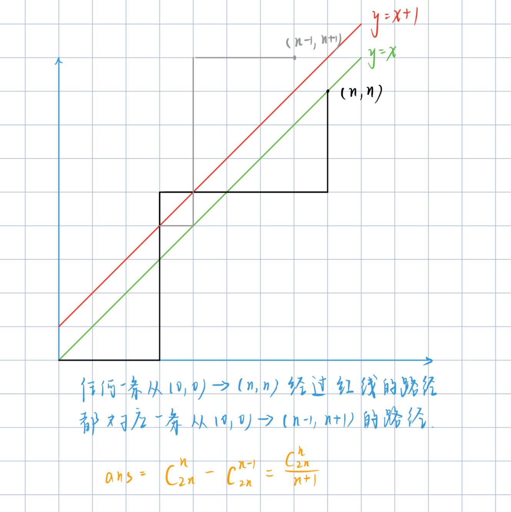

```c++

/*给定n个0和n个1，它们按照某种顺序排成长度为2n的序列
满足任意前缀中0的个数都不少于1的个数的序列的数量为： Cat(n) = C(2n, n) / (n + 1)*/


#include <iostream>
#include <algorithm>

using namespace std;

typedef long long LL;

const int N = 100010, mod = 1e9 + 7;


int qmi(int a, int b, int p)
{
    int res = 1;
    while (b)
    {
        if (b & 1) res = (LL)res * a % p;
        a = (LL)a * a % p;
        b >>= 1;
    }
    return res;
}

int C(int a,int b, int p){
	if(b > a) return 0;
	int res = 1;
	for(int i = 1, j = a; i <= b; i++,j--){
		res = (LL)res * j % p;
		res = (LL)res * qmi(i, p - 2, p) % p;
	}
	return res;
} 


int main()
{
    int n;
    cin >> n;

    cout<<(LL)C(2 * n, n, mod) * qmi(n + 1, mod - 2, mod) % mod<<endl;

    return 0;
}

```

## 9 容斥原理


🔢 **容斥原理（Inclusion-Exclusion Principle）** 是组合数学中用于计算多个集合的**并集大小**的重要方法，通过加减交集来避免重复计数。

📐 基本公式

1、**两个集合** $$A$$ 和 $$B$$：
$$
|A \cup B| = |A| + |B| - |A \cap B|
$$
> 🎯 总元素数 = A的元素 + B的元素 - 同时属于A和B的元素（被重复计算的部分）

2、**三个集合** $$A$$、$$B$$、$$C$$：
$$
|A \cup B \cup C| = |A| + |B| + |C| - |A \cap B| - |A \cap C| - |B \cap C| + |A \cap B \cap C|
$$
> ⚖️ 先加所有单集合，再减两两交集（之前多减了），最后加三个集合的交集（之前多减了要补回来）

3、**n个集合的一般形式**：
$$
\left| \bigcup_{i=1}^n A_i \right| = \sum_{i} |A_i| - \sum_{i<j} |A_i \cap A_j| + \sum_{i<j<k} |A_i \cap A_j \cap A_k| - \cdots + (-1)^{n+1} \left| \bigcap_{i=1}^n A_i \right|
$$
💡 核心思想

通过**交替加减交集项**来修正重复计数：

1、**奇数个集合的交集**：➕ 加（补偿被多减的部分）

2、**偶数个集合的交集**：➖ 减（消除重复计算）

🛠️ 典型应用场景

1、**🔢 计数问题**：计算满足至少一个条件的情况总数

2、**🎲 概率计算**：求多个事件至少发生一个的概率

3、**❌ 排除法**：通过剔除不合法情况间接求解

🧠 记忆口诀

> "🔢 奇加偶减"：交集项的符号随集合数量的奇偶性变化（奇数加，偶数减）

🎨 小贴士

1、📊 维恩图是理解容斥原理的绝佳工具

2、⚡ 适用于任何需要"去重"的计数场景

3、🔄 记住"先加后减"的基本节奏

⏱️ **复杂度分析**

容斥原理的时间复杂度为 **O(2ⁿ)**（n为集合数），因为需要计算所有可能的交集组合（共2ⁿ-1项），仅适合小规模问题（通常n≤10）。

### 9.1 能被整除的数


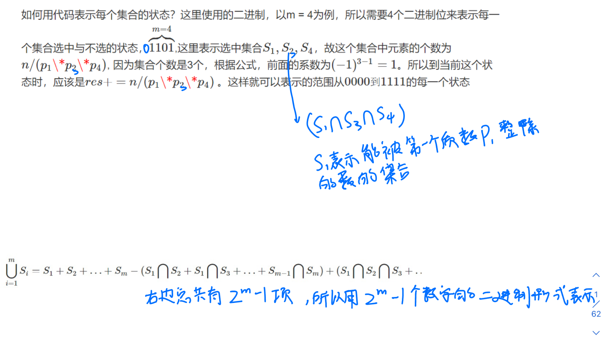

```c++
#include <iostream>
#include <algorithm>

using namespace std;

typedef long long LL;

const int N = 20;

int p[N];


int main()
{
    int n, m;
    cin >> n >> m;
	
	//用 p 数组存储 m 个质数 
    for (int i = 0; i < m; i ++ ) cin >> p[i];

    int res = 0;
    //外层循环遍历从1 到 1111...(m个1，2^m - 1)的每一个数字，每个数字代表上图中第二幅图等式右边的一个加项 
    for (int i = 1; i < 1 << m; i ++ )
    {
        int t = 1, s = 0;//t 为选中集合对应质数的乘积 ，s 为选中集合的数量
		 
        //内层循环，确定当前加项的具体形式，从最低位开始遍历当前数字的每一位，每个数字都当成有 m 位，看当前数字有多少个 1，确定当前项是哪个集合或哪几个集合的交集 
        for (int j = 0; j < m; j ++ )
            if (i >> j & 1)
            {
            	//若 t * p[j] > n ，则 n / t = 0，无意义 
                if ((LL)t * p[j] > n)
                {
                    t = -1;
                    break;
                }
                t *= p[j];//乘上集合对应的质数
                s ++ ;//有一个 1 ，集合数量加一 
            }

        if (t != -1)
        { 
            //除对应集合的质数的乘积就是集合的数量
            if (s % 2) res += n / t;//奇数项为正 
            else res -= n / t;//偶数项为负 
        }
    }

    cout << res << endl;

    return 0;
}
```

```c++
for (int i = 0; i < m; i ++ ) cin >> p[i];

    int res = 0;
    for (int i = 1; i < 1 << m; i ++ )
    {
        int t = 1, s = 0;
		 
        for (int j = 0; j < m; j ++ )
            if (i >> j & 1)
            {
                if ((LL)t * p[j] > n)
                {
                    t = -1;
                    break;
                }
                t *= p[j];
                s ++ ; 
            }

        if (t != -1)
        { 
            if (s % 2) res += n / t;
            else res -= n / t; 
        }
    }
```


## 10 博弈论


### 10.0 内容介绍


**NIM游戏 —— 模板题 AcWing 891. Nim游戏**
给定N堆物品，第i堆物品有Ai个。两名玩家轮流行动，每次可以任选一堆，取走任意多个物品，可把一堆取光，但不能不取。取走最后一件物品者获胜。两人都采取最优策略，问先手是否必胜。

我们把这种游戏称为NIM博弈。把游戏过程中面临的状态称为局面。整局游戏第一个行动的称为先手，第二个行动的称为后手。若在某一局面下无论采取何种行动，都会输掉游戏，则称该局面必败。
所谓采取最优策略是指，若在某一局面下存在某种行动，使得行动后对面面临必败局面，则优先采取该行动。同时，这样的局面被称为必胜。我们讨论的博弈问题一般都只考虑理想情况，即两人均无失误，都采取最优策略行动时游戏的结果。
NIM博弈不存在平局，只有先手必胜和先手必败两种情况。

定理： NIM博弈先手必胜，当且仅当 A1 ^ A2 ^ … ^ An != 0

**公平组合游戏ICG**
若一个游戏满足：

1. 由两名玩家交替行动；
2. 在游戏进程的任意时刻，可以执行的合法行动与轮到哪名玩家无关；
3. 不能行动的玩家判负；

则称该游戏为一个公平组合游戏。
NIM博弈属于公平组合游戏，但城建的棋类游戏，比如围棋，就不是公平组合游戏。因为围棋交战双方分别只能落黑子和白子，胜负判定也比较复杂，不满足条件2和条件3。

**有向图游戏**
给定一个有向无环图，图中有一个唯一的起点，在起点上放有一枚棋子。两名玩家交替地把这枚棋子沿有向边进行移动，每次可以移动一步，无法移动者判负。该游戏被称为有向图游戏。
任何一个公平组合游戏都可以转化为有向图游戏。具体方法是，把每个局面看成图中的一个节点，并且从每个局面向沿着合法行动能够到达的下一个局面连有向边。

**Mex运算**
设S表示一个非负整数集合。定义mex(S)为求出不属于集合S的最小非负整数的运算，即：
mex(S) = min{x}, x属于自然数，且x不属于S

**SG函数**
在有向图游戏中，对于每个节点x，设从x出发共有k条有向边，分别到达节点y1, y2, …, yk，定义SG(x)为x的后继节点y1, y2, …, yk 的SG函数值构成的集合再执行mex(S)运算的结果，即：
SG(x) = mex({SG(y1), SG(y2), …, SG(yk)})
特别地，整个有向图游戏G的SG函数值被定义为有向图游戏起点s的SG函数值，即SG(G) = SG(s)。

**有向图游戏的和 —— 模板题 AcWing 893. 集合-Nim游戏**
设G1, G2, …, Gm 是m个有向图游戏。定义有向图游戏G，它的行动规则是任选某个有向图游戏Gi，并在Gi上行动一步。G被称为有向图游戏G1, G2, …, Gm的和。
有向图游戏的和的SG函数值等于它包含的各个子游戏SG函数值的异或和，即：
SG(G) = SG(G1) ^ SG(G2) ^ … ^ SG(Gm)

**定理**
有向图游戏的某个局面必胜，当且仅当该局面对应节点的SG函数值大于0。
有向图游戏的某个局面必败，当且仅当该局面对应节点的SG函数值等于0。


```
先手必胜状态：可以走到某一个必胜状态

先手必败状态：走不到任何一个必败状态
```


### 10.1 Nim游戏


```c++
#include <iostream>
#include <algorithm>

using namespace std;


int main()
{
    int n;
    scanf("%d", &n);

    int res = 0;
    while (n -- )
    {
        int x;
        scanf("%d", &x);
        res ^= x;
    }

    if (res) puts("Yes");
    else puts("No");

    return 0;
}
```

### 10.2 台阶-Nim游戏


```c++

//奇数台阶上的值的异或值为非0，则先手必胜，反之必败！

#include <iostream>
#include <algorithm>

using namespace std;

const int N = 100010;

int main()
{
    int n;
    scanf("%d", &n);

    int res = 0;
    for (int i = 1; i <= n; i ++ )
    {
        int x;
        scanf("%d", &x);
        //奇数二进制形式最低位为 1 ，&1 后为 1，偶数为 0 
        if (i & 1) res ^= x;
    }

    if (res) puts("Yes");
    else puts("No");

    return 0;
}

```

### 10.3 集合-Nim游戏


```c++
#include <cstring>
#include <iostream>
#include <algorithm>
#include <unordered_set>

using namespace std;

const int N = 110, M = 10010;

int n, k;
int s[N], f[M];//s 存储的是可拿取的石子数量，f 存储的是存储已经计算过的状态（石子数量）的 Nim 值，避免重复计算 


int sg(int x)
{
    if (f[x] != -1) return f[x];
    
	// S 要在函数内部定义 ，因为每次递归 S 都是针对当前状态的，S用于当前状态之后的状态的sg值 
    unordered_set<int> S;
    
    //递归计算当前状态 x 可以到达的之后的所有状态的值插入 S（x 能否减可拿取石子数量集合 S 中的元素） 
    for (int i = 0; i < k; i ++ )
    {
        int sum = s[i];
        if (x >= sum) S.insert(sg(x - sum));
    }
	
	//递归完之后就剩当前状态 x 没有值（不在 S 集合中）了，遍历自然数，如果有不在 S 中的自然数便是当前状态 x 的 sg 值 
    for (int i = 0; ; i ++ )
        if (!S.count(i))
            return f[x] = i;
}


int main()
{
    cin >> k;
    for (int i = 0; i < k; i ++ ) cin >> s[i];
    cin >> n;

    memset(f, -1, sizeof f);

    int res = 0;
    for (int i = 0; i < n; i ++ )
    {
        int x;
        cin >> x;
        res ^= sg(x);
    }

    if (res) puts("Yes");
    else puts("No");

    return 0;
}
```

### 10.4  拆分-Nim游戏


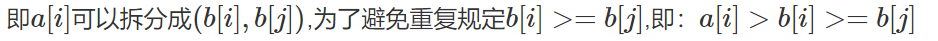

```c++
#include <cstring>
#include <iostream>
#include <algorithm>
#include <unordered_set>

using namespace std;

const int N = 110;


int n;
int f[N];


int sg(int x)
{
    if (f[x] != -1) return f[x];

    unordered_set<int> S;
    
    //x > i >= j
    for (int i = 0; i < x; i ++ )
        for (int j = 0; j <= i; j ++ )
            S.insert(sg(i) ^ sg(j));

    for (int i = 0;; i ++ )
        if (!S.count(i))
            return f[x] = i;
}


int main()
{
    cin >> n;

    memset(f, -1, sizeof f);

    int res = 0;
    while (n -- )
    {
        int x;
        cin >> x;
        res ^= sg(x);
    }

    if (res) puts("Yes");
    else puts("No");

    return 0;
}
```

