# 🎓 AcWing——算法基础课


> 第四讲 · 数学知识 · 质数 / 约数 / 欧拉函数 / 快速幂 / 组合数 / 博弈论

---

## 🔢 第四讲 数学知识

### 🎯 1. 质数 (Prime Numbers)

> **核心思想**：质数（素数）是指在大于1的自然数中，除了1和它本身以外不再有其他因数的自然数。质数是数论的基石。

#### 1.1 试除法判定质数
<details>
<summary><strong>🎯 AcWing 题目与题解</strong></summary>

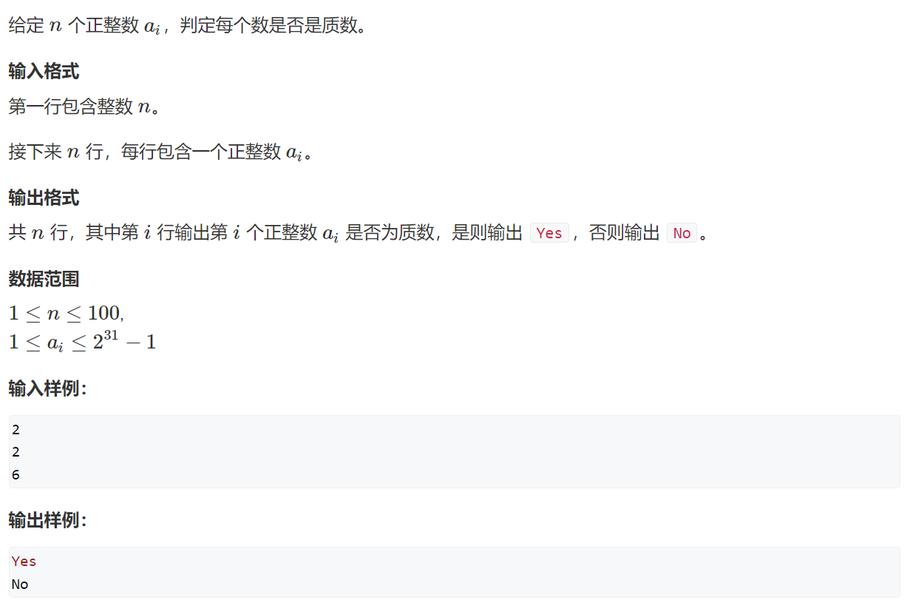

> **解法思路**：一个数 `n` 如果是合数，那么它必然存在一个小于等于 `sqrt(n)` 的因子。因此，我们只需检查从 2 到 `sqrt(n)`（即 `i <= n/i`）是否存在能整除 `n` 的数 `i` 即可。

```cpp
#include <iostream>
using namespace std;

bool is_prime(int x) {
    if (x < 2) return false;
    // x 的一个更小的因子为 i ，另一个更大的因子为 x / i
    // 只需遍历到 sqrt(x) 即可
    for (int i = 2; i <= x / i; i++) {
        if (x % i == 0) return false;
    }
    return true;
}

int main() {
    int n;
    cin >> n;
    while (n--) {
        int x;
        cin >> x;
        if (is_prime(x)) puts("Yes");
        else puts("No");
    }
    return 0;
}
```
</details>

#### 1.2 分解质因数
<details>
<summary><strong>🎯 AcWing 题目与题解</strong></summary>

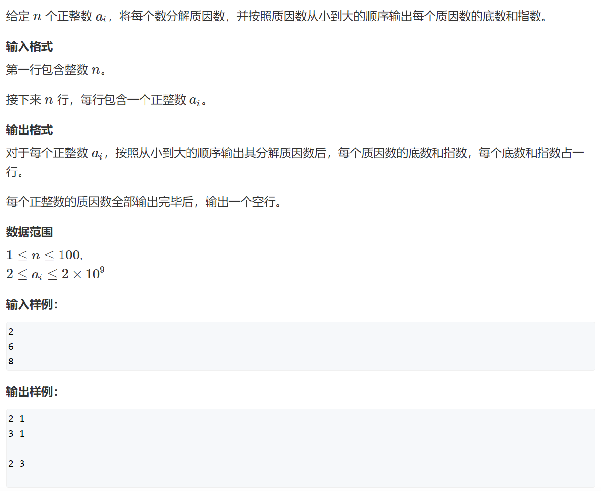

> **解法思路**：同样利用 `i <= n/i` 的性质。从小到大遍历 `i`，如果 `i` 是 `n` 的因子，则 `i` 必为质数（因为 `n` 的更小质因子已被除尽）。我们统计 `i` 的个数，然后将 `n` 中所有的 `i` 都除掉。循环结束后，如果 `n > 1`，说明剩下的 `n` 本身就是那个大于 `sqrt(原n)` 的质因子。

```cpp
#include <iostream>
using namespace std;

void divide(int x) {
    for (int i = 2; i <= x / i; i++) {
        if (x % i == 0) {
            int s = 0;
            while (x % i == 0) {
                x /= i;
                s++;
            }
            cout << i << ' ' << s << endl;
        }
    }
    // 处理最后一个大于 sqrt(原x) 的质因子
    if (x > 1) cout << x << ' ' << 1 << endl;
    cout << endl;
}

int main() {
    int n;
    cin >> n;
    while (n--) {
        int x;
        cin >> x;
        divide(x);
    }
    return 0;
}
```
</details>

#### 1.3 筛法求质数
<details>
<summary><strong>🎯 AcWing 题目与题解</strong></summary>

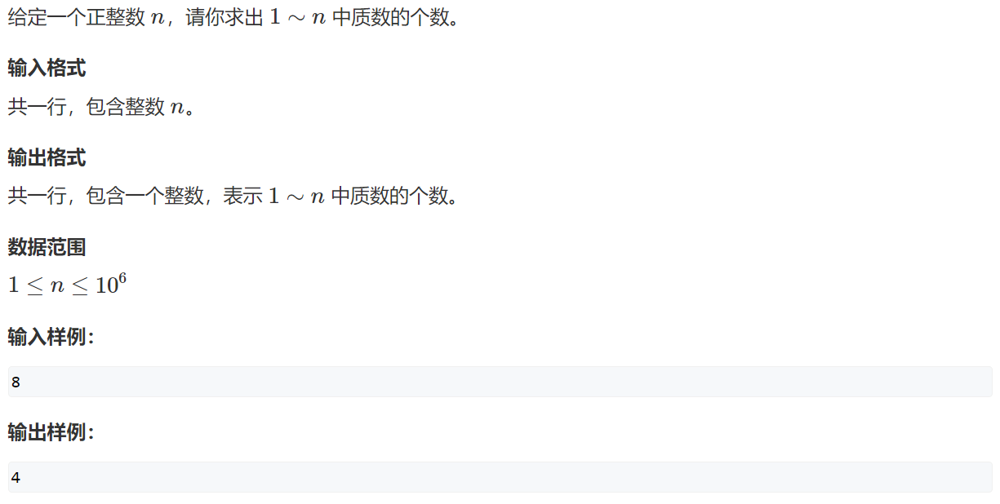

> **埃氏筛法 (O(n log log n))**：从 2 开始，将每个质数的倍数都标记为合数。
> **线性筛法 (O(n))**：核心是 **每个合数只被其最小的质因子筛掉一次**。遍历 2 到 n，如果 `i` 是质数则加入素数表。然后用已筛出的素数 `p` 去筛 `i*p`。关键一步是 `if (i % p == 0) break;`，这保证了 `p` 是 `i` 的最小质因子，从而也是 `i*p` 的最小质因子。

> **埃氏筛法模板**
```cpp
int primes[N], cnt;
bool st[N];

void get_primes(int n) {
    for (int i = 2; i <= n; i++) {
        if (!st[i]) {
            primes[cnt++] = i;
            for (int j = i + i; j <= n; j += i) {
                st[j] = true;
            }
        }
    }
}
```

> **线性筛法题解**
```cpp
#include <iostream>
using namespace std;
const int N = 1000010;

int primes[N], cnt;
bool st[N]; // st[x]=true 表示 x 是合数

void get_primes(int n) {
    for (int i = 2; i <= n; i++) {
        if (!st[i]) primes[cnt++] = i;
        // 用已筛出的素数去筛掉合数
        for (int j = 0; primes[j] <= n / i; j++) {
            st[primes[j] * i] = true;
            // 关键：primes[j] 是 i 的最小质因子，也是 primes[j]*i 的最小质因子
            // 后面的素数再乘i，其最小质因子就不是那个素数了，而是primes[j]
            if (i % primes[j] == 0) break;
        }
    }
}

int main() {
    int n;
    cin >> n;
    get_primes(n);
    cout << cnt << endl;
    return 0;
}
```
</details>

---

### ➗ 2. 约数 (Divisors)

#### 2.1 试除法求约数
<details>
<summary><strong>🎯 AcWing 题目与题解</strong></summary>

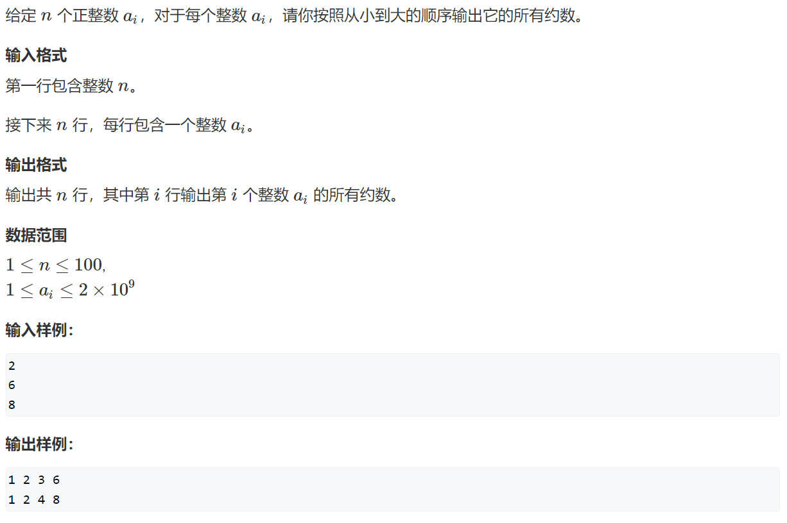

> **解法思路**：约数总是成对出现的。如果 `i` 是 `x` 的约数，那么 `x/i` 也是。我们只需遍历从 1 到 `sqrt(x)`，找到所有小约数 `i`，同时也就找到了大约数 `x/i`。注意 `i == x/i` 的情况，避免重复添加。

```cpp
#include <iostream>
#include <vector>
#include <algorithm>
using namespace std;

vector<int> get_divisors(int x) {
    vector<int> res;
    for (int i = 1; i <= x / i; i++) {
        if (x % i == 0) {
            res.push_back(i);
            if (i != x / i) res.push_back(x / i);
        }
    }
    sort(res.begin(), res.end());
    return res;
}

int main() {
    int n;
    cin >> n;
    while (n--) {
        int x;
        cin >> x;
        auto res = get_divisors(x);
        for (int d : res) cout << d << ' ';
        cout << endl;
    }
    return 0;
}
```
</details>

#### 2.2 约数个数
<details>
<summary><strong>🎯 AcWing 题目与题解</strong></summary>
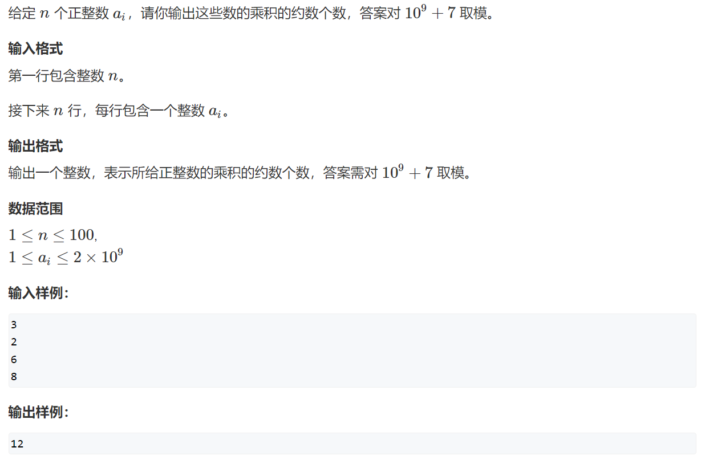

> **约数个数定理**：如果一个数 `N` 的标准质因子分解为 `N = p1^a1 * p2^a2 * ... * pk^ak`，那么 `N` 的约数个数为 `(a1 + 1) * (a2 + 1) * ... * (ak + 1)`。
>
> **解法思路**：先对每个输入的数分解质因数，用 `unordered_map` 累加所有质因子的指数。最后根据定理，将每个指数加 1 后连乘起来。

```cpp
#include <iostream>
#include <unordered_map>
using namespace std;
typedef long long LL;
const int mod = 1e9 + 7;

int main() {
    int n;
    cin >> n;
    unordered_map<int, int> primes;
    while (n--) {
        int x;
        cin >> x;
        for (int i = 2; i <= x / i; i++) {
            while (x % i == 0) {
                x /= i;
                primes[i]++;
            }
        }
        if (x > 1) primes[x]++;
    }

    LL res = 1;
    for (auto p : primes) {
        res = res * (p.second + 1) % mod;
    }
    cout << res << endl;
    return 0;
}```
</details>

#### 2.3 约数之和
<details>
<summary><strong>🎯 AcWing 题目与题解</strong></summary>
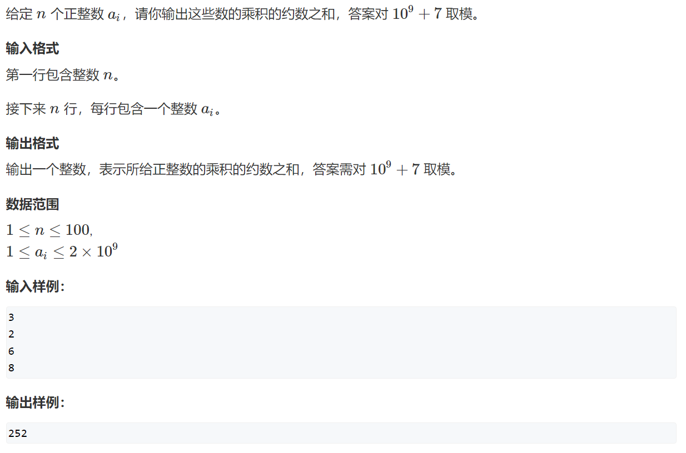

> **约数和定理**：如果 `N = p1^a1 * p2^a2 * ... * pk^ak`，那么 `N` 的所有正约数之和为 `(p1^0 + ... + p1^a1) * ... * (pk^0 + ... + pk^ak)`。
>
> **解法思路**：同上，先累加所有质因子的指数。然后对每个质因子 `p` 和其指数 `a`，计算 `(p^0 + ... + p^a)` 的值，再将这些和连乘起来。

```cpp
#include <iostream>
#include <unordered_map>
using namespace std;
typedef long long LL;
const int mod = 1e9 + 7;

int main() {
    int n;
    cin >> n;
    unordered_map<int, int> primes;
    while (n--) {
        int x;
        cin >> x;
        for (int i = 2; i <= x / i; i++) {
            while (x % i == 0) {
                x /= i;
                primes[i]++;
            }
        }
        if (x > 1) primes[x]++;
    }

    LL res = 1;
    for (auto p : primes) {
        LL prime = p.first, alpha = p.second;
        LL t = 1;
        // 计算 (p^0 + ... + p^a)
        while (alpha--) t = (t * prime + 1) % mod;
        res = res * t % mod;
    }
    cout << res << endl;
    return 0;
}
```
</details>

#### 2.4 最大公约数 (GCD)
<details>
<summary><strong>🎯 AcWing 题目与题解</strong></summary>

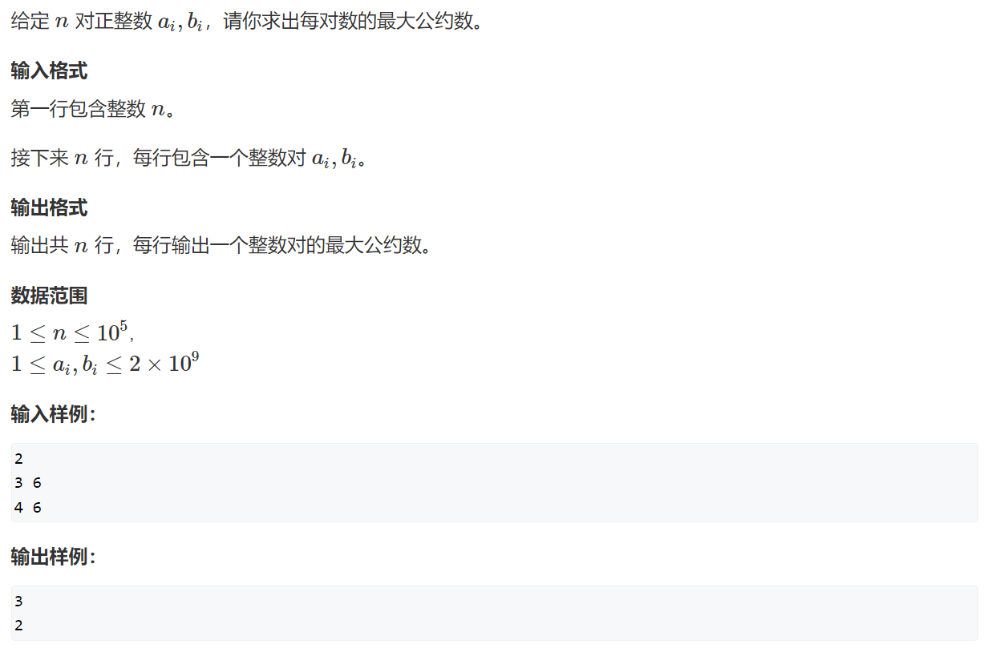

> **欧几里得算法 (辗转相除法)**：`gcd(a, b) = gcd(b, a % b)`，递归边界是当 `b` 为 0 时，`gcd` 为 `a`。这是求最大公约数最高效的方法。

```cpp
#include <iostream>
using namespace std;

int gcd(int a, int b) {
    return b ? gcd(b, a % b) : a;
}

int main() {
    int n;
    cin >> n;
    while (n--) {
        int a, b;
        cin >> a >> b;
        cout << gcd(a, b) << endl;
    }
    return 0;
}
```
</details>

---

### 🇪🇺 3. 欧拉函数

> **核心思想**：欧拉函数 `φ(n)` (phi function) 表示在 1 到 n 中与 n **互质** 的正整数的个数。
>
> **计算公式**：如果 `n = p1^a1 * ... * pk^ak`，则 `φ(n) = n * (1 - 1/p1) * ... * (1 - 1/pk)`。

#### 3.1 求单个欧拉函数
<details>
<summary><strong>🎯 AcWing 题目与题解</strong></summary>

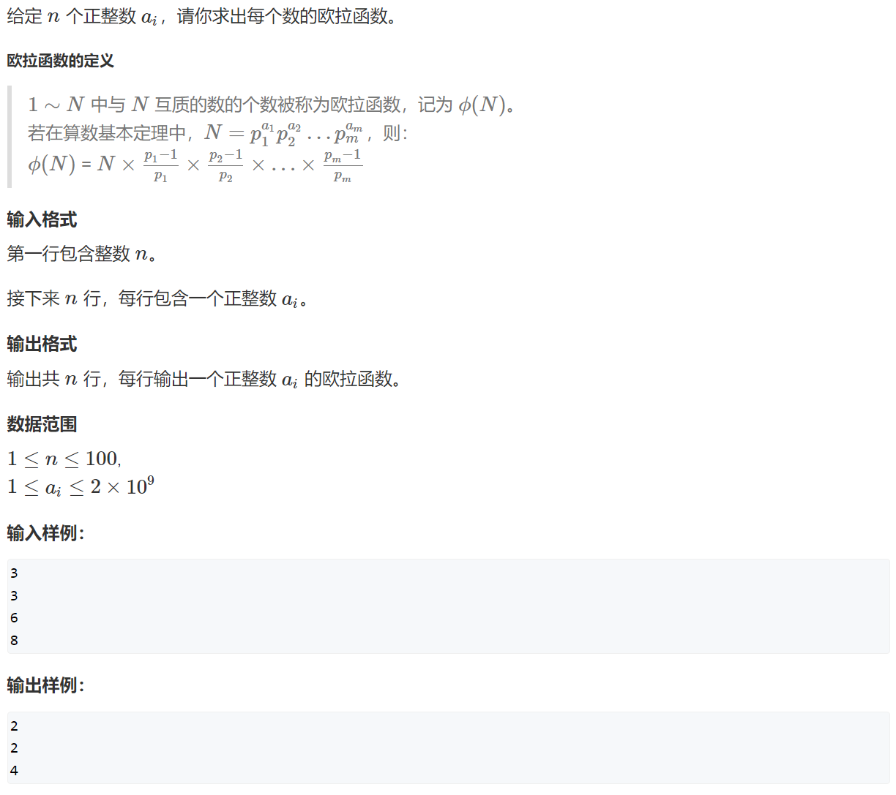

> **解法思路**：直接应用公式。先对 `n` 分解质因数，找到所有质因子 `p`，然后用 `res = res / p * (p-1)` 来计算，以避免浮点数运算。

```cpp
#include <iostream>
using namespace std;

int phi(int x) {
    int res = x;
    for (int i = 2; i <= x / i; i++) {
        if (x % i == 0) {
            res = res / i * (i - 1);
            while (x % i == 0) x /= i;
        }
    }
    if (x > 1) res = res / x * (x - 1);
    return res;
}

int main() {
    int n;
    cin >> n;
    while (n--) {
        int x;
        cin >> x;
        cout << phi(x) << endl;
    }
    return 0;
}
```
</details>

#### 3.2 筛法求欧拉函数
<details>
<summary><strong>🎯 AcWing 题目与题解</strong></summary>

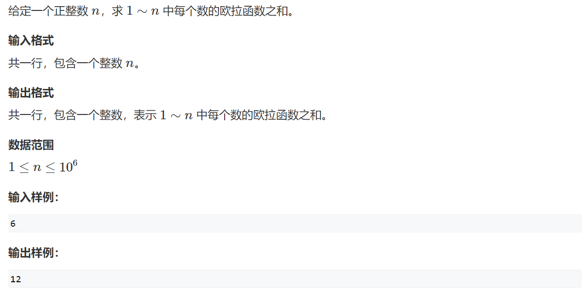

> **解法思路**：在线性筛质数的基础上，利用欧拉函数的性质来递推计算 `φ` 值。
> -   如果 `i` 是质数, `φ(i) = i - 1`。
> -   如果 `i % p == 0`，`p` 是 `i` 的最小质因子，则 `i` 和 `i*p` 含有相同的质因子，`φ(i*p) = φ(i) * p`。
> -   如果 `i % p != 0`，`p` 不是 `i` 的质因子，则 `p` 与 `i` 互质，`φ(i*p) = φ(i) * φ(p) = φ(i) * (p - 1)`。

```cpp
#include <iostream>
using namespace std;
typedef long long LL;
const int N = 1000010;

int primes[N], euler[N], cnt;
bool st[N];

void get_eulers(int n) {
    euler = 1;
    for (int i = 2; i <= n; i++) {
        if (!st[i]) {
            primes[cnt++] = i;
            euler[i] = i - 1;
        }
        for (int j = 0; primes[j] <= n / i; j++) {
            int t = primes[j] * i;
            st[t] = true;
            if (i % primes[j] == 0) {
                euler[t] = euler[i] * primes[j];
                break;
            }
            euler[t] = euler[i] * (primes[j] - 1);
        }
    }
}

int main() {
    int n;
    cin >> n;
    get_eulers(n);
    LL res = 0;
    for (int i = 1; i <= n; i++) res += euler[i];
    cout << res << endl;
    return 0;
}```
</details>

---

### 🚀 4. 快速幂

> **核心思想**：快速幂算法用于高效计算 `a^b mod p`。它将指数 `b` 进行二进制拆分，例如 `a^13 = a^(8+4+1) = a^8 * a^4 * a^1`。通过循环，每次将底数平方，并根据 `b` 的二进制位决定是否将当前底数乘入结果。时间复杂度从 O(b) 降至 O(log b)。

#### 4.1 快速幂
<details>
<summary><strong>🎯 AcWing 题目与题解</strong></summary>
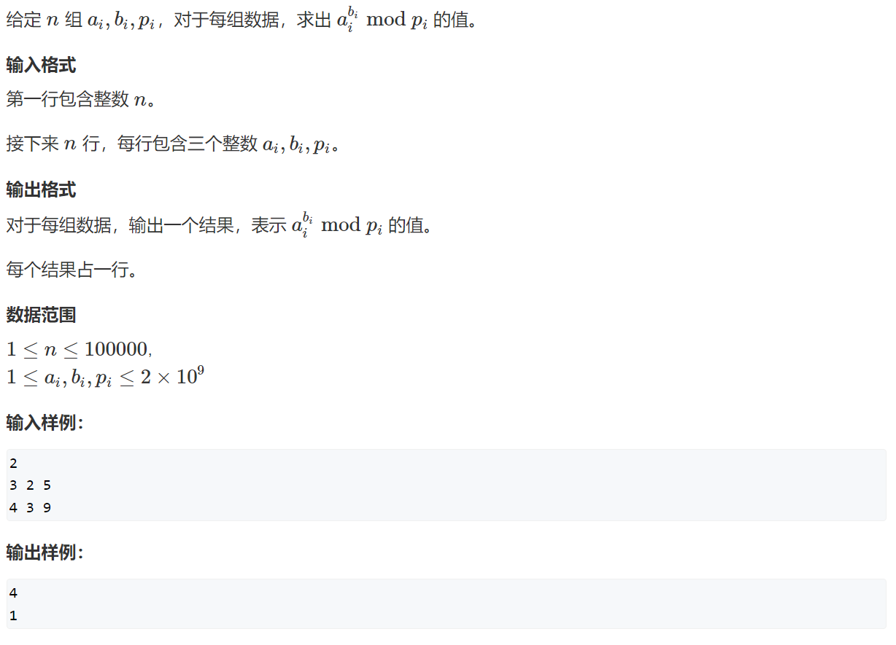

```cpp
#include <iostream>
using namespace std;
typedef long long LL;

LL qmi(int a, int b, int p) {
    LL res = 1 % p;
    LL base = a;
    while (b) {
        if (b & 1) res = res * base % p;
        base = base * base % p;
        b >>= 1;
    }
    return res;
}

int main() {
    int n;
    cin >> n;
    while (n--) {
        int a, b, p;
        cin >> a >> b >> p;
        cout << qmi(a, b, p) << endl;
    }
    return 0;
}
```
</details>

#### 4.2 快速幂求逆元
<details>
<summary><strong>🎯 AcWing 题目与题解</strong></summary>
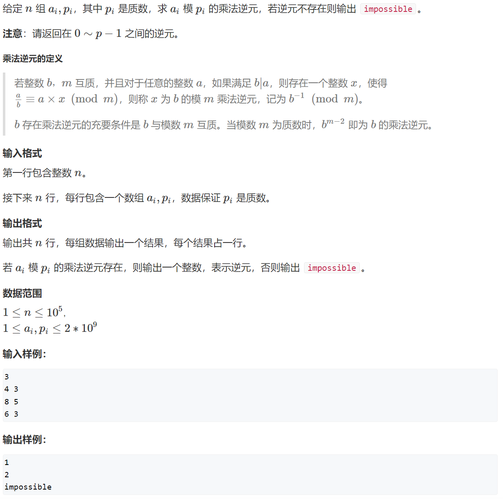

> **费马小定理**：如果 `p` 是一个质数，且 `a` 不是 `p` 的倍数（即 `a` 和 `p` 互质），那么 `a^(p-1) ≡ 1 (mod p)`。
>
> **求逆元**：由 `a * a^(p-2) ≡ 1 (mod p)` 可知，`a` 在模 `p` 意义下的乘法逆元就是 `a^(p-2) mod p`。我们可以用快速幂来计算这个值。

```cpp
#include <iostream>
using namespace std;
typedef long long LL;

LL qmi(int a, int b, int p) {
    LL res = 1 % p;
    LL base = a;
    while (b) {
        if (b & 1) res = res * base % p;
        base = base * base % p;
        b >>= 1;
    }
    return res;
}

int main() {
    int n;
    cin >> n;
    while (n--) {
        int a, p;
        cin >> a >> p;
        if (a % p == 0) puts("impossible");
        else cout << qmi(a, p - 2, p) << endl;
    }
    return 0;
}
```
</details>

---
### ➕ 5. 扩展欧几里得算法

> **核心思想**：扩展欧几里得算法用于求解形如 `ax + by = gcd(a, b)` 的方程的一组整数解 `(x, y)`。它在欧几里得算法递归求 `gcd` 的基础上，反向推导出解。
>
> **递推关系**：当 `b=0` 时，`ax + 0*y = a`，解为 `x=1, y=0`。否则，我们递归求解 `bx' + (a%b)y' = gcd(b, a%b)`，然后根据 `x = y'` 和 `y = x' - (a/b)y'` 推导出原方程的解。

<details>
<summary><strong>扩展欧几里得算法模板与题解</strong></summary>
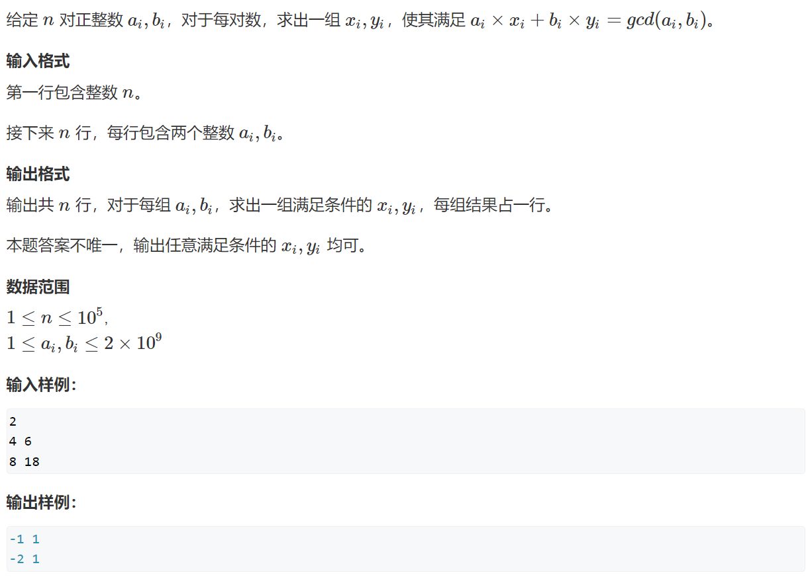

```cpp
#include <iostream>
using namespace std;

// 求解 ax + by = gcd(a, b)
int exgcd(int a, int b, int &x, int &y) {
    if (!b) {
        x = 1, y = 0;
        return a;
    }
    int d = exgcd(b, a % b, y, x);
    y -= a / b * x;
    return d;
}

int main() {
    int n;
    cin >> n;
    while (n--) {
        int a, b, x, y;
        cin >> a >> b;
        exgcd(a, b, x, y);
        cout << x << " " << y << endl;
    }
    return 0;
}
```
</details>

<details>
<summary><strong>线性同余方程</strong></summary>
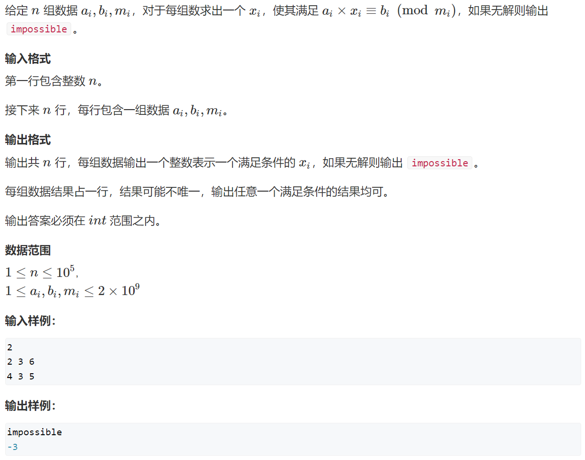

> **解法思路**：方程 `ax ≡ b (mod m)` 等价于 `ax - b = my`（`y`为某个整数），即 `ax - my = b`。这和 `ax + by = c` 形式相同。
> 1.  用扩展欧几里得算法求 `ax' + my' = gcd(a, m)` 的解 `(x', y')`。
> 2.  方程有解的充要条件是 `gcd(a, m)` 能整除 `b`。
> 3.  若有解，则原方程的一个解 `x = x' * (b / gcd(a, m))`。
> 4.  通解为 `x + k * (m / gcd(a, m))`，最小正整数解为 `(x % (m/d) + (m/d)) % (m/d)`。

```cpp
#include <iostream>
using namespace std;
typedef long long LL;

int exgcd(int a, int b, int &x, int &y) {
    if (!b) {
        x = 1, y = 0;
        return a;
    }
    int d = exgcd(b, a % b, y, x);
    y -= a / b * x;
    return d;
}

int main() {
    int n;
    cin >> n;
    while (n--) {
        int a, b, m;
        cin >> a >> b >> m;
        int x, y;
        int d = exgcd(a, m, x, y);
        if (b % d != 0) puts("impossible");
        else {
            // x' = x * (b/d), m' = m/d. 最小正整数解
            LL res = (LL)x * (b / d);
            cout << (res % (m / d) + (m / d)) % (m / d) << endl;
        }
    }
    return 0;
}
```
</details>

---

### 🔢 8. 求组合数

> **核心思想**：组合数 `C(a, b)` 表示从 `a` 个不同元素中取出 `b` 个元素的方案数。
>
> **方法**：
> 1.  **递推法 (O(n²))**: `C(a, b) = C(a-1, b) + C(a-1, b-1)`。适用于 `a, b` 范围较小。
> 2.  **预处理阶乘+逆元 (O(n log mod))**: `C(a, b) = a! / (b! * (a-b)!)`。用快速幂求逆元。适用于 `a, b` 较大，模数为质数。
> 3.  **卢卡斯定理 (O(p log_p n))**: `C(a, b) ≡ C(a/p, b/p) * C(a%p, b%p) (mod p)`。适用于 `a, b` 很大，但模数 `p` 较小的质数。
> 4.  **高精度+质因数分解**: 当需要求真实值且结果很大时，对 `a!, b!, (a-b)!` 分解质因数，约分后再用高精度乘法计算。

<details>
<summary><strong>求组合数 I (递推法)</strong></summary>
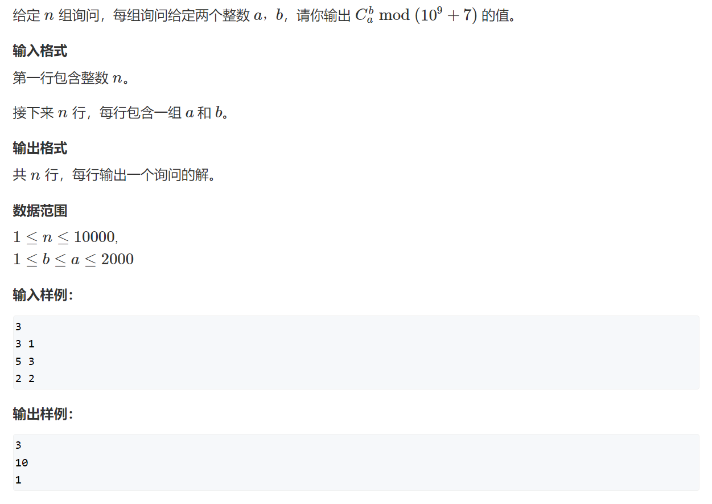

```cpp
#include <iostream>
using namespace std;
const int N = 2010, mod = 1e9 + 7;
int c[N][N];

void init() {
    for (int i = 0; i < N; i++) {
        for (int j = 0; j <= i; j++) {
            if (!j) c[i][j] = 1;
            else c[i][j] = (c[i - 1][j] + c[i - 1][j - 1]) % mod;
        }
    }
}

int main() {
    init();
    int n;
    cin >> n;
    while (n--) {
        int a, b;
        cin >> a >> b;
        cout << c[a][b] << endl;
    }
    return 0;
}
```
</details>

<details>
<summary><strong>求组合数 II (阶乘逆元)</strong></summary>
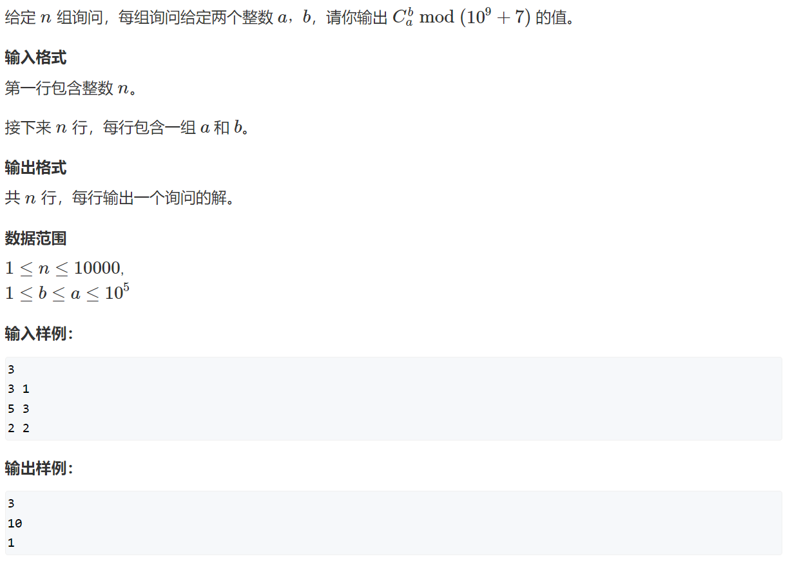

```cpp
#include <iostream>
using namespace std;
typedef long long LL;
const int N = 100010, mod = 1e9 + 7;
int fact[N], infact[N];

int qmi(int a, int k, int p) { /* 快速幂模板 */ }

void init() {
    fact = infact = 1;
    for (int i = 1; i < N; i++) {
        fact[i] = (LL)fact[i - 1] * i % mod;
        infact[i] = (LL)infact[i - 1] * qmi(i, mod - 2, mod) % mod;
    }
}

int main() {
    init();
    int n;
    cin >> n;
    while (n--) {
        int a, b;
        cin >> a >> b;
        cout << (LL)fact[a] * infact[b] % mod * infact[a - b] % mod << endl;
    }
    return 0;
}
```
</details>

<details>
<summary><strong>求组合数 III (卢卡斯定理)</strong></summary>
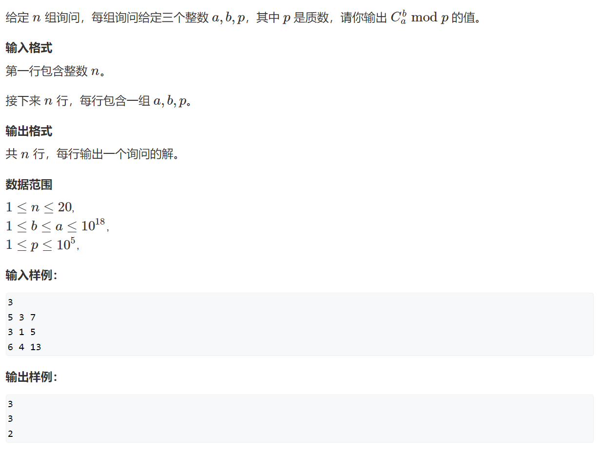

```cpp
#include <iostream>
using namespace std;
typedef long long LL;

int qmi(int a, int k, int p) { /* 快速幂模板 */ }

int C(int a, int b, int p) {
    if (b > a) return 0;
    int res = 1;
    for (int i = 1, j = a; i <= b; i++, j--) {
        res = (LL)res * j % p;
        res = (LL)res * qmi(i, p - 2, p) % p;
    }
    return res;
}

int lucas(LL a, LL b, int p) {
    if (a < p && b < p) return C(a, b, p);
    return (LL)C(a % p, b % p, p) * lucas(a / p, b / p, p) % p;
}

int main() {
    int n;
    cin >> n;
    while (n--) {
        LL a, b;
        int p;
        cin >> a >> b >> p;
        cout << lucas(a, b, p) << endl;
    }
    return 0;
}
```
</details>

<details>
<summary><strong>求组合数 IV (高精度)</strong></summary>
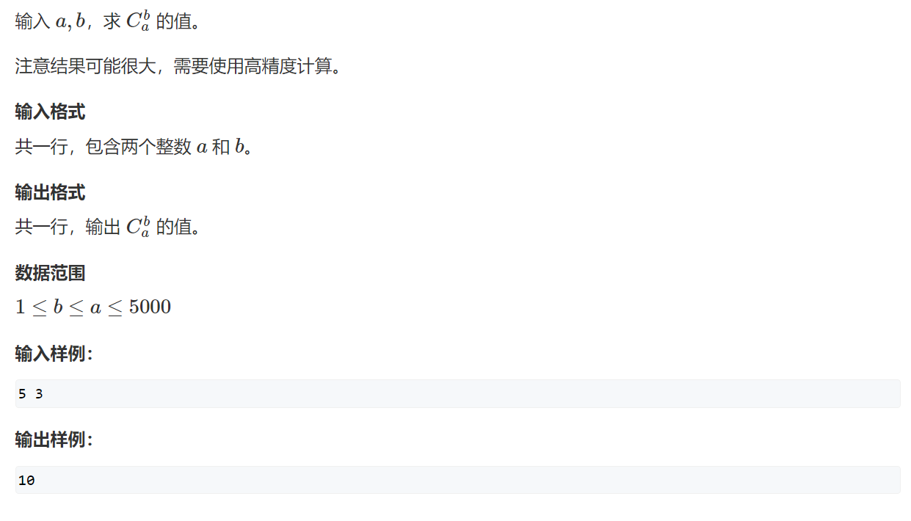

```cpp
// 核心逻辑
// 1. 线性筛预处理 1~a 的所有质数
get_primes(a);
// 2. 计算每个质因子 p 在 C(a,b) 中的次数
// 次数 = get(a, p) - get(b, p) - get(a-b, p)
// 其中 get(n, p) 计算 n! 中质因子 p 的个数
for (int i = 0; i < cnt; i++) {
    int p = primes[i];
    sum[i] = get(a, p) - get(b, p) - get(a - b, p);
}
// 3. 用高精度乘法将所有质因子 p^sum[i] 乘起来
vector<int> res;
res.push_back(1);
for (int i = 0; i < cnt; i++) {
    for (int j = 0; j < sum[i]; j++) {
        res = mul(res, primes[i]);
    }
}
```
</details>

<details>
<summary><strong>满足条件的01序列 (卡特兰数)</strong></summary>
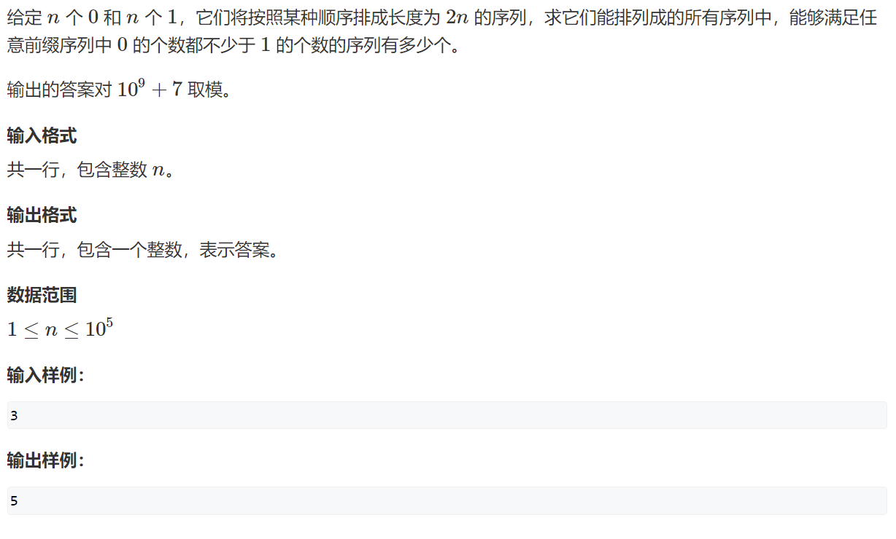

> **核心结论 (卡特兰数)**：`n` 个 0 和 `n` 个 1 组成的、任意前缀中 0 的个数不少于 1 的个数的序列数量为卡特兰数 `Cat(n) = C(2n, n) / (n + 1)`。

```cpp
#include <iostream>
using namespace std;
typedef long long LL;
const int mod = 1e9 + 7;

LL qmi(LL a, int k, int p) { /* 快速幂 */ }

LL C(int a, int b, int p) {
    if (b > a) return 0;
    LL res = 1;
    for (int i = 1, j = a; i <= b; i++, j--) {
        res = res * j % p;
        res = res * qmi(i, p - 2, p) % p;
    }
    return res;
}

int main() {
    int n;
    cin >> n;
    LL res = C(2 * n, n, mod);
    LL inv_n1 = qmi(n + 1, mod - 2, mod);
    cout << res * inv_n1 % mod << endl;
    return 0;
}
```
</details>

---

### 🎭 9. 容斥原理

> **核心思想**：在计数时，要保证每个元素只被计算一次。容斥原理提供了一个公式来计算多个集合并集的大小：`|A∪B| = |A| + |B| - |A∩B|`。对于多个集合，公式为：奇数个集合交集之和，减去偶数个集合交集之和。

<details>
<summary><strong>能被整除的数</strong></summary>

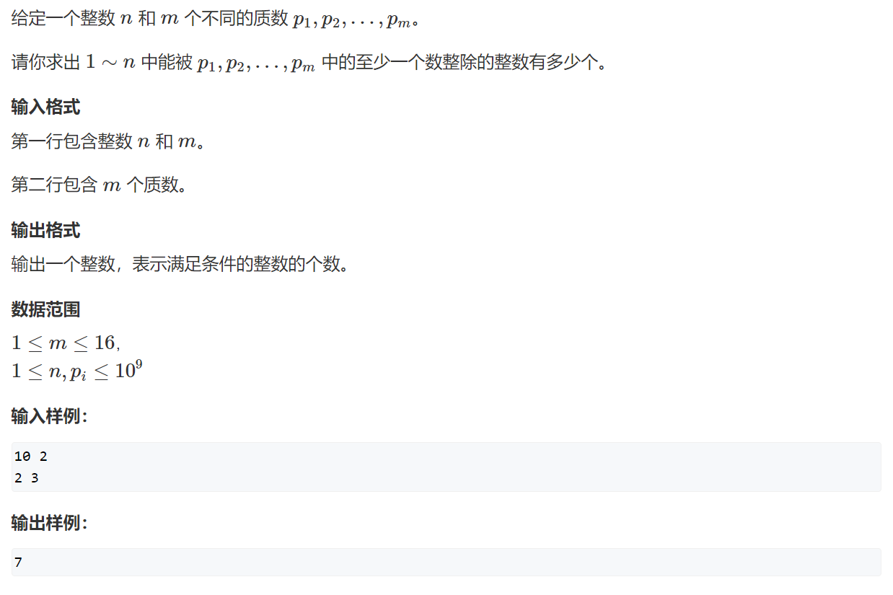

> **解法思路**：求 1~n 中能被 `p1, p2, ..., pm` 中至少一个数整除的数的个数。
> -   能被 `pi` 整除的数有 `floor(n/pi)` 个。
> -   根据容斥原理，答案 = `Σ(n/pi) - Σ(n/lcm(pi,pj)) + ...`
> -   由于 `pi` 都是质数，`lcm(pi, pj) = pi * pj`。
> -   我们用二进制枚举 `1` 到 `2^m - 1` 的所有子集。每个子集代表一个交集。如果子集大小为奇数，则加上 `n / (子集中所有pi的乘积)`；如果为偶数，则减去。

```cpp
#include <iostream>
using namespace std;
typedef long long LL;
const int N = 20;
int p[N];

int main() {
    int n, m;
    cin >> n >> m;
    for (int i = 0; i < m; i++) cin >> p[i];

    int res = 0;
    // 遍历所有非空子集
    for (int i = 1; i < 1 << m; i++) {
        LL t = 1;
        int s = 0; // 子集大小
        for (int j = 0; j < m; j++) {
            if (i >> j & 1) {
                if (t * p[j] > n) {
                    t = -1;
                    break;
                }
                t *= p[j];
                s++;
            }
        }
        if (t != -1) {
            if (s % 2) res += n / t; // 奇加
            else res -= n / t;       // 偶减
        }
    }
    cout << res << endl;
    return 0;
}
```
</details>

---

### 🎲 10. 博弈论

> **核心思想**：博弈论研究决策者的行为和最优策略。在算法竞赛中，主要涉及公平组合游戏（ICG）。
> -   **必胜态 (N-state)**: 存在一种走法，能到达一个必败态。
> -   **必败态 (P-state)**: 无论怎么走，都只能到达必胜态。
> -   **SG 函数**: `SG(x) = mex({SG(y1), SG(y2), ...})`，其中 `y` 是 `x` 的后继状态。`SG(x) > 0` 为必胜态，`SG(x) = 0` 为必败态。
> -   **Nim 游戏**: `n` 堆石子，每次从一堆中取任意个。所有石子数异或和不为 0 则先手必胜，否则必败。

<details>
<summary><strong>Nim 游戏</strong></summary>
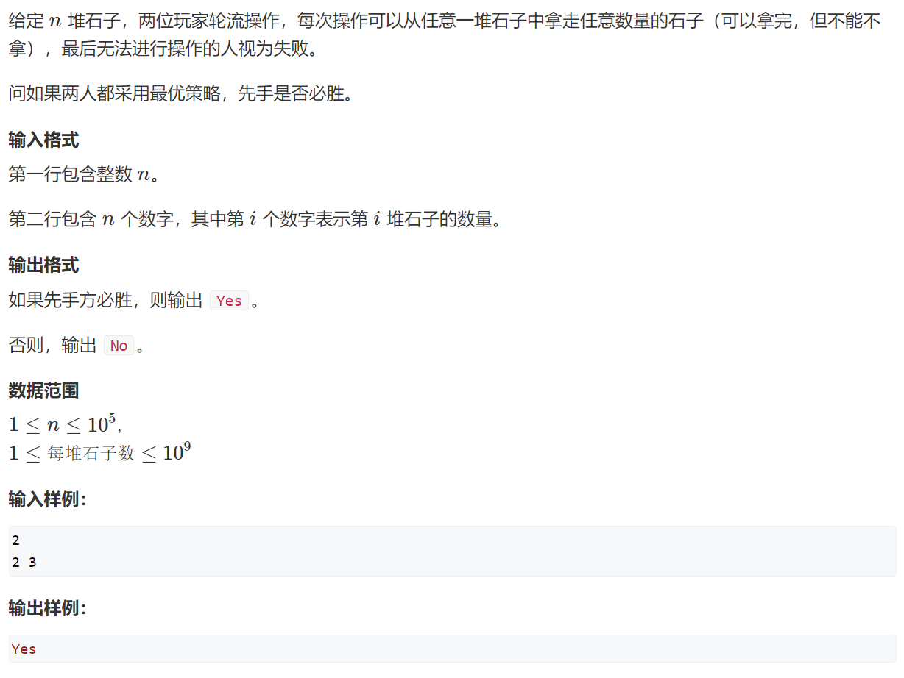

```cpp
#include <iostream>
using namespace std;

int main() {
    int n;
    cin >> n;
    int res = 0;
    while (n--) {
        int x;
        cin >> x;
        res ^= x;
    }
    if (res) puts("Yes"); // 异或和不为0，先手必胜
    else puts("No");
    return 0;
}
```
</details>

<details>
<summary><strong>台阶-Nim 游戏</strong></summary>
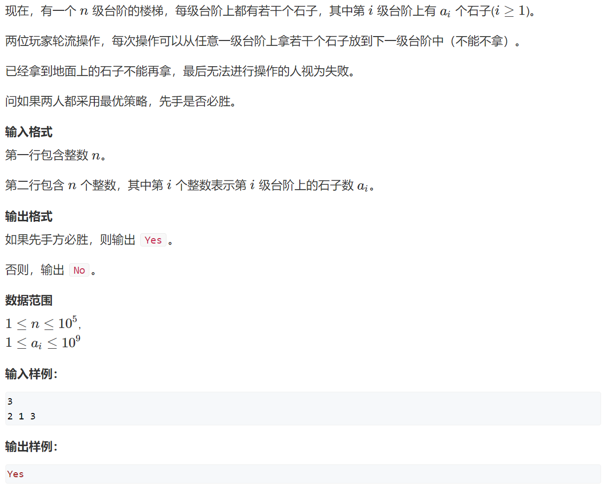

> **核心结论**：只有 **奇数号台阶** 上的石子会影响博弈结果。这相当于对所有奇数号台阶的石子堆做一个 Nim 游戏。偶数台阶上的石子可以被对手通过移到奇数台阶来“模仿”操作，从而抵消影响。

```cpp
#include <iostream>
using namespace std;

int main() {
    int n;
    cin >> n;
    int res = 0;
    for (int i = 1; i <= n; i++) {
        int x;
        cin >> x;
        if (i % 2) res ^= x; // 只对奇数台阶的石子做Nim和
    }
    if (res) puts("Yes");
    else puts("No");
    return 0;
}```
</details>

<details>
<summary><strong>集合-Nim 游戏 & SG 函数</strong></summary>
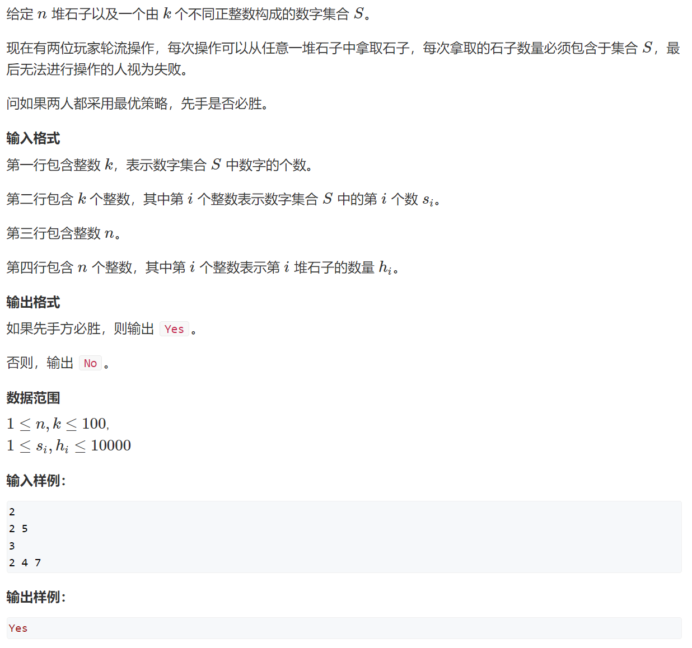

> **解法思路**：这是一个多堆独立游戏的和，最终结果是各堆 SG 值的异或和。对于一堆数量为 `x` 的石子，其 SG 值 `sg(x)` 通过 `mex` 运算得出。`sg(x) = mex({sg(x-s1), sg(x-s2), ...})`，其中 `si` 是可取走的石子数。我们用记忆化搜索来计算 `sg` 值。

```cpp
#include <cstring>
#include <iostream>
#include <unordered_set>
using namespace std;
const int N = 110, M = 10010;

int k, s[N], f[M]; // f[]是记忆化数组

int sg(int x) {
    if (f[x] != -1) return f[x];
    unordered_set<int> S;
    for (int i = 0; i < k; i++) {
        if (x >= s[i]) S.insert(sg(x - s[i]));
    }
    for (int i = 0; ; i++) {
        if (!S.count(i)) return f[x] = i;
    }
}

int main() {
    cin >> k;
    for (int i = 0; i < k; i++) cin >> s[i];
    int n;
    cin >> n;
    memset(f, -1, sizeof f);
    int res = 0;
    while (n--) {
        int x;
        cin >> x;
        res ^= sg(x);
    }
    if (res) puts("Yes");
    else puts("No");
    return 0;
}
```
</details>

<details>
<summary><strong>拆分-Nim 游戏</strong></summary>
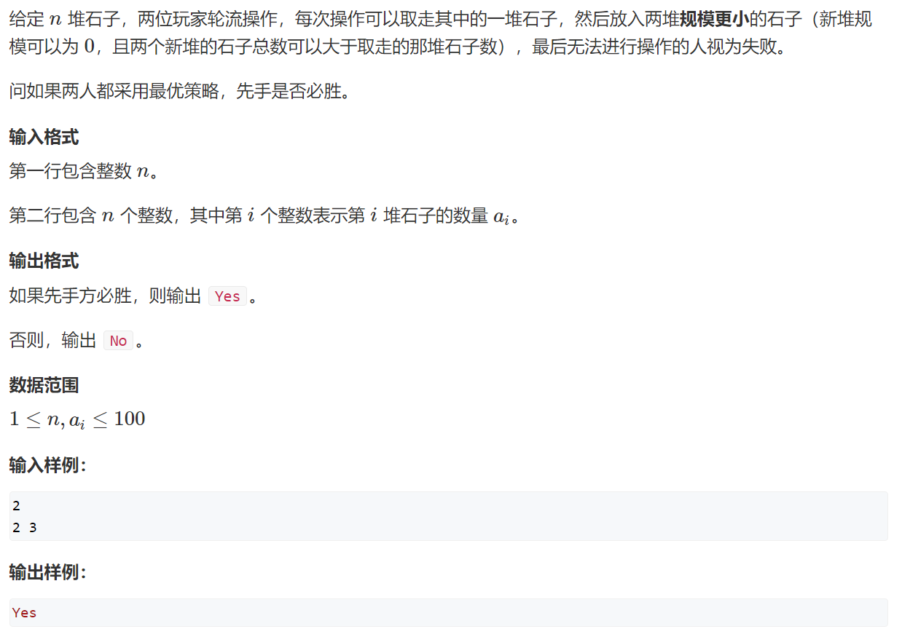

> **解法思路**：将一堆石子拆分成两堆，相当于将一个游戏分裂成两个独立的游戏。根据 **Sprague-Grundy 定理**，分裂后的 SG 值是两堆新石子 SG 值的异或和。因此，`sg(x) = mex({sg(i) ^ sg(j) | i+j = x})`。但题目中是拆成两堆任意数量，所以是 `sg(x) = mex({sg(i) ^ sg(j) | 0 <= i, j < x})`。

```cpp
#include <cstring>
#include <iostream>
#include <unordered_set>
using namespace std;
const int N = 110;

int f[N];

int sg(int x) {
    if (f[x] != -1) return f[x];
    unordered_set<int> S;
    for (int i = 0; i < x; i++) {
        for (int j = 0; j <= i; j++) { // 拆成 i 和 j 两堆，但题目是任意两堆，这里实现的是和为x
            // 题意是将一堆x拆成两堆 i, j (i,j>0, i+j=x), sg值是 sg(i)^sg(j)
            // 而题目给的图是拆成任意两堆，应该是 for i in 0..x-1, for j in 0..x-1
            S.insert(sg(i) ^ sg(j));
        }
    }
    for (int i = 0; ; i++) {
        if (!S.count(i)) return f[x] = i;
    }
}

int main() {
    int n;
    cin >> n;
    memset(f, -1, sizeof f);
    int res = 0;
    while (n--) {
        int x;
        cin >> x;
        res ^= sg(x);
    }
    if (res) puts("Yes");
    else puts("No");
    return 0;
}
```
</details>

---

### 📚 附录：博弈论核心概念

-   **公平组合游戏 (ICG)**:
    1.  两名玩家交替行动。
    2.  任何时刻，合法行动只取决于当前局面，与玩家无关。
    3.  不能行动的玩家判负。

-   **有向图游戏**:
    -   任何 ICG 都可以转化为有向图游戏。局面是节点，行动是边。无法移动者（出度为0的节点）为必败态。

-   **Mex (Minimum Excluded value) 运算**:
    -   `mex(S)`: 不属于非负整数集合 `S` 的最小非负整数。
    -   例: `mex({0, 1, 3, 4}) = 2`。

-   **SG (Sprague-Grundy) 函数**:
    -   `SG(x) = mex({SG(y1), SG(y2), ...})`, 其中 `y` 是 `x` 的所有后继局面。
    -   终点（必败态）的 `SG` 值为 0。
    -   **SG 定理**: 局面的 `SG` 值为 0，则该局面为必败态；`SG` 值大于 0，则为必胜态。

-   **游戏的和 (Sprague-Grundy Theorem)**:
    -   多个独立子游戏的组合，其总局面的 `SG` 值等于所有子游戏 `SG` 值的 **异或和**。
    -   `SG(G) = SG(G1) ^ SG(G2) ^ ... ^ SG(Gm)`
    -   这就是为什么 Nim 游戏（可看作 n 个独立子游戏）的胜负取决于石子数的异或和，因为单堆 `k` 个石子的 `SG` 值就是 `k`。

