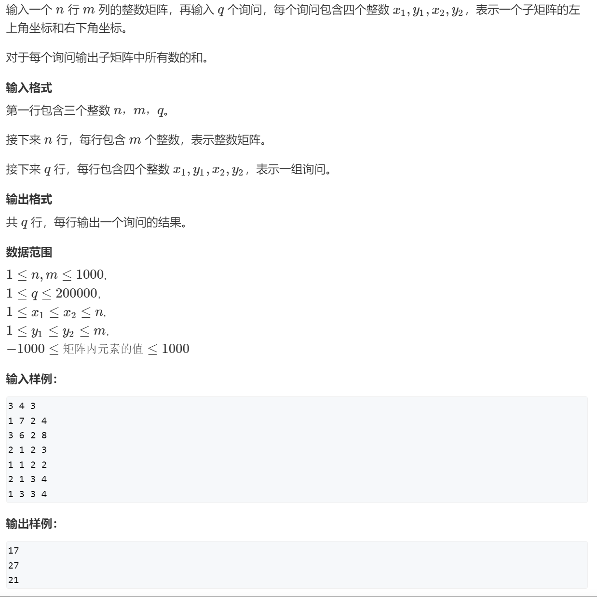
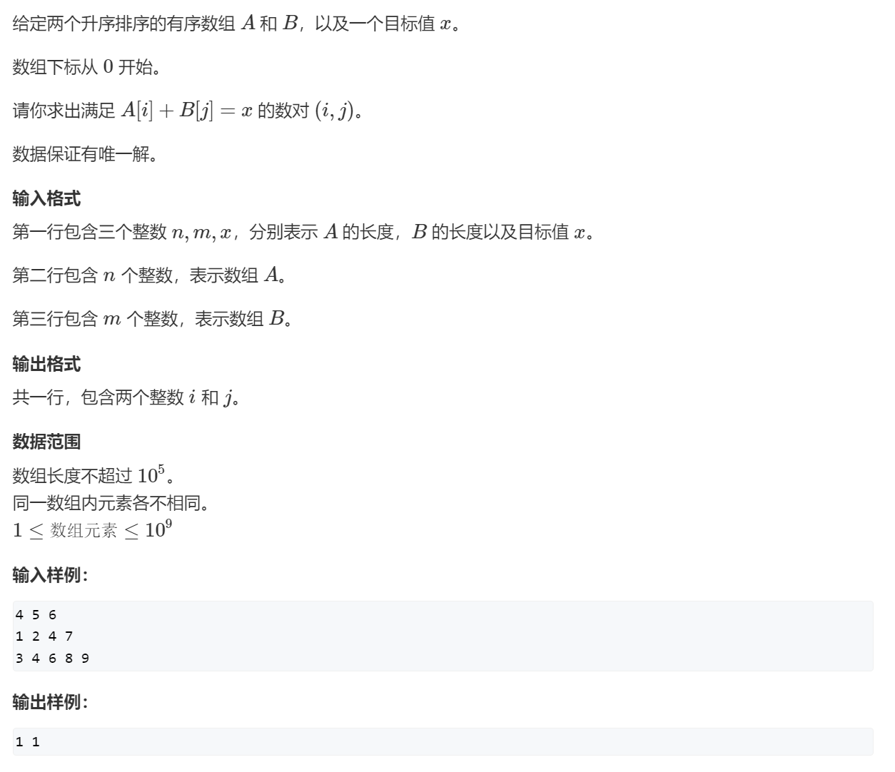
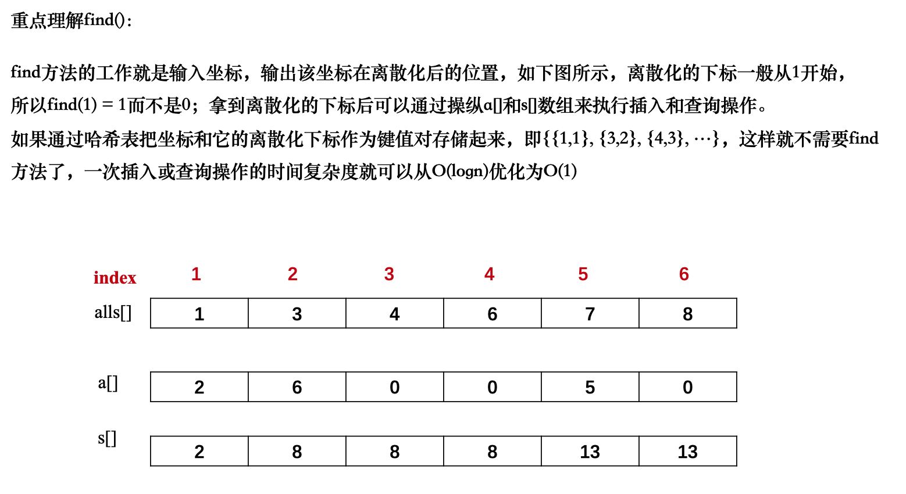
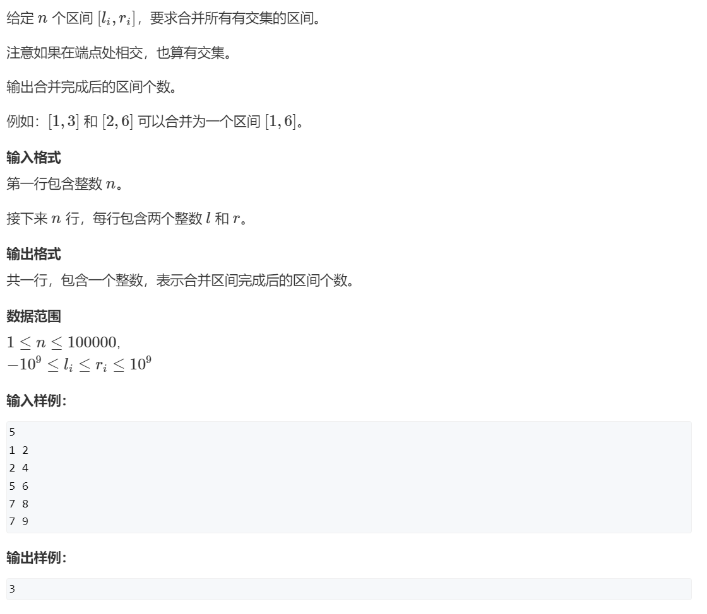

# AcWing——算法基础课

# 第一讲 基础算法

## 1 快速排序

### 1.1 快速排序

> 练习链接：
>
> 1、leetcode: https://leetcode.cn/problems/sort-an-array/description/
>
> 2、洛谷：
>
> （1）题目
>
> https://www.luogu.com.cn/problem/U239911
>
> https://www.luogu.com.cn/problem/P1177
>
> （2）题单
>
> https://www.luogu.com.cn/training/18907

AcWing题目


```c++
#include<iostream>
#include<algorithm>

using namespace std;

const int N = 1e5+7;

int q[N];

//快速排序模板
void quickSort(int q[], int l, int r){
	if(l>=r) return;
	int i = l -1,j = r + 1,x=q[l+r>>1];
	while(i < j){
		do i++; while(x > q[i]);
		do j--; while(x < q[j]);
		if(i<j) swap(q[i],q[j]);//容易忽略if条件
	}
	quickSort(q,l,j);
	quickSort(q,j+1,r);
}
int main(){
	int n;
	cin>>n;
	for(int i = 0;i<n;i++) scanf("%d",&q[i]);
	quickSort(q,0,n-1);
	for(int i = 0;i<n;i++) printf("%d ",q[i]);
	return 0;
}
```

## 2 归并排序

> 洛谷题单：
>
> 1、[快速排序和归并排序 - 题单 - 洛谷 | 计算机科学教育新生态](https://www.luogu.com.cn/training/784214)
>
> 2、[归并排序 - 题单 - 洛谷 | 计算机科学教育新生态](https://www.luogu.com.cn/training/13545)

### 2.1 归并排序

AcWing 题目：


```c++
#include<iostream>

using namespace std;

const int N = 1e5+7;
int q[N],tmp[N];

//归并排序模板
void mergeSort(int q[],int l , int r){
	if(l>=r) return;
	int mid = l+r>>1;
	mergeSort(q,l,mid),mergeSort(q,mid+1,r);
	int k = 0,i=l,j=mid+1;
	while(i<=mid&&j<=r){
		if(q[i]<=q[j]) tmp[k++] = q[i++];
		else tmp[k++] = q[j++];
 	}
 	while(i<=mid) tmp[k++] = q[i++];
	while(j<=r) tmp[k++] = q[j++];
 	for(int i = l, j = 0; i<=r; i++,j++) q[i] = tmp[j];//i是从l开始，容易写成0
}
int main(){
	int n;
	cin>>n;
	for(int i = 0; i< n;i++) scanf("%d",&q[i]);
	mergeSort(q,0,n-1);
	for(int i = 0; i< n;i++) printf("%d ",q[i]);
	return 0;
}


```

### 2.2 逆序对的数量

> [!important]
>
> 洛谷：
>
> 1、https://www.luogu.com.cn/problem/U232725
>
> 2、[P1908 逆序对 - 洛谷](https://www.luogu.com.cn/problem/P1908)

AcWing 题目：


```c++
#include<iostream>

using namespace std;

typedef long long LL;

const int N = 1e5+7;

int q[N],tmp[N];

LL mergeSort(int q[],int l ,int r){
	if(l>=r) return 0;
	int mid = l+r>>1;
	LL x = mergeSort(q,l,mid)+mergeSort(q,mid+1,r);//不要用+=
	int k =0,i=l,j=mid+1;
	while(i<=mid&&j<=r){
		if(q[i]<=q[j]) tmp[k++] = q[i++];
		else{
			tmp[k++] = q[j++];
			x+=mid-i+1;
		}
	}
	while(i<=mid) tmp[k++] = q[i++];
	while(j<=r) tmp[k++] = q[j++];
	for(int i= l,j=0;i<=r;i++,j++) q[i]=tmp[j];//i是从l开始，容易写成0
	return x;
} 
int main(){
	int n;
	cin>>n;
	for(int i =0;i<n;i++) cin>>q[i];
	cout<<mergeSort(q,0,n-1)<<endl;
	return 0;
}
```

## 3 二分

> [!important]
>
> （1）洛谷题单：
>
> 1、https://www.luogu.com.cn/training/111
>
> 2、https://www.luogu.com.cn/training/545539
>
> 3、https://www.luogu.com.cn/training/138949
>
> （2）进阶：二分答案法
>
> https://www.luogu.com.cn/training/10364

### 3.1 数的范围（整数二分）

洛谷题目：

https://www.luogu.com.cn/problem/U383691


Acwing 题目：


```c++
//整数二分法模板
bool check(int x) {/* ... */} // 检查x是否满足某种性质

// 区间[l, r]被划分成[l, mid]和[mid + 1, r]时使用：
int bsearch_1(int l, int r)
{
    while (l < r)
    {
        int mid = l + r >> 1;
        if (check(mid)) r = mid;    // check()判断mid是否满足性质
        else l = mid + 1;
    }
    return l;
}
// 区间[l, r]被划分成[l, mid - 1]和[mid, r]时使用：
int bsearch_2(int l, int r)
{
    while (l < r)
    {
        int mid = l + r + 1 >> 1;
        if (check(mid)) l = mid;
        else r = mid - 1;
    }
    return l;
}
```


```c++
#include <iostream>

using namespace std;

const int N = 100010;

int q[N],n,m;

int main(){
	cin>>n>>m;
	for(int i = 0; i < n ; i++) cin>>q[i];
	while(m--){
		int x;
		cin>>x;
		int l = 0,r= n-1;
		while(l<r){
			int mid=l+r>>1;
			if(x<=q[mid]) r = mid;
			else l = mid+1;
		}
		if(q[l]!=x) cout<<"-1 -1"<<endl;
		else{
			cout<<l<<" ";
			int l = 0 ,r =n-1;
			while(l<r){
				int mid=l+r+1>>1;
				if(x>=q[mid]) l = mid;
				else r = mid-1;
			}
			cout<<l<<endl;		
		}
	}
	return 0;
}
```

### 3.2 数的三次方根（浮点数二分）

洛谷：

https://www.luogu.com.cn/problem/U269029

https://www.luogu.com.cn/problem/T627060


AcWing题目：


```c++
//浮点数二分模板
bool check(double x) {/* ... */} // 检查x是否满足某种性质

double bsearch_3(double l, double r)
{
    const double eps = 1e-6;   // eps 表示精度，取决于题目对精度的要求
    while (r - l > eps)
    {
        double mid = (l + r) / 2;
        if (check(mid)) r = mid;
        else l = mid;
    }
    return l;
}
```


```c++
#include<iostream>

using namespace std;

int main(){
	double n;
	cin>>n;
	double l = -10000,r=10000;
	while(r-l>1e-8){
		double mid = (l+r)/2;
		if(n<= mid *mid *mid) r=mid;
		else l= mid;
	}
	printf("%lf\n",l);
	return 0;
} 
```

## 4 高精度

### 4.1 高精度加法


```c++
#include<iostream>
#include<vector>

using namespace std;

//高精度加法模板
vector<int> add(vector<int> &A,vector<int> &B){
	vector<int> C; 
	int t = 0;
	for(int i = 0;i<A.size()||i<B.size();i++){
		if(i < A.size()) t+=A[i];
		if(i < B.size()) t+=B[i];
		C.push_back(t % 10);
		t/=10;
	}
	if(t) C.push_back(1);
	return C;
}


int main(){
	string a,b;
	cin>>a>>b;
	vector<int> A,B;
	for(int i = a.size()-1;i>=0;i--) A.push_back(a[i]-'0');
	for(int i = b.size()-1;i>=0;i--) B.push_back(b[i]-'0');
	vector<int> C = add(A,B);
	for(int i = C.size()-1;i>=0;i--) cout<<C[i];
	cout<<endl;
	return 0;
	
}
```

### 4.2 高精度减法


```c++
#include<iostream>
#include<vector>

using namespace std;

bool cmp(vector<int> &A,vector<int> &B){
	if(A.size()!=B.size()) return A.size()>B.size();
	for(int i = A.size()-1;i>=0;i--){
		if(A[i]!=B[i]) return A[i]>B[i];
	}
	return true;//A=B的情况 
}

//高精度减法模板
vector<int> sub(vector<int> &A,vector<int> &B){
	vector<int> C; 
	int t = 0;
	for(int i = 0;i<A.size();i++){
		t = A[i]-t;
		if(i<B.size()) t-=B[i];
		C.push_back((t+10)%10);//合二为一 
		if(t<0) t=1;
		else t=0;
	}
	while(C.size()>1 && C.back()==0) C.pop_back();//去掉前导0 
	return C;
}


int main(){
	string a,b;
	cin>>a>>b;
	vector<int> A,B;
	for(int i = a.size()-1;i>=0;i--) A.push_back(a[i]-'0');
	for(int i = b.size()-1;i>=0;i--) B.push_back(b[i]-'0');
	vector<int> C;
	if(cmp(A,B)) C = sub(A,B);
	else {
		C = sub(B,A);
		cout<<"-";
	}
	for(int i = C.size()-1;i>=0;i--) cout<<C[i];
	cout<<endl;
	return 0;
	
}
```

### 4.3 高精度乘法


```c++
#include<iostream>
#include<vector>

using namespace std;

//高精度乘法模板（高精度乘低精度）
vector<int> mul(vector<int> &A,int b){
	vector<int> C; 
	int t = 0;
	for(int i = 0;i<A.size() || t;i++){
		if(i<A.size()) t+=A[i]*b;
		C.push_back(t % 10);
		t/=10;
	}
	while(C.size()>1 && C.back()==0) C.pop_back();//去掉前导0 
	return C;
}


int main(){
	string a;
	int b;
	cin>>a>>b;
	vector<int> A;
	for(int i = a.size()-1;i>=0;i--) A.push_back(a[i]-'0');
	vector<int> C = mul(A,b);
	for(int i = C.size()-1;i>=0;i--) cout<<C[i];
	cout<<endl;
	return 0;
	
}
```

### 4.4 高精度除法


```c++
#include<iostream>
#include<algorithm>
#include<vector>

using namespace std;

//高精度除法模板（高精度除以低精度）
vector<int> div(vector<int> &A,int b,int &t){
	vector<int> C; 
	t = 0;
	for(int i = A.size() - 1; i>=0; i--){
		t = t*10+A[i]; 
		C.push_back(t / b);
		t %= b;
	}
	reverse(C.begin(),C.end());//C是正序的,要先反转
	while(C.size()>1 && C.back()==0) C.pop_back();//去掉前导0 
	return C;
}


int main(){
	string a;
	int b;
	int t;//余数 
	cin>>a>>b;
	vector<int> A;
	for(int i = a.size()-1;i>=0;i--) A.push_back(a[i]-'0');
	vector<int> C = div(A,b,t);
	for(int i = C.size() - 1;i >= 0;i--) cout<<C[i];
	cout<<endl;
	cout<<t<<endl;
	return 0;
	
}
```

## 5 前缀和与差分

### 5.1 前缀和（一维）


```c++
//一维前缀和公式
S[i] = a[1] + a[2] + ... a[i]
a[l] + ... + a[r] = S[r] - S[l - 1]
```


```c++
#include <iostream>

using namespace std;

const int N = 1e5+10;

int a[N],s[N];

int main(){
	int n,m;
	cin>>n>>m;
	for(int i = 1; i <= n ; i++) cin>>a[i];
	for(int i = 1; i <= n ; i++) s[i] = s[i-1]+a[i];//前缀和数组 
	while(m--){
		int l,r;
		cin>>l>>r;
		cout<<s[r] - s[l-1]<<endl;
	}
	return 0;
}
```

### 5.2 子矩阵的和（二维）



```c++
//二维前缀和公式
S[i, j] = 第i行j列格子左上部分所有元素的和
以(x1, y1)为左上角，(x2, y2)为右下角的子矩阵的和为：
S[x2, y2] - S[x1 - 1, y2] - S[x2, y1 - 1] + S[x1 - 1, y1 - 1]
```


```c++
#include <iostream>

using namespace std;

const int N = 1e3+10;

int a[N][N],s[N][N];

int main(){
	int n,m,q;
	cin>>n>>m>>q;
	for(int i = 1 ;i<= n ;i++) 
		for(int j = 1 ;j<= m ;j++) 
			cin>>a[i][j];
	//初始化前缀和数组
	for(int i = 1 ;i<= n ;i++) 
		for(int j = 1 ;j<= m ;j++) 
			s[i][j] = s[i][j-1]+s[i-1][j]-s[i-1][j-1]+a[i][j];//关键公式 	
	while(q--){
		int x1,y1,x2,y2;
		cin>>x1>>y1>>x2>>y2;
		cout<<s[x2][y2]-s[x2][y1-1]-s[x1-1][y2]+s[x1-1][y1-1]<<endl;//关键公式 
	} 
	return 0;
	
}
```

### 5.3 差分（前缀和的逆运算）


```c++
//一维差分
给区间[l, r]中的每个数加上c：B[l] += c, B[r + 1] -= c
```


```c++
#include<iostream>

using namespace std;

const int N = 1e5+10;

int a[N],b[N];

void insert(int l ,int r, int c){
	b[l]+=c;
	b[r+1]-=c;
}

int main(){
	int n,m;
	cin>>n>>m;
	for(int i = 1 ;i <=n;i++) cin>>a[i];//a是前缀和数组 
	for(int i = 1 ;i <=n;i++) insert(i,i,a[i]);//初始化b数组
	//对b数组进行操作 
	while(m--){
		int l,r,c;
		cin>>l>>r>>c;
		insert(l,r,c);
	}
	for(int i = 1 ;i <=n;i++) a[i] = a[i-1] +b[i];//对b数组操作完后重新给a赋一遍值
	for(int i = 1 ;i <=n;i++) cout<<a[i]<<" ";
	cout<<endl;
	return 0;
}
```

### 5.4 差分矩阵


```c++
//二维差分
给以(x1, y1)为左上角，(x2, y2)为右下角的子矩阵中的所有元素加上c：
S[x1, y1] += c, S[x2 + 1, y1] -= c, S[x1, y2 + 1] -= c, S[x2 + 1, y2 + 1] += c
```


```c++
#include<iostream>

using namespace std;

const int N = 1e3+10;

int n,m,q;
int a[N][N],b[N][N];

void insert(int x1,int y1, int x2, int y2,int c){
	b[x1][y1]+=c;
	b[x1][y2+1]-=c;
	b[x2+1][y1]-=c;
	b[x2+1][y2+1]+=c;
} 

int main(){
	cin>>n>>m>>q;
	for(int i = 1 ; i <= n;i++)
		for(int j = 1 ; j <= m;j++)
			cin>>a[i][j];
	//由前缀和数组a初始化出差分数组b
	for(int i = 1 ; i <= n;i++)
		for(int j = 1 ; j <= m;j++)
			insert(i,j,i,j,a[i][j]);
	while(q--){
		int x1,y1,x2,y2,c;
		cin>>x1>>y1>>x2>>y2>>c;
		insert(x1,y1,x2,y2,c);
	}
	//b数组加好后重新给前缀和数组a赋一遍值 
	for(int i = 1 ; i <= n;i++)
		for(int j = 1 ; j <= m;j++)
			a[i][j] = a[i-1][j]+a[i][j-1]-a[i-1][j-1]+b[i][j];
    //输出结果
	for(int i = 1 ; i <= n;i++){
		for(int j = 1 ; j <= m;j++)
			cout<<a[i][j]<<" ";
		cout<<endl;
	}		 
	return 0;
}
```

## 6 双指针算法

### 6.1 最长连续不重复子序列


```c++
//双指针算法模板
for (int i = 0, j = 0; i < n; i ++ )
{
    while (j < i && check(i, j)) j ++ ;

    // 具体问题的逻辑
}
常见问题分类：
    (1) 对于一个序列，用两个指针维护一段区间
    (2) 对于两个序列，维护某种次序，比如归并排序中合并两个有序序列的操作
```


```c++
#include<iostream>

using namespace std;

const int N = 1e5+10;

int s[N],a[N];

int main(){
	int n;
	cin>>n;
	for(int i = 0 ;i < n ; i ++) cin>>a[i];
	int res = 1;//最长连续不重复子序列的长度 
	for(int i=0,j=0;i<n;i++){
		s[a[i]]++;
		while(s[a[i]]>1){
			s[a[j]]--;
			j++;			
		}
		res = max(res,i-j+1);
	}
	cout<<res<<endl;
}
```

### 6.2 数组元素的目标和



```c++
#include<iostream>

using namespace std;

const int N = 1e5+10;

int a[N],b[N];

int main(){
	int n,m,x;
	cin>>n>>m>>x;
	for(int i =0 ;i<n;i++) cin>>a[i];
	for(int i =0 ;i<m;i++) cin>>b[i];
    //当a[i]+b[j]>x时，j往左走，b[j]变小，和也变小；当a[i]+b[j]<x时，i往右走，a[i]变大，和也变大；总结:i就是只能往右走的，j就是只能往左走的
	for(int i = 0 ,j = m - 1; i<n;i++){
		while(j>0&&a[i]+b[j]>x) j--;
		if(a[i]+b[j] == x){
			cout<<i<<" "<<j<<endl;
			break;
		}
	}
	return 0;
}
```

### 6.3 判断子序列


```c++
#include<iostream>

using namespace std;

const int N = 1e5+10;

int a[N],b[N];

int main(){
	int n,m;
	cin>>n>>m;
	for(int i =0 ; i<n;i++) cin>>a[i];
	for(int i =0 ; i<m;i++) cin>>b[i];
	int i =0,j=0;
	while(i<n&&j<m){
		if(a[i] == b[j]) i++;
		j++;
	}//以上while循环其实也可以写成双指针算法模板里的for循环格式，只是i和j的作用域的问题
	if(i == n) cout<<"Yes"<<endl;
	else cout<<"No"<<endl;
	return 0;
}
```

## 7 位运算

### 7.1 二进制中1的个数


```c++
//位运算模板
//1.求n的二进制中的第k位数字（从最低位开始数，最低位是第0位，先让x的二进制右移k位，再和1的二进制数进行与运算;比如n=101010000,k=4,就是要取101010000的第四位数字也就是1，先右移4位成10101，再和00001与运算得1，任何数与1进行与运算都得最低位）
int result = n>>k&1;
//2.返回n的二进制的从最低位开始数的第一位1及低位的所有数字（比如101010000就是返回10000），如果 x 的二进制表示是正数，那么 -x 的二进制表示就是 x 的补码,即x与x得补码进行与运算，比如101010000，即101010000&010110000，得10000
int lowbit(int x){
	return x&-x;
}
```

```c++
#include<iostream>

using namespace std;

const int N = 1e5+10;

int a[N];

int lowbit(int x){
	return x&-x;
}

int main(){
	int n;
	cin>>n;
	for(int i = 0 ; i< n ; i++) cin>>a[i];
	for(int i = 0 ; i< n ; i++){
		int t = 0;
		while(a[i]){
			a[i]-=lowbit(a[i]);
			t++;
		}
		cout<<t<<" "; 
	}
	cout<<endl;
}
```

## 8 离散化

### 8.1 区间和


```c++
//离散化模板
vector<int> alls;//存储所有待离散化的值
sort(alls.begin(),alls.end();//将所有值排序
alls.erase(unique(alls.begin(), alls.end()), alls.end());//去掉重复元素
//二分求出x对应的离散化的值
int find(int x)//找到第一个大于等于x的位置
{
    int l = 0, r = alls.size()-1;
    while(l < r)
    {
        int mid = l + r >> 1;
        if (alls[mid] >= x) r = mid;
        else l =  mid + 1;
    }
    return r+1;//映射到1,2，.n,因为前缀和一般下标是从1开始的
}                
```





```c++
#include<iostream>
#include<vector>
#include<algorithm>

using namespace std;

const int N = 3e5+10;

typedef pair<int,int> PII;

int a[N],s[N];//a[N]是存储插入坐标的值的数组，并且插入坐标和a的索引相对应，s是a的前缀和数组，上图中的a和s数组是从下标1开始画的（图有点错误）
vector<int> alls;//alls是存储所有坐标的数组，上图中的alls数组是从下标0开始画的，所以find那里要return的r要加1，才能正确映射到a和s数组（图有点错误）
vector<PII> add,query;//add是存储插入坐标和插入值的容器，query是存储查询坐标的容器

//返回alls数组中x值的位置 
int find(int x){
	int l = 0, r = alls.size() -1;
	while(l<r){
		int mid = l+r>>1;
		if( x <= alls[mid]) r = mid;
		else l = mid+1;
	}
	return r+1;
}

int main(){
	int n,m;
	cin>>n>>m;
	while(n--){
		int x,c;
		cin>>x>>c;
		add.push_back({x,c});
		alls.push_back(x);
	}
	
	while(m--){
		int l,r;
		cin>>l>>r;
		query.push_back({l,r});
		alls.push_back(l);
		alls.push_back(r);
	}
	
	//去重
	sort(alls.begin(),alls.end());
	alls.erase(unique(alls.begin(),alls.end()),alls.end()); 
	
	//根据alls中存储的坐标将要加的值映射到a数组中 
	for(int i = 0; i < add.size();i++){
		int x = find(add[i].first);
		a[x]+=add[i].second;
	}
	
	for(int i = 1;i <= alls.size(); i++) s[i]= s[i-1] + a[i];
	
	//计算区间和 
	for(int i = 0; i < query.size();i++){
		int l = find(query[i].first);
		int r = find(query[i].second);
		cout<<s[r]-s[l-1]<<endl;
	}
	
	return 0;
	
} 
 

```

## 9 区间合并

### 9.1 区间合并



```c++
//区间合并模板
//将所有存在交集的区间合并
void merge(vector<PII> &segs){
	vector<PII> res;
	sort(segs.begin(),segs.end());
	int st = -2e9, ed = -2e9;
	for(int i = 0 ; i< segs.size(); i++){
		if(segs[i].first > ed){
			st = segs[i].first,ed = segs[i].second;
			res.push_back({st,ed}); 
		}
		else ed = max(ed,segs[i].second); 
	}
	segs = res;
}
```


```c++
#include<iostream>
#include<algorithm>
#include<vector>

using namespace std;

const int N = 1e5+10;

typedef pair<int,int> PII;

void merge(vector<PII> &segs){
	vector<PII> res;
	sort(segs.begin(),segs.end());
	int st = -2e9, ed = -2e9;
	for(int i = 0 ; i< segs.size(); i++){
		if(segs[i].first > ed){
			st = segs[i].first,ed = segs[i].second;
			res.push_back({st,ed}); 
		}
		else ed = max(ed,segs[i].second); 
	}
	segs = res;
}

int main(){
	vector<PII> segs;
	int n;
	cin>>n;
	while(n--){
		int l,r;
		cin>>l>>r;
		segs.push_back({l,r});
	}
	merge(segs);
	cout<<segs.size()<<endl;
	return 0;
}

```
