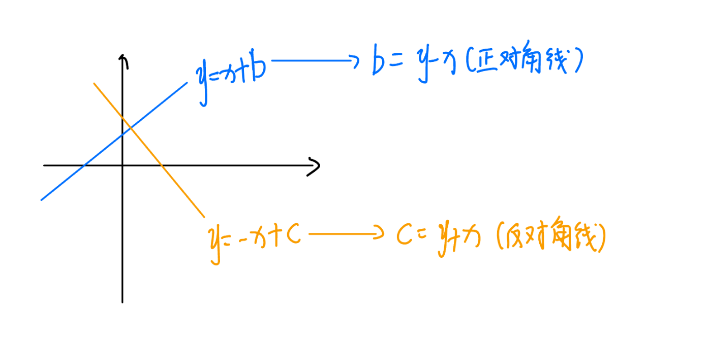
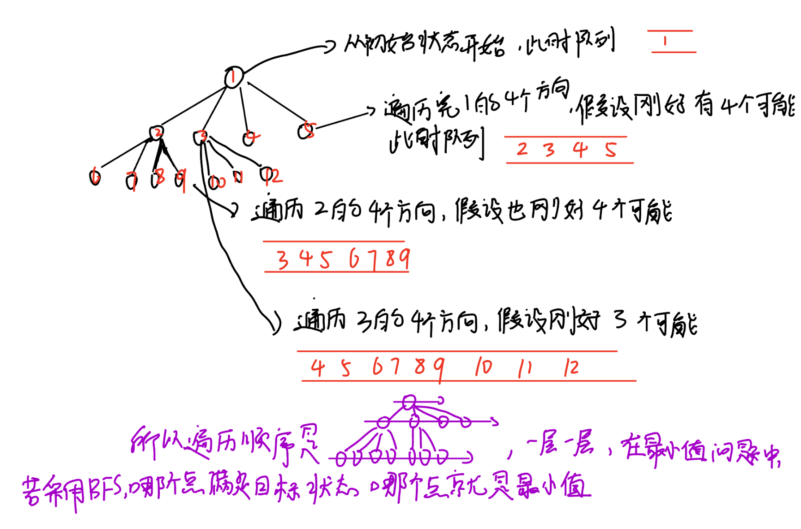
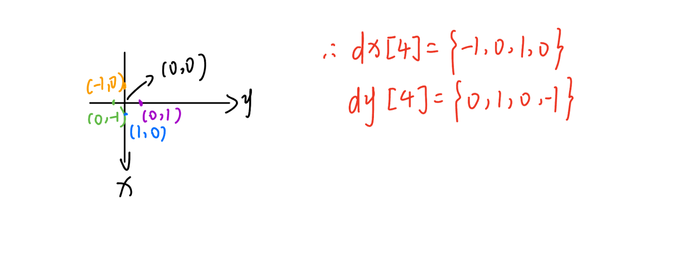
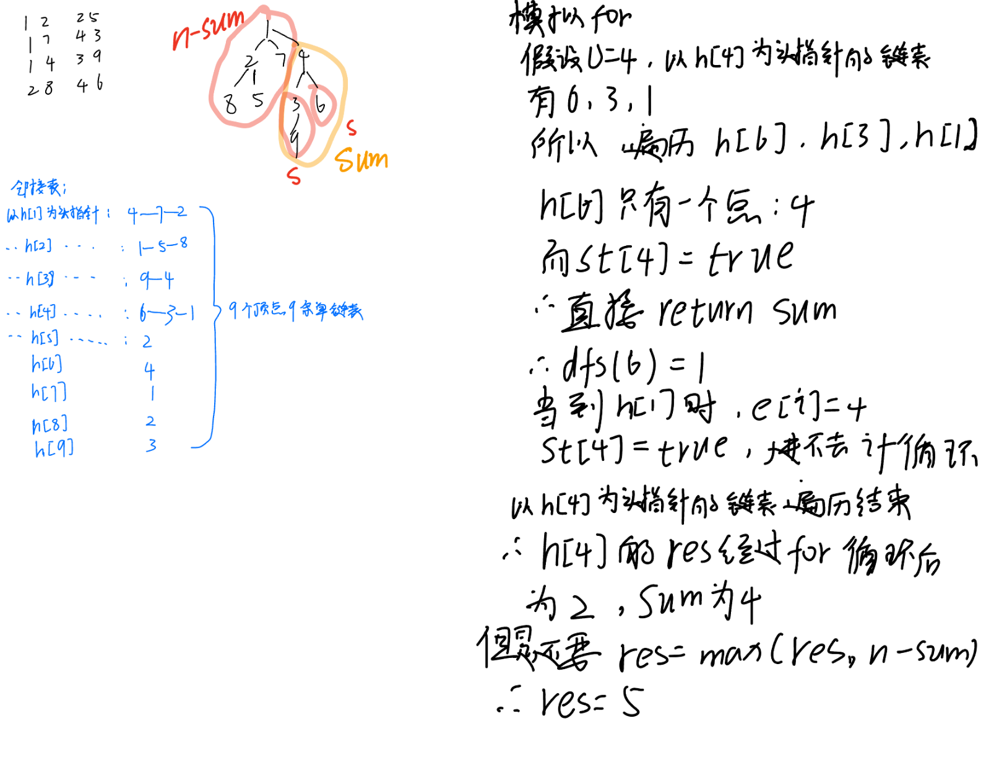
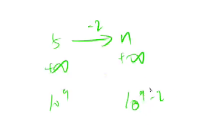
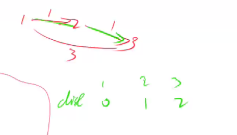
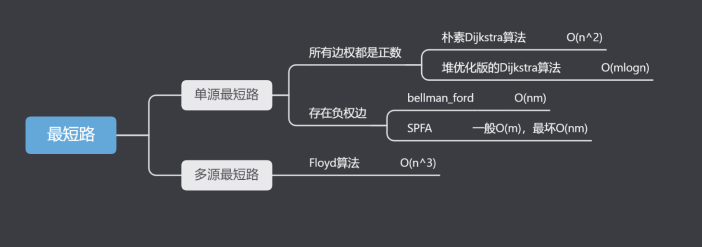
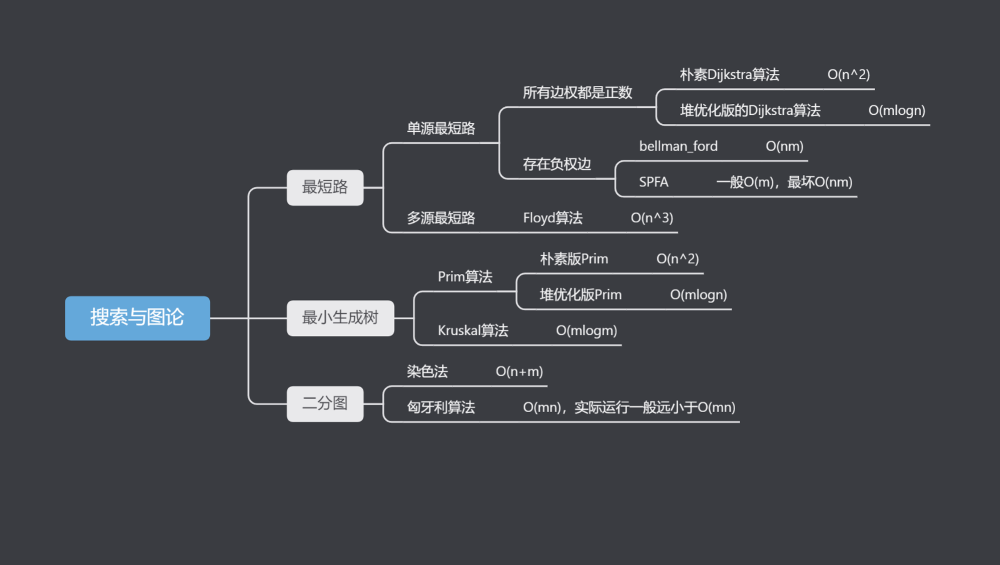

# 🎓 AcWing——算法基础课


> 第三讲 · 搜索与图论 · DFS / BFS / 最短路 / 最小生成树

---

## 第三讲 搜索与图论

### DFS

#### 1.排列数字


```c++
#include<iostream>
using namespace std;
const int N = 10;
int path[N];//保存序列
bool st[N];//数字是否被用过，标记数组 
int n; 
void dfs(int u)
{
    if(u > n)//数字填完了，输出
    {
        for(int i = 1; i <= n; i++)//输出方案
            cout << path[i] << " ";
        cout << endl;
    }
	else{
		for(int i = 1; i <= n; i++)//空位上可以选择的数字为:1 ~ n
    	{
	        if(!st[i])//如果数字 i 没有被用过
	        {
	            path[u] = i;//放入空位
	            st[i] = true;//数字被用，修改状态
	            dfs(u + 1);//填下一个位
                //回溯：原路返回，把原来满足条件的位置的状态修改回来，并把值置为默认值
	            st[i] = false;
                path[u] = 0;//这里可要可不要，因为后面又满足条件赋值时会覆盖
	        }
    	}
	}
}

int main()
{
    cin >> n;
    dfs(1);
}

```

#### 2.n-皇后问题




```c++
#include <iostream>
using namespace std;
const int N = 20; 

// bool数组用来判断搜索的下一个位置是否可行
// col列，dg对角线，udg反对角线
// g[N][N]用来存路径

int n;
char g[N][N];
bool col[N], dg[N], udg[N];

//整体按行搜索 
void dfs(int y) {
    // y从0开始，y == n 表示已经搜了n行，故输出这个方案 
    if (y == n) {
        for (int i = 0; i < n; i ++ ) puts(g[i]);//按行输出   
        puts("");  
        return;
    }
	//局部按列搜索
    for (int x = 0; x < n; x ++ )
        // 剪枝(对于不满足要求的点，不再继续往下搜索)  
        // dg[y - x + n]，+n是为了保证下标非负
        if (!col[x] && !dg[y - x + n] && !udg[y + x]) {
            g[x][y] = 'Q';
            col[x] = dg[y - x + n] = udg[y + x] = true;
            dfs(y + 1);//继续下一行
			//回溯：产生了一种方案后原路返回，把原来满足条件的位置的状态修改回来，并把值置为默认值
            col[x] = dg[y - x + n] = udg[y + x] = false;
            g[x][y] = '.';

        }
}

int main() {
    cin >> n;
    //初始化 
    for (int i = 0; i < n; i ++ )
        for (int j = 0; j < n; j ++ )
            g[i][j] = '.';

    dfs(0);
    return 0;
}   
```

### BFS



#### 1.走迷宫




```c++
#include <iostream>
#include <cstring>
#include <queue>

using namespace std;

const int N = 110;

typedef pair<int, int> PII;

int n, m;
int g[N][N], d[N][N];//g是迷宫数组，d是离原点的距离数组 

int bfs()
{
    //定义并初始化
    queue< pair<int, int> > q;
    
    int dx[4] = {-1, 0, 1, 0}, dy[4] = {0, 1, 0, -1};//顺时针，上右下左

    q.push({0, 0});//先将原点入队 
	//遍历队列
    while (q.size())
    {	 
        PII t = q.front();//取队头元素

        q.pop();//取完就要出队
	
        for (int i = 0; i < 4; i++)//遍历队头四个方向 
        {
            int x = t.first + dx[i], y = t.second + dy[i];
			//g[x][y] == 0表示能走的点，d[x][y] == -1表示如果当前状态是第一次遍历才记录距离，入队
            //d[x][y] == -1很关键，在此走迷宫问题中，最先到d[n - 1][m -1]的肯定是最短距离，但是此时队列中可能还会剩几个元素，所以while循环还会继续，还会继续遍历剩下的点，但是不用担心d[n - 1][m -1]被覆盖，因为d[n - 1][m -1]==-1时不会进入if，所以while循环结束后d[n - 1][m -1]即是最小值，或者直接加一个if(x == n - 1 && y == m - 1) return d[n - 1][m -1];更好理解
            if (x >= 0 && x < n && y >= 0 && y < m && g[x][y] == 0 && d[x][y] == -1)
            {
                d[x][y] = d[t.first][t.second] + 1;//离队头元素距离为1，所以+1
                if(x == n - 1 && y == m - 1) return d[n - 1][m -1];//达到最终状态退出
                q.push({x, y});//将新坐标入队
            }
        }
    }

    return d[n - 1][m -1];//最右下角的点到原点的距离即是最少移动次数 
}

int main()
{
    cin >> n >> m;
    //初始化
    for (int i = 0; i < n; i++)
        for (int j = 0; j < m; j++)
            cin >> g[i][j];
    memset(d, -1, sizeof(d));//将d数组各元素初始值置为-1
    
    d[0][0] = 0;//{0，0}离原点的距离为0，也表示已走过，即从原点开始

    cout << bfs() << endl;

    return 0;
}

```

#### 2.八数码


```c++
#include <iostream>
#include <algorithm>
#include <queue>
#include <unordered_map>

using namespace std;

int bfs(string start)
{
    //定义并初始化
    string end = "12345678x";//定义目标状态
    queue<string> q;
    unordered_map<string, int> d;
    q.push(start);
    d[start] = 0;
    int dx[4] = {-1, 0, 1, 0}, dy[4] = {0, 1, 0, -1};
	//遍历队列
    while(q.size())
    {
        string t = q.front();//取队头
        q.pop();
        //记录当前状态的距离，如果是最终状态则返回距离
        int dist = d[t];
        if(t == end) return d[t];//达到最终状态退出
        int k = t.find('x');//查询x在字符串中的下标 
        int x = k / 3, y = k % 3;//将字符串下标转换为坐标系坐标

        for(int i = 0; i < 4; i++)//遍历队头的四个方向 
        {
            int a = x + dx[i], b = y + dy[i];//移动一次后的坐标 
        
            if(a >= 0 && a < 3 && b >= 0 && b < 3)
            {
                swap(t[k], t[a * 3 + b]);//转移x，即交换x与对应字符，a * 3 + b是坐标转换为下标的公式 
                //如果当前状态是第一次遍历，才记录距离，入队
                if(!d.count(t))
                {
                    d[t] = dist + 1; 
                    q.push(t);
                }
                //四个方向可能有多个方向满足条件，所以要还原状态，所以同一个初始状态遍历完四个方向后因为q.push(t)，q里面可能会存有多个元素 
                swap(t[k], t[a * 3 + b]);
            }
        }
    }
    //无法转换到目标状态，返回-1
    return -1;
}

int main()
{
    char c;
    string start;
    //输入起始状态
    for(int i = 0; i < 9; i++)
    {
        cin >> c;
        start += c;
    }

    cout << bfs(start) << endl;

    return 0;
}

```

### 树与图的深度优先遍历

树与图的遍历，时间复杂度O(n+m)，n表示点数，m表示边数

```c++
int dfs(int u)
{
    st[u] = true; // st[u] 表示点u已经被遍历过

    for (int i = h[u]; i != -1; i = ne[i])
    {
        int j = e[i];
        if (!st[j]) dfs(j);
    }
}
```


#### 树的重心




```c++

//邻接表是一种常用的图存储结构，其原理基于将图的每个顶点表示为一个链表，链表中存储与该顶点相邻的其他顶点。
//树也是特殊的图

#include <iostream>
#include <algorithm>
#include <cstring>

using namespace std;

const int N = 1e5 + 10;
const int M = 2 * N;//以有向图的格式存储无向图，所以每个节点至多对应2n-2条边

int h[N];
int e[M];
int ne[M];
int idx;
int n;
int ans = N;//初始化为n是因为要和res比较，挑出最小的连通块中点数的最大值 

bool st[N];

//h[a]即a为顶点的链表的头指针 
//add是在以a为顶点的链表插入元素b 
void add(int a, int b) {
    e[idx] = b, ne[idx] = h[a], h[a] = idx++;
}

//参数u是题中所说的结点的编号同时也是结点的值，dfs函数是找到u的所有子树的点数加上自己的一个，即sum
int dfs(int u) {
    int res = 0;
    st[u] = true;
    int sum = 1;//u自己算一个 
	//遍历以h[u]为头指针的链表，手动模拟过程如上图
    for (int i = h[u]; i != -1; i = ne[i]) {
        int j = e[i];
        //如果没被访问过 
        if (!st[j]) {
            int s = dfs(j);
            res = max(res, s);
            sum += s; 
        }
    }
	//sum此时是所有子树的点数加上自己的一个 
    res = max(res, n - sum);
    ans = min(res, ans);
    return sum;
}

int main() {

    memset(h, -1, sizeof h);//各个链表的头指针 
    cin >> n;//n个节点 
	//n-1条边 
    for (int i = 0; i < n - 1; i++) {
        int a, b;
        cin >> a >> b;
        add(a, b), add(b, a);
    }

    dfs(1);//此题当作双向图来存储，所以各结点之间都必有通路，所以从1~n任何一个结点开始都行 

    cout << ans << endl;

    return 0;
}

```

### 树与图的广度优先遍历

```c++
queue<int> q;
st[1] = true; // 表示1号点已经被遍历过
q.push(1);

while (q.size())
{
    int t = q.front();
    q.pop();

    for (int i = h[t]; i != -1; i = ne[i])
    {
        int j = e[i];
        if (!st[j])
        {
            st[j] = true; // 表示点j已经被遍历过
            q.push(j);
        }
    }
}
```


#### 图中点的层次

```c++
#include <iostream>
#include <algorithm>
#include <cstring>
#include <queue>

using namespace std;

const int N = 100010;

int n,m;
int h[N],e[N],ne[N],d[N];
int idx;

void add(int a,int b){
	e[idx] = b,ne[idx] = h[a],h[a] = idx++;
}

int bfs(){
	queue<int> q;
	memset(d, -1 , sizeof d);//注意初始化的位置
	q.push(1);
	d[1] = 0;
	while(q.size()){
		int t = q.front();
		q.pop();
		for(int i = h[t]; i != -1; i = ne[i]){
			int j = e[i];
			if(d[j] == -1){
				d[j] = d[t] + 1;
				if(j == n) return d[j];
				q.push(j);
			}
		}
	}
	return d[n];
}

int main(){
	cin>>n>>m;
	int a,b;
	memset(h, -1 ,sizeof h);//要在add(a,b)前初始化
	while(m--){
		cin>>a>>b;
		add(a,b);
	}
	cout<<bfs()<<endl;
	return 0;
}
```

### 拓扑排序

拓扑排序，时间复杂度O(n+m)，n表示点数，m表示边数

```c++
bool topsort()
{
    int hh = 0, tt = -1;

    // d[i] 存储点i的入度
    for (int i = 1; i <= n; i ++ )
        if (!d[i])
            q[ ++ tt] = i;

    while (hh <= tt)
    {
        int t = q[hh ++ ];

        for (int i = h[t]; i != -1; i = ne[i])
        {
            int j = e[i];
            if (-- d[j] == 0)
                q[ ++ tt] = j;
        }
    }

    // 如果所有点都入队了，说明存在拓扑序列；否则不存在拓扑序列。
    return tt == n - 1;
}
```


#### 有向图的拓扑序列


```c++
#include <iostream>
#include <cstring>
#include <algorithm>
using namespace std;

const int N = 100010;
int h[N], e[N], ne[N], idx;//邻接表 
int q[N], hh = 0, tt = -1;//数组模拟队列 
int n, m; 
int d[N];//存储点的入度数 

void add(int a, int b)
{
    e[idx] = b, ne[idx] = h[a], h[a] = idx++;
}

void topsort()
{
	//将所有入度为0的点入队 
    for (int i = 1; i <= n; i++)
    {
        if (d[i] == 0) q[++tt] = i;
    }
    
    while (tt >= hh)
    {
        int t = q[hh++];
        
        for (int i = h[t]; i != -1; i = ne[i])
        {
            int j = e[i];
            //如果此点入度-1后为0则入队 
            if (--d[j] == 0) q[++tt] = j;
        }
    }
    
    if (tt == n - 1)
    {
        for (int i = 0; i < n; i++) cout << q[i] << " " ;    
    }
    else cout << -1 << endl;
    
}

int main()
{
    cin >> n >> m;                  
    memset(h, -1, sizeof h);        
    while (m--)                     
    {
        int a, b;
        cin >> a >> b;
        add(a, b);    
        d[b]++;//add(a, b)说明有到b的边，b的入度+1                                     
    }
    topsort();                       
    return 0;
}

```

### Dijkstra

#### 1.Dijkstra求最短路 I


```c++
//朴素Dijkstra算法，时间复杂度O(n*n+m)，n表示点数，m表示边数

int g[N][N];  // 存储每条边
int dist[N];  // 存储1号点到每个点的最短距离
bool st[N];   // 存储每个点的最短路是否已经确定

// 求1号点到n号点的最短路，如果不存在则返回-1
int dijkstra()
{
    memset(dist, 0x3f, sizeof dist);
    dist[1] = 0;

    for (int i = 0; i < n - 1; i ++ )
    {
        int t = -1;     // 在还未确定最短路的点中，寻找距离最小的点
        for (int j = 1; j <= n; j ++ )
            if (!st[j] && (t == -1 || dist[t] > dist[j]))
                t = j;

        // 用t更新其他点的距离
        for (int j = 1; j <= n; j ++ )
            dist[j] = min(dist[j], dist[t] + g[t][j]);

        st[t] = true;
    }

    if (dist[n] == 0x3f3f3f3f) return -1;
    return dist[n];
}
```


```c++
#include<iostream>
#include<algorithm>
#include<cstring>
using namespace std;

const int N = 510;

int g[N][N];//稠密图用邻接矩阵

/*
eg.
1≤n≤500,
1≤m≤10^5,m近似于n^2,为稠密图，用邻接矩阵

1≤n,m≤1.5×10^5,m近似于n，为稀疏图,用邻接表*/ 

int d[N];//各个点到1号点的距离 
bool st[N];//用于标记该点是否已经确定最小距离 

int n, m;

int Dijkstra()
{
    memset(d, 0x3f3f3f3f, sizeof d);//到原点的距离数组赋值无限大，赋值时赋0x3f和0x3f3f3f3f是一样的   
    d[1] = 0;  
	
	//n个点遍历n次 
    for(int i=0; i<n; i++) {
        int t = -1;
		  
		/*在最外面for循环的第一遍时，因为除了d[1] = 0外，各个点到1点的距离d[i]都还是无穷大
		所以这下面这个小for循环只执行一次，使t=1*/
		//找到没有确定最短路径的节点中距离原点最近的点t，用于之后那个小for循环的d[t] + g[t][j]，用于更新各个点的d[i]
        for(int j=1; j<=n; j++)
            if(!st[j] && (t == -1 || d[t] > d[j]))
                t = j;

        st[t] = true;//修改状态 
		   
		/*在最外面for循环的第一遍时下面这个小for循环是把所有点的d[i]更新为d[i]或者g[1][i]，也就是1到各点的边长 
		如果g[1][i]不存在则说明1号点没有到该点的边，d[i]还是无穷大*/
		//此for循环用于判断 当前点到1点的距离加上当前点到每个点的距离 和 每个点到1点的距离 哪个更小使各个点的d[i]取更小值 
        for(int j=1; j<=n; j++)
            d[j] = min(d[j], d[t] + g[t][j]);
    } 

    if(d[n] == 0x3f3f3f3f) return -1;//没路  

    return d[n];//只要有值就是最短距离
}

int main()
{
    cin >> n >> m;

    memset(g, 0x3f, sizeof g);//邻接矩阵赋无穷大 ，赋值时赋0x3f和0x3f3f3f3f是一样的   

    while(m--) {
        int x, y, z;
        cin >> x >> y >> z;
        g[x][y] = min(g[x][y], z);//防止重边，保留更小的距离    
    }

    cout << Dijkstra() << endl;
    return 0;
}

```

#### 2.Dijkstra求最短路 II


```c++
//堆优化版Dijkstra算法，时间复杂度O(mlogn)，n表示点数，m表示边数

typedef pair<int, int> PII;

int n;      // 点的数量
int h[N], w[N], e[N], ne[N], idx;       // 邻接表存储所有边
int dist[N];        // 存储所有点到1号点的距离
bool st[N];     // 存储每个点的最短距离是否已确定

// 求1号点到n号点的最短距离，如果不存在，则返回-1
int dijkstra()
{
    memset(dist, 0x3f, sizeof dist);
    dist[1] = 0;
    priority_queue<PII, vector<PII>, greater<PII>> heap;
    heap.push({0, 1});      // first存储距离，second存储节点编号

    while (heap.size())
    {
        auto t = heap.top();
        heap.pop();

        int ver = t.second, distance = t.first;

        if (st[ver]) continue;
        st[ver] = true;

        for (int i = h[ver]; i != -1; i = ne[i])
        {
            int j = e[i];
            if (dist[j] > distance + w[i])
            {
                dist[j] = distance + w[i];
                heap.push({dist[j], j});
            }
        }
    }

    if (dist[n] == 0x3f3f3f3f) return -1;
    return dist[n];
}

```


```c++
#include <cstring>
#include <iostream>
#include <queue>

using namespace std;

typedef pair<int, int> PII;

const int N = 150010;

int n, m;
int h[N], w[N], e[N], ne[N], idx;//w[N]是权重数组 
int d[N];
bool st[N];

void add(int a, int b, int c)
{
    e[idx] = b, w[idx] = c, ne[idx] = h[a], h[a] = idx ++ ;
}

int dijkstra()
{
    memset(d, 0x3f, sizeof d);
    d[1] = 0;
    //创建了一个最小堆，其中元素是类型为PII的对，按照递减的顺序(最小元素位于队列前面)存储 
    priority_queue<PII, vector<PII>, greater<PII>> heap;
    heap.push({0, 1});//first是距离，second是点号，不能换，要根据距离排序 

    while (heap.size())
    {
        PII t = heap.top();
        heap.pop();

        int p = t.second;

        if (st[p]) continue;
        
        st[p] = true;
		
        for (int i = h[p]; i != -1; i = ne[i])
        {
            int j = e[i];
            if (d[j] > d[p] + w[i])
            {
                d[j] = d[p] + w[i];
                heap.push({d[j], j});
            }
        }
    }

    if (d[n] == 0x3f3f3f3f) return -1;
    return d[n];
}

int main()
{
    cin>>n>>m;
	int a, b, c;
    memset(h, -1, sizeof h);
    while (m -- )
    {
        cin>>a>>b>>c;
        add(a, b, c);
    }

    cout<<dijkstra()<<endl;

    return 0;
}
```

### bellman-ford

#### 有边数限制的最短路


为什么是dist[n]>0x3f3f3f3f/2， 而不是dist[n] == 0x3f3f3f3f


为什么需要last[a]数组




```c++

//bellman_ford，时间复杂度O(nm)，n表示点数，m表示边数
int n, m;       // n表示点数，m表示边数
int dist[N];        // dist[x]存储1到x的最短路距离

struct Edge     // 边，a表示出点，b表示入点，w表示边的权重
{
    int a, b, w;
}edges[M];

// 求1到n的最短路距离，如果无法从1走到n，则返回-1。
int bellman_ford()
{
    memset(dist, 0x3f, sizeof dist);
    dist[1] = 0;

    // 如果第n次迭代仍然会松弛三角不等式，就说明存在一条长度是n+1的最短路径，由抽屉原理，路径中至少存在两个相同的点，说明图中存在负权回路。
    for (int i = 0; i < n; i ++ )
    {
        for (int j = 0; j < m; j ++ )
        {
            int a = edges[j].a, b = edges[j].b, w = edges[j].w;
            if (dist[b] > dist[a] + w)
                dist[b] = dist[a] + w;
        }
    }

    if (dist[n] > 0x3f3f3f3f / 2) return -1;
    return dist[n];
}

```


```c++
#include <cstring>
#include <iostream>
#include <algorithm>

using namespace std;

const int N = 510, M = 10010;

struct Edge
{
    int a, b, w;   
}edges[M];

int n, m, k;
int d[N];
int last[N];

void bellman_ford()
{
    memset(d, 0x3f, sizeof d);

    d[1] = 0;
    
    //遍历最大限制边数 
    for (int i = 0; i < k; i ++ )
    {
        memcpy(last, d, sizeof d);//备份 
        //遍历总边数 
        for (int j = 0; j < m; j ++ )
        {
            Edge e = edges[j];
            d[e.b] = min(d[e.b], last[e.a] + e.w);
        }
    }
}

int main()
{
    cin>>n>>m>>k;

    for (int i = 0; i < m; i ++ )
    {
        int a, b, w;
        cin>>a>>b>>w;
        edges[i] = {a, b, w};
    }

    bellman_ford();

    if (d[n] > 0x3f3f3f3f / 2) puts("impossible");
    else cout<<d[n]<<endl;

    return 0;
}
```

### spfa

#### 1.spfa求最短路


```c++
//时间复杂度平均情况下O(m)，最坏O(nm)，n表示点数，m表示边数

int n;      // 总点数
int h[N], w[N], e[N], ne[N], idx;       // 邻接表存储所有边
int dist[N];        // 存储每个点到1号点的最短距离
bool st[N];     // 存储每个点是否在队列中

// 求1号点到n号点的最短路距离，如果从1号点无法走到n号点则返回-1
int spfa()
{
    memset(dist, 0x3f, sizeof dist);
    dist[1] = 0;

    queue<int> q;
    q.push(1);
    st[1] = true;

    while (q.size())
    {
        auto t = q.front();
        q.pop();

        st[t] = false;

        for (int i = h[t]; i != -1; i = ne[i])
        {
            int j = e[i];
            if (dist[j] > dist[t] + w[i])
            {
                dist[j] = dist[t] + w[i];
                if (!st[j])     // 如果队列中已存在j，则不需要将j重复插入
                {
                    q.push(j);
                    st[j] = true;
                }
            }
        }
    }

    if (dist[n] == 0x3f3f3f3f) return -1;
    return dist[n];
}

```


```c++

//SPFA算法是对bellman-ford算法的一个优化。
/*Bellman_ford算法可以存在负权回路，是因为其循环的次数是有限制的因此最终不会发生死循环；
但是SPFA算法不可以，由于用了队列来存储，只要发生了更新就会不断的入队，
因此假如有负权回路请你不要用SPFA否则会死循环。*/

#include <cstring>
#include <iostream>
#include <algorithm>
#include <queue>

using namespace std;

const int N = 100010;

int n, m;
int h[N], w[N], e[N], ne[N], idx;
int d[N];
bool st[N];//用于标记某点是否在队列中

void add(int a, int b, int c)
{
    e[idx] = b, w[idx] = c, ne[idx] = h[a], h[a] = idx ++ ;
}

int spfa()
{
    memset(d, 0x3f, sizeof d);
    d[1] = 0;

    queue<int> q;
    q.push(1);
    st[1] = true;

    while (q.size())
    {
        int t = q.front();
        q.pop();
		/* Dijkstra算法中的st数组保存的是当前确定了到源点距离最小的点，
		且一旦确定了最小那么就不可逆了(不可标记为true后改变为false)；
		SPFA算法中的st数组仅仅只是表示的当前发生过更新的点，
		且spfa中的st数组可逆(可以在标记为true之后又标记为false)。*/
        st[t] = false;//从队列中取出来之后该节点st被标记为false,代表之后该节点如果发生更新可再次入队

        for (int i = h[t]; i != -1; i = ne[i])
        {
            int j = e[i];
            if (d[j] > d[t] + w[i])
            {
                d[j] = d[t] + w[i];
                if (!st[j])//如果当前点已经在数列中，就更新一下数值而不用加入到队列当中
                {
                    q.push(j);
                    st[j] = true;
                }
            }
        }
    }

    return d[n];
}

int main()
{
    cin>>n>>m;

    memset(h, -1, sizeof h);

    while (m -- )
    {
        int a, b, c;
        cin>>a>>b>>c;
        add(a, b, c);
    }

	/*Bellman_ford算法里最后return-1的判断条件写的是dist[n]>0x3f3f3f3f/2;
	而spfa算法写的是dist[n]==0x3f3f3f3f;其原因在于Bellman_ford算法会遍历所有的边，
	因此不管是不是和源点连通的边它都会得到更新；但是SPFA算法不一样，它相当于采用了BFS，
	因此遍历到的结点都是与源点连通的，因此如果你要求的n和源点不连通，它不会得到更新，还是保持的0x3f3f3f3f。*/
    if (spfa() == 0x3f3f3f3f) puts("impossible");
    else cout<<d[n]<<endl;;

    return 0;
}

```

#### 2.spfa判断负环


```c++

//时间复杂度O(nm)，n表示点数，m表示边数
int n, m;      
int h[N], w[M], e[M], ne[M], idx;       // 邻接表存储所有边
int dist[N], cnt[N];        // dist[x]存储1号点到x的最短距离，cnt[x]存储1到x的最短路中经过的点数
bool st[N];     // 存储每个点是否在队列中

// 如果存在负环，则返回true，否则返回false。
bool spfa()
{
    // 不需要初始化dist数组
    // 原理：如果某条最短路径上有n个点（除了自己），那么加上自己之后一共有n+1个点，由抽屉原理一定有两个点相同，所以存在环。

    queue<int> q;
    for (int i = 1; i <= n; i ++ )
    {
        q.push(i);
        st[i] = true;
    }

    while (q.size())
    {
        auto t = q.front();
        q.pop();

        st[t] = false;

        for (int i = h[t]; i != -1; i = ne[i])
        {
            int j = e[i];
            if (dist[j] > dist[t] + w[i])
            {
                dist[j] = dist[t] + w[i];
                cnt[j] = cnt[t] + 1;
                if (cnt[j] >= n) return true;       // 如果从1号点到x的最短路中包含至少n个点（不包括自己），则说明存在环
                if (!st[j])
                {
                    q.push(j);
                    st[j] = true;
                }
            }
        }
    }

    return false;
}

```


```c++
#include <cstring>
#include <iostream>
#include <queue>

using namespace std;

const int N = 2010, M = 10010;

int n, m;
int h[N], e[M], ne[M], w[M], idx;
bool st[N];
int d[N];
int cnt[N]; //cnt[x] 表示 当前从1-x的最短路的边数

void add(int a, int b, int c)
{
    e[idx] = b, ne[idx] = h[a], w[idx] = c, h[a] = idx++;
}

bool spfa(){
    // 这里不需要初始化d数组为正无穷的原因是，如果存在负环，那么dist不管初始化为多少，都会被更新

    queue<int> q;

    //不仅仅是1了，因为点1可能到不了有负环的点， 因此把所有点都入队
    for(int i=1;i<=n;i++){
        q.push(i);
        st[i]=true;
    }

    while(q.size()){
        int t = q.front();
        q.pop();
        st[t]=false;
        
        for(int i = h[t]; i != -1; i = ne[i]){
            int j = e[i];
            if(d[j] > d[t] + w[i]){
                d[j] = d[t] + w[i];
                cnt[j] = cnt[t] + 1;
                if(cnt[j] >= n) return true;
                if(!st[j]){
                    q.push(j);
                    st[j] = true;
                }
            }
        }
    }
    return false;
}

int main()
{
    cin >> n >> m;
    memset(h, -1, sizeof h);
    while(m--){
    	int a, b, c;
        cin >> a >> b >> c;
        add(a, b, c);
	}

    if (spfa()) puts("Yes");
    else puts("No");
    return 0;
}

```

### Floyd

#### Floyd求最短路


```c++

//时间复杂度O(n*n*n)
//初始化
    for (int i = 1; i <= n; i ++ )
        for (int j = 1; j <= n; j ++ )
            if (i == j) d[i][j] = 0;
            else d[i][j] = INF;

// 算法结束后，d[a][b]表示a到b的最短距离
void floyd()
{
    for (int k = 1; k <= n; k ++ )
        for (int i = 1; i <= n; i ++ )
            for (int j = 1; j <= n; j ++ )
                d[i][j] = min(d[i][j], d[i][k] + d[k][j]);
}
```


```c++
#include <iostream>
#include <algorithm>

using namespace std;

const int N = 210, INF = 1e9;//INF表示正无穷，当算法要用memset函数时用0x3f3f3f3f表示无穷大 

int n, m, q;
int d[N][N];

void floyd() {
    for(int k = 1; k <= n; k++)
        for(int i = 1; i <= n; i++)
            for(int j = 1; j <= n; j++)
                d[i][j] = min(d[i][j], d[i][k] + d[k][j]);
}

int main() {
    cin >> n >> m >> q;
    //初始化邻接矩阵 
    for(int i = 1; i <= n; i++)
        for(int j = 1; j <= n; j++)
            if(i == j) d[i][j] = 0;//消除自环，又因为不存在负环，所以不会被覆盖 
            else d[i][j] = INF;//
    
    int a,b,c;
    while(m--) {
        cin >> a >> b >> c;
        d[a][b] = min(d[a][b], c);//注意这步min的参数
    }
    
    floyd();
    
    while(q--) {
        cin >> a >> b;
        //由于有负权边存在所以约大过INF/2
        if(d[a][b] > INF/2) puts("impossible");
        else cout << d[a][b] << endl;
    }
    
    return 0;
}
```




### Prim

#### Prim算法求最小生成树


```c++
//朴素版prim算法，时间复杂度是O(n*n+m)，n表示点数，m表示边数

int n;      // n表示点数
int g[N][N];        // 邻接矩阵，存储所有边
int dist[N];        // 存储其他点到当前最小生成树的距离
bool st[N];     // 存储每个点是否已经在生成树中


// 如果图不连通，则返回INF(值是0x3f3f3f3f), 否则返回最小生成树的树边权重之和
int prim()
{
    memset(dist, 0x3f, sizeof dist);

    int res = 0;
    for (int i = 0; i < n; i ++ )
    {
        int t = -1;
        for (int j = 1; j <= n; j ++ )
            if (!st[j] && (t == -1 || dist[t] > dist[j]))
                t = j;

        if (i && dist[t] == INF) return INF;

        if (i) res += dist[t];
        st[t] = true;

        for (int j = 1; j <= n; j ++ ) dist[j] = min(dist[j], g[t][j]);
    }

    return res;
}

```


```c++
#include <cstring>
#include <iostream>
#include <algorithm>

using namespace std;

const int N = 510, INF = 0x3f3f3f3f;

int n, m;
int g[N][N];
int d[N];//某点离集合的距离 
bool st[N];//标记是否已加入集合 
 

int prim()
{
    memset(d, 0x3f, sizeof d);
    d[1] = 0;
    
    int res = 0;//最小生成树的边权之和 
    for (int i = 0; i < n; i ++ )
    {
        int t = -1;
        //找到目前离集合最近的点 
        for (int j = 1; j <= n; j ++ )
            if (!st[j] && (t == -1 || d[t] > d[j]))
                t = j;
        
        //如果d[t] == INF 就说明当前遍历的点离集合没有通路 即不可能生成最小生成树，返回INF 
        if (d[t] == INF) return INF;
        st[t] = true;//加入集合 
		
		//更新总边权
        res += d[t];
		
		/*这里是g[t][j]而不是d[t]+g[t][j]是因为： 
		要更新的是各点到集合的最小距离即到最后加入集合的那个点即当前遍历的点的距离，而不是原点*/
        for (int j = 1; j <= n; j ++ ) d[j] = min(d[j], g[t][j]);
    }

    return res;
}


int main()
{
    cin>>n>>m;

    memset(g, 0x3f, sizeof g);

    while (m -- )
    {
        int a, b, c;
        cin>>a>>b>>c; 
        g[a][b] = g[b][a] = min(g[a][b], c);//无向图是特殊的有向图，赋两条边 
    }

    int t = prim();

    if (t == INF) puts("impossible");
    else cout<<t<<endl;

    return 0;
}
```

### Kruskal

#### Kruskal算法求最小生成树


```c++
//时间复杂度是O(mlogm)，m表示边数

int n, m;
int p[N];
int res;//集合中的总边权 
int cnt;//集合中的边数 

struct Edge
{
    int a, b, w;
  
    bool operator < (const Edge &e) const
    {
        return w < e.w;
    }
}edges[M];
 
int find(int x)
{
    if (p[x] != x) p[x] = find(p[x]);
    return p[x];
}

void kruskal()
{
	//按升序给每条边排序 
    sort(edges, edges + m);
	
	// 初始化并查集
    for (int i = 1; i <= n; i ++ ) p[i] = i;    
    
    //遍历所有边
    for (int i = 0; i < m; i ++ )
    {
        int a = edges[i].a, b = edges[i].b, w = edges[i].w;
		 
        int pa = find(a), pb = find(b);
        if (pa != pb)
        {
            p[pa] = pb;
            res += w;
            cnt ++ ;
        }
    }

}
```


```c++
#include <cstring>
#include <iostream>
#include <algorithm>

using namespace std;

const int N = 100010, M = 200010;

int n, m;
int p[N];
int res;//集合中的总边权 
int cnt;//集合中的边数 

struct Edge
{
    int a, b, w;
    
    /*
	一般形式：
	bool operator<(const ClassName &other) const {
    // 在这里编写比较逻辑，返回当前对象是否小于另一个对象
	} 
	*/
	
	//“<”运算符的重载函数，它定义了对 Edge 对象之间按照 w 成员变量的大小进行比较。 
    bool operator < (const Edge &e) const
    {
        return w < e.w;//w 和 W.w 分别表示当前对象和另一个对象的 w 成员变量的值。
    }
}edges[M];

//找根结点 
int find(int x)
{
    if (p[x] != x) p[x] = find(p[x]);
    return p[x];
}

void kruskal()
{
	//先按升序给每条边排序 
    sort(edges, edges + m);
	
	// 初始化并查集
    for (int i = 1; i <= n; i ++ ) p[i] = i;    
    
    //遍历所有边（较小权重的边先连，各个点连好之后就都在同一个集合了，再有边也加入不了了）
    for (int i = 0; i < m; i ++ )
    {
        int a = edges[i].a, b = edges[i].b, w = edges[i].w;
		 
        int pa = find(a), pb = find(b);
        if (pa != pb)
        {
            p[pa] = pb;
            res += w;
            cnt ++ ;
        }
    }

}

int main()
{
    cin >> n >> m;

    for (int i = 0; i < m; i ++ )
    {
        int a, b, w;
        cin >> a >> b >> w;
        edges[i] = {a, b, w};
    }

    kruskal();

    if (cnt < n - 1) cout << "impossible" << endl;//最小生成树最少要有n-1条边，注意不要用m 
    else cout << res << endl;

    return 0;
}

```

### 染色法判定二分图

#### 染色法判定二分图


```c++

//时间复杂度O(n+m)，n为点数，m为边数
//二分图：直接连接的点不在同一个集合 

#include <cstring>
#include <iostream>
#include <algorithm>

using namespace std;

const int N = 100010, M = 200010;//有向图模拟无向图，边数设成点数的两倍 

int n, m;
int h[N], e[M], ne[M], idx;//有向图模拟无向图，用e[M], ne[M]而不是N
int color[N];//保存各个点的颜色，0 未染色，1 是一种颜色，2 是另一种颜色 

void add(int a, int b)
{
    e[idx] = b, ne[idx] = h[a], h[a] = idx ++ ;
}

//u 是点，c 是颜色，给该点及其连通子块中的点染色 
bool dfs(int u, int c)
{
	//先把 u 点染为 c 色 
    color[u] = c;
	
	//再遍历 u 的邻接表，将 u 的连通子块中的点全部染色  
    for (int i = h[u]; i != -1; i = ne[i])
    {
        int j = e[i];
        //如果当前点未染色，再给遍历的当前点及其连通子块中的点染色  
        if (!color[j])
        {
            if (!dfs(j, 3 - c)) return false;
        }
        //如果已染色，并且颜色和该点一样 
        else if (color[j] == c) return false;
    }

    return true;
}

int main()
{
    cin>>n>>m; 

    memset(h, -1, sizeof h);

    while (m -- )
    {
        int a, b;
        cin>>a>>b;
        add(a, b), add(b, a);
    }

    bool flag = true;
    //遍历所有点染色
    for (int i = 1; i <= n; i ++ )
    	//如果有点未染色，则给该点及其连通子块中的点染色
        if (!color[i])
        {	
        	//如果有一个点染色失败则不是二分图 
            if (!dfs(i, 1))//这里 1 和 2 都行 
            {
                flag = false;
                break;
            }
        }

    if (flag) puts("Yes");
    else puts("No");

    return 0;
}
```

### 匈牙利算法

#### 二分图的最大匹配


```c++

//时间复杂度是O(nm)，n是点数，m是边数
//二分图是指图中所有点只分两个集合 
//匹配：在图论中，一个「匹配」是一个边的集合，其中任意两条边都没有公共顶点即点是一对一的。 
//二分图中一个点可能会连接多个点，但并不能称为匹配，当这个点确定了对应另一个集合中的哪个点时，匹配数加一 

#include <cstring>
#include <iostream>
#include <algorithm>

using namespace std;

const int N = 510, M = 100010;

int n1, n2, m;
int g[N][N];//稠密图采用邻接矩阵 
int match[N];//match[i]表示A集合的点i目前匹配的B集合中的点 
bool st[N];//st[i]表示，B集合中的点i是否已经匹配 
int res;//最大匹配数 

//使 x 点在这一轮中未遍历的 B 集合的点中匹配一个点，匹配成功返回 true 
bool find(int x)
{
	//遍历 A 集合中的 x 对应 B 集合中的各个点 
    for(int i = x, j = 1; j <= n2; j++){
    	//如果i到j有边 
        if(g[i][j]){
        	//该点没有被匹配 
            if (!st[j])
            {
            	//虽然每轮B集合中的各点的匹配状态都要刷新，但是也必须要有st[j]来确定状态，以便于find(match[j])时排除此点去找x连接的其他点 
                st[j] = true;//修改状态，注意位置，要在find(match[j])之前即if之前
                /*
				如果 j 点没有匹配 A 集合中的任意一点即match[j] == 0，
				或者 j 点目前匹配的 A 集合中的点还有其他相连接的点可匹配即 find(match[j])
				*/
                if (match[j] == 0 || find(match[j]))
                {
                    match[j] = x;
                    return true;
                }
            }
        }
    }

    return false;
}

int main()
{
    cin>>n1>>n2>>m;
	
    while (m -- )
    {
        int a, b;
        cin>>a>>b;
        g[a][b] = 1;//有边时权重为1 
    }
	
	//遍历A集合中的各点 
    for (int i = 1; i <= n1; i ++ )
    {
    	//因为可以使 B 集合中的已匹配的点可以“被抢 ”（find(match[j])），所以每轮都要刷新使 B 集合中的各点都可以访问 
        memset(st, false, sizeof st);
        if (find(i)) res ++ ;
    }

    cout<<res<<endl;

    return 0;
}
```




