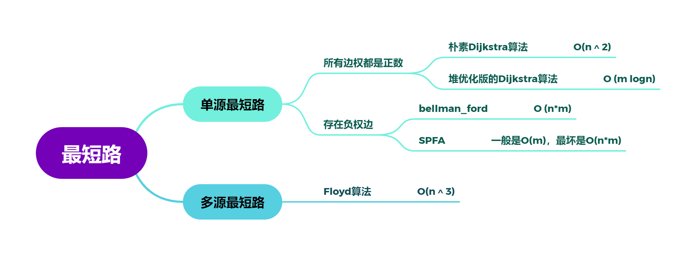
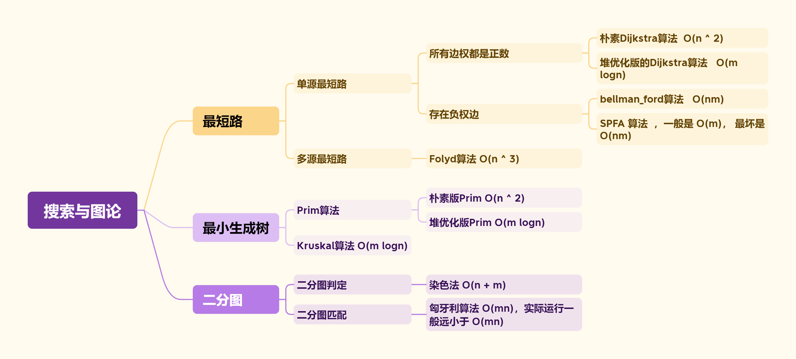

# 🎓 AcWing——算法基础课


> 本笔记为 **第三讲 · 搜索与图论** 的 C++ 模板与题解，内容涵盖 DFS、BFS、最短路、最小生成树、二分图等核心概念。

---

## 📖 第三讲 搜索与图论

### 🧭 1. DFS (深度优先搜索)

> **核心思想**：深度优先搜索（DFS）是一种用于遍历或搜索树或图的算法。它会沿着一条路径尽可能深地搜索，直到到达末端，然后回溯到上一个节点，继续探索其他未访问过的路径。DFS 通常通过递归或显式栈来实现，常用于解决排列组合、N皇后、寻找路径等问题。

#### 1.1 排列数字

<details>
<summary><strong>🔗 练习平台与题解</strong></summary>

-   **洛谷**: [P1706 全排列问题](https://www.luogu.com.cn/problem/P1706)
-   **AcWing**: [842. 排列数字](https://www.acwing.com/problem/content/844/)


> **解法思路**：
>
> 这是一个典型的回溯问题。我们按顺序为每个位置（`u`）选择一个可用的数字（`i`）。
>
> 1.  **递归终止条件**：当所有位置（`u > n`）都已填满，输出当前排列。
> 2.  **选择列表**：对于当前位置 `u`，我们可以从 `1` 到 `n` 中选择一个尚**未使用**的数字。
> 3.  **路径与状态**：
>     -   `path[]` 数组记录当前排列。
>     -   `st[]` (或 `used[]`) 布尔数组标记某个数字是否已被使用。
> 4.  **回溯**：当填完下一个位置 `u+1` 并返回后，需要将当前位置 `u` 所做的选择撤销（即 `st[i] = false;`），以便尝试其他可用的数字。

> **AcWing 题解代码**

```cpp
#include<iostream>
using namespace std;
const int N = 10;

int path[N]; // 保存当前排列
bool st[N];  // 标记数字是否被用过
int n;

void dfs(int u) {
    // 递归终止条件：所有位置都已填满
    if (u > n) {
        for (int i = 1; i <= n; i++) cout << path[i] << " ";
        cout << endl;
        return;
    }

    // 遍历所有可用数字
    for (int i = 1; i <= n; i++) {
        if (!st[i]) { // 如果数字 i 没被用过
            path[u] = i;       // 放入当前位置
            st[i] = true;      // 标记为已用
            dfs(u + 1);        // 递归填充下一个位置
            st[i] = false;     // 恢复现场（回溯），撤销选择
        }
    }
}

int main() {
    cin >> n;
    dfs(1);
    return 0;
}
```

> **洛谷 P1706 题解代码 (推荐)**

```cpp
#include<iostream>
#include<iomanip>
using namespace std;
const int N = 10;

int path[N];
bool used[N];
int sz; // 当前已填充的数字个数

void backtracking(int n) {
    if (sz == n) {
        for (int i = 0; i < n; i++) {
            cout << setw(5) << path[i];
        }
        cout << endl;
        return;
    }
    for (int i = 1; i <= n; i++) {
        if (used[i] == false) {
            path[sz++] = i;
            used[i] = true;
            backtracking(n);
            // 回溯
            sz--;
            used[i] = false;
        }
    }
}

int main() {
    int n;
    scanf("%d", &n);
    backtracking(n);
    return 0;
}
```

</details>

#### 1.2 N-皇后问题

<details>
<summary><strong>🔗 练习平台与题解</strong></summary>

-   **洛谷**: [T247305 N皇后问题](https://www.luogu.com.cn/problem/T247305)
-   **AcWing**: [843. n-皇后问题](https://www.acwing.com/problem/content/845/)


> **解法思路**：
>
> 按行（或列）依次放置皇后，确保新放置的皇后不与任何已存在的皇后在同一列或同一对角线上。
>
> 1.  **按行搜索**：`dfs(y)` 表示在第 `y` 行放置皇后。
> 2.  **剪枝**：为了快速判断位置是否冲突，使用三个布尔数组：
>     -   `col[x]`：标记第 `x` 列是否已有皇后。
>     -   `dg[y - x + n]`：标记主对角线 (`y-x` 为常数) 是否已有皇后。`+n` 是为了防止下标为负。
>     -   `udg[y + x]`：标记副对角线 (`y+x` 为常数) 是否已有皇后。
> 3.  **回溯**：当一行放置成功并递归到下一行后，需要撤销当前行的选择，以便在上一层递归中尝试其他列。

> **AcWing 题解代码**

```cpp
#include <iostream>
using namespace std;
const int N = 20;

int n;
char g[N][N];
bool col[N], dg[N * 2], udg[N * 2]; // 对角线数组大小要开2倍

// 按行搜索
void dfs(int y) {
    if (y == n) { // 所有行都已成功放置
        for (int i = 0; i < n; i++) puts(g[i]);
        puts("");
        return;
    }

    // 遍历当前行的每一列
    for (int x = 0; x < n; x++) {
        // 剪枝：判断列、主对角线、副对角线是否冲突
        if (!col[x] && !dg[y - x + n] && !udg[y + x]) {
            g[y][x] = 'Q';
            col[x] = dg[y - x + n] = udg[y + x] = true;
            dfs(y + 1);
            // 回溯
            col[x] = dg[y - x + n] = udg[y + x] = false;
            g[y][x] = '.';
        }
    }
}

int main() {
    cin >> n;
    for (int i = 0; i < n; i++) {
        for (int j = 0; j < n; j++) {
            g[i][j] = '.';
        }
    }
    dfs(0);
    return 0;
}
```

</details>

---

### 🌊 2. BFS (广度优先搜索)

> **核心思想**：广度优先搜索（BFS）是另一种图遍历算法。它从一个起始节点开始，首先访问其所有相邻节点，然后逐层向外扩展，访问更远的节点。BFS 总是能找到**无权图**中两点之间的最短路径。它通常通过队列来实现。

#### 2.1 走迷宫

<details>
<summary><strong>🔗 练习平台与题解</strong></summary>

-   **牛客**: [走迷宫](https://www.nowcoder.com/practice/e88b41dc6e764b2893bc4221777ffe64)
-   **AcWing**: [844. 走迷宫](https://www.acwing.com/problem/content/846/)


> **解法思路**：
>
> 迷宫问题是 BFS 的经典应用，因为题目要求最少步数，等价于图中的最短路径。
>
> 1.  **队列**：用一个队列 `q` 存储待访问的坐标 `pair<int, int>`。
> 2.  **距离数组**：用一个二维数组 `d[N][N]` 存储从起点到每个点的最短距离。`d` 数组也兼具标记功能，`d[x][y] == -1` 表示该点未被访问过。
> 3.  **流程**：
>     -   将起点 `(0,0)` 入队，`d[0][0] = 0`。
>     -   当队列不为空时，取出队头元素 `t`。
>     -   遍历 `t` 的四个方向，对于合法（未越界、可通行、未访问）的邻居 `(x, y)`：
>         -   更新距离 `d[x][y] = d[t.first][t.second] + 1`。
>         -   将 `(x, y)` 入队。
> 4.  **终点**：最终 `d[n-1][m-1]` 的值就是答案。

> **AcWing 题解代码**

```cpp
#include <iostream>
#include <cstring>
#include <queue>
using namespace std;

typedef pair<int, int> PII;
const int N = 110;

int n, m;
int g[N][N]; // 迷宫
int d[N][N]; // 距离数组

int bfs() {
    queue<PII> q;
    memset(d, -1, sizeof d);

    q.push({0, 0});
    d = 0;

    int dx[] = {-1, 0, 1, 0}, dy[] = {0, 1, 0, -1};

    while (!q.empty()) {
        PII t = q.front();
        q.pop();

        if (t.first == n - 1 && t.second == m - 1) {
            return d[n - 1][m - 1];
        }

        for (int i = 0; i < 4; i++) {
            int x = t.first + dx[i], y = t.second + dy[i];
            if (x >= 0 && x < n && y >= 0 && y < m && g[x][y] == 0 && d[x][y] == -1) {
                d[x][y] = d[t.first][t.second] + 1;
                q.push({x, y});
            }
        }
    }
    return -1; // Should not reach here for this problem
}

int main() {
    cin >> n >> m;
    for (int i = 0; i < n; i++) {
        for (int j = 0; j < m; j++) {
            cin >> g[i][j];
        }
    }
    cout << bfs() << endl;
    return 0;
}
```

</details>

#### 2.2 八数码

<details>
<summary><strong>🔗 练习平台与题解</strong></summary>

-   **洛谷**: [P1379 八数码难题](https://www.luogu.com.cn/problem/P1379)
-   **AcWing**: [845. 八数码](https://www.acwing.com/problem/content/847/)


> **解法思路**：
>
> 这是一个状态空间搜索问题，可以将每个九宫格的布局看作图中的一个节点，移动操作看作边。求最少移动次数，就是求图中最短路。
>
> 1.  **状态表示**：用一个字符串（如 "12345678x"）来唯一表示九宫格的状态。
> 2.  **BFS 框架**：
>     -   用一个队列 `q` 存储状态字符串。
>     -   用一个 `unordered_map<string, int> d` 存储从初始状态到任一状态的最少步数，同样兼具判重功能。
> 3.  **状态转移**：
>     -   从队列中取出当前状态 `t`。
>     -   找到 'x' 的位置，并将其转换为二维坐标 `(x, y)`。
>     -   尝试向四个方向移动 'x'，生成新的状态字符串。
>     -   如果新状态未被访问过（即在 map `d` 中不存在），则更新其距离并将其入队。
> 4.  **终点**：当从队列中取出的状态等于目标状态 "12345678x" 时，返回其距离。

> **AcWing 题解代码**

```cpp
#include <iostream>
#include <string>
#include <queue>
#include <unordered_map>
#include <algorithm>
using namespace std;

int bfs(string start) {
    string end = "12345678x";
    queue<string> q;
    unordered_map<string, int> d;

    q.push(start);
    d[start] = 0;

    int dx[] = {-1, 0, 1, 0}, dy[] = {0, 1, 0, -1};

    while (!q.empty()) {
        string t = q.front();
        q.pop();

        if (t == end) return d[t];

        int dist = d[t];
        int k = t.find('x');
        int x = k / 3, y = k % 3;

        for (int i = 0; i < 4; i++) {
            int a = x + dx[i], b = y + dy[i];
            if (a >= 0 && a < 3 && b >= 0 && b < 3) {
                string next_state = t;
                swap(next_state[k], next_state[a * 3 + b]);
                if (d.find(next_state) == d.end()) {
                    d[next_state] = dist + 1;
                    q.push(next_state);
                }
            }
        }
    }
    return -1;
}

int main() {
    string start;
    for (int i = 0; i < 9; i++) {
        char c;
        cin >> c;
        start += c;
    }
    cout << bfs(start) << endl;
    return 0;
}
```

</details>

---

### 🌳 3. 树与图的遍历

> **核心思想**：树和图的遍历是许多更复杂算法的基础。DFS 适合寻找所有解、深入探索路径的问题；BFS 适合寻找最短路（无权）、层序遍历的问题。时间复杂度均为 O(N+M)，其中 N 是点数，M 是边数。

#### 3.1 树的重心 (DFS 应用)

<details>
<summary><strong>🔗 练习平台与题解</strong></summary>

-   **AcWing**: [846. 树的重心](https://www.acwing.com/problem/content/848/)


> **解法思路**：
>
> 树的重心是指删除该节点后，剩余各个连通块中节点数的最大值最小的那个节点。
>
> 1.  **DFS 计算子树大小**：定义 `dfs(u)` 函数，其返回值为以 `u` 为根的子树的节点总数。
> 2.  **遍历与计算**：在 `dfs(u)` 的过程中，对于每个子节点 `j`，我们递归调用 `dfs(j)` 得到其子树大小 `s`。
>     -   那么，删除 `u` 后，以 `j` 为根的这个连通块大小就是 `s`。
>     -   同时，`u` 的上方也形成一个连通块，其大小为 `n - sum`，其中 `sum` 是以 `u` 为根的整个子树的大小。
> 3.  **更新答案**：在 `dfs(u)` 的末尾，我们收集所有以 `u` 的子节点为根的连通块大小，以及 `u` 上方连通块的大小，取它们的最大值 `res`。然后用 `res` 来更新全局的最小值 `ans`。

> **AcWing 题解代码**

```cpp
#include <iostream>
#include <cstring>
#include <algorithm>
using namespace std;

const int N = 1e5 + 10, M = N * 2;
int h[N], e[M], ne[M], idx;
bool st[N];
int n;
int ans = N;

void add(int a, int b) {
    e[idx] = b, ne[idx] = h[a], h[a] = idx++;
}

// 返回以u为根的子树的节点数
int dfs(int u) {
    st[u] = true;
    int sum = 1; // 包含节点u本身
    int res = 0; // 存储删除u后，最大连通块的节点数

    for (int i = h[u]; i != -1; i = ne[i]) {
        int j = e[i];
        if (!st[j]) {
            int s = dfs(j); // s是子树j的大小
            res = max(res, s);
            sum += s;
        }
    }

    res = max(res, n - sum); // u上方的连通块大小
    ans = min(ans, res);

    return sum;
}

int main() {
    cin >> n;
    memset(h, -1, sizeof h);
    for (int i = 0; i < n - 1; i++) {
        int a, b;
        cin >> a >> b;
        add(a, b), add(b, a);
    }
    dfs(1);
    cout << ans << endl;
    return 0;
}
```

</details>

#### 3.2 图中点的层次 (BFS 应用)

<details>
<summary><strong>🔗 练习平台与题解</strong></summary>

-   **AcWing**: [847. 图中点的层次](https://www.acwing.com/problem/content/849/)

> **解法思路**：
>
> 求图中点的层次，等价于求有向图中从 1 号点到 n 号点的最短距离（边权为 1）。这是 BFS 的典型应用。
>
> 1.  **邻接表**：使用邻接表存储有向图。
> 2.  **BFS 框架**：
>     -   队列 `q` 存储待访问节点。
>     -   距离数组 `d[N]` 初始化为 -1，`d[1] = 0`。
>     -   从 1 号点开始 BFS，逐层扩展，更新每个可达节点的 `d` 值。
> 3.  **结果**：最终 `d[n]` 就是 1 号点到 n 号点的最短距离。如果 `d[n]` 仍为 -1，则表示不可达。

> **AcWing 题解代码**

```cpp
#include <iostream>
#include <cstring>
#include <queue>
using namespace std;

const int N = 100010;
int h[N], e[N], ne[N], idx;
int d[N]; // 存储距离，-1表示未访问
int n, m;

void add(int a, int b) {
    e[idx] = b, ne[idx] = h[a], h[a] = idx++;
}

int bfs() {
    memset(d, -1, sizeof d);
    queue<int> q;

    q.push(1);
    d = 0;

    while (!q.empty()) {
        int t = q.front();
        q.pop();

        if (t == n) return d[n];

        for (int i = h[t]; i != -1; i = ne[i]) {
            int j = e[i];
            if (d[j] == -1) {
                d[j] = d[t] + 1;
                q.push(j);
            }
        }
    }
    return d[n];
}

int main() {
    cin >> n >> m;
    memset(h, -1, sizeof h);
    for (int i = 0; i < m; i++) {
        int a, b;
        cin >> a >> b;
        add(a, b);
    }
    cout << bfs() << endl;
    return 0;
}
```

</details>

---

### 📊 4. 拓扑排序

> **核心思想**：拓扑排序是对 **有向无环图（DAG）** 的顶点进行排序，使得对于图中每一条有向边 `(u, v)`，`u` 在排序中都出现在 `v` 之前。经典的实现是 **Kahn算法**：
> 1.  计算所有节点的入度。
> 2.  将所有入度为 0 的节点加入队列。
> 3.  当队列不为空时，出队一个节点 `t`，将其加入拓扑序列。
> 4.  遍历 `t` 的所有出边 `(t, j)`，将 `j` 的入度减 1。若 `j` 的入度变为 0，则将 `j` 入队。
> 5.  若最终拓扑序列的节点数不等于总节点数，说明图中存在环。

<details>
<summary><strong>🔗 练习平台与题解</strong></summary>

-   **AcWing**: [848. 有向图的拓扑序列](https://www.acwing.com/problem/content/850/)


> **拓扑排序模板 (Kahn 算法)**
>
> ```cpp
> bool topsort() {
>     int hh = 0, tt = -1;
>     // d[i] 存储点i的入度
>     for (int i = 1; i <= n; i++) {
>         if (!d[i]) q[++tt] = i; // 入度为0的点入队
>     }
> 
>     while (hh <= tt) {
>         int t = q[hh++];
>         for (int i = h[t]; i != -1; i = ne[i]) {
>             int j = e[i];
>             if (--d[j] == 0) { // j的入度减1，若为0则入队
>                 q[++tt] = j;
>             }
>         }
>     }
>     // 如果所有点都入队，说明存在拓扑序列
>     return tt == n - 1;
> }
> ```

> **AcWing 题解代码**

```cpp
#include <iostream>
#include <cstring>
#include <algorithm>
using namespace std;

const int N = 100010;
int h[N], e[N], ne[N], idx;
int q[N]; // 数组模拟队列
int d[N]; // 存储点的入度
int n, m;

void add(int a, int b) {
    e[idx] = b, ne[idx] = h[a], h[a] = idx++;
}

bool topsort() {
    int hh = 0, tt = -1;
    for (int i = 1; i <= n; i++) {
        if (d[i] == 0) q[++tt] = i;
    }

    while (hh <= tt) {
        int t = q[hh++];
        for (int i = h[t]; i != -1; i = ne[i]) {
            int j = e[i];
            d[j]--;
            if (d[j] == 0) q[++tt] = j;
        }
    }
    return tt == n - 1;
}

int main() {
    cin >> n >> m;
    memset(h, -1, sizeof h);
    for (int i = 0; i < m; i++) {
        int a, b;
        cin >> a >> b;
        add(a, b);
        d[b]++;
    }

    if (topsort()) {
        for (int i = 0; i < n; i++) cout << q[i] << " ";
        cout << endl;
    } else {
        cout << -1 << endl;
    }
    return 0;
}
```

</details>

---

### 🗺️ 5. 最短路问题

> **核心思想**：最短路问题旨在寻找图中两点（单源）或所有点对（多源）之间的最短路径。不同算法适用于不同场景：
> -   **Dijkstra**: 适用于 **无负权边** 的图，是贪心算法的典范。
> -   **Bellman-Ford**: 适用于 **有负权边** 的图，可以检测 **负权环**，但效率较低。
> -   **SPFA**: Bellman-Ford 的队列优化版，通常比 Bellman-Ford 快，也能处理负权边和检测负环。
> -   **Floyd-Warshall**: 用于求解 **所有点对** 之间的最短路，可处理负权边，但不能处理负权环。

#### 5.1 Dijkstra 算法

> **核心思想**：Dijkstra 算法通过维护一个集合 `S`，其中包含已找到最短路径的顶点。它不断地从 `S` 外部的顶点中选择一个距离源点最近的顶点 `t` 加入 `S`，然后用 `t` 来更新其邻居到源点的距离（称为“松弛”操作）。此过程重复 `n` 次。适用于**无负权边**的图。

<details>
<summary><strong>I. 朴素版 (邻接矩阵, O(n²))</strong></summary>

-   **洛谷**: [P3371 【模板】单源最短路径（弱化版）](https://www.luogu.com.cn/problem/P3371)
-   **AcWing**: [849. Dijkstra求最短路 I](https://www.acwing.com/problem/content/851/)


> **解法思路**：
>
> 适用于稠密图（边数接近 n²）。
>
> 1.  初始化 `dist` 数组为无穷大，`dist[1] = 0`。
> 2.  进行 `n` 次迭代：
>     -   在所有未确定最短路的点中，找到 `dist` 值最小的点 `t`。
>     -   将 `t` 标记为已确定。
>     -   用 `t` 来更新所有与它相邻的点的 `dist` 值：`dist[j] = min(dist[j], dist[t] + g[t][j])`。

> **AcWing 题解代码**

```cpp
#include <iostream>
#include <cstring>
#include <algorithm>
using namespace std;

const int N = 510;
const int INF = 0x3f3f3f3f;

int g[N][N]; // 邻接矩阵
int dist[N];
bool st[N];
int n, m;

int dijkstra() {
    memset(dist, 0x3f, sizeof dist);
    dist = 0;

    for (int i = 0; i < n; i++) {
        int t = -1;
        // 找到未确定中距离最近的点
        for (int j = 1; j <= n; j++) {
            if (!st[j] && (t == -1 || dist[t] > dist[j])) {
                t = j;
            }
        }
        
        if (t == -1 || t == n) break; // 优化：如果找不到点或已找到终点

        st[t] = true;

        // 用 t 更新其他点的距离
        for (int j = 1; j <= n; j++) {
            dist[j] = min(dist[j], dist[t] + g[t][j]);
        }
    }

    if (dist[n] == INF) return -1;
    return dist[n];
}

int main() {
    cin >> n >> m;
    memset(g, 0x3f, sizeof g);
    for(int i = 1; i <= n; i++) g[i][i] = 0;

    while (m--) {
        int x, y, z;
        cin >> x >> y >> z;
        g[x][y] = min(g[x][y], z);
    }

    cout << dijkstra() << endl;
    return 0;
}
```

</details>

<details>
<summary><strong>II. 堆优化版 (邻接表, O(m log n))</strong></summary>

-   **洛谷**: [P4779 【模板】单源最短路径（标准版）](https://www.luogu.com.cn/problem/P4779)
-   **AcWing**: [850. Dijkstra求最短路 II](https://www.acwing.com/problem/content/852/)


> **解法思路**：
>
> 适用于稀疏图（边数远小于 n²）。朴素版中 `O(n)` 寻找最小 `dist` 值的步骤可以用**优先队列（最小堆）**优化到 `O(log n)`。
>
> 1.  用邻接表存图。
> 2.  使用 `priority_queue` 存储 `pair<distance, vertex>`，按 `distance` 升序排列。
> 3.  将 `{0, 1}` (距离0，节点1) 入堆。
> 4.  当堆不为空时，取出堆顶 `{dist, ver}`。
> 5.  如果 `ver` 已被访问，跳过。否则，标记 `ver` 为已访问。
> 6.  遍历 `ver` 的邻居 `j`，如果 `dist[j] > dist[ver] + w`，则更新 `dist[j]` 并将 `{dist[j], j}` 入堆。

> **AcWing 题解代码**

```cpp
#include <iostream>
#include <cstring>
#include <queue>
#include <vector>
using namespace std;

typedef pair<int, int> PII;
const int N = 150010;
const int INF = 0x3f3f3f3f;

int h[N], w[N], e[N], ne[N], idx;
int dist[N];
bool st[N];
int n, m;

void add(int a, int b, int c) {
    e[idx] = b, w[idx] = c, ne[idx] = h[a], h[a] = idx++;
}

int dijkstra() {
    memset(dist, 0x3f, sizeof dist);
    dist = 0;
    priority_queue<PII, vector<PII>, greater<PII>> heap;
    heap.push({0, 1}); // {distance, vertex}

    while (!heap.empty()) {
        auto t = heap.top();
        heap.pop();

        int ver = t.second;
        int distance = t.first;

        if (st[ver]) continue;
        st[ver] = true;

        for (int i = h[ver]; i != -1; i = ne[i]) {
            int j = e[i];
            if (dist[j] > distance + w[i]) {
                dist[j] = distance + w[i];
                heap.push({dist[j], j});
            }
        }
    }

    if (dist[n] == INF) return -1;
    return dist[n];
}

int main() {
    cin >> n >> m;
    memset(h, -1, sizeof h);
    while (m--) {
        int a, b, c;
        cin >> a >> b >> c;
        add(a, b, c);
    }
    cout << dijkstra() << endl;
    return 0;
}
```

</details>

#### 5.2 Bellman-Ford 算法

> **核心思想**：Bellman-Ford 算法基于动态规划。它对图中的所有边进行 `n-1` 轮松弛操作。在第 `k` 轮松弛后，`dist[i]` 存储的是从源点出发、经过最多 `k` 条边到达 `i` 的最短路径长度。该算法可以处理**负权边**。如果在第 `n` 轮仍然可以松弛，说明图中存在**负权环**。

<details>
<summary><strong>🔗 练习平台与题解</strong></summary>

-   **AcWing**: [853. 有边数限制的最短路](https://www.acwing.com/problem/content/855/)


> **解法思路**：
>
> 题目明确要求“最多经过 k 条边”，这正是 Bellman-Ford 算法的特长。
>
> 1.  用结构体数组存储所有边。
> 2.  进行 `k` 轮迭代。在每一轮中，遍历所有 `m` 条边 `(a, b, w)`，尝试用 `dist[a] + w` 来更新 `dist[b]`。
> 3.  **串联问题**：为防止在一轮迭代中，用本轮更新过的值去更新其他值（即一条路径上更新了多次），需要一个 `backup` 数组 `last[]` 来存储上一轮的 `dist` 值。`dist[b] = min(dist[b], last[a] + w)`。
> 4.  **不可达判断**：由于存在负权边，`dist` 可能被一个非常大的正数加上一个负数更新。因此，判断不可达不能用 `dist[n] == INF`，而应该用 `dist[n] > INF / 2`，这是一个安全的界限。

> **AcWing 题解代码**

```cpp
#include <iostream>
#include <cstring>
#include <algorithm>
using namespace std;

const int N = 510, M = 10010;
const int INF = 0x3f3f3f3f;

struct Edge {
    int a, b, w;
} edges[M];

int dist[N];
int last[N]; // 备份数组
int n, m, k;

void bellman_ford() {
    memset(dist, 0x3f, sizeof dist);
    dist = 0;

    for (int i = 0; i < k; i++) { // 迭代 k 次
        memcpy(last, dist, sizeof dist);
        for (int j = 0; j < m; j++) { // 遍历所有边
            auto e = edges[j];
            dist[e.b] = min(dist[e.b], last[e.a] + e.w);
        }
    }
}

int main() {
    cin >> n >> m >> k;
    for (int i = 0; i < m; i++) {
        int a, b, w;
        cin >> a >> b >> w;
        edges[i] = {a, b, w};
    }

    bellman_ford();

    if (dist[n] > INF / 2) puts("impossible");
    else cout << dist[n] << endl;

    return 0;
}
```

</details>

#### 5.3 SPFA 算法

> **核心思想**：SPFA (Shortest Path Faster Algorithm) 是 Bellman-Ford 的队列优化版本。Bellman-Ford 每轮迭代会遍历所有边，但很多边的松弛操作是无效的。SPFA 的优化在于，只有当一个点 `u` 的 `dist` 值变小时，才有可能去更新它的邻居。因此，SPFA 维护一个队列，只将被成功松弛的节点入队。

<details>
<summary><strong>I. SPFA 求最短路</strong></summary>

-   **AcWing**: [851. spfa求最短路](https://www.acwing.com/problem/content/853/)


> **解法思路**：
>
> 1.  用队列 `q` 和布尔数组 `st`（标记节点是否在队列中）。
> 2.  源点 `1` 入队，`dist[1]=0`, `st[1]=true`。
> 3.  当队列不为空时，出队一个点 `t`，`st[t]=false`。
> 4.  遍历 `t` 的邻居 `j`，如果 `dist[j] > dist[t] + w`，则更新 `dist[j]`。
> 5.  如果 `j` 不在队列中，则将 `j` 入队，`st[j]=true`。

> **AcWing 题解代码**

```cpp
#include <iostream>
#include <cstring>
#include <queue>
using namespace std;

const int N = 100010;
const int INF = 0x3f3f3f3f;

int h[N], w[N], e[N], ne[N], idx;
int dist[N];
bool st[N]; // 标记是否在队列中
int n, m;

void add(int a, int b, int c) {
    e[idx] = b, w[idx] = c, ne[idx] = h[a], h[a] = idx++;
}

int spfa() {
    memset(dist, 0x3f, sizeof dist);
    dist = 0;
    queue<int> q;
    q.push(1);
    st = true;

    while (!q.empty()) {
        int t = q.front();
        q.pop();
        st[t] = false;

        for (int i = h[t]; i != -1; i = ne[i]) {
            int j = e[i];
            if (dist[j] > dist[t] + w[i]) {
                dist[j] = dist[t] + w[i];
                if (!st[j]) {
                    q.push(j);
                    st[j] = true;
                }
            }
        }
    }
    return dist[n];
}

int main() {
    cin >> n >> m;
    memset(h, -1, sizeof h);
    while (m--) {
        int a, b, c;
        cin >> a >> b >> c;
        add(a, b, c);
    }
    
    int res = spfa();
    if (res == INF) puts("impossible");
    else cout << res << endl;
    
    return 0;
}
```

</details>

<details>
<summary><strong>II. SPFA 判断负环</strong></summary>

-   **洛谷**: [P3385 【模板】负环](https://www.luogu.com.cn/problem/P3385)
-   **AcWing**: [852. spfa判断负环](https://www.acwing.com/problem/content/854/)


> **解法思路**：
>
> 如果图中存在负环，那么在环上的点可以无限松弛，导致 SPFA 算法死循环。我们可以利用这一点来判断负环。
>
> 1.  **边数计数**：设置一个 `cnt` 数组，`cnt[x]` 记录从源点到 `x` 的最短路径所包含的边数。
> 2.  **抽屉原理**：在松弛 `dist[j] = dist[t] + w[i]` 时，同时更新 `cnt[j] = cnt[t] + 1`。
> 3.  **负环判断**：如果 `cnt[j] >= n`，说明从源点到 `j` 的最短路径经过了至少 `n` 条边，这意味着路径上至少有 `n+1` 个点。根据抽屉原理，其中必有重复的点，即形成了环。由于是在松弛过程中发现的，这个环一定是负权环。
> 4.  **初始状态**：为了能检测到所有可能不与 1 号点连通的负环，初始时需要将所有节点都加入队列。

> **AcWing 题解代码**

```cpp
#include <iostream>
#include <cstring>
#include <queue>
using namespace std;

const int N = 2010, M = 10010;
int h[N], w[M], e[M], ne[M], idx;
int dist[N], cnt[N];
bool st[N];
int n, m;

void add(int a, int b, int c) {
    e[idx] = b, w[idx] = c, ne[idx] = h[a], h[a] = idx++;
}

bool spfa() {
    queue<int> q;
    for (int i = 1; i <= n; i++) {
        q.push(i);
        st[i] = true;
    }

    while (!q.empty()) {
        int t = q.front();
        q.pop();
        st[t] = false;

        for (int i = h[t]; i != -1; i = ne[i]) {
            int j = e[i];
            if (dist[j] > dist[t] + w[i]) {
                dist[j] = dist[t] + w[i];
                cnt[j] = cnt[t] + 1;
                if (cnt[j] >= n) return true;
                if (!st[j]) {
                    q.push(j);
                    st[j] = true;
                }
            }
        }
    }
    return false;
}

int main() {
    cin >> n >> m;
    memset(h, -1, sizeof h);
    while (m--) {
        int a, b, c;
        cin >> a >> b >> c;
        add(a, b, c);
    }
    if (spfa()) puts("Yes");
    else puts("No");
    return 0;
}
```

</details>

#### 5.4 Floyd-Warshall 算法

> **核心思想**：Floyd 算法是一种用于求解**所有点对之间**最短路径的动态规划算法。其状态转移方程为 `d[i][j] = min(d[i][j], d[i][k] + d[k][j])`。这个方程的含义是：从 `i`到 `j` 的最短路径，要么是当前已知的路径，要么是经过中转点 `k` 的路径 (`i -> k -> j`)。通过枚举所有可能的中转点 `k`，最终可以得到所有点对间的最短路。

<details>
<summary><strong>🔗 练习平台与题解</strong></summary>

-   **AcWing**: [854. Floyd求最短路](https://www.acwing.com/problem/content/856/)


> **解法思路**：
>
> 1.  **初始化**：用邻接矩阵 `d[N][N]` 存图。`d[i][i] = 0`，`d[i][j]` (i≠j) 为边权重或无穷大。
> 2.  **三重循环**：**最外层必须是中转点 `k`**，内两层是起点 `i` 和终点 `j`。
>     `for k = 1 to n`
>     `  for i = 1 to n`
>     `    for j = 1 to n`
>     `      d[i][j] = min(d[i][j], d[i][k] + d[k][j]);`
> 3.  **结果**：算法结束后，`d[a][b]` 即为 `a` 到 `b` 的最短距离。

> **AcWing 题解代码**

```cpp
#include <iostream>
#include <algorithm>
#include <cstring>
using namespace std;

const int N = 210, INF = 1e9;
int d[N][N];
int n, m, q;

void floyd() {
    for (int k = 1; k <= n; k++) {
        for (int i = 1; i <= n; i++) {
            for (int j = 1; j <= n; j++) {
                d[i][j] = min(d[i][j], d[i][k] + d[k][j]);
            }
        }
    }
}

int main() {
    cin >> n >> m >> q;
    for (int i = 1; i <= n; i++) {
        for (int j = 1; j <= n; j++) {
            if (i == j) d[i][j] = 0;
            else d[i][j] = INF;
        }
    }

    while (m--) {
        int a, b, c;
        cin >> a >> b >> c;
        d[a][b] = min(d[a][b], c);
    }

    floyd();

    while (q--) {
        int a, b;
        cin >> a >> b;
        if (d[a][b] > INF / 2) puts("impossible");
        else cout << d[a][b] << endl;
    }
    return 0;
}
```

</details>

---

### 🌳 6. 最小生成树 (MST)

> **核心思想**：对于一个连通的无向加权图，最小生成树（MST）是包含图中所有顶点的一棵树，且其所有边的权重之和最小。构造 MST 的常用算法都是基于贪心策略：
> -   **Prim**: 从一个点开始，不断将离当前生成树最近的顶点和边加入，直到所有点都加入。
> -   **Kruskal**: 将所有边按权重从小到大排序，依次加入边，只要不形成环就保留，直到有 `n-1` 条边。

#### 6.1 Prim 算法

> **核心思想**：Prim 算法类似于 Dijkstra。它维护一个顶点集合 `S`，初始时只有一个顶点。算法每一步都选择一条连接 `S` 中顶点与 `S` 外顶点的权重最小的边，并将该边和对应的 `S` 外顶点加入 `S`。这个过程重复 `n-1` 次。

<details>
<summary><strong>🔗 练习平台与题解 (朴素版, O(n²))</strong></summary>

-   **AcWing**: [858. Prim算法求最小生成树](https://www.acwing.com/problem/content/860/)


> **解法思路**：
>
> 适用于稠密图。
>
> 1.  初始化 `dist` 数组为无穷大，`dist[i]` 表示点 `i` 到当前生成树集合的最短距离。
> 2.  进行 `n` 次迭代：
>     -   在所有未加入集合的点中，找到 `dist` 值最小的点 `t`。
>     -   如果找到的 `dist[t]` 为无穷大，说明图不连通。
>     -   将 `dist[t]` 加入总权重，并将 `t` 加入集合。
>     -   用 `t` 来更新其他点到集合的距离：`dist[j] = min(dist[j], g[t][j])`。

> **AcWing 题解代码**

```cpp
#include <iostream>
#include <cstring>
#include <algorithm>
using namespace std;

const int N = 510, INF = 0x3f3f3f3f;
int g[N][N];
int dist[N];
bool st[N];
int n, m;

int prim() {
    memset(dist, 0x3f, sizeof dist);
    int res = 0;

    for (int i = 0; i < n; i++) {
        int t = -1;
        // 找到未加入集合中，距离集合最近的点
        for (int j = 1; j <= n; j++) {
            if (!st[j] && (t == -1 || dist[t] > dist[j])) {
                t = j;
            }
        }

        if (i > 0 && dist[t] == INF) return INF; // 非首轮且找不到点，则不连通

        if (i > 0) res += dist[t];
        st[t] = true;

        // 用 t 更新其他点到集合的距离
        for (int j = 1; j <= n; j++) {
            dist[j] = min(dist[j], g[t][j]);
        }
    }
    return res;
}

int main() {
    cin >> n >> m;
    memset(g, 0x3f, sizeof g);
    for(int i = 1; i <= n; i++) g[i][i] = 0;

    while (m--) {
        int a, b, c;
        cin >> a >> b >> c;
        g[a][b] = g[b][a] = min(g[a][b], c);
    }

    int t = prim();
    if (t == INF) puts("impossible");
    else cout << t << endl;

    return 0;
}
```

</details>

#### 6.2 Kruskal 算法

> **核心思想**：Kruskal 算法是一种以边为中心的贪心算法。它将所有边按权重从小到大排序，然后依次考察每条边。如果一条边连接的两个顶点尚不属于同一个连通分量（用**并查集**判断），则将这条边加入最小生成树，并合并这两个连通分量。

<details>
<summary><strong>🔗 练习平台与题解 (O(m log m))</strong></summary>

-   **洛谷**: [P3366 【模板】最小生成树](https://www.luogu.com.cn/problem/P3366)
-   **AcWing**: [859. Kruskal算法求最小生成树](https://www.acwing.com/problem/content/861/)


> **解法思路**：
>
> 适用于稀疏图。
>
> 1.  用结构体存储所有边，并按权重升序排序。
> 2.  初始化并查集，每个点自成一个集合。
> 3.  遍历排序后的边 `(a, b, w)`：
>     -   用 `find` 函数查找 `a` 和 `b` 的根节点。
>     -   如果根节点不同，说明 `a` 和 `b` 不在同一连通块，加入这条边不会形成环。
>     -   将该边权重 `w` 加入总和，合并 `a` 和 `b` 所在的集合，已加入的边数 `cnt` 加一。
> 4.  当 `cnt` 达到 `n-1` 时，MST 构建完成。如果遍历完所有边后 `cnt < n-1`，则图不连通。

> **AcWing 题解代码**

```cpp
#include <iostream>
#include <algorithm>
using namespace std;

const int N = 100010, M = 200010;

struct Edge {
    int a, b, w;
    bool operator< (const Edge &other) const {
        return w < other.w;
    }
} edges[M];

int p[N]; // 并查集
int n, m;

int find(int x) {
    if (p[x] != x) p[x] = find(p[x]);
    return p[x];
}

int main() {
    cin >> n >> m;
    for (int i = 0; i < m; i++) {
        cin >> edges[i].a >> edges[i].b >> edges[i].w;
    }

    sort(edges, edges + m);

    for (int i = 1; i <= n; i++) p[i] = i;

    int res = 0, cnt = 0;
    for (int i = 0; i < m; i++) {
        int a = edges[i].a, b = edges[i].b, w = edges[i].w;
        int pa = find(a), pb = find(b);
        if (pa != pb) {
            p[pa] = pb;
            res += w;
            cnt++;
        }
    }

    if (cnt < n - 1) puts("impossible");
    else cout << res << endl;

    return 0;
}```

</details>

---

### 🎨 7. 二分图

> **核心思想**：二分图是一种特殊的图，其所有顶点可以被分为两个互不相交的集合 `U` 和 `V`，使得图中每条边的两个端点都分别属于这两个集合。一个重要的判定性质是：**一个图是二分图，当且仅当它不包含奇数长度的环**。

#### 7.1 染色法判定二分图

> **核心思想**：我们可以使用图遍历（DFS 或 BFS）来尝试对图进行二染色。从任一未染色的顶点开始，将其染成颜色 1。然后遍历其所有邻居，将它们染成颜色 2。再从这些邻居出发，将其邻居染成颜色 1，以此类推。如果在染色过程中，发现一个顶点的邻居已经被染成了和它自己相同的颜色，那么就说明存在冲突（即存在奇数环），该图不是二分图。

<details>
<summary><strong>🔗 练习平台与题解 (O(n+m))</strong></summary>

-   **AcWing**: [860. 染色法判定二分图](https://www.acwing.com/problem/content/862/)


> **AcWing 题解代码**

```cpp
#include <iostream>
#include <cstring>
using namespace std;

const int N = 100010, M = 200010;
int h[N], e[M], ne[M], idx;
int color[N]; // 0:未染色, 1:颜色1, 2:颜色2
int n, m;

void add(int a, int b) {
    e[idx] = b, ne[idx] = h[a], h[a] = idx++;
}

bool dfs(int u, int c) {
    color[u] = c;
    for (int i = h[u]; i != -1; i = ne[i]) {
        int j = e[i];
        if (!color[j]) {
            if (!dfs(j, 3 - c)) return false; // 染成相反颜色
        } else if (color[j] == c) {
            return false; // 邻居颜色和自己相同，冲突
        }
    }
    return true;
}

int main() {
    cin >> n >> m;
    memset(h, -1, sizeof h);
    while (m--) {
        int a, b;
        cin >> a >> b;
        add(a, b), add(b, a);
    }

    bool flag = true;
    for (int i = 1; i <= n; i++) {
        if (!color[i]) { // 如果有未染色的连通块
            if (!dfs(i, 1)) {
                flag = false;
                break;
            }
        }
    }

    if (flag) puts("Yes");
    else puts("No");

    return 0;
}
```

</details>

#### 7.2 匈牙利算法 (最大匹配)

> **核心思想**：匈牙利算法用于解决二分图的最大匹配问题。它是一种增广路算法。核心思想是：遍历左部集合的每个点 `u`，尝试为它在右部集合中寻找一个匹配点 `v`。
> -   如果 `v` 尚未匹配，则直接将 `(u, v)` 组成一对。
> -   如果 `v` 已被另一个左部点 `u'` 匹配，则尝试为 `u'` 寻找一个新的匹配点（递归调用 `find(u')`）。如果成功为 `u'` 找到了“下家”，那么 `v` 就可以让给 `u` 来匹配。
> 这条“让来让去”的路径就是增广路。每找到一条增广路，最大匹配数就加一。

<details>
<summary><strong>🔗 练习平台与题解 (O(nm))</strong></summary>

-   **洛谷**: [P3386 【模板】二分图最大匹配](https://www.luogu.com.cn/problem/P3386)
-   **AcWing**: [861. 二分图的最大匹配](https://www.acwing.com/problem/content/863/)


> **AcWing 题解代码 (邻接表)**

```cpp
#include <iostream>
#include <cstring>
using namespace std;

const int N1 = 510, M = 100010;
int h[N1], e[M], ne[M], idx;
int match[N1]; // match[j] 存储右部点 j 当前匹配的左部点
bool st[N1];   // st[j] 记录在一轮 find 中右部点 j 是否被访问过
int n1, n2, m;

void add(int a, int b) {
    e[idx] = b, ne[idx] = h[a], h[a] = idx++;
}

bool find(int u) {
    for (int i = h[u]; i != -1; i = ne[i]) {
        int j = e[i]; // u 的一个邻居
        if (!st[j]) {
            st[j] = true;
            // 如果 j 未被匹配，或者 j 的原配可以找到下家
            if (match[j] == 0 || find(match[j])) {
                match[j] = u;
                return true;
            }
        }
    }
    return false;
}

int main() {
    cin >> n1 >> n2 >> m;
    memset(h, -1, sizeof h);
    while (m--) {
        int u, v;
        cin >> u >> v;
        add(u, v);
    }

    int res = 0;
    for (int i = 1; i <= n1; i++) {
        memset(st, false, sizeof st); // 每轮为新的左部点匹配时，重置 st 数组
        if (find(i)) {
            res++;
        }
    }

    cout << res << endl;
    return 0;
}
```

</details>

---

### 🧠 思维导图总结



